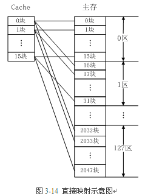
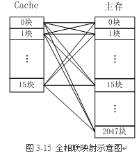
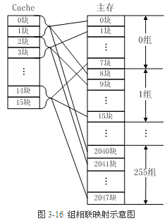
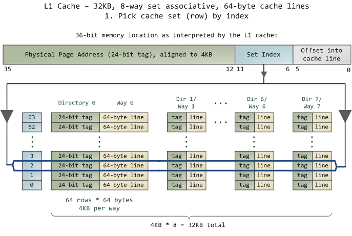
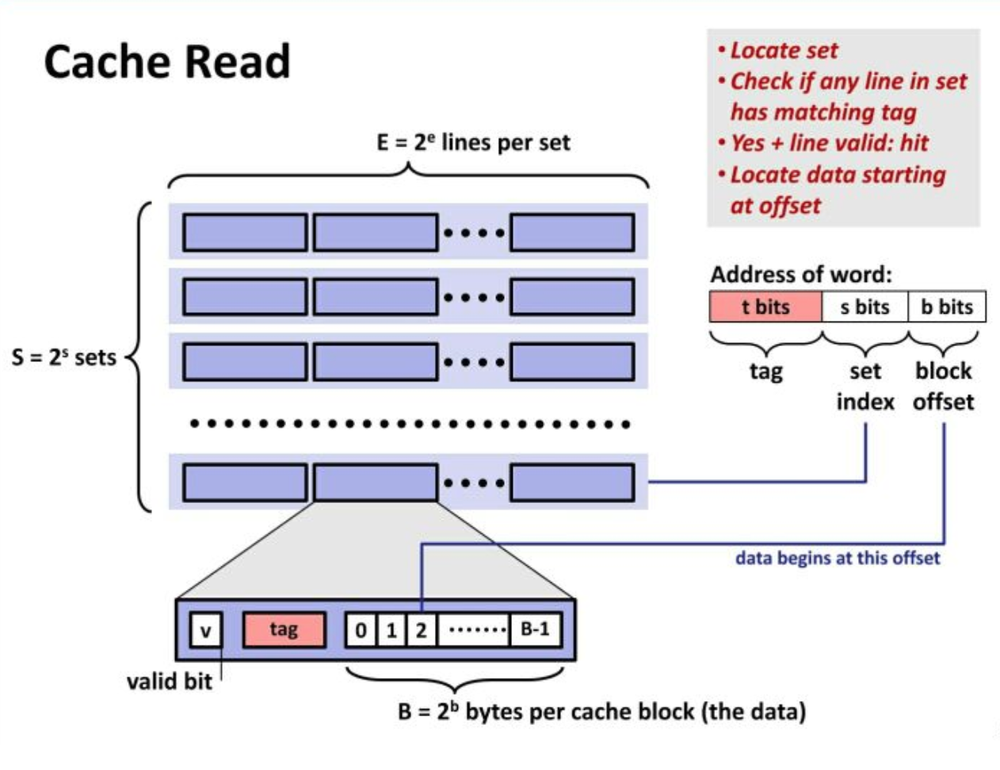
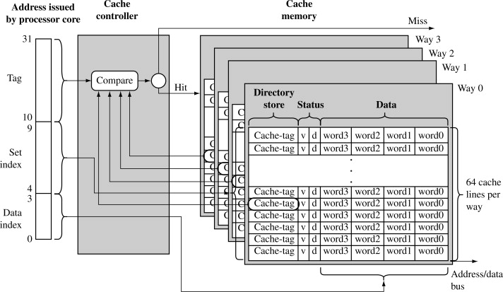
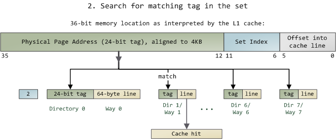

# Cache映射

## 参考资料

https://www.cnblogs.com/east1203/p/11572500.html

## 1. 引入

Cache的容量很小，它保存的内容只是主存内容的一个子集，且Cache与主存的数据交换是以块为单位的。**为了把信息放到Cache中，必须应用某种函数把主存地址定位到Cache中，这称为地址映射**。**在信息按这种映射关系装入Cache后，CPU执行程序时，会将程序中的主存地址变换成Cache地址，这个变换过程叫做地址变换。**

Cache的地址映射方式有直接映射、全相联映射和组相联映射。假设某台计算机主存容量为l MB，被分为2048块，每块512B；Cache容量为8KB，被分为16块，每块也是512B。下面以此为例介绍三种基本的地址映射方法。

## 2. 直接映射

直接映射的Cache组织如图3-14所示。**主存中的一个块只能映射到Cache的某一特定块中去**。例如，主存的第0块、第16块、……、第2032块，只能映射到Cache的第0块；而主存的第1块、第17块、……、第2033块，只能映射到Cache的第1块……。

 

**直接映射是最简单的地址映射方式，它的硬件简单，成本低，地址变换速度快，而且不涉及替换算法问题。但是这种方式不够灵活，Cache的存储空间得不到充分利用，每个主存块只有一个固定位置可存放，容易产生冲突，使Cache效率下降，因此只适合大容量Cache采用。**例如，如果一个程序需要重复引用主存中第0块与第16块，最好将主存第0块与第16块同时复制到Cache中，但由于它们都只能复制到Cache的第0块中去，即使Cache中别的存储空间空着也不能占用，因此这两个块会不断地交替装入Cache中，导致命中率降低。

## 3. 全相联映射

 图3-15 是全相联映射的Cache组织，**主存中任何一块都可以映射到Cache中的任何一块位置上。**

 

全相联映射方式比较灵活，主存的各块可以映射到Cache的任一块中，**Cache的利用率高，块冲突概率低**，只要淘汰Cache中的某一块，即可调入主存的任一块。但是，**由于Cache比较电路的设计和实现比较困难，这种方式只适合于小容量Cache采用。**

## 4. 组相联映射

组相联映射实际上是直接映射和全相联映射的折中方案，其组织结构如图3-16所示。**主存和Cache都分组，主存中一个组内的块数与Cache中的分组数相同，组间采用直接映射，组内采用全相联映射**。也就是说，将Cache分成u组，每组v块，主存块存放到哪个组是固定的，至于存到该组哪一块则是灵活的。例如，主存分为256组，每组8块，Cache分为8组，每组2块。

  

主存中的各块与Cache的组号之间有固定的映射关系，但可自由映射到对应Cache组中的任何一块。例如：

+ 主存中的第0块、第8块……均映射于Cache的第0组（直接映射），但可映射到Cache第0组中的第0块或第1块（全相联映射）；
+ 主存的第1块、第9块……均映射于Cache的第1组（直接映射），但可映射到Cache第1组中的第2块或第3块（全相联映射）。

常采用的组相联结构Cache，每组内有2、4、8、16块，称为2路、4路、8路、16路组相联Cache。组相联结构Cache是前两种方法的折中方案，**适度兼顾二者的优点，尽量避免二者的缺点，因而得到普遍采用。**

## 5. 一次内存访问示意图

 

 注意事项

- TLB采用组相联
- 页表采用两级页表
- cache采用组相联
- cache仅考虑L1 d-cache，不考虑L1 i-cache、L2 cache和L3 cache
- 未考虑页表缺页
- 简化了cache未命中情况

## 6. 实际例子

下面展示了现代Intel处理器的CPU cache是如何组织的。有关cache的讨论往往缺乏具体的实例，使得一些简单的概念变得扑朔迷离。也许是我可爱的小脑瓜有点迟钝吧，但不管怎样，至少下面讲述了故事的前一半，即Core 2的 L1 cache是如何被访问的：

 

 L1 cache – 32KB，8路组相联，64字节缓存线

 

 

### 6.1  由索引拣选缓存组（行）

+ **在cache中的数据是以缓存线（line）为单位组织的，一条缓存线对应于内存中一个连续的字节块**。这个cache使用了64字节的缓存线。**这些线被保存在cache bank中，也叫路（way）**。每一路都有一个专门的目录（directory）用来保存一些登记信息。你可以把每一路连同它的目录想象成电子表格中的一列，**而表的一行构成了cache的一组（set）。列中的每一个单元（cell）都含有一条缓存线**，由与之对应的目录单元跟踪管理。图中的cache有64 组、每组8路，因此有512个含有缓存线的单元，合计32KB的存储空间。

+ **在cache眼中，物理内存被分割成了许多4KB大小的物理内存页（page）（每一路是一个page？）**。每一页都含有[4KB / 64 bytes](http://www.google.com/search?hl=en&q=(4KB+/+64+bytes)) == 64条缓存线。在一个4KB的页中，第0到63字节是第一条缓存线，第64到127字节是第二条缓存线，以此类推。每一页都重复着这种划分，所以第0页第3条缓存线与第1页第3条缓存线是不同的。

+ **在全相联缓存（fully associative cache）中，内存中的任意一条缓存线都可以被存储到任意的缓存单元中。**这种存储方式十分灵活，但也使得要访问它们时，检索缓存单元的工作变得复杂、昂贵。由于L1和L2 cache工作在很强的约束之下，包括功耗，芯片物理空间，存取速度等，所以在多数情况下，使用全相联缓存并不是一个很好的折中。

取而代之的是图中的**组相联缓存（set associative cache）。意思是，内存中一条给定的缓存线只能被保存在一个特定的组（或行）中**。所以，*任意*物理内存页的第0条缓存线（页内第0到63字节）必须存储到第0组，第1条缓存线存储到第1组，以此类推。每一组有8个单元可用于存储它所关联的缓存线，从而形成一个8路关联的组（8-way associative set）。当访问一个内存地址时，**地址的第6到11位（译注：组索引，因为有64个组，所以6bit索引）指出了在4KB内存页中缓存线的编号**，从而决定了即将使用的缓存组。举例来说，物理地址0x800010a0的组索引是[000010](http://www.google.com/search?q=0x800010a0 in binary)，所以此地址的内容一定是在第2组中缓存的。

但是还有一个问题，就是要找出一组中哪个单元包含了想要的信息，如果有的话。这就到了缓存目录登场的时刻。每一个缓存线都被其对应的目录单元做了*标记*（tag）；这个标记就是一个简单的内存页编号，指出缓存线来自于哪一页。由于处理器可以寻址64GB的物理RAM，所以总共有[64GB / 4KB](http://www.google.com/search?hl=en&q=lg(64GB+/+4KB)) == 224个内存页，需要24位来保存标记。前例中的物理地址0x800010a0对应的页号为[524,289](http://www.google.com/search?hl=en&q=0x800010a0+Bytes+/+4KB)。下面是故事的后一半：

 

### 6.2 在组中搜索匹配标记

+ 由于我们只需要去查看某一组中的8路，所以查找匹配标记是非常迅速的；事实上，从电学角度讲，所有的标记是同时进行比对的，我用箭头来表示这一点。如果此时正好有一条具有匹配标签的有效缓存线，我们就获得一次缓存命中（cache hit）。否则，这个请求就会被转发的L2 cache，如果还没匹配上就再转发给主系统内存。通过应用各种调节尺寸和容量的技术，Intel给CPU配置了较大的L2 cache，但其基本的设计都是相同的。比如，你可以将原先的缓存增加8路而获得一个64KB的缓存；再将组数增加到4096，每路可以存储[256KB](http://www.google.com/search?hl=en&q=64+Bytes+*+4096)。经过这两次修改，就得到了一个4MB的L2 cache。在此情况下，需要18位来保存标记，12位保存组索引；缓存所使用的物理内存页的大小与其一路的大小相等。（译注：有4096组，就需要lg(4096)==12位的组索引，缓存线依然是64字节，所以一路有4096*64B==256KB字节；在L2 cache眼中，内存被分割为许多256KB的块，所以需要lg(64GB/256KB)==18位来保存标记。）
+ 如果有一组已经被放满了，那么在另一条缓存线被存储进来之前，已有的某一条则必须被腾空（evict）。为了避免这种情况，对运算速度要求较高的程序就要尝试仔细组织它的数据，使得内存访问均匀的分布在已有的缓存线上。举例来说，假设程序中有一个数组，元素的大小是512字节，其中一些对象在内存中相距4KB。这些对象的各个字段都落在同一缓存线上，并竞争同一缓存组。如果程序频繁的访问一个给定的字段（比如，通过[虚函数表](http://en.wikipedia.org/wiki/Vtable)vtable调用虚函数），那么这个组看起来就好像一直是被填满的，缓存开始变得毫无意义，因为缓存线一直在重复着腾空与重新载入的步骤。在我们的例子中，由于组数的限制，L1 cache仅能保存8个这类对象的虚函数表。这就是组相联策略的折中所付出的代价：即使在整体缓存的使用率并不高的情况下，由于组冲突，我们还是会遇到缓存缺失的情况。然而，鉴于计算机中各个存储层次的[相对速度](http://blog.csdn.net/drshenlei/archive/2009/06/05/4240703.aspx)，不管怎么说，大部分的应用程序并不必为此而担心。
+  一个内存访问经常由一个线性（或虚拟）地址发起，所以L1 cache需要依赖分页单元（paging unit）来求出物理内存页的地址，以便用于缓存标记。与此相反，组索引来自于线性地址的低位，所以不需要转换就可以使用了（在我们的例子中为第6到11位）。因此L1 cache是物理标记但虚拟索引的（physically tagged but virtually indexed），从而帮助CPU进行并行的查找操作。因为L1 cache的一路绝不会比MMU的一页还大，所以可以保证一个给定的物理地址位置总是关联到同一组，即使组索引是虚拟的。在另一方面L2 cache必须是物理标记和物理索引的，因为它的一路比MMU的一页要大。但是，当一个请求到达L2 cache时，物理地址已经被L1 cache准备（resolved）完毕了，所以L2 cache会工作得很好。
+  最后，目录单元还存储了对应缓存线的*状态*（state）。在L1代码缓存中的一条缓存线要么是无效的（invalid）要么是共享的（shared，意思是有效的，真的J）。在L1数据缓存和L2缓存中，一条缓存线可以为4个MESI状态之一：被修改的（modified），独占的（exclusive），共享的（shared），无效的（invalid）。Intel缓存是包容式的（inclusive）：L1缓存的内容会被复制到L2缓存中。 

## 7. 总结

1. 内存层次结构的意义在于利用引用的**空间局部性和时间局部性原理**，将经常被访问的数据放到快速的存储器中，而将不经常访问的数据留在较慢的存储器中。

2. 一般情况下，除了寄存器和L1缓存可以操作指定字长的数据，下层的内存子系统就不会再使用这么小的单位了，而是直接移动数据块，比如以缓存线为单位访问数据。

3. 对于组冲突，可以这么理解：与上文相似，假设一个缓存，由512条缓存线组成，每条线64字节，容量32KB。

+ a) 假如它是直接映射缓存，由于它往往使用地址的低位直接映射缓存线编号，所以所有的32K倍数的地址（32K，64K，96K等）都会映射到同一条线上（即第0线）。假如程序的内存组织不当，交替的去访问布置在这些地址的数据，则会导致冲突。从外表看来就好像缓存只有1条线了，尽管其他缓存线一直是空闲着的。

+ b) 如果是全相联缓存，那么每条缓存线都是独立的，可以对应于内存中的任意缓存线。只有当所有的512条缓存线都被占满后才会出现冲突。

+ c) 组相联是前两者的折中，每一路中的缓存线采用直接映射方式，而在路与路之间，缓存控制器使用全相联映射算法，决定选择一组中的哪一条线。

+ d) 如果是2路组相联缓存，那么这512条缓存线就被分为了2路，每路256条线，一路16KB。此时所有为16K整数倍的地址（16K，32K，48K等）都会映射到第0线，但由于2路是关联的，所以可以同时有2个这种地址的内容被缓存，不会发生冲突。当然了，如果要访问第三个这种地址，还是要先腾空已有的一条才行。所以极端情况下，从外表看来就好像缓存只有2条线了，尽管其他缓存线一直是空闲着的。

+ e) 如果是8路组相联缓存（与文中示例相同），那么这512条缓存线就被分为了8路，每路64条线，一路4KB。所以如果数组中元素地址是4K对齐的，并且程序交替的访问这些元素，就会出现组冲突。从外表看来就好像缓存只有8条线了，尽管其他缓存线一直是空闲着的。

