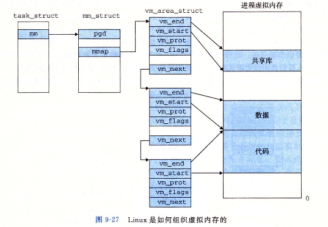

# Linux源码剖析-内存管理结构体

## 参考资料

+ https://blog.csdn.net/SweeNeil/article/details/83903093

## 1. 源代码

### 关系

  

### 1.1 mm_struct的定义

mm_types.h：

```c
struct mm_struct {
	struct {
		struct vm_area_struct *mmap;		/* list of VMAs */
		struct rb_root mm_rb;
		u64 vmacache_seqnum;                   /* per-thread vmacache */
#ifdef CONFIG_MMU
		unsigned long (*get_unmapped_area) (struct file *filp,
				unsigned long addr, unsigned long len,
				unsigned long pgoff, unsigned long flags);
#endif
		unsigned long mmap_base;	/* base of mmap area */
		unsigned long mmap_legacy_base;	/* base of mmap area in bottom-up allocations */
#ifdef CONFIG_HAVE_ARCH_COMPAT_MMAP_BASES
		/* Base adresses for compatible mmap() */
		unsigned long mmap_compat_base;
		unsigned long mmap_compat_legacy_base;
#endif
		unsigned long task_size;	/* size of task vm space */
		unsigned long highest_vm_end;	/* highest vma end address */
		pgd_t * pgd;

#ifdef CONFIG_MEMBARRIER
		/**
		 * @membarrier_state: Flags controlling membarrier behavior.
		 *
		 * This field is close to @pgd to hopefully fit in the same
		 * cache-line, which needs to be touched by switch_mm().
		 */
		atomic_t membarrier_state;
#endif

		/**
		 * @mm_users: The number of users including userspace.
		 *
		 * Use mmget()/mmget_not_zero()/mmput() to modify. When this
		 * drops to 0 (i.e. when the task exits and there are no other
		 * temporary reference holders), we also release a reference on
		 * @mm_count (which may then free the &struct mm_struct if
		 * @mm_count also drops to 0).
		 */
		atomic_t mm_users;

		/**
		 * @mm_count: The number of references to &struct mm_struct
		 * (@mm_users count as 1).
		 *
		 * Use mmgrab()/mmdrop() to modify. When this drops to 0, the
		 * &struct mm_struct is freed.
		 */
		atomic_t mm_count;

#ifdef CONFIG_MMU
		atomic_long_t pgtables_bytes;	/* PTE page table pages */
#endif
		int map_count;			/* number of VMAs */

		spinlock_t page_table_lock; /* Protects page tables and some
					     * counters
					     */
		struct rw_semaphore mmap_sem;

		struct list_head mmlist; /* List of maybe swapped mm's.	These
					  * are globally strung together off
					  * init_mm.mmlist, and are protected
					  * by mmlist_lock
					  */


		unsigned long hiwater_rss; /* High-watermark of RSS usage */
		unsigned long hiwater_vm;  /* High-water virtual memory usage */

		unsigned long total_vm;	   /* Total pages mapped */
		unsigned long locked_vm;   /* Pages that have PG_mlocked set */
		atomic64_t    pinned_vm;   /* Refcount permanently increased */
		unsigned long data_vm;	   /* VM_WRITE & ~VM_SHARED & ~VM_STACK */
		unsigned long exec_vm;	   /* VM_EXEC & ~VM_WRITE & ~VM_STACK */
		unsigned long stack_vm;	   /* VM_STACK */
		unsigned long def_flags;

		spinlock_t arg_lock; /* protect the below fields */
		unsigned long start_code, end_code, start_data, end_data;
		unsigned long start_brk, brk, start_stack;
		unsigned long arg_start, arg_end, env_start, env_end;

		unsigned long saved_auxv[AT_VECTOR_SIZE]; /* for /proc/PID/auxv */

		/*
		 * Special counters, in some configurations protected by the
		 * page_table_lock, in other configurations by being atomic.
		 */
		struct mm_rss_stat rss_stat;

		struct linux_binfmt *binfmt;

		/* Architecture-specific MM context */
		mm_context_t context;

		unsigned long flags; /* Must use atomic bitops to access */

		struct core_state *core_state; /* coredumping support */

#ifdef CONFIG_AIO
		spinlock_t			ioctx_lock;
		struct kioctx_table __rcu	*ioctx_table;
#endif
#ifdef CONFIG_MEMCG
		/*
		 * "owner" points to a task that is regarded as the canonical
		 * user/owner of this mm. All of the following must be true in
		 * order for it to be changed:
		 *
		 * current == mm->owner
		 * current->mm != mm
		 * new_owner->mm == mm
		 * new_owner->alloc_lock is held
		 */
		struct task_struct __rcu *owner;
#endif
		struct user_namespace *user_ns;

		/* store ref to file /proc/<pid>/exe symlink points to */
		struct file __rcu *exe_file;
#ifdef CONFIG_MMU_NOTIFIER
		struct mmu_notifier_mm *mmu_notifier_mm;
#endif
#if defined(CONFIG_TRANSPARENT_HUGEPAGE) && !USE_SPLIT_PMD_PTLOCKS
		pgtable_t pmd_huge_pte; /* protected by page_table_lock */
#endif
#ifdef CONFIG_NUMA_BALANCING
		/*
		 * numa_next_scan is the next time that the PTEs will be marked
		 * pte_numa. NUMA hinting faults will gather statistics and
		 * migrate pages to new nodes if necessary.
		 */
		unsigned long numa_next_scan;

		/* Restart point for scanning and setting pte_numa */
		unsigned long numa_scan_offset;

		/* numa_scan_seq prevents two threads setting pte_numa */
		int numa_scan_seq;
#endif
		/*
		 * An operation with batched TLB flushing is going on. Anything
		 * that can move process memory needs to flush the TLB when
		 * moving a PROT_NONE or PROT_NUMA mapped page.
		 */
		atomic_t tlb_flush_pending;
#ifdef CONFIG_ARCH_WANT_BATCHED_UNMAP_TLB_FLUSH
		/* See flush_tlb_batched_pending() */
		bool tlb_flush_batched;
#endif
		struct uprobes_state uprobes_state;
#ifdef CONFIG_HUGETLB_PAGE
		atomic_long_t hugetlb_usage;
#endif
		struct work_struct async_put_work;
	} __randomize_layout;

	/*
	 * The mm_cpumask needs to be at the end of mm_struct, because it
	 * is dynamically sized based on nr_cpu_ids.
	 */
	unsigned long cpu_bitmap[];
};
```

### 1.2 vm_area_struct的定义

mm_types.h：

```c
/*
 * This struct defines a memory VMM memory area. There is one of these
 * per VM-area/task.  A VM area is any part of the process virtual memory
 * space that has a special rule for the page-fault handlers (ie a shared
 * library, the executable area etc).
 */
struct vm_area_struct {
	/* The first cache line has the info for VMA tree walking. */

	unsigned long vm_start;		/* Our start address within vm_mm. */
	unsigned long vm_end;		/* The first byte after our end address
					   within vm_mm. */

	/* linked list of VM areas per task, sorted by address */
	struct vm_area_struct *vm_next, *vm_prev;

	struct rb_node vm_rb;

	/*
	 * Largest free memory gap in bytes to the left of this VMA.
	 * Either between this VMA and vma->vm_prev, or between one of the
	 * VMAs below us in the VMA rbtree and its ->vm_prev. This helps
	 * get_unmapped_area find a free area of the right size.
	 */
	unsigned long rb_subtree_gap;

	/* Second cache line starts here. */

	struct mm_struct *vm_mm;	/* The address space we belong to. */
	pgprot_t vm_page_prot;		/* Access permissions of this VMA. */
	unsigned long vm_flags;		/* Flags, see mm.h. */

	/*
	 * For areas with an address space and backing store,
	 * linkage into the address_space->i_mmap interval tree.
	 */
	struct {
		struct rb_node rb;
		unsigned long rb_subtree_last;
	} shared;

	/*
	 * A file's MAP_PRIVATE vma can be in both i_mmap tree and anon_vma
	 * list, after a COW of one of the file pages.	A MAP_SHARED vma
	 * can only be in the i_mmap tree.  An anonymous MAP_PRIVATE, stack
	 * or brk vma (with NULL file) can only be in an anon_vma list.
	 */
	struct list_head anon_vma_chain; /* Serialized by mmap_sem &
					  * page_table_lock */
	struct anon_vma *anon_vma;	/* Serialized by page_table_lock */

	/* Function pointers to deal with this struct. */
	const struct vm_operations_struct *vm_ops;

	/* Information about our backing store: */
	unsigned long vm_pgoff;		/* Offset (within vm_file) in PAGE_SIZE
					   units */
	struct file * vm_file;		/* File we map to (can be NULL). */
	void * vm_private_data;		/* was vm_pte (shared mem) */

#ifdef CONFIG_SWAP
	atomic_long_t swap_readahead_info;
#endif
#ifndef CONFIG_MMU
	struct vm_region *vm_region;	/* NOMMU mapping region */
#endif
#ifdef CONFIG_NUMA
	struct mempolicy *vm_policy;	/* NUMA policy for the VMA */
#endif
	struct vm_userfaultfd_ctx vm_userfaultfd_ctx;
} __randomize_layout;
```

### 1.3 task_struct的定义

`include/linux/sched.h`

```c
struct task_struct {
#ifdef CONFIG_THREAD_INFO_IN_TASK
	/*
	 * For reasons of header soup (see current_thread_info()), this
	 * must be the first element of task_struct.
	 */
	struct thread_info		thread_info;
#endif
	/* -1 unrunnable, 0 runnable, >0 stopped: */
	volatile long			state;

	/*
	 * This begins the randomizable portion of task_struct. Only
	 * scheduling-critical items should be added above here.
	 */
	randomized_struct_fields_start

	void				*stack;
	refcount_t			usage;
	/* Per task flags (PF_*), defined further below: */
	unsigned int			flags;
	unsigned int			ptrace;

#ifdef CONFIG_SMP
	struct llist_node		wake_entry;
	int				on_cpu;
#ifdef CONFIG_THREAD_INFO_IN_TASK
	/* Current CPU: */
	unsigned int			cpu;
#endif
	unsigned int			wakee_flips;
	unsigned long			wakee_flip_decay_ts;
	struct task_struct		*last_wakee;

	/*
	 * recent_used_cpu is initially set as the last CPU used by a task
	 * that wakes affine another task. Waker/wakee relationships can
	 * push tasks around a CPU where each wakeup moves to the next one.
	 * Tracking a recently used CPU allows a quick search for a recently
	 * used CPU that may be idle.
	 */
	int				recent_used_cpu;
	int				wake_cpu;
#endif
	int				on_rq;

	int				prio;
	int				static_prio;
	int				normal_prio;
	unsigned int			rt_priority;

	const struct sched_class	*sched_class;
	struct sched_entity		se;
	struct sched_rt_entity		rt;
#ifdef CONFIG_CGROUP_SCHED
	struct task_group		*sched_task_group;
#endif
	struct sched_dl_entity		dl;

#ifdef CONFIG_UCLAMP_TASK
	/* Clamp values requested for a scheduling entity */
	struct uclamp_se		uclamp_req[UCLAMP_CNT];
	/* Effective clamp values used for a scheduling entity */
	struct uclamp_se		uclamp[UCLAMP_CNT];
#endif

#ifdef CONFIG_PREEMPT_NOTIFIERS
	/* List of struct preempt_notifier: */
	struct hlist_head		preempt_notifiers;
#endif

#ifdef CONFIG_BLK_DEV_IO_TRACE
	unsigned int			btrace_seq;
#endif

	unsigned int			policy;
	int				nr_cpus_allowed;
	const cpumask_t			*cpus_ptr;
	cpumask_t			cpus_mask;

#ifdef CONFIG_PREEMPT_RCU
	int				rcu_read_lock_nesting;
	union rcu_special		rcu_read_unlock_special;
	struct list_head		rcu_node_entry;
	struct rcu_node			*rcu_blocked_node;
#endif /* #ifdef CONFIG_PREEMPT_RCU */

#ifdef CONFIG_TASKS_RCU
	unsigned long			rcu_tasks_nvcsw;
	u8				rcu_tasks_holdout;
	u8				rcu_tasks_idx;
	int				rcu_tasks_idle_cpu;
	struct list_head		rcu_tasks_holdout_list;
#endif /* #ifdef CONFIG_TASKS_RCU */

	struct sched_info		sched_info;

	struct list_head		tasks;
#ifdef CONFIG_SMP
	struct plist_node		pushable_tasks;
	struct rb_node			pushable_dl_tasks;
#endif

	struct mm_struct		*mm;
	struct mm_struct		*active_mm;

	/* Per-thread vma caching: */
	struct vmacache			vmacache;

#ifdef SPLIT_RSS_COUNTING
	struct task_rss_stat		rss_stat;
#endif
	int				exit_state;
	int				exit_code;
	int				exit_signal;
	/* The signal sent when the parent dies: */
	int				pdeath_signal;
	/* JOBCTL_*, siglock protected: */
	unsigned long			jobctl;

	/* Used for emulating ABI behavior of previous Linux versions: */
	unsigned int			personality;

	/* Scheduler bits, serialized by scheduler locks: */
	unsigned			sched_reset_on_fork:1;
	unsigned			sched_contributes_to_load:1;
	unsigned			sched_migrated:1;
	unsigned			sched_remote_wakeup:1;
#ifdef CONFIG_PSI
	unsigned			sched_psi_wake_requeue:1;
#endif

	/* Force alignment to the next boundary: */
	unsigned			:0;

	/* Unserialized, strictly 'current' */

	/* Bit to tell LSMs we're in execve(): */
	unsigned			in_execve:1;
	unsigned			in_iowait:1;
#ifndef TIF_RESTORE_SIGMASK
	unsigned			restore_sigmask:1;
#endif
#ifdef CONFIG_MEMCG
	unsigned			in_user_fault:1;
#endif
#ifdef CONFIG_COMPAT_BRK
	unsigned			brk_randomized:1;
#endif
#ifdef CONFIG_CGROUPS
	/* disallow userland-initiated cgroup migration */
	unsigned			no_cgroup_migration:1;
	/* task is frozen/stopped (used by the cgroup freezer) */
	unsigned			frozen:1;
#endif
#ifdef CONFIG_BLK_CGROUP
	/* to be used once the psi infrastructure lands upstream. */
	unsigned			use_memdelay:1;
#endif

	unsigned long			atomic_flags; /* Flags requiring atomic access. */

	struct restart_block		restart_block;

	pid_t				pid;
	pid_t				tgid;

#ifdef CONFIG_STACKPROTECTOR
	/* Canary value for the -fstack-protector GCC feature: */
	unsigned long			stack_canary;
#endif
	/*
	 * Pointers to the (original) parent process, youngest child, younger sibling,
	 * older sibling, respectively.  (p->father can be replaced with
	 * p->real_parent->pid)
	 */

	/* Real parent process: */
	struct task_struct __rcu	*real_parent;

	/* Recipient of SIGCHLD, wait4() reports: */
	struct task_struct __rcu	*parent;

	/*
	 * Children/sibling form the list of natural children:
	 */
	struct list_head		children;
	struct list_head		sibling;
	struct task_struct		*group_leader;

	/*
	 * 'ptraced' is the list of tasks this task is using ptrace() on.
	 *
	 * This includes both natural children and PTRACE_ATTACH targets.
	 * 'ptrace_entry' is this task's link on the p->parent->ptraced list.
	 */
	struct list_head		ptraced;
	struct list_head		ptrace_entry;

	/* PID/PID hash table linkage. */
	struct pid			*thread_pid;
	struct hlist_node		pid_links[PIDTYPE_MAX];
	struct list_head		thread_group;
	struct list_head		thread_node;

	struct completion		*vfork_done;

	/* CLONE_CHILD_SETTID: */
	int __user			*set_child_tid;

	/* CLONE_CHILD_CLEARTID: */
	int __user			*clear_child_tid;

	u64				utime;
	u64				stime;
#ifdef CONFIG_ARCH_HAS_SCALED_CPUTIME
	u64				utimescaled;
	u64				stimescaled;
#endif
	u64				gtime;
	struct prev_cputime		prev_cputime;
#ifdef CONFIG_VIRT_CPU_ACCOUNTING_GEN
	struct vtime			vtime;
#endif

#ifdef CONFIG_NO_HZ_FULL
	atomic_t			tick_dep_mask;
#endif
	/* Context switch counts: */
	unsigned long			nvcsw;
	unsigned long			nivcsw;

	/* Monotonic time in nsecs: */
	u64				start_time;

	/* Boot based time in nsecs: */
	u64				real_start_time;

	/* MM fault and swap info: this can arguably be seen as either mm-specific or thread-specific: */
	unsigned long			min_flt;
	unsigned long			maj_flt;

	/* Empty if CONFIG_POSIX_CPUTIMERS=n */
	struct posix_cputimers		posix_cputimers;

	/* Process credentials: */

	/* Tracer's credentials at attach: */
	const struct cred __rcu		*ptracer_cred;

	/* Objective and real subjective task credentials (COW): */
	const struct cred __rcu		*real_cred;

	/* Effective (overridable) subjective task credentials (COW): */
	const struct cred __rcu		*cred;

#ifdef CONFIG_KEYS
	/* Cached requested key. */
	struct key			*cached_requested_key;
#endif

	/*
	 * executable name, excluding path.
	 *
	 * - normally initialized setup_new_exec()
	 * - access it with [gs]et_task_comm()
	 * - lock it with task_lock()
	 */
	char				comm[TASK_COMM_LEN];

	struct nameidata		*nameidata;

#ifdef CONFIG_SYSVIPC
	struct sysv_sem			sysvsem;
	struct sysv_shm			sysvshm;
#endif
#ifdef CONFIG_DETECT_HUNG_TASK
	unsigned long			last_switch_count;
	unsigned long			last_switch_time;
#endif
	/* Filesystem information: */
	struct fs_struct		*fs;

	/* Open file information: */
	struct files_struct		*files;

	/* Namespaces: */
	struct nsproxy			*nsproxy;

	/* Signal handlers: */
	struct signal_struct		*signal;
	struct sighand_struct		*sighand;
	sigset_t			blocked;
	sigset_t			real_blocked;
	/* Restored if set_restore_sigmask() was used: */
	sigset_t			saved_sigmask;
	struct sigpending		pending;
	unsigned long			sas_ss_sp;
	size_t				sas_ss_size;
	unsigned int			sas_ss_flags;

	struct callback_head		*task_works;

#ifdef CONFIG_AUDIT
#ifdef CONFIG_AUDITSYSCALL
	struct audit_context		*audit_context;
#endif
	kuid_t				loginuid;
	unsigned int			sessionid;
#endif
	struct seccomp			seccomp;

	/* Thread group tracking: */
	u32				parent_exec_id;
	u32				self_exec_id;

	/* Protection against (de-)allocation: mm, files, fs, tty, keyrings, mems_allowed, mempolicy: */
	spinlock_t			alloc_lock;

	/* Protection of the PI data structures: */
	raw_spinlock_t			pi_lock;

	struct wake_q_node		wake_q;

#ifdef CONFIG_RT_MUTEXES
	/* PI waiters blocked on a rt_mutex held by this task: */
	struct rb_root_cached		pi_waiters;
	/* Updated under owner's pi_lock and rq lock */
	struct task_struct		*pi_top_task;
	/* Deadlock detection and priority inheritance handling: */
	struct rt_mutex_waiter		*pi_blocked_on;
#endif

#ifdef CONFIG_DEBUG_MUTEXES
	/* Mutex deadlock detection: */
	struct mutex_waiter		*blocked_on;
#endif

#ifdef CONFIG_DEBUG_ATOMIC_SLEEP
	int				non_block_count;
#endif

#ifdef CONFIG_TRACE_IRQFLAGS
	unsigned int			irq_events;
	unsigned long			hardirq_enable_ip;
	unsigned long			hardirq_disable_ip;
	unsigned int			hardirq_enable_event;
	unsigned int			hardirq_disable_event;
	int				hardirqs_enabled;
	int				hardirq_context;
	unsigned long			softirq_disable_ip;
	unsigned long			softirq_enable_ip;
	unsigned int			softirq_disable_event;
	unsigned int			softirq_enable_event;
	int				softirqs_enabled;
	int				softirq_context;
#endif

#ifdef CONFIG_LOCKDEP
# define MAX_LOCK_DEPTH			48UL
	u64				curr_chain_key;
	int				lockdep_depth;
	unsigned int			lockdep_recursion;
	struct held_lock		held_locks[MAX_LOCK_DEPTH];
#endif

#ifdef CONFIG_UBSAN
	unsigned int			in_ubsan;
#endif

	/* Journalling filesystem info: */
	void				*journal_info;

	/* Stacked block device info: */
	struct bio_list			*bio_list;

#ifdef CONFIG_BLOCK
	/* Stack plugging: */
	struct blk_plug			*plug;
#endif

	/* VM state: */
	struct reclaim_state		*reclaim_state;

	struct backing_dev_info		*backing_dev_info;

	struct io_context		*io_context;

#ifdef CONFIG_COMPACTION
	struct capture_control		*capture_control;
#endif
	/* Ptrace state: */
	unsigned long			ptrace_message;
	kernel_siginfo_t		*last_siginfo;

	struct task_io_accounting	ioac;
#ifdef CONFIG_PSI
	/* Pressure stall state */
	unsigned int			psi_flags;
#endif
#ifdef CONFIG_TASK_XACCT
	/* Accumulated RSS usage: */
	u64				acct_rss_mem1;
	/* Accumulated virtual memory usage: */
	u64				acct_vm_mem1;
	/* stime + utime since last update: */
	u64				acct_timexpd;
#endif
#ifdef CONFIG_CPUSETS
	/* Protected by ->alloc_lock: */
	nodemask_t			mems_allowed;
	/* Seqence number to catch updates: */
	seqcount_t			mems_allowed_seq;
	int				cpuset_mem_spread_rotor;
	int				cpuset_slab_spread_rotor;
#endif
#ifdef CONFIG_CGROUPS
	/* Control Group info protected by css_set_lock: */
	struct css_set __rcu		*cgroups;
	/* cg_list protected by css_set_lock and tsk->alloc_lock: */
	struct list_head		cg_list;
#endif
#ifdef CONFIG_X86_CPU_RESCTRL
	u32				closid;
	u32				rmid;
#endif
#ifdef CONFIG_FUTEX
	struct robust_list_head __user	*robust_list;
#ifdef CONFIG_COMPAT
	struct compat_robust_list_head __user *compat_robust_list;
#endif
	struct list_head		pi_state_list;
	struct futex_pi_state		*pi_state_cache;
	struct mutex			futex_exit_mutex;
	unsigned int			futex_state;
#endif
#ifdef CONFIG_PERF_EVENTS
	struct perf_event_context	*perf_event_ctxp[perf_nr_task_contexts];
	struct mutex			perf_event_mutex;
	struct list_head		perf_event_list;
#endif
#ifdef CONFIG_DEBUG_PREEMPT
	unsigned long			preempt_disable_ip;
#endif
#ifdef CONFIG_NUMA
	/* Protected by alloc_lock: */
	struct mempolicy		*mempolicy;
	short				il_prev;
	short				pref_node_fork;
#endif
#ifdef CONFIG_NUMA_BALANCING
	int				numa_scan_seq;
	unsigned int			numa_scan_period;
	unsigned int			numa_scan_period_max;
	int				numa_preferred_nid;
	unsigned long			numa_migrate_retry;
	/* Migration stamp: */
	u64				node_stamp;
	u64				last_task_numa_placement;
	u64				last_sum_exec_runtime;
	struct callback_head		numa_work;

	/*
	 * This pointer is only modified for current in syscall and
	 * pagefault context (and for tasks being destroyed), so it can be read
	 * from any of the following contexts:
	 *  - RCU read-side critical section
	 *  - current->numa_group from everywhere
	 *  - task's runqueue locked, task not running
	 */
	struct numa_group __rcu		*numa_group;

	/*
	 * numa_faults is an array split into four regions:
	 * faults_memory, faults_cpu, faults_memory_buffer, faults_cpu_buffer
	 * in this precise order.
	 *
	 * faults_memory: Exponential decaying average of faults on a per-node
	 * basis. Scheduling placement decisions are made based on these
	 * counts. The values remain static for the duration of a PTE scan.
	 * faults_cpu: Track the nodes the process was running on when a NUMA
	 * hinting fault was incurred.
	 * faults_memory_buffer and faults_cpu_buffer: Record faults per node
	 * during the current scan window. When the scan completes, the counts
	 * in faults_memory and faults_cpu decay and these values are copied.
	 */
	unsigned long			*numa_faults;
	unsigned long			total_numa_faults;

	/*
	 * numa_faults_locality tracks if faults recorded during the last
	 * scan window were remote/local or failed to migrate. The task scan
	 * period is adapted based on the locality of the faults with different
	 * weights depending on whether they were shared or private faults
	 */
	unsigned long			numa_faults_locality[3];

	unsigned long			numa_pages_migrated;
#endif /* CONFIG_NUMA_BALANCING */

#ifdef CONFIG_RSEQ
	struct rseq __user *rseq;
	u32 rseq_sig;
	/*
	 * RmW on rseq_event_mask must be performed atomically
	 * with respect to preemption.
	 */
	unsigned long rseq_event_mask;
#endif

	struct tlbflush_unmap_batch	tlb_ubc;

	union {
		refcount_t		rcu_users;
		struct rcu_head		rcu;
	};

	/* Cache last used pipe for splice(): */
	struct pipe_inode_info		*splice_pipe;

	struct page_frag		task_frag;

#ifdef CONFIG_TASK_DELAY_ACCT
	struct task_delay_info		*delays;
#endif

#ifdef CONFIG_FAULT_INJECTION
	int				make_it_fail;
	unsigned int			fail_nth;
#endif
	/*
	 * When (nr_dirtied >= nr_dirtied_pause), it's time to call
	 * balance_dirty_pages() for a dirty throttling pause:
	 */
	int				nr_dirtied;
	int				nr_dirtied_pause;
	/* Start of a write-and-pause period: */
	unsigned long			dirty_paused_when;

#ifdef CONFIG_LATENCYTOP
	int				latency_record_count;
	struct latency_record		latency_record[LT_SAVECOUNT];
#endif
	/*
	 * Time slack values; these are used to round up poll() and
	 * select() etc timeout values. These are in nanoseconds.
	 */
	u64				timer_slack_ns;
	u64				default_timer_slack_ns;

#ifdef CONFIG_KASAN
	unsigned int			kasan_depth;
#endif

#ifdef CONFIG_FUNCTION_GRAPH_TRACER
	/* Index of current stored address in ret_stack: */
	int				curr_ret_stack;
	int				curr_ret_depth;

	/* Stack of return addresses for return function tracing: */
	struct ftrace_ret_stack		*ret_stack;

	/* Timestamp for last schedule: */
	unsigned long long		ftrace_timestamp;

	/*
	 * Number of functions that haven't been traced
	 * because of depth overrun:
	 */
	atomic_t			trace_overrun;

	/* Pause tracing: */
	atomic_t			tracing_graph_pause;
#endif

#ifdef CONFIG_TRACING
	/* State flags for use by tracers: */
	unsigned long			trace;

	/* Bitmask and counter of trace recursion: */
	unsigned long			trace_recursion;
#endif /* CONFIG_TRACING */

#ifdef CONFIG_KCOV
	/* Coverage collection mode enabled for this task (0 if disabled): */
	unsigned int			kcov_mode;

	/* Size of the kcov_area: */
	unsigned int			kcov_size;

	/* Buffer for coverage collection: */
	void				*kcov_area;

	/* KCOV descriptor wired with this task or NULL: */
	struct kcov			*kcov;
#endif

#ifdef CONFIG_MEMCG
	struct mem_cgroup		*memcg_in_oom;
	gfp_t				memcg_oom_gfp_mask;
	int				memcg_oom_order;

	/* Number of pages to reclaim on returning to userland: */
	unsigned int			memcg_nr_pages_over_high;

	/* Used by memcontrol for targeted memcg charge: */
	struct mem_cgroup		*active_memcg;
#endif

#ifdef CONFIG_BLK_CGROUP
	struct request_queue		*throttle_queue;
#endif

#ifdef CONFIG_UPROBES
	struct uprobe_task		*utask;
#endif
#if defined(CONFIG_BCACHE) || defined(CONFIG_BCACHE_MODULE)
	unsigned int			sequential_io;
	unsigned int			sequential_io_avg;
#endif
#ifdef CONFIG_DEBUG_ATOMIC_SLEEP
	unsigned long			task_state_change;
#endif
	int				pagefault_disabled;
#ifdef CONFIG_MMU
	struct task_struct		*oom_reaper_list;
#endif
#ifdef CONFIG_VMAP_STACK
	struct vm_struct		*stack_vm_area;
#endif
#ifdef CONFIG_THREAD_INFO_IN_TASK
	/* A live task holds one reference: */
	refcount_t			stack_refcount;
#endif
#ifdef CONFIG_LIVEPATCH
	int patch_state;
#endif
#ifdef CONFIG_SECURITY
	/* Used by LSM modules for access restriction: */
	void				*security;
#endif

#ifdef CONFIG_GCC_PLUGIN_STACKLEAK
	unsigned long			lowest_stack;
	unsigned long			prev_lowest_stack;
#endif

	/*
	 * New fields for task_struct should be added above here, so that
	 * they are included in the randomized portion of task_struct.
	 */
	randomized_struct_fields_end

	/* CPU-specific state of this task: */
	struct thread_struct		thread;

	/*
	 * WARNING: on x86, 'thread_struct' contains a variable-sized
	 * structure.  It *MUST* be at the end of 'task_struct'.
	 *
	 * Do not put anything below here!
	 */
};
```

## 2. 简介

一个进程的虚拟地址空间主要由两个数据结构来描述。

+ 一个是最高层次的：`mm_struct`（定义在`mm_types.h`中）；
+ 一个是较高层次的：`vm_area_structs`；

最高层次的mm_struct结构描述了一个进程的整个虚拟地址空间。较高层次的结构vm_area_truct描述了虚拟地址空间的一个区间（简称虚拟区或线性区）。每个进程只有一个mm_struct结构，在每个进程的task_struct结构中，有一个指向该进程的结构。可以说，mm_struct结构是对**整个用户空间**（注意，是用户空间）的描述。

## 3. 解析task_struct中的mm

+ `struct mm_struct		*mm;`
  + 进程所拥有的用户空间内存描述符；
+ `struct mm_struct		*active_mm;`
  + 进程运行时所使用的内存描述符；

注意：

+ 对于普通进程，这两个指针变量相同；
+ 对于内核线程，不拥有任何内存描述符，mm成员总是设为NULL；

当内核线程运行时，它的active_mm成员被初始化为前一个运行进程的active_mm值。

每一个进程都会有自己独立的mm_struct，这样每一个进程都会有自己独立的地址空间，这样才能互不干扰。

当进程之间的地址空间被共享的时候，我们可以理解为这个时候是多个进程使用一份地址空间，这就是线程。

## 4. mm_struct数据结构详解

在地址空间中，mmap为地址空间的内存区域（用vm_area_struct结构来表示）链表，mm_rb用红黑树来存储，链表表示起来更加方便，红黑树表示起来更加方便查找。

区别是，当虚拟区较少的时候，这个时候采用单链表，由mmap指向这个链表，当虚拟区多时此时采用红黑树的结构，由mm_rb指向这棵红黑树。这样就可以在大量数据的时候效率更高。

所有的mm_struct结构体通过自身的mmlist域链接在一个双向链表上，该链表的首元素是init_mm内存描述符，代表init进程的地址空间。

```c
atomic_t mm_users; 
 
atomic_t mm_count; 
```

+ 每一个进程都可以被别的进程来共享，也就是和别的进程来共享mm_struct。

+ kernel线程是没有地址空间的，也就没有对应的mm_struct，kernel线程使用之前运行的进程的内存描述符。

+ 程序中通常用到的地址常常具有局部性，当前最近一次用的虚拟地址区间很可能下一次还是需要用到，所以我们采用局部性原理，通常时候我们去把当前地址周围一个区间的内存放入高速缓存当中，这个区间在mm_struct当中就是由mmap_cache来维护。
