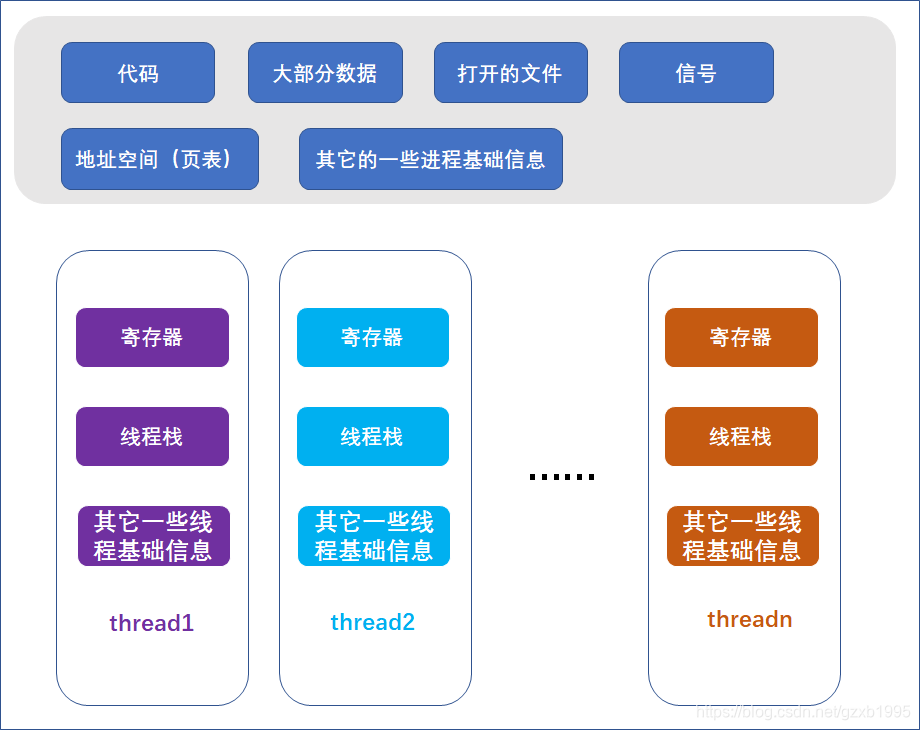
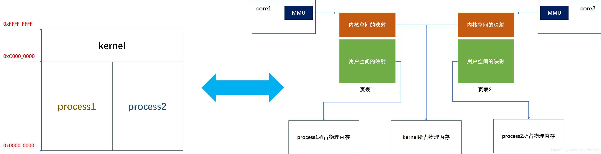

# 多核处理器上的MMU和TLB

## 参考

+ https://blog.csdn.net/gzxb1995/article/details/104910787
+ https://blog.csdn.net/weixin_30902943/article/details/112334610

## 1. 对多核处理器以及进程、线程的困惑

### 1.1 进程线程基本概念

**对多核处理器，同一时间只能运行一个进程里的多个线程**。这句话是对还是错？

首先，进程的内含通常被认为是运行中的程序及相关资源的总和，而线程被包含在进程之中，是操作系统能够进行运算调度的最小单位，大部分情况下，它是进程中的实际运作单位[1]。这样说或许非常抽象，不妨借助图像理解。对于含有多线程的进程来说，进程与线程的关系如下图所示：

 

不难看出，进程持有其所有线程共享的公共资源，而不同线程都保存有自己的寄存器备份以及栈等内容，也就是说处理器的某个核心上各个寄存器的值来自于一个线程，在线程被切换出去时这些寄存器信息都会被保存回线程里，而被调入的线程所保存的寄存器信息将被载入。

 这说明真正在CPU上运行的是进程中一个个的线程，所以才将线程称为进程中的实际运作单位。

再打个比方，比如一个家，有房子有家具，家里生活了一家人，这个家的物理实体（进程）被这一家人共享，而每天真正干活的是家里的每个人（线程），房子家具是不会干活的。好了，进程、线程就介绍到这里。下面介绍一下linux的进程、线程。

### 1.2 Linux中的进程与线程

各种操作系统教材上往往会对进程、线程做出泾渭分明的定义或说明，也确实有操作系统实现了清晰的进程、线程抽象，但linux没有。

linux没有为进程（process）和线程（thread）分别做抽象，而是使用一个名为`task_struct`的结构来描述调度的一个单元。

对于那些进程拥有的公共资源，比如地址空间、打开的文件、信号等，linux分别使用相应的对象（结构体）来描述它们，例如描述进程地址空间的`mm_struct`。

在`task_struct`中，不会完整的保存描述公共资源的对象，仅维护一个指向这些对象的指针。

这样一来，假如两个`task_struct`中相应指针指向了同一个描述公共资源的对象实例，那么就说明这两个`task_struct`共享该公共资源，比如共享地址空间，共享打开的文件等。

具体共享哪些东西是可以控制的，当我们使用`clone`系统调用去创建一个`task_struct`时，可以通过传参告诉内核新创建的任务与当前任务共享哪些资源。

那么如何用`task_struct`去体现进程和线程呢？

+ 假如两个`task_struct`不共享任何公共资源，它们就被视为两个进程；（写时复制）

+ 如果两个`task_struct`共享所有公共资源，它们就被视为一个进程下的两个线程。（共享对象）

事实上，linux中，用`fork`创建进程、用`pthread_create`创建线程，其内部都是通过调用`clone`，并为`clone`传递不共享/共享公共资源的参数来实现的，如下图：

 

其中：

+ tgid：tgid叫线程组id。同一个进程里每一个线程的`task_struct`中tgid值都一样。
+ 上图左边采用写时复制；上图右边采用共享对象；

### 1.3 困惑点

如果对多核处理器，**同一时间只能运行一个进程里的多个线程**这个说法成立的话，对于进程、线程抽象清晰的操作系统，这个场景勉强还能想象：OS的调度器工作在两个层次，以进程为单位切换，调度一个进程内的多个线程到各个core上执行。

而linux这样对进程、线程没有清晰的抽象，内核面对的是位于各个core的调度队列上的一个个的task_struct，其调度也是以task_struct为单位的，而这些task_struct可能共享公共资源（线程），也可能不共享公共资源（进程），难道在调度的时候各个核之间还要同步，确保调度的都是共享公共资源（特别是地址空间）的task_struct？这场景，怎么想怎么别扭！

于是我开始怀疑**对多核处理器，同一时间只能运行一个进程里的多个线程这个说法是错误的**，下面就要找证据证明。

那么，从什么方向入手才能查找到有针对性的资料呢？我是这样考虑的，假如对多核处理器，同一时间只能运行一个进程里的多个线程成立，那么制约同一时间运行不同进程的多个线程的要素是什么呢？

不难想到是MMU，MMU可谓是连接虚拟地址和物理地址的桥梁，`MMU+页表=虚拟地址空间`，而进程、线程之间的重要区别就是是否共享共享地址空间。假如，**一个多核处理器，所有core都共享一个MMU的话，那么同一时间确实只能运行一个进程里的多个线程。**

因此，最关键的问题来了，`MMU是被共享的么`？

## 2. 多核处理器上的MMU和TLB

[stackoverflow上关于这个问题的回答](https://stackoverflow.com/questions/9929755/do-multi-core-cpus-share-the-mmu-and-page-tables)

具体答案是：**MMU通常不是共享的**（我不确定对所有处理器成立）。不妨看一下酷睿i7的存储系统框图：

 

《Understanding Linux Kernel》中的一段话

> In a multiprocessor system, each CPU has its own TLB, called the local TLB of the CPU. Contrary to the hardware cache, the corresponding entries of the TLB need not be synchronized, because processes running on the existing CPUs may associate the same linear address with different physical ones.

翻译：

> 在多处理器系统中，每个CPU拥有自己的TLB（译者补：快表，专门用于页表的Cache）称为本地TLB。不同于硬件Cache，（多个）TLB的表项之间不需要做同步，因为运行在各个CPU上的进程可能**将同一个虚拟地址映射到不同的物理地址处（译者补：说明不共享地址空间）**。

当然，可能会有人指出**多处理器**和**多核**之间是有差异的，但两者之间也有很多共同之处。多核中，每个核都拥有自己的MMU，它们也可以像多处理器系统那样，每个MMU都联系到独立的页表，这样同一时间，不同的虚拟地址空间可以并存，因此也就支持**同时运行不同进程的多个线程**。

需要指出的是，虽然不同进程之间通过维护各自的页表使得虚拟地址空间相互独立（除了少数情况，如共享内存），但那仅限于用户部分，而内核部分的地址映射对于所有进程都是相同的。也就是说，页表中内核部分的映射对于所有进程来说都是相同的。如下图：

 

在结束这个问题的讨论之前，不妨分析一下linux的进程核线程的开销大小。我将从创建、切换、通信这三个方面做简要分析：

+ **创建**：
  + 在linux中，创建进程或线程本质上都是在内核空间建立一个`task_struct`结构，但这不意味着进程、线程拥有同样的开销。
  + 创建线程只需要和当前的`task_struct`共享资源即可；
  + 创建进程时，不仅要建立一个`task_struct`结构，还需要复制当前`task_struct`的公共资源。
  + 虽然linux有写时复制的机制，但这只是延后复制，而非不复制，债是要还的，晚一些也是要还的。
  + 因此就创建方面来说，进程的开销大于线程的开销。
+ **切换**：
  + linux切换的都是`task_struct`，但被换出的`task_struct`和换入的`task_struct`是否共享公共资源，这对切换的开销有不小的影响。
  + 假如两者不共享公共资源（进程切换），那么当前core的Cache和TLB都会失效，换入的进程在运行初期，Cache和TLB尚未有效建立时，运行会比较慢。而有效建立Cache和TLB是需要时间的，考虑到调度往往以毫秒为单位，因此这个时间是无法忽略的。
  + 假如两者共享公共资源（线程切换），这就意味着两者共享虚拟地址空间，也就无需失效Cache和TLB。当然，考虑到两个线程运行的指令、访问的数据可能会有部分位于不同的地址处，因此换入的线程在运行初期，可能会有较多的Cache和TLB未命中，但这比起进程切换需要失效Cache和TLB要好得多。
  + 所以，就切换方面来说，进程的开销大于线程的开销。

+ **通信**：
  + 由于进程不共用地址空间，因此进程间实现通信要麻烦一些，代价也大一些；
  + 而线程间共享地址空间，最简单的，使用全局变量就可以实现通信（尽管有些时候这种同步方式不一定恰当）。
  + 因此，进程间通信开销大于线程间通信开销。

综上，进程的开销是大于线程的开销的。但值得指出的是，并不能因为线程开销小而把它当作万金油。进程也有着地址空间隔离，相互影响小的优点。总的来说，进程、线程各有其适用的场景，应当恰当的适用它们。

## 3. 不足的补充

关于有多个核运行一个或者多个进程的时候，MMU和ASID怎么应用的问题。

MMU是CPU的地址翻译器，每个CPU一个：

 

你从全系统看，pa只有一份，而每个cpu都有自己的一份va，翻译方法由页表指定，放在物理内存里面，TLB充当这个页表内存的Cache，把常用的翻译项内置在MMU中。这是硬件角度提供的模型。

好，现在看软件怎么用。假设我创建一个进程，我把它部署到左边的CPU上。我要设定这个进程的页表空间，它就是这样的：

 

如果你在另一个CPU上再创建一个进程，就是把左边的事情再做一次，这个我们就不画图了。

如果你现在要把左边这个CPU的进程切换出去，交给另一个进程，就会这样：

 

进程1暂时放一边，页表换成进程2的页表就行。但这个过程成本很高，因为你首先得把TLB里面属于进程1页表的缓冲清掉，才能保证不会影响进程2的地址空间。

为了解决这个问题，我们把每个翻译条目都加上一个进程ID，简称ASID。在CPU的系统寄存器中设置上这个ASID，这样进程1用进程1的asid，进程2用进程2的asid，两者都在TLB中，但进程2占据CPU的时候，不会使用进程1的项，等切换回进程1的时候，原来的东西还在，也不需要重新加载，这提高了效率。

我们当然想最好asid和软件的pid是一样的，但一般做不到，因为软件的PID通常是一个标准字长，而asid必须嵌入页表项里，没法放太大，所以，它常常只有16位，甚至8位之类的，需要一个稀疏映射表才能把两者关联起来。

现在假设我在左边CPU的进程中再创建一个线程，而且把这个线程调度到第二个CPU上，这个结果是这样的：

 

两个CPU共享同一个进程，它们就需要共享同一个页表，但它们需要共享同一个asid吗？答案是：不需要。因为asid本来就不大，明明可以分开用，只要达到每个CPU的调度上限就可以了，你现在让我公用？如果有一个进程永远不调度到我这边，我不是亏（白分配）了？

所以，靠谱的实现（比如Linux Kernel）中，asid仅在本CPU有效，扩展到IOMMU，也仅仅对那个设备有效，不是全局的。所以，对于每个进程的asid，都是per_cpu结构，每个CPU都有一个实例。

> 有趣的而是，RISC-V的20190608-Priv-MSU-Ratified版本里面有这样一条修改记录：Software is strongly recommended to allocate ASIDs globally, so that a future extension can globalize ASIDs for imporved performance and hardware flexibility。做这个统一对软件来说未来表面上肯定是利好的，因为很多方案多了一个假设可以用。但综合性能是否能够做上去，还真要用上一段时间才知道。

这时，如果其中一个CPU进行调度，把时间让给另一个进程，结果就会是这样的：

 

TLB里面谁的页表都可以有，反正有asid区分，有一个线程被挂起，以后属于哪个CPU等调度的时候另说，剩下就是谁占着那个CPU，谁在那个CPU上的asid生效，自然就会查那个asid的翻译项，如果没有，就从真正的内存页表里面读进去了。

如果进程实在太多，在某个CPU上没法给他分配一个实在的了，这个好办，只要分配一个不是当前的，然后把新分配的这个asid的内容从TLB里面全部抹掉就可以了。代码在各个平台的上下文切换逻辑中，比如ARM64，代码在`arch/arm64/mm/context.c`中。但其实概念空间逻辑都是一样的。

Linux在实现的时候用了大量的Lazy算法，所以，其实asid都不是在进程创建的时候生成的，而是在调度前发现没有了，就临时生成的，这对于新手来说，看代码会比较困扰的，但还是那句话，习惯就好。