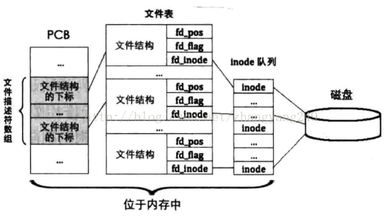

# 创建文件系统

## 参考网址

https://blog.csdn.net/zhangyang249/article/details/78637616

## 1. 创建超级块、i结点、目录项

在创建文件系统前，一些基础数据结构要先创建：超级块、inode 和 目录项。

超级块（硬盘中和内存中都有一份）

```c
struct super_block {
   uint32_t magic;		    // 用来标识文件系统类型,支持多文件系统的操作系统通过此标志来识别文件系统类型
   uint32_t sec_cnt;		    // 本分区总共的扇区数
   uint32_t inode_cnt;		    // 本分区中inode数量
   uint32_t part_lba_base;	    // 本分区的起始lba地址
   uint32_t block_bitmap_lba;	    // 块位图本身起始扇区地址
   uint32_t block_bitmap_sects;     // 扇区位图本身占用的扇区数量
   uint32_t inode_bitmap_lba;	    // i结点位图起始扇区lba地址
   uint32_t inode_bitmap_sects;	    // i结点位图占用的扇区数量
   uint32_t inode_table_lba;	    // i结点表起始扇区lba地址
   uint32_t inode_table_sects;	    // i结点表占用的扇区数量
   uint32_t data_start_lba;	    // 数据区开始的第一个扇区号
   uint32_t root_inode_no;	    // 根目录所在的I结点号
   uint32_t dir_entry_size;	    // 目录项大小
   uint8_t  pad[460];		    // 加上460字节,凑够512字节1扇区大小
} __attribute__ ((packed));
```

inode 结构（硬盘中，通过读入一个扇区到内存来修改inode_table的值然后同步）

```c
truct inode {
   uint32_t i_no;    // inode编号
/* 当此inode是文件时,i_size是指文件大小,
若此inode是目录,i_size是指该目录下所有目录项大小之和*/
   uint32_t i_size;
   uint32_t i_open_cnts;   // 记录此文件被打开的次数
   bool write_deny;	   // 写文件不能并行,进程写文件前检查此标识
   uint32_t i_sectors[13];
   struct list_elem inode_tag;
};
```

目录项（硬盘中）

```c
struct dir_entry {
   char filename[MAX_FILE_NAME_LEN];  // 普通文件或目录名称
   uint32_t i_no;					 // 普通文件或目录对应的inode编号
   enum file_types f_type;			 // 文件类型
};
```

目录（内存中）

```c
struct dir 
{
   struct inode* inode;   //指针，用于指向内存中的inode
   uint32_t dir_pos;	  // 记录在目录内的偏移
   uint8_t dir_buf[512];  // 目录的数据缓存
};
```

## 2. 创建分区元信息

高级格式化分区，也就是初始化分区的元信息，具体包括：

+ 超级块位置和大小
+ 空闲块位图的位置和大小
+ inode 位图的位置和大小
+ inode 数组的位置和大小
+ 空闲块起始地址
+ 根目录起始地址。

`partition_format(struct partition* part)`，具体实现是：

+ 1，首先要根据分区 part 的大小，计算出来分区文件系统各元信息需要的扇区数和位置。

+ 2，在内存中创建超级块，将以上步骤计算的元信息写入超级块，将超级块写入磁盘，将元信息写入磁盘上各自的位置，将根目录写入磁盘。

注意的是：分区挂载的目的是为了使用分区上的数据，需要对这些数据增删查改，所以需要对相对应的位图进行操作，位图的操作是在内存中进行。我们的空闲块位图的处理方法比较简单粗暴，在将启动扇区、inode位图、inode数组写入硬盘后剩余的扇区为空闲扇区，然后向上除整得到空闲块位图的扇区数，然后用总空闲扇区的数量减去位图数量得到了。这样做的结果就造成了最后一扇区的最后有些位是多余的，所以我们要提前将这些多余的位设置为1，然后写入硬盘。

```c
static void partition_format(struct partition* part) {
/* 为方便实现,一个块大小是一扇区 */
   uint32_t boot_sector_sects = 1;	  
   uint32_t super_block_sects = 1;
   uint32_t inode_bitmap_sects = DIV_ROUND_UP(MAX_FILES_PER_PART, BITS_PER_SECTOR);	   // I结点位图占用的扇区数.最多支持4096个文件
   uint32_t inode_table_sects = DIV_ROUND_UP(((sizeof(struct inode) * MAX_FILES_PER_PART)), SECTOR_SIZE);
   uint32_t used_sects = boot_sector_sects + super_block_sects + inode_bitmap_sects + inode_table_sects;
   uint32_t free_sects = part->sec_cnt - used_sects;  
 
/************** 简单处理块位图占据的扇区数 ***************/
   uint32_t block_bitmap_sects;
   block_bitmap_sects = DIV_ROUND_UP(free_sects, BITS_PER_SECTOR);
   /* block_bitmap_bit_len是位图中位的长度,也是可用块的数量 */
   uint32_t block_bitmap_bit_len = free_sects - block_bitmap_sects; 
   block_bitmap_sects = DIV_ROUND_UP(block_bitmap_bit_len, BITS_PER_SECTOR); 
/*********************************************************/
   
   /* 超级块初始化 */
   struct super_block sb;
   sb.magic = 0x19590318;
   sb.sec_cnt = part->sec_cnt;
   sb.inode_cnt = MAX_FILES_PER_PART;
   sb.part_lba_base = part->start_lba;
 
   sb.block_bitmap_lba = sb.part_lba_base + 2;	 // 第0块是引导块,第1块是超级块
   sb.block_bitmap_sects = block_bitmap_sects;
 
   sb.inode_bitmap_lba = sb.block_bitmap_lba + sb.block_bitmap_sects;
   sb.inode_bitmap_sects = inode_bitmap_sects;
 
   sb.inode_table_lba = sb.inode_bitmap_lba + sb.inode_bitmap_sects;
   sb.inode_table_sects = inode_table_sects; 
 
   sb.data_start_lba = sb.inode_table_lba + sb.inode_table_sects;
   sb.root_inode_no = 0;
   sb.dir_entry_size = sizeof(struct dir_entry);
 
   printk("%s info:\n", part->name);
   printk("   magic:0x%x\n   part_lba_base:0x%x\n   all_sectors:0x%x\n   inode_cnt:0x%x\n   block_bitmap_lba:0x%x\n   block_bitmap_sectors:0x%x\n   inode_bitmap_lba:0x%x\n   inode_bitmap_sectors:0x%x\n   inode_table_lba:0x%x\n   inode_table_sectors:0x%x\n   data_start_lba:0x%x\n", sb.magic, sb.part_lba_base, sb.sec_cnt, sb.inode_cnt, sb.block_bitmap_lba, sb.block_bitmap_sects, sb.inode_bitmap_lba, sb.inode_bitmap_sects, sb.inode_table_lba, sb.inode_table_sects, sb.data_start_lba);
 
   struct disk* hd = part->my_disk;
/*******************************
 * 1 将超级块写入本分区的1扇区 *
 ******************************/
   ide_write(hd, part->start_lba + 1, &sb, 1);
   printk("   super_block_lba:0x%x\n", part->start_lba + 1);
 
/* 找出数据量最大的元信息,用其尺寸做存储缓冲区*/
   uint32_t buf_size = (sb.block_bitmap_sects >= sb.inode_bitmap_sects ? sb.block_bitmap_sects : sb.inode_bitmap_sects);
   buf_size = (buf_size >= sb.inode_table_sects ? buf_size : sb.inode_table_sects) * SECTOR_SIZE;
   uint8_t* buf = (uint8_t*)sys_malloc(buf_size);	// 申请的内存由内存管理系统清0后返回
   
/**************************************
 * 2 将块位图初始化并写入sb.block_bitmap_lba *
 *************************************/
   /* 初始化块位图block_bitmap */
   buf[0] |= 0x01;       // 第0个块预留给根目录,位图中先占位
   uint32_t block_bitmap_last_byte = block_bitmap_bit_len / 8;
   uint8_t  block_bitmap_last_bit  = block_bitmap_bit_len % 8;
   uint32_t last_size = SECTOR_SIZE - (block_bitmap_last_byte % SECTOR_SIZE);	     // last_size是位图所在最后一个扇区中，不足一扇区的其余部分
 
   /* 1 先将位图最后一字节到其所在的扇区的结束全置为1,即超出实际块数的部分直接置为已占用*/
   memset(&buf[block_bitmap_last_byte], 0xff, last_size);
   
   /* 2 再将上一步中覆盖的最后一字节内的有效位重新置0 */
   uint8_t bit_idx = 0;
   while (bit_idx <= block_bitmap_last_bit) {
      buf[block_bitmap_last_byte] &= ~(1 << bit_idx++);
   }
   ide_write(hd, sb.block_bitmap_lba, buf, sb.block_bitmap_sects);
 
/***************************************
 * 3 将inode位图初始化并写入sb.inode_bitmap_lba *
 ***************************************/
   /* 先清空缓冲区*/
   memset(buf, 0, buf_size);
   buf[0] |= 0x1;      // 第0个inode分给了根目录
   /* 由于inode_table中共4096个inode,位图inode_bitmap正好占用1扇区,
    * 即inode_bitmap_sects等于1, 所以位图中的位全都代表inode_table中的inode,
    * 无须再像block_bitmap那样单独处理最后一扇区的剩余部分,
    * inode_bitmap所在的扇区中没有多余的无效位 */
   ide_write(hd, sb.inode_bitmap_lba, buf, sb.inode_bitmap_sects);
 
/***************************************
 * 4 将inode数组初始化并写入sb.inode_table_lba *
 ***************************************/
 /* 准备写inode_table中的第0项,即根目录所在的inode */
   memset(buf, 0, buf_size);  // 先清空缓冲区buf
   struct inode* i = (struct inode*)buf; 
   i->i_size = sb.dir_entry_size * 2;	 // .和..
   i->i_no = 0;   // 根目录占inode数组中第0个inode
   i->i_sectors[0] = sb.data_start_lba;	     // 由于上面的memset,i_sectors数组的其它元素都初始化为0 
   ide_write(hd, sb.inode_table_lba, buf, sb.inode_table_sects);
   
/***************************************
 * 5 将根目录初始化并写入sb.data_start_lba
 ***************************************/
   /* 写入根目录的两个目录项.和.. */
   memset(buf, 0, buf_size);
   struct dir_entry* p_de = (struct dir_entry*)buf;
 
   /* 初始化当前目录"." */
   memcpy(p_de->filename, ".", 1);
   p_de->i_no = 0;
   p_de->f_type = FT_DIRECTORY;
   p_de++;
 
   /* 初始化当前目录父目录".." */
   memcpy(p_de->filename, "..", 2);
   p_de->i_no = 0;   // 根目录的父目录依然是根目录自己
   p_de->f_type = FT_DIRECTORY;
 
   /* sb.data_start_lba已经分配给了根目录,里面是根目录的目录项 */
   ide_write(hd, sb.data_start_lba, buf, 1);
 
   printk("   root_dir_lba:0x%x\n", sb.data_start_lba);
   printk("%s format done\n", part->name);
   sys_free(buf);
}
```

当 inode 指代的是普通文件时，成员大小是文件的具体字节大小。

当inode 指代的是目录时，成员大小是是此目录下所有目录项的大小之和。

然后通过`partition_format()`格式化函数来格式化每个分区，具体实现是通过三层循环：分别是两个通道、每个通道的主从硬盘、然后每个硬盘的各个分区。读取每个分区的超级块，检测里面的魔数，如果符合，说明之前已经格式化过了，如果魔数不符合，则格式化。

## 3. 挂载分区

windows系统的分区盘符都是直接摆在那里的，但是Linux却不一样，分区使用的时候要拿出来，不使用的时候可以收起来。

Linux中内核所在的分区是默认分区，自系统启动后就以该分区为默认分区，该分区的根目录是固定存在的，要想使用其他新分区的话，需要用mount 命令手动将新的分区挂载到默认分区的某个目录下。尽管其他分区有自己的根目录，但是默认分区的根目录才是所有分区的父目录。分区不用的时候就要 umount 命令卸载。

挂载分区的实质就是把该分区文件系统的元信息从硬盘上读出来加载到内存中，这样硬盘资源的变化都用内存中元信息来跟踪。如果对硬盘资源有了操作，就要计时的将内存中的元信息同步写入到硬盘以持久化。

## 4. 什么是文件描述符？

文件描述符的对象是文件的操作。

读写文件的本质是：先通过文件的inode 找到文件数据块的扇区地址，随后读写该扇区，从而实现了文件的读写。

操作系统都支持一个进程同时、多次、打开同一个文件，任意时刻的操作都有偏移量，比如写操作，写一个字偏移量要变化一个。

Linux提供了称为“文件结构”的数据结构，专门用于记录与文件操作相关的信息，每次打开一个文件就会产生一个文件结构，从而实现了“即使同一个文件被同时多次打开，各自操作的偏移量也互不影响”的灵活性。Linux把所有的“文件结构”组织到一起形成数组统一管理，该数组被称为文件表。

 

文件结构，打开一次文件就会产生一个文件结构。

```c
struct file {
   uint32_t fd_pos;      // 记录当前文件操作的偏移地址,以0为起始,最大为文件大小-1
   uint32_t fd_flag;
   struct inode* fd_inode;
};
```

inode 用于描述文件储存的相关信息，文件结构用于描述文件打开后，文件的读写偏移量等信息。

文件与inode 一一对应，一个文件仅有一个inode，一个文件可以被打开多次，每次都会产生一个文件结构，因此一个inode 可以有多个文件结构，多个文件结构可以对应同一个inode。(本质是偏移量不同)

文件描述符只是个整数，文件描述符数组存在于进程的PCB中，并且文件描述符数组的元素是文件表的下标。

就是说 `fb_table[3]=7,fb_table[4]=18...`，即文件描述符数组元素中的内容是文件表的下标，指向文件表中的某个文件结构。但是文件描述符却是文件描述符数组的下标。文件描述符为3的文件对应的文件表项是要到 fb_table[3]=7 找。

注意 `fb_table[0]=0,fb_table[1]=1,fb_table[2]=2`.

当某进程把文件描述符作为参数提交给文件系统时，文件系统用此文件描述符在该进程的PCB中的文件描述符数组中索引对应的元素，从该元素中获取对应的文件结构的下标，用该下标在文件表中索引相应的文件结构，从该文件结构中获取文件的 inode，最终找到文件的数据块。
 

当用户进程打开文件时，文件系统给用户进程返回的该进程PCB中文件描述符组的元素值，也是文件表的下标值，即文件描述符。

Linux中的文件操作通常是先用open 打开文件以获取该文件的文件描述符，然后将文件描述符作为参数传给 read 或 write 等函数对该文件进行读写操作。所以open 操作的本质就是创建相应文件描述符的过程，创建文件描述符的过程就是逐层在这三个数据结构中找空位，在该空位填充好数据后返回该位置的地址。

+ 1，在全局的inode队列中新建一 inode，然后返回该inode 地址
+ 2，在全局的文件表中找一空位，在该位置填充文件结构，使 fd_inode 指向上一步中返回的 inode 地址，然后返回本地址结构在文件表中的下标值
+ 3，在PCB中的文件描述符数组中找一空位，使该位置的值指向上一步中返回的文件结构的下标，并返回本文件描述符在文件描述符数组中的下标。

文件描述符数组中的前3个都是标准的文件描述符：0表示标准输入、1表示表述输出、2表示标准错误。

