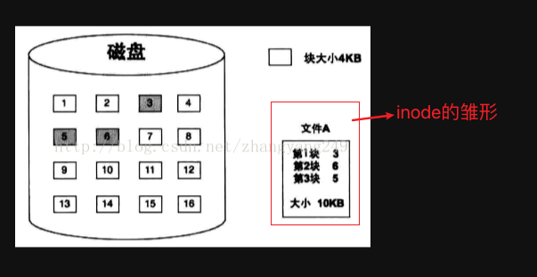
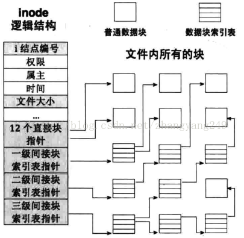
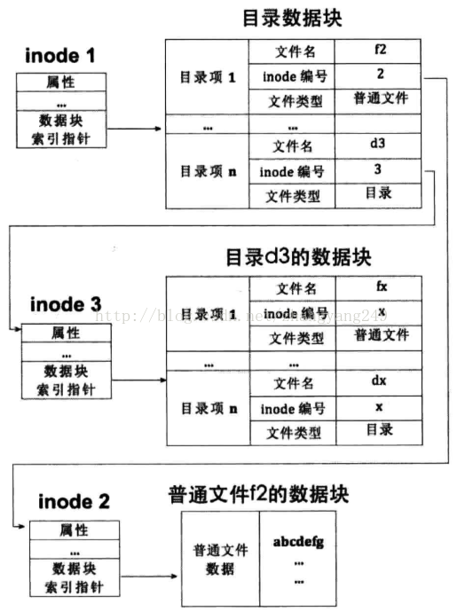
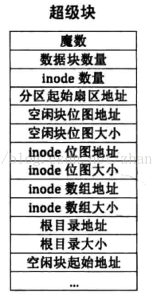
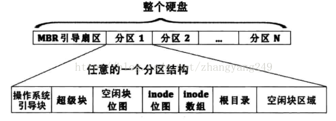

# 文件系统基本知识

## 参考网址

https://blog.csdn.net/zhangyang249/article/details/78637616

## 1. inode、间接块索引表、文件控制块FCB

硬盘读写单位是扇区，因此一个块是由多个扇区组成的，块大小是扇区大小的整数倍。

块是文件系统的读写单位，因此文件至少要占一个块，当文件体积大于一个块时，文件要拆分为多个块来存储。

文件组织形式是对各个文件而言的，UNIX操作系统中的索引结构-inode。

采用索引结构的文件系统，文件中的块依然可以分散到不连续的零散空间中，保留了磁盘高利用率的优点，更重要的是文件系统为每个文件的所有块建立了一个索引表，索引表就是块地址数组，即每个数组元素就是块的地址，数组元素下标是文件块的索引，第n个数组元素指向文件中的第n个块，这样访问任意一个块时候，只要从数组中获得块地址即可。

必须为每一个文件都单独配备一个这样的元信息数据结构，因此 UNIX文件系统中，一个文件必须对应一个 inode。

 

当文件很大时，采取的策略是：每个索引表共有 15个索引项，暂时称此索引表为老索引表。

前12个索引项是文件的前12个块地址，他们是文件的直接块。若文件大于12个块，那就再建立个新的索引表，新索引表称为一级间接块索引表，表中容纳256个块地址。

此表占用一个物理块来存储，该物理块的地址存储到老索引表的第 13 个索引项中。这样文件就有12+256=268块，当文件块大于256块时，建立二级间接块索引表，各表项存储的是一级间接块索引表的地址，这样就可以有 `256*256`个块了，然后在老索引表中的第14个索引项存储二级间接块索引表所在块的地址。这样总共可以有 （`12+256+256*256`） 个块。不行的话，在创建三级间接块索引表，表中各表项存储的二级间接块索引表的地址，这样就可以 `256*256*256` 个块，三级间接块索引表的地址储存在老索引表的第15个索引项中。文件最大可以（`12+256+256*256+256*256*256`）个块。

 

inode结构中，几乎囊括了一个文件的所有信息，权限、属性、时间、大小等等。

只要用于管理、控制文件相关信息的数据结构都被称为 FCB，即文件控制块，inode 也是这种结构，因此inode 也是FCB 的一种。

注意：inode 是文件在文件系统上的元信息，要通过文件系统获得文件的实体，必须先要找到文件的 inode。

Linux中，文件系统是针对各个分区来管理磁盘空间的。在每一个分区中，inode 的数量是固定的，inode 的数量等于文件的数量，分区中所有文件的 inode 通过一个大表格来维护，此表格称为 inode_table ，用数组来表示，数组元素的下标便是文件 inode 编号。

一个分区的大小是固定的，但是文件大小不一，若两个 16GB 的分区，一个分区中储存 1M大小 的文件一个，另一个分区中储存文件大小 1G 的文件也是一个储存，它们的 inode 利用率是一样的，但是磁盘空间利用率不一样。所以一个分区的利用率分为 inode 利用率和磁盘空间利用率。

## 2. 目录项和目录简介

Linux中，目录和文件都用 inode 来表示，因此目录也是文件，只是目录是包含了文件的文件。

所以有了目录文件和普通文件，是文件就要有 inode。如果inode 表示的普通文件，此 inode 指向的数据块中的内容应该是普通文件自己的数据。 inode 表示的目录文件，则指向的数据块中的内容应该是要么普通文件的目录项，要么是目录文件的目录项。

不管文件是 普通文件 还是 目录文件，所有的都存在于某个目录中。所以目录项内容分为普通文件和目录文件。

所以目录相当与一个文件列表，每个文件在目录中都有一个entry，每个entry 的内容至少包括文件名、文件类型、文件的inode 编号。想想 `ls -lai` 这个命令出来的内容。

+ 文件名：inode中并没有文件名，所以文件名存在于目录项中
+ 文件类型：表明这个文件的类型是目录文件还是普通文件
+ inode编号：通过inode 编号可以在inode_table 中找到 inode的地址，这样可以找到该文件的实体块。创建文件的本质就是创建了目录项和 inode。

总结：文件系统中的目录和普通文件统一用 inode 表示。inode表示的文件是普通文件，还是目录文件，取决于 inode 所指向的数据块中实际内容是什么。inode 是文件的实质，但它并不能直接引用，必须通过文件名找到文件名所在的目录项，然后从目录项中获得 inode 的编号，然后用编号到inode_table 数组中找相关的 inode，最后找到文件的数据块。

 

## 3. 超级块和文件系统布局

超级块就是文件系统元信息的配置文件，它是在分区创建文件系统时创建的，所有有关文件系统元信息的配置都在超级块中。

包括：

+ inode_table 的地址和大小

+ inode 位图的地址和大小

+ 根目录的地址和大小

+ 空闲块位图的地址和大小。

每一个分区都有一个超级块，超级块的位置和大小是固定的，在各个分区的第2个扇区，一个扇区大小。

文件系统是针对各个分区来管理的，inode 代表了文件，因此各分区都有自己的inode 数组。各分区可创建的最大文件数是在为分区创建文件系统（格式化）时设置的。所以各分区的inode_table 的数组长度是等于最大文件数的，我们用位图来管理 inode 的使用情况。
 

在分区的开始是MBR块，里面主要是内核加载器。通过MBR可以进入保护模式、开启分页模式、加载内核到内存。

第二个块是超级块，后面是inode 位图和inode_table 数组，后面是根目录和空闲块区域，根目录和空闲块区域才是储存数据的区域。 

 

