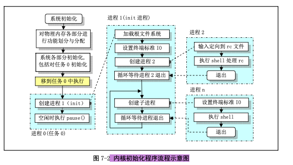
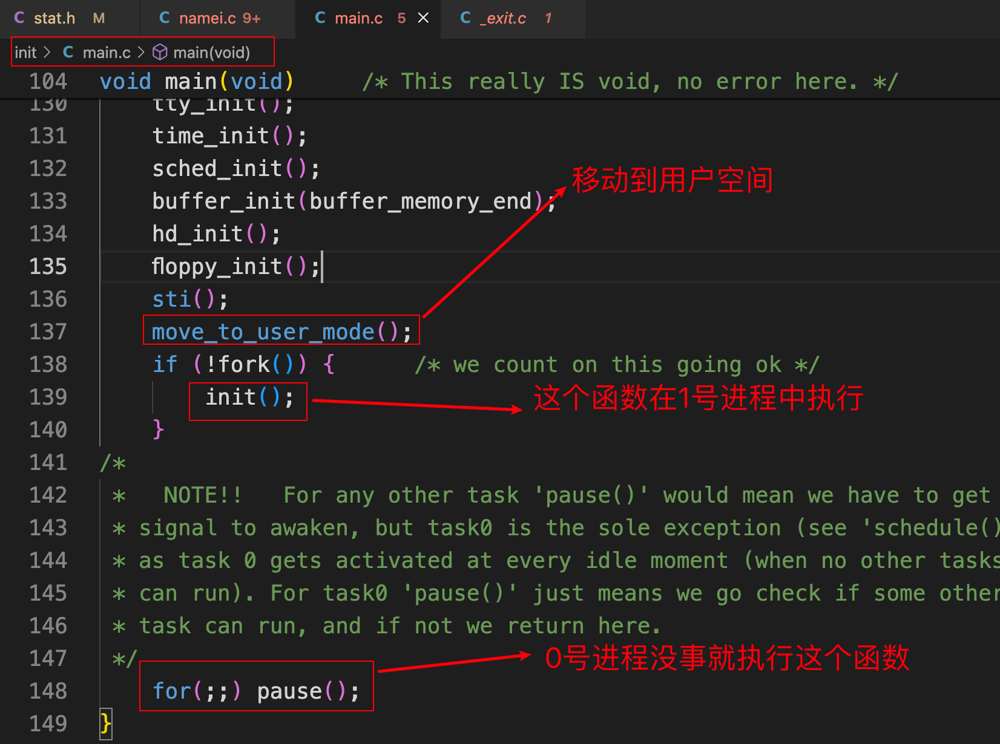
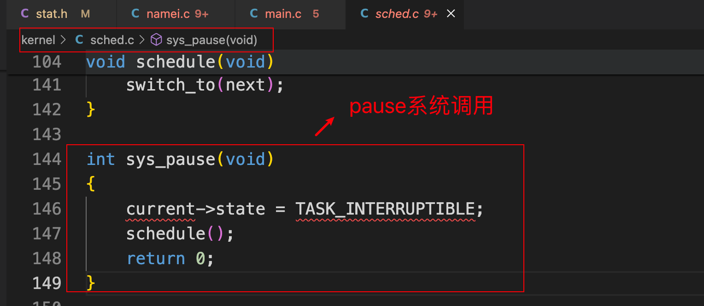
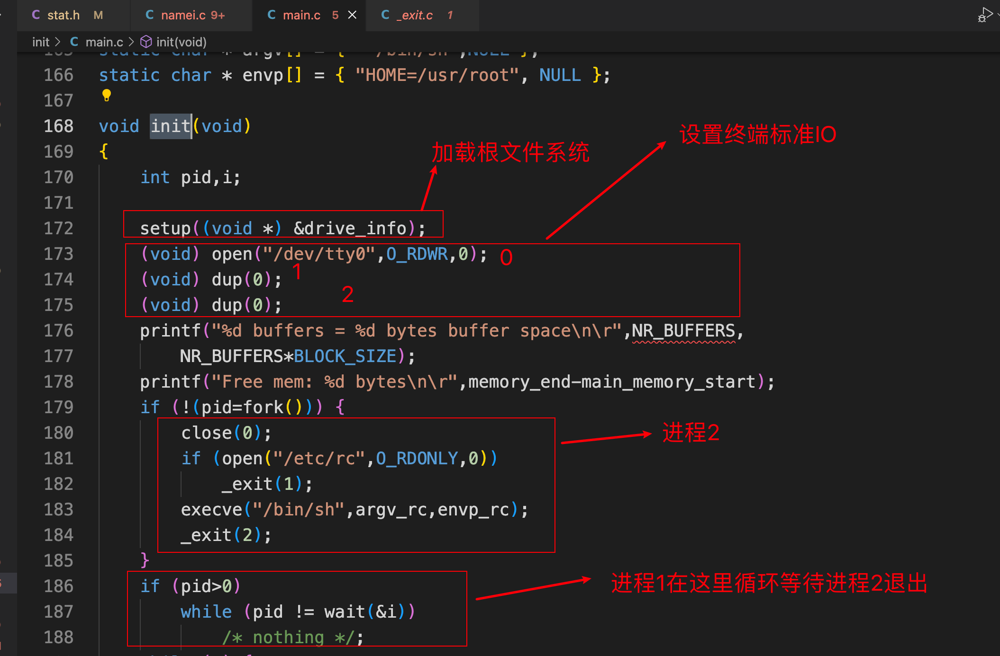
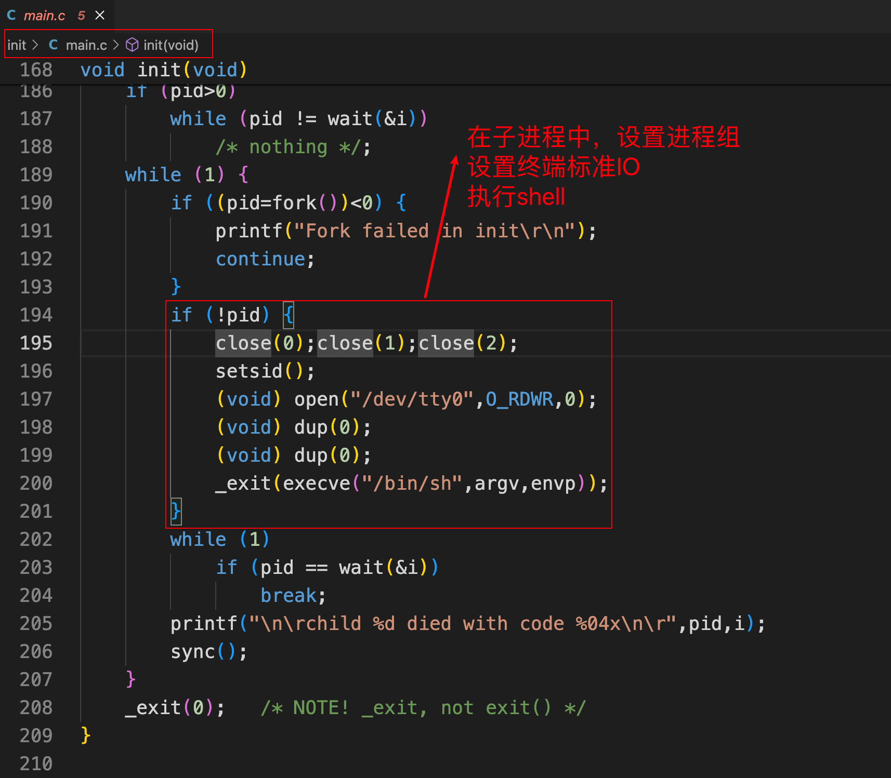
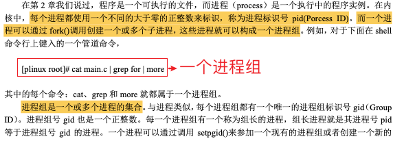
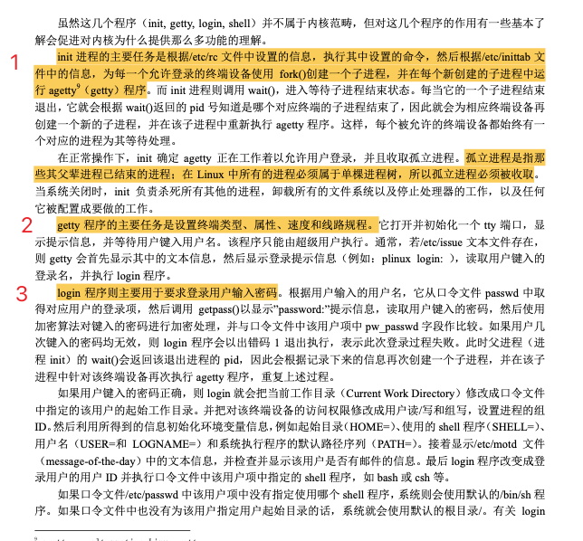
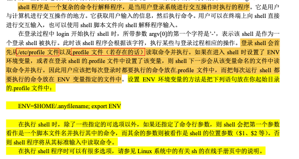
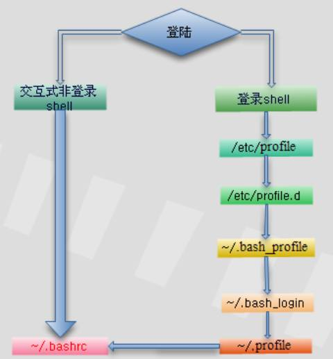

# Linux内核完全注释-初始化程序 

## 参考资料

+ https://developer.aliyun.com/article/32079

## 1. init/main.c代码

```c
/*
 *  linux/init/main.c
 *
 *  (C) 1991  Linus Torvalds
 */

#define __LIBRARY__
#include <unistd.h>
#include <time.h>

/*
 * we need this inline - forking from kernel space will result
 * in NO COPY ON WRITE (!!!), until an execve is executed. This
 * is no problem, but for the stack. This is handled by not letting
 * main() use the stack at all after fork(). Thus, no function
 * calls - which means inline code for fork too, as otherwise we
 * would use the stack upon exit from 'fork()'.
 *
 * Actually only pause and fork are needed inline, so that there
 * won't be any messing with the stack from main(), but we define
 * some others too.
 */
static inline _syscall0(int,fork)
static inline _syscall0(int,pause)  //暂停进程的执行，直到收到一个信号
static inline _syscall1(int,setup,void *,BIOS)
static inline _syscall0(int,sync)   //更新文件系统

#include <linux/tty.h>
#include <linux/sched.h>    //调度程序头文件，定义了任务结构task_struct、第一个初始任务的数据
#include <linux/head.h>     //定义了段描述符的简单结构，和几个选择符常量
#include <asm/system.h>
#include <asm/io.h>

#include <stddef.h>
#include <stdarg.h>
#include <unistd.h>
#include <fcntl.h>
#include <sys/types.h>

#include <linux/fs.h>

static char printbuf[1024];

extern int vsprintf();
extern void init(void);
extern void blk_dev_init(void);     //块设备初始化子程序
extern void chr_dev_init(void);     //字符设备初始化子程序
extern void hd_init(void);          //硬盘初始化子程序
extern void floppy_init(void);      //软驱初始化程序
extern void mem_init(long start, long end);     //内存管理初始化
extern long rd_init(long mem_start, int length);    //虚拟盘初始化
extern long kernel_mktime(struct tm * tm);      //计算系统开机启动时间(s)
extern long startup_time;       //内核启动时间(开机时间)(s)

/*
 * This is set up by the setup-routine at boot-time
 */
#define EXT_MEM_K (*(unsigned short *)0x90002)
#define DRIVE_INFO (*(struct drive_info *)0x90080)
#define ORIG_ROOT_DEV (*(unsigned short *)0x901FC)  //根文件系统所在设备号

/*
 * Yeah, yeah, it's ugly, but I cannot find how to do this correctly
 * and this seems to work. I anybody has more info on the real-time
 * clock I'd be interested. Most of this was trial and error, and some
 * bios-listing reading. Urghh.
 */

#define CMOS_READ(addr) ({ \
outb_p(0x80|addr,0x70); \
inb_p(0x71); \
})

#define BCD_TO_BIN(val) ((val)=((val)&15) + ((val)>>4)*10)

static void time_init(void)     //取CMOS实时钟信息作为开机时间，并保存到全局变量startup_time(s)
{
	struct tm time;

	do {
		time.tm_sec = CMOS_READ(0);
		time.tm_min = CMOS_READ(2);
		time.tm_hour = CMOS_READ(4);
		time.tm_mday = CMOS_READ(7);
		time.tm_mon = CMOS_READ(8);
		time.tm_year = CMOS_READ(9);
	} while (time.tm_sec != CMOS_READ(0));
	BCD_TO_BIN(time.tm_sec);
	BCD_TO_BIN(time.tm_min);
	BCD_TO_BIN(time.tm_hour);
	BCD_TO_BIN(time.tm_mday);
	BCD_TO_BIN(time.tm_mon);
	BCD_TO_BIN(time.tm_year);
	time.tm_mon--;
	startup_time = kernel_mktime(&time);
}

static long memory_end = 0;     //机器具有的物理内存容量
static long buffer_memory_end = 0;  //高速缓冲区末端地址
static long main_memory_start = 0;  //主内存(将用于分页)开始的位置

struct drive_info { char dummy[32]; } drive_info;   //用于存放硬盘参数表信息

void main(void)		/* This really IS void, no error here. */
{			/* The startup routine assumes (well, ...) this */
/*
 * Interrupts are still disabled. Do necessary setups, then
 * enable them
 */
 	ROOT_DEV = ORIG_ROOT_DEV;
 	drive_info = DRIVE_INFO;
	memory_end = (1<<20) + (EXT_MEM_K<<10);
	memory_end &= 0xfffff000;
	if (memory_end > 16*1024*1024)
		memory_end = 16*1024*1024;
	if (memory_end > 12*1024*1024)
		buffer_memory_end = 4*1024*1024;
	else if (memory_end > 6*1024*1024)
		buffer_memory_end = 2*1024*1024;
	else
		buffer_memory_end = 1*1024*1024;
	main_memory_start = buffer_memory_end;
#ifdef RAMDISK
	main_memory_start += rd_init(main_memory_start, RAMDISK*1024);
#endif
	mem_init(main_memory_start,memory_end); //主内存区初始化
	trap_init();        //陷阱门(硬件中断向量)初始化
	blk_dev_init();     //块设备初始化
	chr_dev_init();     //字符设备初始化
	tty_init();         //tty初始化
	time_init();        //设置开机启动时间
	sched_init();       //调度程序初始化(加载任务0的tr,ldtr)
	buffer_init(buffer_memory_end); //缓冲管理初始化，建内存链表
	hd_init();          //硬盘初始化
	floppy_init();      //软驱初始化
	sti();              //所有初始化工作都完成了，开启中断
	move_to_user_mode();    //移到用户模式下执行
	if (!fork()) {		/* we count on this going ok */
		init();     //在新建的子进程(任务1)中执行
	}
/*
 *   NOTE!!   For any other task 'pause()' would mean we have to get a
 * signal to awaken, but task0 is the sole exception (see 'schedule()')
 * as task 0 gets activated at every idle moment (when no other tasks
 * can run). For task0 'pause()' just means we go check if some other
 * task can run, and if not we return here.
 */
	for(;;) pause();    //调度函数只要发现系统中没有其他任务可以运行时就会切换到任务0
}

static int printf(const char *fmt, ...)
{
	va_list args;
	int i;

	va_start(args, fmt);
	write(1,printbuf,i=vsprintf(printbuf, fmt, args));
	va_end(args);
	return i;
}

static char * argv_rc[] = { "/bin/sh", NULL };  //调用执行程序时参数的字符串数组
static char * envp_rc[] = { "HOME=/", NULL };   //调用执行程序时环境字符串数组

static char * argv[] = { "-/bin/sh",NULL };
static char * envp[] = { "HOME=/usr/root", NULL };

void init(void)
{
	int pid,i;

	setup((void *) &drive_info);    //读取硬盘参数包括分区表信息并加载虚拟盘(如果存在)和安装根文件系统设备
	(void) open("/dev/tty0",O_RDWR,0);
	(void) dup(0);  //复制句柄，产生句柄1号--stdout标准输出设备
	(void) dup(0);  //复制句柄，产生句柄2号--stderr标准错误输出设备
	printf("%d buffers = %d bytes buffer space\n\r",NR_BUFFERS,
		NR_BUFFERS*BLOCK_SIZE);
	printf("Free mem: %d bytes\n\r",memory_end-main_memory_start);
	if (!(pid=fork())) {
		close(0);   //关闭句柄0并立即打开/etc/rc文件的作用是将标准输入stdin重定向到/etc/rc文件
		if (open("/etc/rc",O_RDONLY,0))
			_exit(1);
		execve("/bin/sh",argv_rc,envp_rc);
		_exit(2);
	}
	if (pid>0)
		while (pid != wait(&i))
			/* nothing */;
	while (1) {
		if ((pid=fork())<0) {
			printf("Fork failed in init\r\n");
			continue;
		}
		if (!pid) {
			close(0);close(1);close(2);
			setsid();   //创建一个新的会话期
			(void) open("/dev/tty0",O_RDWR,0);
			(void) dup(0);
			(void) dup(0);
			_exit(execve("/bin/sh",argv,envp));
		}
		while (1)
			if (pid == wait(&i))
				break;
		printf("\n\rchild %d died with code %04x\n\r",pid,i);
		sync();
	}
	_exit(0);	/* NOTE! _exit, not exit() */
}  
```

## 2. 内核初始化程序流程示意图

 

## 3. main函数分析

```c
void main(void)		/* This really IS void, no error here. */
{			/* The startup routine assumes (well, ...) this */
/*
 * Interrupts are still disabled. Do necessary setups, then
 * enable them
 */
 	ROOT_DEV = ORIG_ROOT_DEV;
 	drive_info = DRIVE_INFO;
	memory_end = (1<<20) + (EXT_MEM_K<<10);
	memory_end &= 0xfffff000;
	if (memory_end > 16*1024*1024)
		memory_end = 16*1024*1024;
	if (memory_end > 12*1024*1024)
		buffer_memory_end = 4*1024*1024;
	else if (memory_end > 6*1024*1024)
		buffer_memory_end = 2*1024*1024;
	else
		buffer_memory_end = 1*1024*1024;
	main_memory_start = buffer_memory_end;
#ifdef RAMDISK
	main_memory_start += rd_init(main_memory_start, RAMDISK*1024);
#endif
	mem_init(main_memory_start,memory_end); //主内存区初始化
	trap_init();        //陷阱门(硬件中断向量)初始化
	blk_dev_init();     //块设备初始化
	chr_dev_init();     //字符设备初始化
	tty_init();         //tty初始化
	time_init();        //设置开机启动时间
	sched_init();       //调度程序初始化(加载任务0的tr,ldtr)
	buffer_init(buffer_memory_end); //缓冲管理初始化，建内存链表
	hd_init();          //硬盘初始化
	floppy_init();      //软驱初始化
	sti();              //所有初始化工作都完成了，开启中断
	move_to_user_mode();    //移到用户模式下执行
	if (!fork()) {		/* we count on this going ok */
		init();     //在新建的子进程(任务1)中执行
	}
/*
 *   NOTE!!   For any other task 'pause()' would mean we have to get a
 * signal to awaken, but task0 is the sole exception (see 'schedule()')
 * as task 0 gets activated at every idle moment (when no other tasks
 * can run). For task0 'pause()' just means we go check if some other
 * task can run, and if not we return here.
 */
	for(;;) pause();    //调度函数只要发现系统中没有其他任务可以运行时就会切换到任务0
}

```

## 4. init函数分析

### 4.1 引入

 

进程0仅执行pause系统调用，并又会调用调度函数。

 

### 4.2 进入init函数内部

 

 

### 4.3 证据

```bash
ubuntu@VM-0-16-ubuntu:~/Linux011/oslab$ head -n 100 process.log
1       N       48	# 进程1新建（init()）。此前是进程0建立和运行
1       J       48	# 新建后进入就绪队列
0       J       48	# 进程0从运行->就绪，让出CPU
1       R       48	# 进程1运行
2       N       49	# 进程1建立进程2。2会运行/etc/rc脚本，然后退出
2       J       49
1       W       49	# 进程1开始等待（等待进程2退出）
2       R       49	# 进程2运行
3       N       63	# 进程2建立进程3。3是/bin/sh建立的运行脚本的子进程
3       J       64
2       J       64	# 进程2从运行->就绪，让出CPU
3       R       64	# 进程3运行
3       W       68	# 进程3从运行->阻塞
2       R       68	# 进程2运行
2       E       73	# 进程2不等进程3退出，就先走一步了
1       J       73	# 进程1此前在等待进程2退出，被阻塞。进程2退出后，重新进入就绪队列
1       R       73
4       N       74	# 进程1建立进程4，即shell
4       J       74
1       W       74	# 进程1等待shell退出（除非执行exit命令，否则shell不会退出）
4       R       74	# 进程4运行
5       N       106	# 进程5是shell建立的不知道做什么的进程
5       J       106
4       W       107
5       R       107
4       J       109
5       E       109	# 进程5很快退出
4       R       109	
4       W       115	# shell等待用户输入命令
0       R       115	# 因为无事可做，所以进程0重出江湖
4       J       1710	# 用户输入命令了，唤醒了shell
4       R       1710
4       W       1710
0       R       1710
4       J       1760
4       R       1760
4       W       1760
0       R       1760
4       J       1968
4       R       1968
4       W       1968
0       R       1968
4       J       2011
4       R       2011
4       W       2011
0       R       2011
4       J       2081
4       R       2081
4       W       2081
0       R       2081
4       J       2108
4       R       2108
4       W       2108
0       R       2108
4       J       2704
4       R       2704
4       W       2704
0       R       2704
4       J       2746
4       R       2746
4       W       2746
0       R       2746
3       J       3067
3       R       3067
3       W       3067
0       R       3067
4       J       3483
4       R       3483
4       W       3483
0       R       3483
4       J       3532
4       R       3532
4       W       3532
0       R       3532
4       J       3979
4       R       3979
4       W       3979
0       R       3979
4       J       4015
4       R       4015
4       W       4015
0       R       4015
4       J       4800
4       R       4800
4       W       4800
0       R       4800
4       J       5167
4       R       5167
4       W       5167
0       R       5167
4       J       5693
4       R       5693
4       W       5693
0       R       5693
4       J       5695
4       R       5695
4       W       5696
0       R       5696
4       J       5696
4       R       5696
```

## 5. 会话期的概念 

 

 

## 6. 环境初始化工作

不属于内核范畴！！！！！

### 6.1 有关环境初始化的程序

 

为了能具有登陆系统功能和多人同时使用系统的功能，通常的：

+ 系统还会执行系统环境初始化程序init.c，而此程序会根据系统/etc/目录中配置文件的设置信息，对系统中支持的每个终端设备创建子进程，并在子进程中运行终端初始化设置程序agetty；
+ agetty则会在终端上显示用户登陆提示信息“login：”。当用户键入了用户名后，agetty被替换成login程序；
+ login程序在验证了用户输入口令的正确性之后，最终调用shell程序，并进入shell交互工作界面。

### 6.2 详细解析

 

  

### 6.3 登陆系统时shell的读取顺序

+ https://developer.aliyun.com/article/559854

 

+ https://cloud.tencent.com/developer/article/1116370

 

