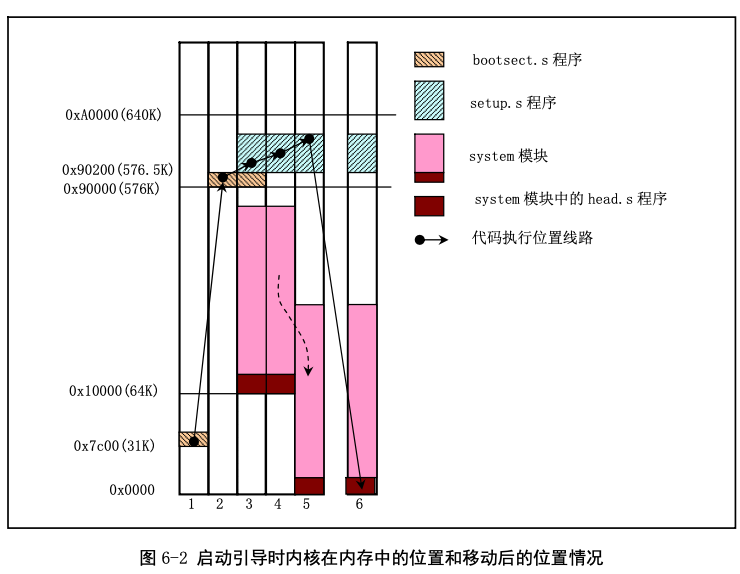

# Linux内核完全注释-引导启动程序

## 1. 总体功能

### 1.1 从系统加电起所执行程序的顺序 

 

### 1.2 内核在内存中的位置和移动后的位置情况

 

## 2. bootsect.s程序

 

## 3. setup.s程序

 

 

  

## 4. head.s程序

  

## 5. 内存映像

### 5.1 setup.s执行后的内存映像

 

### 5.2 head.s执行后的内存映像

  

