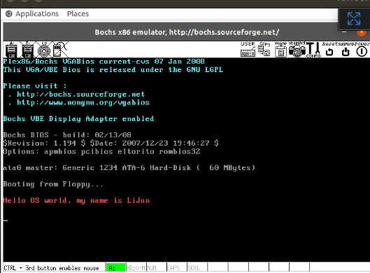
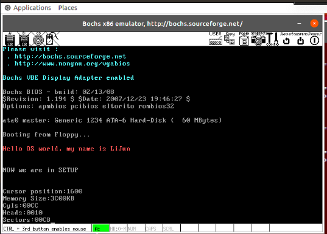

# 实验一报告

## 1. 完成 bootsect.s 的屏幕输出功能

需要修改的文件：`linux-0.11/boot/bootsect.s`

```assembly
entry _start
_start:
    mov ah,#0x03
    xor bh,bh
    int 0x10
    mov cx,#38
    mov bx,#0x000c
    mov bp,#msg1
    mov ax,#0x07c0
    mov es,ax
    mov ax,#0x1301
    int 0x10
inf_loop:
    jmp inf_loop
msg1:
    .byte   13,10
    .ascii  "Hello OS world, my name is LiJun"
    .byte   13,10,13,10
.org 510
boot_flag:
    .word   0xAA55
```

编译内核后运行结果：

 

## 2. bootsect.s 读入 setup.s

需要修改的文件：

+ `linux-0.11/boot/bootsect.s`
+ `linux-0.11/boot/setup.s`

`linux-0.11/boot/bootsect.s`

```assembly
SETUPLEN=2
SETUPSEG=0x07e0
entry _start
_start:
    mov ah,#0x03    ! ah=03 读取光标位置
    xor bh,bh       ! bh=页号
    int 0x10
    mov cx,#38      ! 读取38个字符
    mov bx,#0x000c  ! bh=显示页面号 bl=字符属性
    mov bp,#msg1
    mov ax,#0x07c0
    mov es,ax   ! 将es段寄存器设置为0x07c0
    mov ax,#0x1301  ! ax=0x13 显示字符串 al=放置光标的方式及规定属性 0x01表示使用bl中的属性值
    int 0x10
load_setup:  ! 将setup模块从磁盘第2个扇区开始读到0x7e00处，共读2个扇区
	mov	dx,#0x0000	! dh=磁头号 dl=驱动器号
	mov	cx,#0x0002  ! ch=磁道(柱面)号的低8位 cl=开始扇区(位0-5),磁道号高2位(位6-7)
	mov	bx,#0x0200	! es:bx指向数据缓冲区 此时es=0x07c0
	mov	ax,#0x0200+SETUPLEN	! ah=0x02 读磁盘扇区道内存 al=需要读出的扇区数量
	int	0x13
	jnc	ok_load_setup
	mov	dx,#0x0000
	mov	ax,#0x0000
	int	0x13
	jmp	load_setup

ok_load_setup:
    jmpi   0,SETUPSEG
msg1:
    .byte   13,10
    .ascii  "Hello OS world, my name is LiJun"
    .byte   13,10,13,10
.org 510
boot_flag:
    .word   0xAA55
```

`linux-0.11/boot/setup.s`

```assembly
entry _start
_start:
    mov ah,#0x03
    xor bh,bh
    int 0x10
    mov cx,#25
    mov bx,#0x000c
    mov bp,#msg2
    mov ax,cs
    mov es,ax
    mov ax,#0x1301
    int 0x10
inf_loop:
    jmp inf_loop
msg2:
    .byte   13,10
    .ascii  "NOW we are in SETUP"
    .byte   13,10,13,10
.org 510
boot_flag:
    .word   0xAA55
```

编译后运行的结果：

 

## 3. setup.s 获取基本硬件参数

### 3.1 获取硬件参数

`linux-0.11/boot/setup.s`中的部分代码：

```assembly
mov    ax,#INITSEG
mov    ds,ax	! 设置 ds = 0x9000
mov    ah,#0x03
xor    bh,bh	! 读入光标位置
int    0x10		! 调用 0x10 中断
mov    [0],dx	! 将光标位置写入 0x90000.

! 读入内存大小位置
mov    ah,#0x88
int    0x15
mov    [2],ax

! 从 0x41 处拷贝 16 个字节（磁盘参数表）
mov    ax,#0x0000
mov    ds,ax
lds    si,[4*0x41]
mov    ax,#INITSEG
mov    es,ax
mov    di,#0x0004
mov    cx,#0x10
! 重复16次
rep
movsb
```

### 3.2 显示获得的参数

`linux-0.11/boot/setup.s`中的部分代码：

```assembly
! 以 16 进制方式打印栈顶的16位数
print_hex:
! 4 个十六进制数字
    mov cx,#4
! 将(bp)所指的值放入 dx 中，如果 bp 是指向栈顶的话
    mov dx,(bp)
print_digit:
! 循环以使低 4 比特用上 !! 取 dx 的高 4 比特移到低 4 比特处。
    rol dx,#4
! ah = 请求的功能值，al = 半字节(4 个比特)掩码。
    mov ax,#0xe0f
! 取 dl 的低 4 比特值。
    and al,dl
! 给 al 数字加上十六进制 0x30
    add al,#0x30
    cmp al,#0x3a
! 是一个不大于十的数字
    jl  outp
! 是a～f，要多加 7
    add al,#0x07
outp:
    int 0x10
    loop    print_digit
    ret
! 这里用到了一个 loop 指令;
! 每次执行 loop 指令，cx 减 1，然后判断 cx 是否等于 0。
! 如果不为 0 则转移到 loop 指令后的标号处，实现循环；
! 如果为0顺序执行。
!
! 另外还有一个非常相似的指令：rep 指令，
! 每次执行 rep 指令，cx 减 1，然后判断 cx 是否等于 0。
！ 如果不为 0 则继续执行 rep 指令后的串操作指令，直到 cx 为 0，实现重复。

! 打印回车换行
print_nl:
! CR
    mov ax,#0xe0d
    int 0x10
! LF
    mov al,#0xa
    int 0x10
    ret
```

### 3.3 完整代码

`linux-0.11/boot/setup.s`

```assembly
INITSEG  = 0x9000
entry _start
_start:
! Print "NOW we are in SETUP"
    mov ah,#0x03    ! ah=3 读取光标位置
    xor bh,bh       ! bh=页号
    int 0x10
    mov cx,#25      ! 读取25个字符（字节可以改变）
    mov bx,#0x0007  ! bh=显示页面号 bl=字符属性
    mov bp,#msg2
    mov ax,cs
    mov es,ax
    mov ax,#0x1301  ! ax=0x13 显示字符串 al=放置光标的方式及规定属性 0x01表示使用bl中的属性值
    int 0x10

    mov ax,cs
    mov es,ax
! init ss:sp
    mov ax,#INITSEG
    mov ss,ax   ! ss=0x9000
    mov sp,#0xFF00  ! ss:sp = 0x9ff00 保证申请的栈足够大

! Get Params
    mov ax,#INITSEG
    mov ds,ax
    mov ah,#0x03
    xor bh,bh
    int 0x10
    mov [0],dx  ! 将光标位置写入 0x90000.
! 读入内存大小位置
    mov ah,#0x88
    int 0x15
    mov [2],ax
! 从 0x41 处拷贝 16 个字节（磁盘参数表）
    mov ax,#0x0000
    mov ds,ax
    lds si,[4*0x41]
    mov ax,#INITSEG
    mov es,ax
    mov di,#0x0004
    mov cx,#0x10
    rep
    movsb

! Be Ready to Print
    mov ax,cs
    mov es,ax
    mov ax,#INITSEG
    mov ds,ax   ! ds=0x9000

! Cursor Position
    mov ah,#0x03
    xor bh,bh
    int 0x10
    mov cx,#18
    mov bx,#0x0007
    mov bp,#msg_cursor
    mov ax,#0x1301
    int 0x10
    mov dx,[0]
    call    print_hex
! Memory Size
    mov ah,#0x03
    xor bh,bh
    int 0x10
    mov cx,#14
    mov bx,#0x0007
    mov bp,#msg_memory
    mov ax,#0x1301
    int 0x10
    mov dx,[2]
    call    print_hex
! Add KB
    mov ah,#0x03
    xor bh,bh
    int 0x10
    mov cx,#2
    mov bx,#0x0007
    mov bp,#msg_kb
    mov ax,#0x1301
    int 0x10
! Cyles
    mov ah,#0x03
    xor bh,bh
    int 0x10
    mov cx,#7
    mov bx,#0x0007
    mov bp,#msg_cyles
    mov ax,#0x1301
    int 0x10
    mov dx,[4]
    call    print_hex
! Heads
    mov ah,#0x03
    xor bh,bh
    int 0x10
    mov cx,#8
    mov bx,#0x0007
    mov bp,#msg_heads
    mov ax,#0x1301
    int 0x10
    mov dx,[6]
    call    print_hex
! Secotrs
    mov ah,#0x03
    xor bh,bh
    int 0x10
    mov cx,#10
    mov bx,#0x0007
    mov bp,#msg_sectors
    mov ax,#0x1301
    int 0x10
    mov dx,[12]
    call    print_hex

inf_loop:
    jmp inf_loop

print_hex:
    mov    cx,#4
print_digit:
    rol    dx,#4
    mov    ax,#0xe0f
    and    al,dl
    add    al,#0x30
    cmp    al,#0x3a
    jl     outp
    add    al,#0x07
outp:
    int    0x10
    loop   print_digit
    ret
print_nl:
    mov    ax,#0xe0d     ! CR
    int    0x10
    mov    al,#0xa     ! LF
    int    0x10
    ret

msg2:
    .byte 13,10
    .ascii "NOW we are in SETUP"
    .byte 13,10,13,10
msg_cursor:
    .byte 13,10
    .ascii "Cursor position:"
msg_memory:
    .byte 13,10
    .ascii "Memory Size:"
msg_cyles:
    .byte 13,10
    .ascii "Cyls:"
msg_heads:
    .byte 13,10
    .ascii "Heads:"
msg_sectors:
    .byte 13,10
    .ascii "Sectors:"
msg_kb:
    .ascii "KB"

.org 510
boot_flag:
    .word 0xAA55
```

### 3.4 编译后运行的结果

 
