# Linux内核完全注释-内核代码

## 1. 总体介绍

位置：`linux-0.11/kernel`

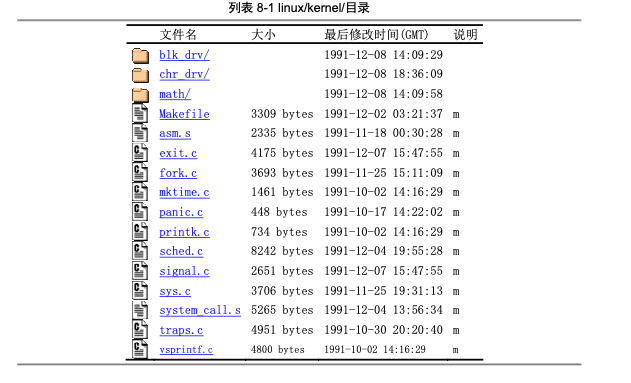 

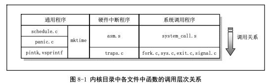 

### 1.1 中断处理程序

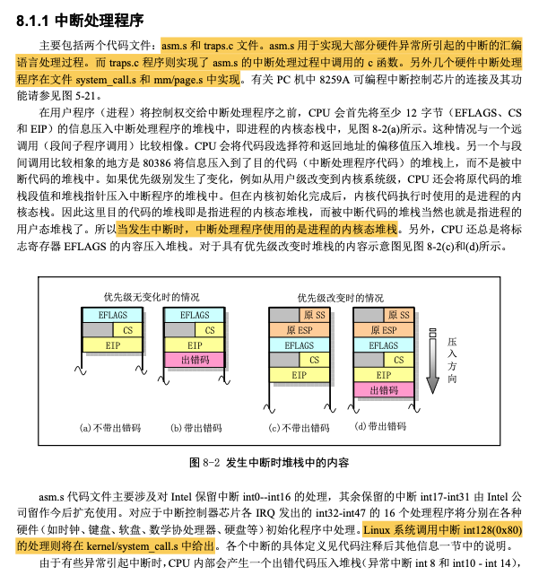 

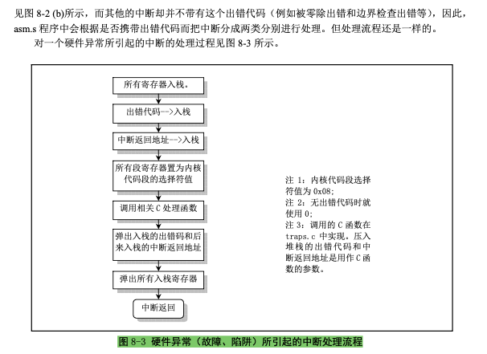 

### 1.2 系统调用处理相关程序

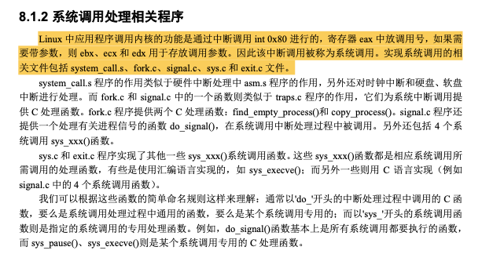 

### 1.3 其他通用类程序

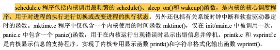 

## 2. Makefile文件

```makefile
oslab/linux-0.11/kernel$ cat Makefile

#
# Makefile for the FREAX-kernel.
#
# Note! Dependencies are done automagically by 'make dep', which also
# removes any old dependencies. DON'T put your own dependencies here
# unless it's something special (ie not a .c file).
#

AR	=ar
AS	=as --32
LD	=ld
LDFLAGS	=-m elf_i386 -x
CC	=gcc-3.4 -march=i386
CFLAGS	=-m32 -g -Wall -O -fstrength-reduce -fomit-frame-pointer \
	-finline-functions -nostdinc -I../include
CPP	=gcc-3.4 -E -nostdinc -I../include

.c.s:
	$(CC) $(CFLAGS) \
	-S -o $*.s $<
.s.o:
	$(AS) -o $*.o $<
.c.o:
	$(CC) $(CFLAGS) \
	-c -o $*.o $<

OBJS  = sched.o system_call.o traps.o asm.o fork.o \
	panic.o printk.o vsprintf.o sys.o exit.o \
	signal.o mktime.o who.o

kernel.o: $(OBJS)
	$(LD) -m elf_i386 -r -o kernel.o $(OBJS)
	sync

clean:
	rm -f core *.o *.a tmp_make keyboard.s
	for i in *.c;do rm -f `basename $$i .c`.s;done
	(cd chr_drv; make clean)
	(cd blk_drv; make clean)
	(cd math; make clean)

dep:
	sed '/\#\#\# Dependencies/q' < Makefile > tmp_make
	(for i in *.c;do echo -n `echo $$i | sed 's,\.c,\.s,'`" "; \
		$(CPP) -M $$i;done) >> tmp_make
	cp tmp_make Makefile
	(cd chr_drv; make dep)
	(cd blk_drv; make dep)

### Dependencies:
who.s who.o: who.c ../include/linux/kernel.h ../include/unistd.h
exit.s exit.o: exit.c ../include/errno.h ../include/signal.h \
  ../include/sys/types.h ../include/sys/wait.h ../include/linux/sched.h \
  ../include/linux/head.h ../include/linux/fs.h ../include/linux/mm.h \
  ../include/linux/kernel.h ../include/linux/tty.h ../include/termios.h \
  ../include/asm/segment.h
fork.s fork.o: fork.c ../include/errno.h ../include/linux/sched.h \
  ../include/linux/head.h ../include/linux/fs.h ../include/sys/types.h \
  ../include/linux/mm.h ../include/signal.h ../include/linux/kernel.h \
  ../include/asm/segment.h ../include/asm/system.h
mktime.s mktime.o: mktime.c ../include/time.h
panic.s panic.o: panic.c ../include/linux/kernel.h ../include/linux/sched.h \
  ../include/linux/head.h ../include/linux/fs.h ../include/sys/types.h \
  ../include/linux/mm.h ../include/signal.h
printk.s printk.o: printk.c ../include/stdarg.h ../include/stddef.h \
  ../include/linux/kernel.h
sched.s sched.o: sched.c ../include/linux/sched.h ../include/linux/head.h \
  ../include/linux/fs.h ../include/sys/types.h ../include/linux/mm.h \
  ../include/signal.h ../include/linux/kernel.h ../include/linux/sys.h \
  ../include/linux/fdreg.h ../include/asm/system.h ../include/asm/io.h \
  ../include/asm/segment.h
signal.s signal.o: signal.c ../include/linux/sched.h ../include/linux/head.h \
  ../include/linux/fs.h ../include/sys/types.h ../include/linux/mm.h \
  ../include/signal.h ../include/linux/kernel.h ../include/asm/segment.h
sys.s sys.o: sys.c ../include/errno.h ../include/linux/sched.h \
  ../include/linux/head.h ../include/linux/fs.h ../include/sys/types.h \
  ../include/linux/mm.h ../include/signal.h ../include/linux/tty.h \
  ../include/termios.h ../include/linux/kernel.h ../include/asm/segment.h \
  ../include/sys/times.h ../include/sys/utsname.h
traps.s traps.o: traps.c ../include/string.h ../include/linux/head.h \
  ../include/linux/sched.h ../include/linux/fs.h ../include/sys/types.h \
  ../include/linux/mm.h ../include/signal.h ../include/linux/kernel.h \
  ../include/asm/system.h ../include/asm/segment.h ../include/asm/io.h
vsprintf.s vsprintf.o: vsprintf.c ../include/stdarg.h ../include/string.h
```

## 3. asm.s程序

### 3.1 分析

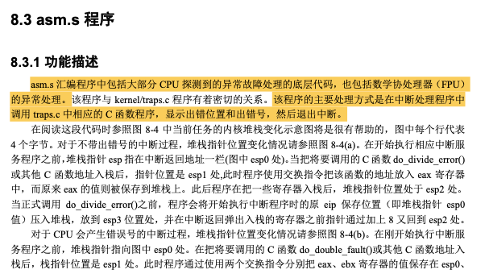 

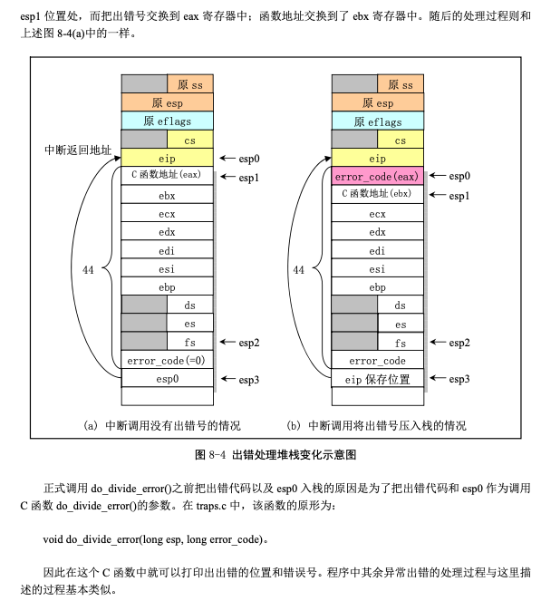 

### 3.2 代码

```assembly
oslab/linux-0.11/kernel$ cat asm.s

/*
 *  linux/kernel/asm.s
 *
 *  (C) 1991  Linus Torvalds
 */

/*
 * asm.s contains the low-level code for most hardware faults.
 * page_exception is handled by the mm, so that isn't here. This
 * file also handles (hopefully) fpu-exceptions due to TS-bit, as
 * the fpu must be properly saved/resored. This hasn't been tested.
 */

.globl divide_error,debug,nmi,int3,overflow,bounds,invalid_op
.globl double_fault,coprocessor_segment_overrun
.globl invalid_TSS,segment_not_present,stack_segment
.globl general_protection,coprocessor_error,irq13,reserved

divide_error:
	pushl $do_divide_error
no_error_code:
	xchgl %eax,(%esp)
	pushl %ebx
	pushl %ecx
	pushl %edx
	pushl %edi
	pushl %esi
	pushl %ebp
	push %ds
	push %es
	push %fs
	pushl $0		# "error code"
	lea 44(%esp),%edx
	pushl %edx
	movl $0x10,%edx
	mov %dx,%ds
	mov %dx,%es
	mov %dx,%fs
	call *%eax
	addl $8,%esp
	pop %fs
	pop %es
	pop %ds
	popl %ebp
	popl %esi
	popl %edi
	popl %edx
	popl %ecx
	popl %ebx
	popl %eax
	iret

debug:  # int1 debug调试中断入口点
	pushl $do_int3		# _do_debug
	jmp no_error_code

nmi:    # int2 非屏蔽中断调用入口点
	pushl $do_nmi
	jmp no_error_code

int3:   # int3 断点指令引起中断的入口点
	pushl $do_int3
	jmp no_error_code

overflow:   # int4 溢出出错处理中断入口点
	pushl $do_overflow
	jmp no_error_code

bounds:     # int5 边界检查出错中断入口点
	pushl $do_bounds
	jmp no_error_code

invalid_op: # int6 无效操作指令出错中断入口点
	pushl $do_invalid_op
	jmp no_error_code

coprocessor_segment_overrun:    # int7 协处理器段超出出错中断入口点
	pushl $do_coprocessor_segment_overrun
	jmp no_error_code

reserved:   # int15 其他Intel保留中断的入口点
	pushl $do_reserved
	jmp no_error_code

irq13:      # int45 Linux设置的数学协处理器硬件中断
	pushl %eax
	xorb %al,%al
	outb %al,$0xF0
	movb $0x20,%al
	outb %al,$0x20
	jmp 1f
1:	jmp 1f
1:	outb %al,$0xA0
	popl %eax
	jmp coprocessor_error

double_fault:   # int8 双出错故障
	pushl $do_double_fault
error_code:
	xchgl %eax,4(%esp)		# error code <-> %eax
	xchgl %ebx,(%esp)		# &function <-> %ebx
	pushl %ecx
	pushl %edx
	pushl %edi
	pushl %esi
	pushl %ebp
	push %ds
	push %es
	push %fs
	pushl %eax			# error code
	lea 44(%esp),%eax		# offset
	pushl %eax
	movl $0x10,%eax
	mov %ax,%ds
	mov %ax,%es
	mov %ax,%fs
	call *%ebx
	addl $8,%esp
	pop %fs
	pop %es
	pop %ds
	popl %ebp
	popl %esi
	popl %edi
	popl %edx
	popl %ecx
	popl %ebx
	popl %eax
	iret

invalid_TSS:    # int10 无效的任务状态段
	pushl $do_invalid_TSS
	jmp error_code

segment_not_present:    # int11 段不存在
	pushl $do_segment_not_present
	jmp error_code

stack_segment:  # int12 堆栈段错误
	pushl $do_stack_segment
	jmp error_code

general_protection: # int13 一般保护性出错
	pushl $do_general_protection
	jmp error_code
```

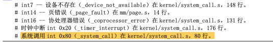 

### 3.3 补充

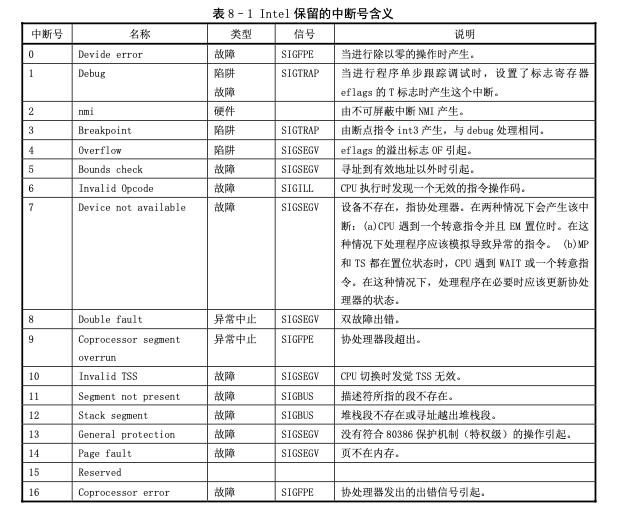 

## 4. trap.s程序

### 4.1 分析

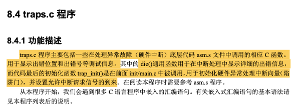 

### 4.2 代码

```c
oslab/linux-0.11/kernel$ cat traps.c

/*
 *  linux/kernel/traps.c
 *
 *  (C) 1991  Linus Torvalds
 */

/*
 * 'Traps.c' handles hardware traps and faults after we have saved some
 * state in 'asm.s'. Currently mostly a debugging-aid, will be extended
 * to mainly kill the offending process (probably by giving it a signal,
 * but possibly by killing it outright if necessary).
 */
#include <string.h>

#include <linux/head.h>
#include <linux/sched.h>
#include <linux/kernel.h>
#include <asm/system.h>
#include <asm/segment.h>
#include <asm/io.h>

#define get_seg_byte(seg,addr) ({ \
register char __res; \
__asm__("push %%fs;mov %%ax,%%fs;movb %%fs:%2,%%al;pop %%fs" \
	:"=a" (__res):"0" (seg),"m" (*(addr))); \
__res;})

#define get_seg_long(seg,addr) ({ \
register unsigned long __res; \
__asm__("push %%fs;mov %%ax,%%fs;movl %%fs:%2,%%eax;pop %%fs" \
	:"=a" (__res):"0" (seg),"m" (*(addr))); \
__res;})

#define _fs() ({ \
register unsigned short __res; \
__asm__("mov %%fs,%%ax":"=a" (__res):); \
__res;})

int do_exit(long code);

void page_exception(void);

void divide_error(void);
void debug(void);
void nmi(void);
void int3(void);
void overflow(void);
void bounds(void);
void invalid_op(void);
void device_not_available(void);
void double_fault(void);
void coprocessor_segment_overrun(void);
void invalid_TSS(void);
void segment_not_present(void);
void stack_segment(void);
void general_protection(void);
void page_fault(void);
void coprocessor_error(void);
void reserved(void);
void parallel_interrupt(void);
void irq13(void);

static void die(char * str,long esp_ptr,long nr)
{
	long * esp = (long *) esp_ptr;
	int i;

	printk("%s: %04x\n\r",str,nr&0xffff);
	printk("EIP:\t%04x:%p\nEFLAGS:\t%p\nESP:\t%04x:%p\n",
		esp[1],esp[0],esp[2],esp[4],esp[3]);
	printk("fs: %04x\n",_fs());
	printk("base: %p, limit: %p\n",get_base(current->ldt[1]),get_limit(0x17));
	if (esp[4] == 0x17) {
		printk("Stack: ");
		for (i=0;i<4;i++)
			printk("%p ",get_seg_long(0x17,i+(long *)esp[3]));
		printk("\n");
	}
	str(i);     //取当前运行任务的任务号
	printk("Pid: %d, process nr: %d\n\r",current->pid,0xffff & i);
	for(i=0;i<10;i++)
		printk("%02x ",0xff & get_seg_byte(esp[1],(i+(char *)esp[0])));
	printk("\n\r");
	do_exit(11);		/* play segment exception */
}

void do_double_fault(long esp, long error_code)
{
	die("double fault",esp,error_code);
}

void do_general_protection(long esp, long error_code)
{
	die("general protection",esp,error_code);
}

void do_divide_error(long esp, long error_code)
{
	die("divide error",esp,error_code);
}

void do_int3(long * esp, long error_code,
		long fs,long es,long ds,
		long ebp,long esi,long edi,
		long edx,long ecx,long ebx,long eax)
{
	int tr;

	__asm__("str %%ax":"=a" (tr):"0" (0));
	printk("eax\t\tebx\t\tecx\t\tedx\n\r%8x\t%8x\t%8x\t%8x\n\r",
		eax,ebx,ecx,edx);
	printk("esi\t\tedi\t\tebp\t\tesp\n\r%8x\t%8x\t%8x\t%8x\n\r",
		esi,edi,ebp,(long) esp);
	printk("\n\rds\tes\tfs\ttr\n\r%4x\t%4x\t%4x\t%4x\n\r",
		ds,es,fs,tr);
	printk("EIP: %8x   CS: %4x  EFLAGS: %8x\n\r",esp[0],esp[1],esp[2]);
}

void do_nmi(long esp, long error_code)
{
	die("nmi",esp,error_code);
}

void do_debug(long esp, long error_code)
{
	die("debug",esp,error_code);
}

void do_overflow(long esp, long error_code)
{
	die("overflow",esp,error_code);
}

void do_bounds(long esp, long error_code)
{
	die("bounds",esp,error_code);
}

void do_invalid_op(long esp, long error_code)
{
	die("invalid operand",esp,error_code);
}

void do_device_not_available(long esp, long error_code)
{
	die("device not available",esp,error_code);
}

void do_coprocessor_segment_overrun(long esp, long error_code)
{
	die("coprocessor segment overrun",esp,error_code);
}

void do_invalid_TSS(long esp,long error_code)
{
	die("invalid TSS",esp,error_code);
}

void do_segment_not_present(long esp,long error_code)
{
	die("segment not present",esp,error_code);
}

void do_stack_segment(long esp,long error_code)
{
	die("stack segment",esp,error_code);
}

void do_coprocessor_error(long esp, long error_code)
{
	if (last_task_used_math != current)
		return;
	die("coprocessor error",esp,error_code);
}

void do_reserved(long esp, long error_code)
{
	die("reserved (15,17-47) error",esp,error_code);
}

void trap_init(void)
{
	int i;

	set_trap_gate(0,&divide_error);
	set_trap_gate(1,&debug);
	set_trap_gate(2,&nmi);
	set_system_gate(3,&int3);	/* int3-5 can be called from all */
	set_system_gate(4,&overflow);
	set_system_gate(5,&bounds);
	set_trap_gate(6,&invalid_op);
	set_trap_gate(7,&device_not_available);
	set_trap_gate(8,&double_fault);
	set_trap_gate(9,&coprocessor_segment_overrun);
	set_trap_gate(10,&invalid_TSS);
	set_trap_gate(11,&segment_not_present);
	set_trap_gate(12,&stack_segment);
	set_trap_gate(13,&general_protection);
	set_trap_gate(14,&page_fault);
	set_trap_gate(15,&reserved);
	set_trap_gate(16,&coprocessor_error);
	for (i=17;i<48;i++)
		set_trap_gate(i,&reserved);
	set_trap_gate(45,&irq13);
	outb_p(inb_p(0x21)&0xfb,0x21);
	outb(inb_p(0xA1)&0xdf,0xA1);
	set_trap_gate(39,&parallel_interrupt);
}
```

## 5. system_call.s程序

### 5.1 分析

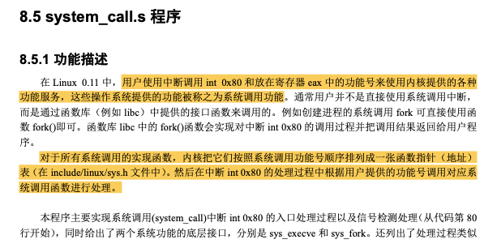 

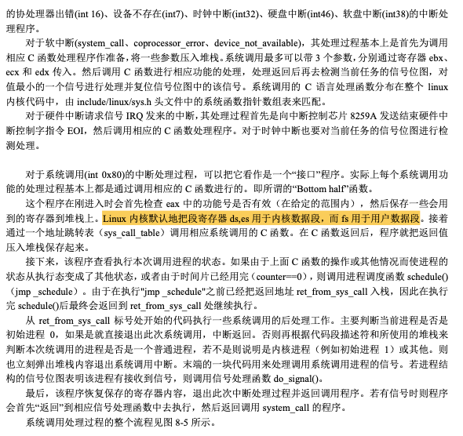 

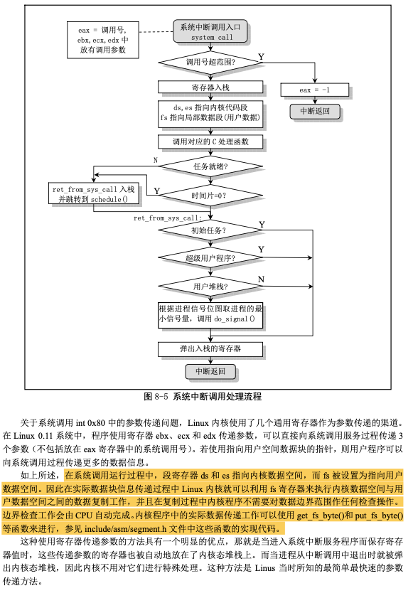 

### 5.2 代码

```assembly
oslab/linux-0.11/kernel$ cat system_call.s

/*
 *  linux/kernel/system_call.s
 *
 *  (C) 1991  Linus Torvalds
 */

/*
 *  system_call.s  contains the system-call low-level handling routines.
 * This also contains the timer-interrupt handler, as some of the code is
 * the same. The hd- and flopppy-interrupts are also here.
 *
 * NOTE: This code handles signal-recognition, which happens every time
 * after a timer-interrupt and after each system call. Ordinary interrupts
 * don't handle signal-recognition, as that would clutter them up totally
 * unnecessarily.
 *
 * Stack layout in 'ret_from_system_call':
 *
 *	 0(%esp) - %eax
 *	 4(%esp) - %ebx
 *	 8(%esp) - %ecx
 *	 C(%esp) - %edx
 *	10(%esp) - %fs
 *	14(%esp) - %es
 *	18(%esp) - %ds
 *	1C(%esp) - %eip
 *	20(%esp) - %cs
 *	24(%esp) - %eflags
 *	28(%esp) - %oldesp
 *	2C(%esp) - %oldss
 */

SIG_CHLD	= 17

EAX		= 0x00
EBX		= 0x04
ECX		= 0x08
EDX		= 0x0C
FS		= 0x10
ES		= 0x14
DS		= 0x18
EIP		= 0x1C
CS		= 0x20
EFLAGS		= 0x24
OLDESP		= 0x28  # 当特权级变化时栈会切换，用户栈指针被保存在内核态栈中
OLDSS		= 0x2C

state	= 0		# these are offsets into the task-struct.   # 进程状态码
counter	= 4     # 任务运行时间计数(递减)(滴答数) 运行时间片
priority = 8    # 运行优先级 任务开始运行时counter=priority 越大则运行时间越长
signal	= 12    # 是信号位图 每个比特位代表一种信号，信号值=位偏移值+1
sigaction = 16		# MUST be 16 (=len of sigaction)
blocked = (33*16)   # 受阻塞信号位图的偏移量

# offsets within sigaction
sa_handler = 0      # 信号处理过程的句柄(描述符)
sa_mask = 4         # 信号屏蔽码
sa_flags = 8        # 信号集
sa_restorer = 12    # 恢复函数指针

nr_system_calls = 74    # Linux0.11中系统调用总数

/*
 * Ok, I get parallel printer interrupts while using the floppy for some
 * strange reason. Urgel. Now I just ignore them.
 */
.globl system_call,sys_fork,timer_interrupt,sys_execve
.globl hd_interrupt,floppy_interrupt,parallel_interrupt
.globl device_not_available, coprocessor_error

.align 2
bad_sys_call:   # 错误的系统调用号
	movl $-1,%eax
	iret
.align 2
reschedule:     # 重新执行调度程序入口
	pushl $ret_from_sys_call
	jmp schedule
.align 2
system_call:    # linux系统调用入口 调用中断int 0x80 eax中是系统调用号
	cmpl $nr_system_calls-1,%eax
	ja bad_sys_call
	push %ds
	push %es
	push %fs
	pushl %edx
	pushl %ecx		# push %ebx,%ecx,%edx as parameters
	pushl %ebx		# to the system call
	movl $0x10,%edx		# set up ds,es to kernel space
	mov %dx,%ds
	mov %dx,%es
	movl $0x17,%edx		# fs points to local data space
	mov %dx,%fs
	call sys_call_table(,%eax,4)    # 查系统调用表，根据系统调用号(eax)找到要调用的函数
	pushl %eax         # 把系统调用返回值入栈
	movl current,%eax   # 96-100查看当前任务的运行状态
	cmpl $0,state(%eax)		# state
	jne reschedule
	cmpl $0,counter(%eax)		# counter
	je reschedule
ret_from_sys_call:  # 系统调用C函数返回后，对信号进行识别处理
	movl current,%eax		# task[0] cannot have signals
	cmpl task,%eax          # task对应C程序中的task[]数组(进程PCB)
	je 3f
	cmpw $0x0f,CS(%esp)		# was old code segment supervisor ?
	jne 3f
	cmpw $0x17,OLDSS(%esp)		# was stack segment = 0x17 ?
	jne 3f
	movl signal(%eax),%ebx  # 处理当前任务中的信号
	movl blocked(%eax),%ecx
	notl %ecx
	andl %ebx,%ecx
	bsfl %ecx,%ecx
	je 3f
	btrl %ecx,%ebx
	movl %ebx,signal(%eax)
	incl %ecx
	pushl %ecx
	call do_signal  # 调用C函数信号处理程序
	popl %eax
3:	popl %eax
	popl %ebx
	popl %ecx
	popl %edx
	pop %fs
	pop %es
	pop %ds
	iret

.align 2
coprocessor_error:  # int16 处理器错误中断
	push %ds
	push %es
	push %fs
	pushl %edx
	pushl %ecx
	pushl %ebx
	pushl %eax
	movl $0x10,%eax
	mov %ax,%ds
	mov %ax,%es
	movl $0x17,%eax
	mov %ax,%fs
	pushl $ret_from_sys_call
	jmp math_error

.align 2
device_not_available:   # 设备不存在或协处理器不存在
	push %ds
	push %es
	push %fs
	pushl %edx
	pushl %ecx
	pushl %ebx
	pushl %eax
	movl $0x10,%eax
	mov %ax,%ds
	mov %ax,%es
	movl $0x17,%eax
	mov %ax,%fs
	pushl $ret_from_sys_call
	clts				# clear TS so that we can use math
	movl %cr0,%eax
	testl $0x4,%eax			# EM (math emulation bit)
	je math_state_restore
	pushl %ebp
	pushl %esi
	pushl %edi
	call math_emulate
	popl %edi
	popl %esi
	popl %ebp
	ret

.align 2
timer_interrupt:    # int32 时钟中断处理程序
	push %ds		# save ds,es and put kernel data space
	push %es		# into them. %fs is used by _system_call
	push %fs
	pushl %edx		# we save %eax,%ecx,%edx as gcc doesn't
	pushl %ecx		# save those across function calls. %ebx
	pushl %ebx		# is saved as we use that in ret_sys_call
	pushl %eax
	movl $0x10,%eax
	mov %ax,%ds
	mov %ax,%es
	movl $0x17,%eax
	mov %ax,%fs
	incl jiffies
	movb $0x20,%al		# EOI to interrupt controller #1
	outb %al,$0x20
	movl CS(%esp),%eax
	andl $3,%eax		# %eax is CPL (0 or 3, 0=supervisor)
	pushl %eax
	call do_timer		# 'do_timer(long CPL)' does everything from
	addl $4,%esp		# task switching to accounting ...
	jmp ret_from_sys_call

.align 2
sys_execve:
	lea EIP(%esp),%eax
	pushl %eax
	call do_execve
	addl $4,%esp
	ret

.align 2
sys_fork:
	call find_empty_process
	testl %eax,%eax
	js 1f
	push %gs
	pushl %esi
	pushl %edi
	pushl %ebp
	pushl %eax
	call copy_process
	addl $20,%esp
1:	ret

hd_interrupt:   # int 0x2E 硬盘中断处理程序 响应硬件中断请求IRQ14
	pushl %eax
	pushl %ecx
	pushl %edx
	push %ds
	push %es
	push %fs
	movl $0x10,%eax
	mov %ax,%ds
	mov %ax,%es
	movl $0x17,%eax
	mov %ax,%fs
	movb $0x20,%al
	outb %al,$0xA0		# EOI to interrupt controller #1
	jmp 1f			# give port chance to breathe
1:	jmp 1f
1:	xorl %edx,%edx
	xchgl do_hd,%edx
	testl %edx,%edx
	jne 1f
	movl $unexpected_hd_interrupt,%edx
1:	outb %al,$0x20
	call *%edx		# "interesting" way of handling intr.
	pop %fs
	pop %es
	pop %ds
	popl %edx
	popl %ecx
	popl %eax
	iret

floppy_interrupt:   # int 0x26 软盘驱动器中断处理程序 响应硬件中断请求IRQ6
	pushl %eax
	pushl %ecx
	pushl %edx
	push %ds
	push %es
	push %fs
	movl $0x10,%eax
	mov %ax,%ds
	mov %ax,%es
	movl $0x17,%eax
	mov %ax,%fs
	movb $0x20,%al
	outb %al,$0x20		# EOI to interrupt controller #1
	xorl %eax,%eax
	xchgl do_floppy,%eax
	testl %eax,%eax
	jne 1f
	movl $unexpected_floppy_interrupt,%eax
1:	call *%eax		# "interesting" way of handling intr.
	pop %fs
	pop %es
	pop %ds
	popl %edx
	popl %ecx
	popl %eax
	iret

parallel_interrupt:
	pushl %eax
	movb $0x20,%al
	outb %al,$0x20
	popl %eax
	iret
```

### 5.3 自己实现系统调用的步骤

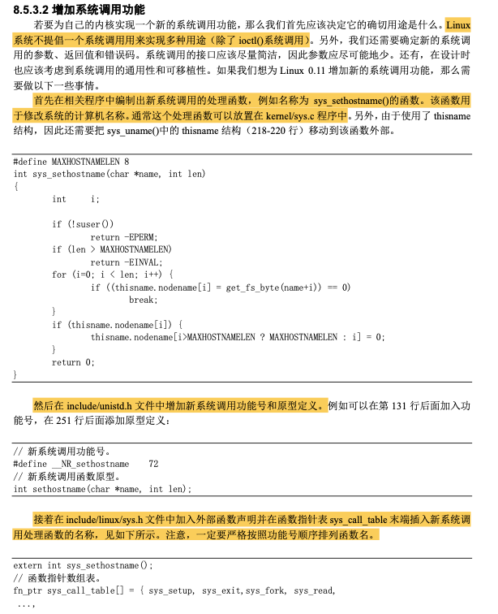 

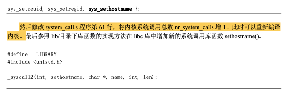 

### 5.4 在汇编代码中直接使用系统调用

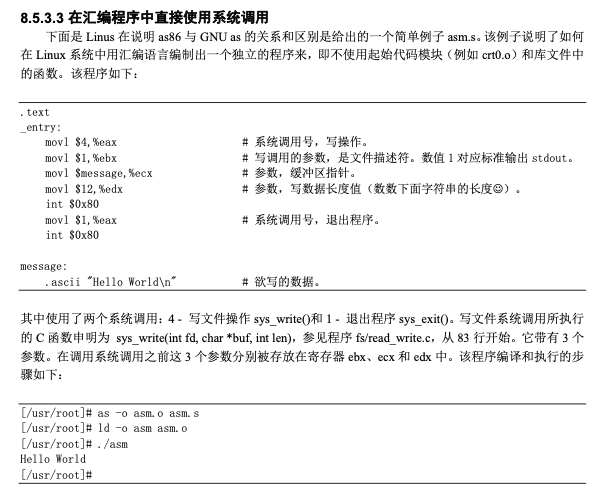 

## 6. mktime.c程序

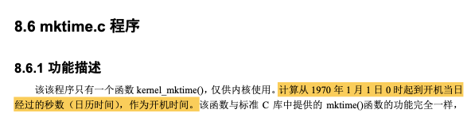 

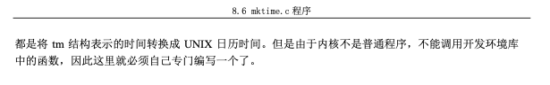 

```c
oslab/linux-0.11/kernel$ cat mktime.c
  
/*
 *  linux/kernel/mktime.c
 *
 *  (C) 1991  Linus Torvalds
 */

#include <time.h>

/*
 * This isn't the library routine, it is only used in the kernel.
 * as such, we don't care about years<1970 etc, but assume everything
 * is ok. Similarly, TZ etc is happily ignored. We just do everything
 * as easily as possible. Let's find something public for the library
 * routines (although I think minix times is public).
 */
/*
 * PS. I hate whoever though up the year 1970 - couldn't they have gotten
 * a leap-year instead? I also hate Gregorius, pope or no. I'm grumpy.
 */
#define MINUTE 60
#define HOUR (60*MINUTE)
#define DAY (24*HOUR)
#define YEAR (365*DAY)

/* interestingly, we assume leap-years */
static int month[12] = {
	0,
	DAY*(31),
	DAY*(31+29),
	DAY*(31+29+31),
	DAY*(31+29+31+30),
	DAY*(31+29+31+30+31),
	DAY*(31+29+31+30+31+30),
	DAY*(31+29+31+30+31+30+31),
	DAY*(31+29+31+30+31+30+31+31),
	DAY*(31+29+31+30+31+30+31+31+30),
	DAY*(31+29+31+30+31+30+31+31+30+31),
	DAY*(31+29+31+30+31+30+31+31+30+31+30)
};

long kernel_mktime(struct tm * tm)
{
	long res;
	int year;

	year = tm->tm_year - 70;
/* magic offsets (y+1) needed to get leapyears right.*/
	res = YEAR*year + DAY*((year+1)/4);
	res += month[tm->tm_mon];
/* and (y+2) here. If it wasn't a leap-year, we have to adjust */
	if (tm->tm_mon>1 && ((year+2)%4))
		res -= DAY;
	res += DAY*(tm->tm_mday-1);
	res += HOUR*tm->tm_hour;
	res += MINUTE*tm->tm_min;
	res += tm->tm_sec;
	return res;
}
```

