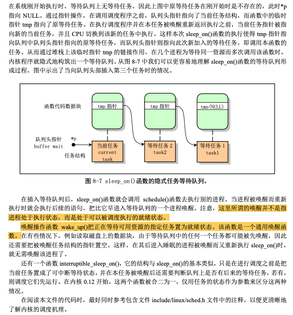

# Linux内核完全注释-内核代码2.md

## 1. sched.c程序

### 1.1 分析

 

 

 

### 1.2 代码

```c
oslab/linux-0.11/kernel$ cat sched.c
  
/*
 *  linux/kernel/sched.c
 *
 *  (C) 1991  Linus Torvalds
 */

/*
 * 'sched.c' is the main kernel file. It contains scheduling primitives
 * (sleep_on, wakeup, schedule etc) as well as a number of simple system
 * call functions (type getpid(), which just extracts a field from
 * current-task
 */
#include <linux/sched.h>
#include <linux/kernel.h>
#include <linux/sys.h>
#include <linux/fdreg.h>
#include <asm/system.h>
#include <asm/io.h>
#include <asm/segment.h>

#include <signal.h>

#define _S(nr) (1<<((nr)-1))    //取信号nr在信号位图中对应位的二进制值
#define _BLOCKABLE (~(_S(SIGKILL) | _S(SIGSTOP)))   //除了SIGKILL和SIGSTOP外其余的信号都是可阻塞的

void show_task(int nr,struct task_struct * p)   //显示任务号nr的进程号、进程状态和内核堆栈空闲字节数
{
	int i,j = 4096-sizeof(struct task_struct);

	printk("%d: pid=%d, state=%d, ",nr,p->pid,p->state);
	i=0;
	while (i<j && !((char *)(p+1))[i])  //检测指定任务数据结构以后等于0的字节数
		i++;
	printk("%d (of %d) chars free in kernel stack\n\r",i,j);
}

void show_stat(void)    //显示所有任务的任务号、进程状态和内核堆栈空闲字节数(大约)
{
	int i;

	for (i=0;i<NR_TASKS;i++)    //NR_TASKS:系统能容纳的最大进程数量
		if (task[i])
			show_task(i,task[i]);
}

#define LATCH (1193180/HZ)  //设置8253芯片的初值

extern void mem_use(void);

extern int timer_interrupt(void);   //时钟中断处理函数
extern int system_call(void);       //系统调用中断处理程序

union task_union {  //每个任务(进程)在内核态运行时都有自己的内核态堆栈。这里定义了任务的内核态堆栈结构
	struct task_struct task;    //定义任务联合(任务结构成员和stack字符数组成员)，因为一个任务的数据结构
	char stack[PAGE_SIZE];      //与其内核态堆栈在同一内存页中，所以从堆栈段寄存器ss可以获得其数据段选择符
};

static union task_union init_task = {INIT_TASK,};   //定义初始任务的数据

long volatile jiffies=0;    //从开机开始算起的滴答数时间值全局变量(10ms/滴答) 系统时钟中断每发生一次即一个滴答
long startup_time=0;    //开机时间，从1970:0:0:0开始计时的秒数
struct task_struct *current = &(init_task.task);    //当前任务指针(初始化指向任务0)
struct task_struct *last_task_used_math = NULL;     //使用过协处理器任务的指针

struct task_struct * task[NR_TASKS] = {&(init_task.task), };    //定义任务指针数组

long user_stack [ PAGE_SIZE>>2 ] ;  //定义用户堆栈，共1K项，容量4K字节

struct {
	long * a;
	short b;
	} stack_start = { & user_stack [PAGE_SIZE>>2] , 0x10 };
/*
 *  'math_state_restore()' saves the current math information in the
 * old math state array, and gets the new ones from the current task
 */
void math_state_restore()   //当任务被调度交换过以后，该函数用以保存原任务的协处理器状态(上下文)并恢复
{                           //新调度进来的当前任务的协处理器执行状态
	if (last_task_used_math == current) //如果任务没变则返回(上一个任务就是当前任务)
		return;
	__asm__("fwait");
	if (last_task_used_math) {
		__asm__("fnsave %0"::"m" (last_task_used_math->tss.i387));
	}
	last_task_used_math=current;
	if (current->used_math) {
		__asm__("frstor %0"::"m" (current->tss.i387));
	} else {
		__asm__("fninit"::);
		current->used_math=1;
	}
}

/*
 *  'schedule()' is the scheduler function. This is GOOD CODE! There
 * probably won't be any reason to change this, as it should work well
 * in all circumstances (ie gives IO-bound processes good response etc).
 * The one thing you might take a look at is the signal-handler code here.
 *
 *   NOTE!!  Task 0 is the 'idle' task, which gets called when no other
 * tasks can run. It can not be killed, and it cannot sleep. The 'state'
 * information in task[0] is never used.
 */
void schedule(void)
{
	int i,next,c;
	struct task_struct ** p;    //任务结构指针的指针

/* check alarm, wake up any interruptible tasks that have got a signal */

	for(p = &LAST_TASK ; p > &FIRST_TASK ; --p) //从任务数组中最后一个任务开始循环检测alarm 在循环时跳过空指针项
		if (*p) {
			if ((*p)->alarm && (*p)->alarm < jiffies) {
					(*p)->signal |= (1<<(SIGALRM-1));
					(*p)->alarm = 0;
				}
			if (((*p)->signal & ~(_BLOCKABLE & (*p)->blocked)) &&
			(*p)->state==TASK_INTERRUPTIBLE)
				(*p)->state=TASK_RUNNING;
		}

/* this is the scheduler proper: */

	while (1) {
		c = -1;
		next = 0;
		i = NR_TASKS;
		p = &task[NR_TASKS];
		while (--i) {   //从任务数组的最后一个任务开始循环处理，并跳过不含任务的数组槽。比较每个就绪状态任务的counter
			if (!*--p)  //(任务运行时间的递减滴答计数)值，哪一个值大，运行时间还不长，next就指向哪个的任务号
				continue;
			if ((*p)->state == TASK_RUNNING && (*p)->counter > c)
				c = (*p)->counter, next = i;
		}
		if (c) break;
		for(p = &LAST_TASK ; p > &FIRST_TASK ; --p) //根据每个任务的优先权值，更新每一个任务的counter值
			if (*p)
				(*p)->counter = ((*p)->counter >> 1) +
						(*p)->priority;
	}
	switch_to(next);    //切换到任务号为next的任务，并运行
}

int sys_pause(void) //pause()系统调用 转换当前任务的状态为可中断的等待状态并重新调度
{
	current->state = TASK_INTERRUPTIBLE;
	schedule();
	return 0;
}

void sleep_on(struct task_struct **p)
{
	struct task_struct *tmp;

	if (!p)
		return;
	if (current == &(init_task.task))
		panic("task[0] trying to sleep");
	tmp = *p;
	*p = current;
	current->state = TASK_UNINTERRUPTIBLE;
	schedule();
	if (tmp)
		tmp->state=0;
}

void interruptible_sleep_on(struct task_struct **p)
{
	struct task_struct *tmp;

	if (!p)
		return;
	if (current == &(init_task.task))
		panic("task[0] trying to sleep");
	tmp=*p;
	*p=current;
repeat:	current->state = TASK_INTERRUPTIBLE;
	schedule();
	if (*p && *p != current) {
		(**p).state=0;
		goto repeat;
	}
	*p=NULL;
	if (tmp)
		tmp->state=0;
}

void wake_up(struct task_struct **p)    //唤醒*p指向的任务
{
	if (p && *p) {
		(**p).state=0;
		*p=NULL;
	}
}

/*
 * OK, here are some floppy things that shouldn't be in the kernel
 * proper. They are here because the floppy needs a timer, and this
 * was the easiest way of doing it.
 */
static struct task_struct * wait_motor[4] = {NULL,NULL,NULL,NULL}; //201-262用于处理软驱定时
static int  mon_timer[4]={0,0,0,0};
static int moff_timer[4]={0,0,0,0};
unsigned char current_DOR = 0x0C;

int ticks_to_floppy_on(unsigned int nr)
{
	extern unsigned char selected;
	unsigned char mask = 0x10 << nr;

	if (nr>3)
		panic("floppy_on: nr>3");
	moff_timer[nr]=10000;		/* 100 s = very big :-) */
	cli();				/* use floppy_off to turn it off */
	mask |= current_DOR;
	if (!selected) {
		mask &= 0xFC;
		mask |= nr;
	}
	if (mask != current_DOR) {
		outb(mask,FD_DOR);
		if ((mask ^ current_DOR) & 0xf0)
			mon_timer[nr] = HZ/2;
		else if (mon_timer[nr] < 2)
			mon_timer[nr] = 2;
		current_DOR = mask;
	}
	sti();
	return mon_timer[nr];
}

void floppy_on(unsigned int nr)
{
	cli();
	while (ticks_to_floppy_on(nr))
		sleep_on(nr+wait_motor);
	sti();
}

void floppy_off(unsigned int nr)
{
	moff_timer[nr]=3*HZ;
}

void do_floppy_timer(void)
{
	int i;
	unsigned char mask = 0x10;

	for (i=0 ; i<4 ; i++,mask <<= 1) {
		if (!(mask & current_DOR))
			continue;
		if (mon_timer[i]) {
			if (!--mon_timer[i])
				wake_up(i+wait_motor);
		} else if (!moff_timer[i]) {
			current_DOR &= ~mask;
			outb(current_DOR,FD_DOR);
		} else
			moff_timer[i]--;
	}
}

#define TIME_REQUESTS 64    //最多有64个定时器

static struct timer_list {
	long jiffies;   //定时滴答数
	void (*fn)();   //定时处理程序
	struct timer_list * next;   //链接指向下一个定时器
} timer_list[TIME_REQUESTS], * next_timer = NULL;   //next_timer是定时器队列头指针

void add_timer(long jiffies, void (*fn)(void))  //添加定时器
{
	struct timer_list * p;

	if (!fn)
		return;
	cli();
	if (jiffies <= 0)
		(fn)();
	else {
		for (p = timer_list ; p < timer_list + TIME_REQUESTS ; p++)
			if (!p->fn)
				break;
		if (p >= timer_list + TIME_REQUESTS)
			panic("No more time requests free");
		p->fn = fn;
		p->jiffies = jiffies;
		p->next = next_timer;
		next_timer = p;
		while (p->next && p->next->jiffies < p->jiffies) {
			p->jiffies -= p->next->jiffies;
			fn = p->fn;
			p->fn = p->next->fn;
			p->next->fn = fn;
			jiffies = p->jiffies;
			p->jiffies = p->next->jiffies;
			p->next->jiffies = jiffies;
			p = p->next;
		}
	}
	sti();
}

void do_timer(long cpl) //时钟中断C函数处理程序 cpl=当前特权级 0或者3
{
	extern int beepcount;   //扬声器发声时间滴答数
	extern void sysbeepstop(void);  //关闭扬声器

	if (beepcount)
		if (!--beepcount)
			sysbeepstop();

	if (cpl)
		current->utime++;
	else
		current->stime++;

	if (next_timer) {
		next_timer->jiffies--;
		while (next_timer && next_timer->jiffies <= 0) {
			void (*fn)(void);

			fn = next_timer->fn;
			next_timer->fn = NULL;
			next_timer = next_timer->next;
			(fn)();
		}
	}
	if (current_DOR & 0xf0)
		do_floppy_timer();
	if ((--current->counter)>0) return;
	current->counter=0;
	if (!cpl) return;
	schedule();
}

int sys_alarm(long seconds) //设置报警定时时间值(s)
{
	int old = current->alarm;

	if (old)
		old = (old - jiffies) / HZ;
	current->alarm = (seconds>0)?(jiffies+HZ*seconds):0;
	return (old);
}

int sys_getpid(void)    //取得当前进程号pid
{
	return current->pid;
}

int sys_getppid(void)   //取得父进程号ppid
{
	return current->father;
}

int sys_getuid(void)    //取用户号uid
{
	return current->uid;
}

int sys_geteuid(void)   //取有效的用户号euid
{
	return current->euid;
}

int sys_getgid(void)    //取组号gid
{
	return current->gid;
}

int sys_getegid(void)   //取有效的组号egid
{
	return current->egid;
}

int sys_nice(long increment)    //系统调用功能 降低对CPU的使用优先权
{
	if (current->priority-increment>0)
		current->priority -= increment;
	return 0;
}

void sched_init(void)   //内核调度程序的初始化子程序
{
	int i;
	struct desc_struct * p; //描述符表结构指针

	if (sizeof(struct sigaction) != 16)
		panic("Struct sigaction MUST be 16 bytes");
	set_tss_desc(gdt+FIRST_TSS_ENTRY,&(init_task.task.tss));
	set_ldt_desc(gdt+FIRST_LDT_ENTRY,&(init_task.task.ldt));
	p = gdt+2+FIRST_TSS_ENTRY;
	for(i=1;i<NR_TASKS;i++) {
		task[i] = NULL;
		p->a=p->b=0;
		p++;
		p->a=p->b=0;
		p++;
	}
/* Clear NT, so that we won't have troubles with that later on */
	__asm__("pushfl ; andl $0xffffbfff,(%esp) ; popfl");
	ltr(0);
	lldt(0);
	outb_p(0x36,0x43);		/* binary, mode 3, LSB/MSB, ch 0 */
	outb_p(LATCH & 0xff , 0x40);	/* LSB */
	outb(LATCH >> 8 , 0x40);	/* MSB */
	set_intr_gate(0x20,&timer_interrupt);
	outb(inb_p(0x21)&~0x01,0x21);
	set_system_gate(0x80,&system_call);
}
```

## 2. signal.c程序

### 2.1 分析

 

 

 

 

### 2.2 代码

```c
oslab/linux-0.11/kernel$ cat signal.c

/*
 *  linux/kernel/signal.c
 *
 *  (C) 1991  Linus Torvalds
 */

#include <linux/sched.h>
#include <linux/kernel.h>
#include <asm/segment.h>

#include <signal.h>

volatile void do_exit(int error_code);

int sys_sgetmask()  //获取当前任务信号屏蔽位图(屏蔽码或阻塞码)
{
	return current->blocked;
}

int sys_ssetmask(int newmask)   //设置新的信号屏蔽位图 SIGKILL不能被屏蔽 返回值是原信号屏蔽位图
{
	int old=current->blocked;

	current->blocked = newmask & ~(1<<(SIGKILL-1));
	return old;
}

static inline void save_old(char * from,char * to)  //复制sigaction数据到fs数据段to处。即从内核空间复制到用户(任务)数据段中
{
	int i;

	verify_area(to, sizeof(struct sigaction));
	for (i=0 ; i< sizeof(struct sigaction) ; i++) {
		put_fs_byte(*from,to);
		from++;
		to++;
	}
}

static inline void get_new(char * from,char * to) //将sigaction数据从fs数据段from复制到to处
{                                                 //即把用户数据空间复制到内核数据段中
	int i;

	for (i=0 ; i< sizeof(struct sigaction) ; i++)
		*(to++) = get_fs_byte(from++);
}

int sys_signal(int signum, long handler, long restorer)
{
	struct sigaction tmp;

	if (signum<1 || signum>32 || signum==SIGKILL)
		return -1;
	tmp.sa_handler = (void (*)(int)) handler;
	tmp.sa_mask = 0;
	tmp.sa_flags = SA_ONESHOT | SA_NOMASK;
	tmp.sa_restorer = (void (*)(void)) restorer;
	handler = (long) current->sigaction[signum-1].sa_handler;
	current->sigaction[signum-1] = tmp;
	return handler;
}

int sys_sigaction(int signum, const struct sigaction * action,
	struct sigaction * oldaction)
{
	struct sigaction tmp;

	if (signum<1 || signum>32 || signum==SIGKILL)
		return -1;
	tmp = current->sigaction[signum-1];
	get_new((char *) action,
		(char *) (signum-1+current->sigaction));
	if (oldaction)
		save_old((char *) &tmp,(char *) oldaction);
	if (current->sigaction[signum-1].sa_flags & SA_NOMASK)
		current->sigaction[signum-1].sa_mask = 0;
	else
		current->sigaction[signum-1].sa_mask |= (1<<(signum-1));
	return 0;
}

void do_signal(long signr,long eax, long ebx, long ecx, long edx,
	long fs, long es, long ds,
	long eip, long cs, long eflags,
	unsigned long * esp, long ss)
{
	unsigned long sa_handler;
	long old_eip=eip;
	struct sigaction * sa = current->sigaction + signr - 1;
	int longs;
	unsigned long * tmp_esp;

	sa_handler = (unsigned long) sa->sa_handler;
	if (sa_handler==1)
		return;
	if (!sa_handler) {
		if (signr==SIGCHLD)
			return;
		else
			do_exit(1<<(signr-1));
	}
	if (sa->sa_flags & SA_ONESHOT)
		sa->sa_handler = NULL;
	*(&eip) = sa_handler;
	longs = (sa->sa_flags & SA_NOMASK)?7:8;
	*(&esp) -= longs;
	verify_area(esp,longs*4);
	tmp_esp=esp;
	put_fs_long((long) sa->sa_restorer,tmp_esp++);
	put_fs_long(signr,tmp_esp++);
	if (!(sa->sa_flags & SA_NOMASK))
		put_fs_long(current->blocked,tmp_esp++);
	put_fs_long(eax,tmp_esp++);
	put_fs_long(ecx,tmp_esp++);
	put_fs_long(edx,tmp_esp++);
	put_fs_long(eflags,tmp_esp++);
	put_fs_long(old_eip,tmp_esp++);
	current->blocked |= sa->sa_mask;
}
```

### 2.2 补充信息

 

 

## 3. exit.c程序

### 3.1 分析

 

### 3.2 代码

```c
oslab/linux-0.11/kernel$ cat exit.c

/*
 *  linux/kernel/exit.c
 *
 *  (C) 1991  Linus Torvalds
 */

#include <errno.h>
#include <signal.h>
#include <sys/wait.h>

#include <linux/sched.h>
#include <linux/kernel.h>
#include <linux/tty.h>
#include <asm/segment.h>

int sys_pause(void);    //把进程置为睡眠状态，知道收到信号
int sys_close(int fd);  //关闭指定文件的系统调用

void release(struct task_struct * p)    //释放指定进程所占的任务槽及其任务数据结构占用的内存页面
{
	int i;

	if (!p)
		return;
	for (i=1 ; i<NR_TASKS ; i++)    //扫描任务数组，寻找指定任务
		if (task[i]==p) {
			task[i]=NULL;   //置空该任务项并释放相关物理页
			free_page((long)p);
			schedule();
			return;
		}
	panic("trying to release non-existent task");
}

static inline int send_sig(long sig,struct task_struct * p,int priv)    //向指定任务p发送信号sig 权限为priv
{
	if (!p || sig<1 || sig>32)
		return -EINVAL;
	if (priv || (current->euid==p->euid) || suser())
		p->signal |= (1<<(sig-1));
	else
		return -EPERM;
	return 0;
}

static void kill_session(void)  //终止会话
{
	struct task_struct **p = NR_TASKS + task;   //指针*p指向任务数组最末端

	while (--p > &FIRST_TASK) { //扫描任务指针数组，对于所有的任务(任务0除外),如果其会话号session等于当前进程的
		if (*p && (*p)->session == current->session)    //会话号就向它发送挂断进程信号SIGHUP
			(*p)->signal |= 1<<(SIGHUP-1);
	}
}

/*
 * XXX need to check permissions needed to send signals to process
 * groups, etc. etc.  kill() permissions semantics are tricky!
 */
int sys_kill(int pid,int sig)   //可用于向任何进程或进程组发送任何信号 而并非只是杀死进程
{
	struct task_struct **p = NR_TASKS + task;
	int err, retval = 0;

	if (!pid) while (--p > &FIRST_TASK) {
		if (*p && (*p)->pgrp == current->pid)
			if ((err=send_sig(sig,*p,1)))
				retval = err;
	} else if (pid>0) while (--p > &FIRST_TASK) {
		if (*p && (*p)->pid == pid)
			if ((err=send_sig(sig,*p,0)))
				retval = err;
	} else if (pid == -1) while (--p > &FIRST_TASK) {
		if ((err = send_sig(sig,*p,0)))
			retval = err;
	} else while (--p > &FIRST_TASK)
		if (*p && (*p)->pgrp == -pid)
			if ((err = send_sig(sig,*p,0)))
				retval = err;
	return retval;
}

static void tell_father(int pid)    //通知父进程
{
	int i;

	if (pid)
		for (i=0;i<NR_TASKS;i++) {
			if (!task[i])
				continue;
			if (task[i]->pid != pid)
				continue;
			task[i]->signal |= (1<<(SIGCHLD-1));
			return;
		}
/* if we don't find any fathers, we just release ourselves */
/* This is not really OK. Must change it to make father 1 */
	printk("BAD BAD - no father found\n\r");
	release(current);
}

int do_exit(long code)  //程序退出处理函数
{
	int i;
	free_page_tables(get_base(current->ldt[1]),get_limit(0x0f));    //释放数据段所占的内存页
	free_page_tables(get_base(current->ldt[2]),get_limit(0x17));    //释放代码段所占的内存页
	for (i=0 ; i<NR_TASKS ; i++)
		if (task[i] && task[i]->father == current->pid) {   //有子进程
			task[i]->father = 1;    //将子进程的father置为1
			if (task[i]->state == TASK_ZOMBIE)  //僵死状态
				/* assumption task[1] is always init */
				(void) send_sig(SIGCHLD, task[1], 1);   //交给1号进程处理
		}
	for (i=0 ; i<NR_OPEN ; i++) //关闭当前进程打开着的所有文件
		if (current->filp[i])
			sys_close(i);
	iput(current->pwd);
	current->pwd=NULL;
	iput(current->root);
	current->root=NULL;
	iput(current->executable);
	current->executable=NULL;
	if (current->leader && current->tty >= 0)
		tty_table[current->tty].pgrp = 0;
	if (last_task_used_math == current)
		last_task_used_math = NULL;
	if (current->leader)
		kill_session();
	current->state = TASK_ZOMBIE;
	current->exit_code = code;
	tell_father(current->father);
	schedule();
	return (-1);	/* just to suppress warnings */
}

int sys_exit(int error_code)
{
	return do_exit((error_code&0xff)<<8);
}

int sys_waitpid(pid_t pid,unsigned long * stat_addr, int options)   //挂起当前进程 直到pid指定的子进程退出(终止)或者收到
{                                                                   //要求终止该进程的信号 或者是需要调用一个信号句柄
	int flag, code;             //如果子进程早已退出，则本调用将立刻返回，子进程使用的所有资源将释放
	struct task_struct ** p;

	verify_area(stat_addr,4);
repeat:
	flag=0;
	for(p = &LAST_TASK ; p > &FIRST_TASK ; --p) {
		if (!*p || *p == current)
			continue;
		if ((*p)->father != current->pid)
			continue;
		if (pid>0) {
			if ((*p)->pid != pid)   //是当前进程的另外子进程
				continue;
		} else if (!pid) {  //pid=0 等待进程组号与当前进程组号相同的任何子进程
			if ((*p)->pgrp != current->pgrp)
				continue;
		} else if (pid != -1) { //pid < -1 等待进程组号等于-pid的任何子进程
			if ((*p)->pgrp != -pid)
				continue;
		}
		switch ((*p)->state) {  //pid=-1    等待当前进程的任何子进程
			case TASK_STOPPED:
				if (!(options & WUNTRACED))
					continue;
				put_fs_long(0x7f,stat_addr);
				return (*p)->pid;
			case TASK_ZOMBIE:
				current->cutime += (*p)->utime;
				current->cstime += (*p)->stime;
				flag = (*p)->pid;
				code = (*p)->exit_code;
				release(*p);
				put_fs_long(code,stat_addr);
				return flag;
			default:
				flag=1;
				continue;
		}
	}
	if (flag) {
		if (options & WNOHANG)
			return 0;
		current->state=TASK_INTERRUPTIBLE;
		schedule();
		if (!(current->signal &= ~(1<<(SIGCHLD-1))))
			goto repeat;
		else
			return -EINTR;
	}
	return -ECHILD;
}
```

## 4. fork.c程序

### 4.1 分析

 

 

### 4.2 代码

```c
oslab/linux-0.11/kernel$ cat fork.c

/*
 *  linux/kernel/fork.c
 *
 *  (C) 1991  Linus Torvalds
 */

/*
 *  'fork.c' contains the help-routines for the 'fork' system call
 * (see also system_call.s), and some misc functions ('verify_area').
 * Fork is rather simple, once you get the hang of it, but the memory
 * management can be a bitch. See 'mm/mm.c': 'copy_page_tables()'
 */
#include <errno.h>

#include <linux/sched.h>
#include <linux/kernel.h>
#include <asm/segment.h>
#include <asm/system.h>

extern void write_verify(unsigned long address);    //写页面验证 若页面不可写 则复制页面

long last_pid=0;    //最新进程号 其值由get_empty_process()生成

void verify_area(void * addr,int size)  //进程空间区域写前验证函数
{
	unsigned long start;

	start = (unsigned long) addr;
	size += start & 0xfff;
	start &= 0xfffff000;    //此时start是当前进程空间中的逻辑地址
	start += get_base(current->ldt[2]);
	while (size>0) {    //循环进行写页面验证，若页面不可写，则复制页面
		size -= 4096;
		write_verify(start);
		start += 4096;
	}
}

int copy_mem(int nr,struct task_struct * p) //复制内存页表 此时新进程与父进程共享所有内存页面
{   //nr=新任务号 p=新任务数据结构指针 该函数为新任务在线性地址空间中设置代码段和数据段基址、限长、并复制页表
	unsigned long old_data_base,new_data_base,data_limit;
	unsigned long old_code_base,new_code_base,code_limit;

	code_limit=get_limit(0x0f);
	data_limit=get_limit(0x17);
	old_code_base = get_base(current->ldt[1]);
	old_data_base = get_base(current->ldt[2]);
	if (old_data_base != old_code_base)
		panic("We don't support separate I&D");
	if (data_limit < code_limit)
		panic("Bad data_limit");
	new_data_base = new_code_base = nr * 0x4000000;
	p->start_code = new_code_base;
	set_base(p->ldt[1],new_code_base);
	set_base(p->ldt[2],new_data_base);
	if (copy_page_tables(old_data_base,new_data_base,data_limit)) { //copy_page_tables返回0代表成功
		printk("free_page_tables: from copy_mem\n");
		free_page_tables(new_data_base,data_limit); //因为copy_page_tables返回不为0，代表失败，所以释放刚才申请的页表项
		return -ENOMEM;
	}
	return 0;
}

/*
 *  Ok, this is the main fork-routine. It copies the system process
 * information (task[nr]) and sets up the necessary registers. It
 * also copies the data segment in it's entirety.
 */
int copy_process(int nr,long ebp,long edi,long esi,long gs,long none,
		long ebx,long ecx,long edx,
		long fs,long es,long ds,
		long eip,long cs,long eflags,long esp,long ss)
{
	struct task_struct *p;
	int i;
	struct file *f;

	p = (struct task_struct *) get_free_page(); //为新任务数据结构分配内存
	if (!p)
		return -EAGAIN;
	task[nr] = p;
	*p = *current;	/* NOTE! this doesn't copy the supervisor stack */
	p->state = TASK_UNINTERRUPTIBLE;    //设置为不可中断等待状态，防止内核调度其执行
	p->pid = last_pid;  //新进程号，也由find_empty_process()得到
	p->father = current->pid;   //设置父进程号
	p->counter = p->priority;   //运行时间片值
	p->signal = 0;  //信号位图置0
	p->alarm = 0;   //报警定时值(滴答数)
	p->leader = 0;		/* process leadership doesn't inherit */
	p->utime = p->stime = 0;    //用户态和和系统运行时间
	p->cutime = p->cstime = 0;  //子进程用户态和核心态运行时间
	p->start_time = jiffies;    //进程开始运行时间(当前时间滴答数)
	p->tss.back_link = 0;
	p->tss.esp0 = PAGE_SIZE + (long) p;
	p->tss.ss0 = 0x10;
	p->tss.eip = eip;
	p->tss.eflags = eflags;
	p->tss.eax = 0; //这是当fork返回时新进程会返回0的原因所在
	p->tss.ecx = ecx;
	p->tss.edx = edx;
	p->tss.ebx = ebx;
	p->tss.esp = esp;
	p->tss.ebp = ebp;
	p->tss.esi = esi;
	p->tss.edi = edi;
	p->tss.es = es & 0xffff;
	p->tss.cs = cs & 0xffff;
	p->tss.ss = ss & 0xffff;
	p->tss.ds = ds & 0xffff;
	p->tss.fs = fs & 0xffff;
	p->tss.gs = gs & 0xffff;
	p->tss.ldt = _LDT(nr);
	p->tss.trace_bitmap = 0x80000000;
	if (last_task_used_math == current)
		__asm__("clts ; fnsave %0"::"m" (p->tss.i387));
	if (copy_mem(nr,p)) {
		task[nr] = NULL;
		free_page((long) p);
		return -EAGAIN;
	}
	for (i=0; i<NR_OPEN;i++)    //如果父进程中有些文件是打开的，则将对应文件的打开次数增加1
		if ((f=p->filp[i]))
			f->f_count++;
	if (current->pwd)
		current->pwd->i_count++;
	if (current->root)
		current->root->i_count++;
	if (current->executable)
		current->executable->i_count++;
	set_tss_desc(gdt+(nr<<1)+FIRST_TSS_ENTRY,&(p->tss));
	set_ldt_desc(gdt+(nr<<1)+FIRST_LDT_ENTRY,&(p->ldt));
	p->state = TASK_RUNNING;	/* do this last, just in case */
	return last_pid;
}

int find_empty_process(void)    //为新进程取得不重复的进程号last_pid
{
	int i;

	repeat:
		if ((++last_pid)<0) last_pid=1;
		for(i=0 ; i<NR_TASKS ; i++)
			if (task[i] && task[i]->pid == last_pid) goto repeat;
	for(i=1 ; i<NR_TASKS ; i++)
		if (!task[i])
			return i;
	return -EAGAIN;
}
```

