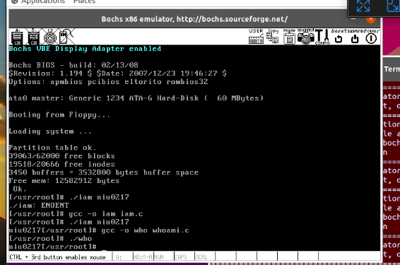

# 实验二报告

## 1. 修改的文件

### 1.1 文件1 (bochs中)

`oslab/hdc/usr/include/unistd.h`

+ 修改的地方：

```c
//添加
#define __NR_iam        72
#define __NR_whoami     73
```

+ 完整代码：

```c
#ifndef _UNISTD_H
#define _UNISTD_H

/* ok, this may be a joke, but I'm working on it */
#define _POSIX_VERSION 198808L

#define _POSIX_CHOWN_RESTRICTED	/* only root can do a chown (I think..) */
#define _POSIX_NO_TRUNC		/* no pathname truncation (but see in kernel) */
#define _POSIX_VDISABLE '\0'	/* character to disable things like ^C */
/*#define _POSIX_SAVED_IDS */	/* we'll get to this yet */
/*#define _POSIX_JOB_CONTROL */	/* we aren't there quite yet. Soon hopefully */

#define STDIN_FILENO	0
#define STDOUT_FILENO	1
#define STDERR_FILENO	2

#ifndef NULL
#define NULL    ((void *)0)
#endif

/* access */
#define F_OK	0
#define X_OK	1
#define W_OK	2
#define R_OK	4

/* lseek */
#define SEEK_SET	0
#define SEEK_CUR	1
#define SEEK_END	2

/* _SC stands for System Configuration. We don't use them much */
#define _SC_ARG_MAX		1
#define _SC_CHILD_MAX		2
#define _SC_CLOCKS_PER_SEC	3
#define _SC_NGROUPS_MAX		4
#define _SC_OPEN_MAX		5
#define _SC_JOB_CONTROL		6
#define _SC_SAVED_IDS		7
#define _SC_VERSION		8

/* more (possibly) configurable things - now pathnames */
#define _PC_LINK_MAX		1
#define _PC_MAX_CANON		2
#define _PC_MAX_INPUT		3
#define _PC_NAME_MAX		4
#define _PC_PATH_MAX		5
#define _PC_PIPE_BUF		6
#define _PC_NO_TRUNC		7
#define _PC_VDISABLE		8
#define _PC_CHOWN_RESTRICTED	9

#include <sys/stat.h>
#include <sys/times.h>
#include <sys/utsname.h>
#include <utime.h>

#ifdef __LIBRARY__

#define __NR_setup	0	/* used only by init, to get system going */
#define __NR_exit	1
#define __NR_fork	2
#define __NR_read	3
#define __NR_write	4
#define __NR_open	5
#define __NR_close	6
#define __NR_waitpid	7
#define __NR_creat	8
#define __NR_link	9
#define __NR_unlink	10
#define __NR_execve	11
#define __NR_chdir	12
#define __NR_time	13
#define __NR_mknod	14
#define __NR_chmod	15
#define __NR_chown	16
#define __NR_break	17
#define __NR_stat	18
#define __NR_lseek	19
#define __NR_getpid	20
#define __NR_mount	21
#define __NR_umount	22
#define __NR_setuid	23
#define __NR_getuid	24
#define __NR_stime	25
#define __NR_ptrace	26
#define __NR_alarm	27
#define __NR_fstat	28
#define __NR_pause	29
#define __NR_utime	30
#define __NR_stty	31
#define __NR_gtty	32
#define __NR_access	33
#define __NR_nice	34
#define __NR_ftime	35
#define __NR_sync	36
#define __NR_kill	37
#define __NR_rename	38
#define __NR_mkdir	39
#define __NR_rmdir	40
#define __NR_dup	41
#define __NR_pipe	42
#define __NR_times	43
#define __NR_prof	44
#define __NR_brk	45
#define __NR_setgid	46
#define __NR_getgid	47
#define __NR_signal	48
#define __NR_geteuid	49
#define __NR_getegid	50
#define __NR_acct	51
#define __NR_phys	52
#define __NR_lock	53
#define __NR_ioctl	54
#define __NR_fcntl	55
#define __NR_mpx	56
#define __NR_setpgid	57
#define __NR_ulimit	58
#define __NR_uname	59
#define __NR_umask	60
#define __NR_chroot	61
#define __NR_ustat	62
#define __NR_dup2	63
#define __NR_getppid	64
#define __NR_getpgrp	65
#define __NR_setsid	66
#define __NR_sigaction	67
#define __NR_sgetmask	68
#define __NR_ssetmask	69
#define __NR_setreuid	70
#define __NR_setregid	71
#define __NR_iam        72
#define __NR_whoami     73

#define _syscall0(type,name) \
type name(void) \
{ \
long __res; \
__asm__ volatile ("int $0x80" \
	: "=a" (__res) \
	: "0" (__NR_##name)); \
if (__res >= 0) \
	return (type) __res; \
errno = -__res; \
return -1; \
}

#define _syscall1(type,name,atype,a) \
type name(atype a) \
{ \
long __res; \
__asm__ volatile ("int $0x80" \
	: "=a" (__res) \
	: "0" (__NR_##name),"b" ((long)(a))); \
if (__res >= 0) \
	return (type) __res; \
errno = -__res; \
return -1; \
}

#define _syscall2(type,name,atype,a,btype,b) \
type name(atype a,btype b) \
{ \
long __res; \
__asm__ volatile ("int $0x80" \
	: "=a" (__res) \
	: "0" (__NR_##name),"b" ((long)(a)),"c" ((long)(b))); \
if (__res >= 0) \
	return (type) __res; \
errno = -__res; \
return -1; \
}

#define _syscall3(type,name,atype,a,btype,b,ctype,c) \
type name(atype a,btype b,ctype c) \
{ \
long __res; \
__asm__ volatile ("int $0x80" \
	: "=a" (__res) \
	: "0" (__NR_##name),"b" ((long)(a)),"c" ((long)(b)),"d" ((long)(c))); \
if (__res>=0) \
	return (type) __res; \
errno=-__res; \
return -1; \
}

#endif /* __LIBRARY__ */

extern int errno;

int access(const char * filename, mode_t mode);
int acct(const char * filename);
int alarm(int sec);
int brk(void * end_data_segment);
void * sbrk(ptrdiff_t increment);
int chdir(const char * filename);
int chmod(const char * filename, mode_t mode);
int chown(const char * filename, uid_t owner, gid_t group);
int chroot(const char * filename);
int close(int fildes);
int creat(const char * filename, mode_t mode);
int dup(int fildes);
int execve(const char * filename, char ** argv, char ** envp);
int execv(const char * pathname, char ** argv);
int execvp(const char * file, char ** argv);
int execl(const char * pathname, char * arg0, ...);
int execlp(const char * file, char * arg0, ...);
int execle(const char * pathname, char * arg0, ...);
volatile void exit(int status);
volatile void _exit(int status);
int fcntl(int fildes, int cmd, ...);
int fork(void);
int getpid(void);
int getuid(void);
int geteuid(void);
int getgid(void);
int getegid(void);
int ioctl(int fildes, int cmd, ...);
int kill(pid_t pid, int signal);
int link(const char * filename1, const char * filename2);
int lseek(int fildes, off_t offset, int origin);
int mknod(const char * filename, mode_t mode, dev_t dev);
int mount(const char * specialfile, const char * dir, int rwflag);
int nice(int val);
int open(const char * filename, int flag, ...);
int pause(void);
int pipe(int * fildes);
int read(int fildes, char * buf, off_t count);
int setpgrp(void);
int setpgid(pid_t pid,pid_t pgid);
int setuid(uid_t uid);
int setgid(gid_t gid);
void (*signal(int sig, void (*fn)(int)))(int);
int stat(const char * filename, struct stat * stat_buf);
int fstat(int fildes, struct stat * stat_buf);
int stime(time_t * tptr);
int sync(void);
time_t time(time_t * tloc);
time_t times(struct tms * tbuf);
int ulimit(int cmd, long limit);
mode_t umask(mode_t mask);
int umount(const char * specialfile);
int uname(struct utsname * name);
int unlink(const char * filename);
int ustat(dev_t dev, struct ustat * ubuf);
int utime(const char * filename, struct utimbuf * times);
pid_t waitpid(pid_t pid,int * wait_stat,int options);
pid_t wait(int * wait_stat);
int write(int fildes, const char * buf, off_t count);
int dup2(int oldfd, int newfd);
int getppid(void);
pid_t getpgrp(void);
pid_t setsid(void);

#endif
```

### 1.2 文件2

`oslab/linux-0.11/kernel/system_call.s`

+ 要修改的地方

```assembly
# 修改 74是系统调用的个数，之前是72，我们添加了两个，所以是74
nr_system_calls = 74
```

+ 完整代码：

```assembly
/*
 *  linux/kernel/system_call.s
 *
 *  (C) 1991  Linus Torvalds
 */

/*
 *  system_call.s  contains the system-call low-level handling routines.
 * This also contains the timer-interrupt handler, as some of the code is
 * the same. The hd- and flopppy-interrupts are also here.
 *
 * NOTE: This code handles signal-recognition, which happens every time
 * after a timer-interrupt and after each system call. Ordinary interrupts
 * don't handle signal-recognition, as that would clutter them up totally
 * unnecessarily.
 *
 * Stack layout in 'ret_from_system_call':
 *
 *	 0(%esp) - %eax
 *	 4(%esp) - %ebx
 *	 8(%esp) - %ecx
 *	 C(%esp) - %edx
 *	10(%esp) - %fs
 *	14(%esp) - %es
 *	18(%esp) - %ds
 *	1C(%esp) - %eip
 *	20(%esp) - %cs
 *	24(%esp) - %eflags
 *	28(%esp) - %oldesp
 *	2C(%esp) - %oldss
 */

SIG_CHLD	= 17

EAX		= 0x00
EBX		= 0x04
ECX		= 0x08
EDX		= 0x0C
FS		= 0x10
ES		= 0x14
DS		= 0x18
EIP		= 0x1C
CS		= 0x20
EFLAGS		= 0x24
OLDESP		= 0x28
OLDSS		= 0x2C

state	= 0		# these are offsets into the task-struct.
counter	= 4
priority = 8
signal	= 12
sigaction = 16		# MUST be 16 (=len of sigaction)
blocked = (33*16)

# offsets within sigaction
sa_handler = 0
sa_mask = 4
sa_flags = 8
sa_restorer = 12

nr_system_calls = 74

/*
 * Ok, I get parallel printer interrupts while using the floppy for some
 * strange reason. Urgel. Now I just ignore them.
 */
.globl system_call,sys_fork,timer_interrupt,sys_execve
.globl hd_interrupt,floppy_interrupt,parallel_interrupt
.globl device_not_available, coprocessor_error

.align 2
bad_sys_call:
	movl $-1,%eax
	iret
.align 2
reschedule:
	pushl $ret_from_sys_call
	jmp schedule
.align 2
system_call:
	cmpl $nr_system_calls-1,%eax
	ja bad_sys_call
	push %ds
	push %es
	push %fs
	pushl %edx
	pushl %ecx		# push %ebx,%ecx,%edx as parameters
	pushl %ebx		# to the system call
	movl $0x10,%edx		# set up ds,es to kernel space
	mov %dx,%ds
	mov %dx,%es
	movl $0x17,%edx		# fs points to local data space
	mov %dx,%fs
	call sys_call_table(,%eax,4)
	pushl %eax
	movl current,%eax
	cmpl $0,state(%eax)		# state
	jne reschedule
	cmpl $0,counter(%eax)		# counter
	je reschedule
ret_from_sys_call:
	movl current,%eax		# task[0] cannot have signals
	cmpl task,%eax
	je 3f
	cmpw $0x0f,CS(%esp)		# was old code segment supervisor ?
	jne 3f
	cmpw $0x17,OLDSS(%esp)		# was stack segment = 0x17 ?
	jne 3f
	movl signal(%eax),%ebx
	movl blocked(%eax),%ecx
	notl %ecx
	andl %ebx,%ecx
	bsfl %ecx,%ecx
	je 3f
	btrl %ecx,%ebx
	movl %ebx,signal(%eax)
	incl %ecx
	pushl %ecx
	call do_signal
	popl %eax
3:	popl %eax
	popl %ebx
	popl %ecx
	popl %edx
	pop %fs
	pop %es
	pop %ds
	iret

.align 2
coprocessor_error:
	push %ds
	push %es
	push %fs
	pushl %edx
	pushl %ecx
	pushl %ebx
	pushl %eax
	movl $0x10,%eax
	mov %ax,%ds
	mov %ax,%es
	movl $0x17,%eax
	mov %ax,%fs
	pushl $ret_from_sys_call
	jmp math_error

.align 2
device_not_available:
	push %ds
	push %es
	push %fs
	pushl %edx
	pushl %ecx
	pushl %ebx
	pushl %eax
	movl $0x10,%eax
	mov %ax,%ds
	mov %ax,%es
	movl $0x17,%eax
	mov %ax,%fs
	pushl $ret_from_sys_call
	clts				# clear TS so that we can use math
	movl %cr0,%eax
	testl $0x4,%eax			# EM (math emulation bit)
	je math_state_restore
	pushl %ebp
	pushl %esi
	pushl %edi
	call math_emulate
	popl %edi
	popl %esi
	popl %ebp
	ret

.align 2
timer_interrupt:
	push %ds		# save ds,es and put kernel data space
	push %es		# into them. %fs is used by _system_call
	push %fs
	pushl %edx		# we save %eax,%ecx,%edx as gcc doesn't
	pushl %ecx		# save those across function calls. %ebx
	pushl %ebx		# is saved as we use that in ret_sys_call
	pushl %eax
	movl $0x10,%eax
	mov %ax,%ds
	mov %ax,%es
	movl $0x17,%eax
	mov %ax,%fs
	incl jiffies
	movb $0x20,%al		# EOI to interrupt controller #1
	outb %al,$0x20
	movl CS(%esp),%eax
	andl $3,%eax		# %eax is CPL (0 or 3, 0=supervisor)
	pushl %eax
	call do_timer		# 'do_timer(long CPL)' does everything from
	addl $4,%esp		# task switching to accounting ...
	jmp ret_from_sys_call

.align 2
sys_execve:
	lea EIP(%esp),%eax
	pushl %eax
	call do_execve
	addl $4,%esp
	ret

.align 2
sys_fork:
	call find_empty_process
	testl %eax,%eax
	js 1f
	push %gs
	pushl %esi
	pushl %edi
	pushl %ebp
	pushl %eax
	call copy_process
	addl $20,%esp
1:	ret

hd_interrupt:
	pushl %eax
	pushl %ecx
	pushl %edx
	push %ds
	push %es
	push %fs
	movl $0x10,%eax
	mov %ax,%ds
	mov %ax,%es
	movl $0x17,%eax
	mov %ax,%fs
	movb $0x20,%al
	outb %al,$0xA0		# EOI to interrupt controller #1
	jmp 1f			# give port chance to breathe
1:	jmp 1f
1:	xorl %edx,%edx
	xchgl do_hd,%edx
	testl %edx,%edx
	jne 1f
	movl $unexpected_hd_interrupt,%edx
1:	outb %al,$0x20
	call *%edx		# "interesting" way of handling intr.
	pop %fs
	pop %es
	pop %ds
	popl %edx
	popl %ecx
	popl %eax
	iret

floppy_interrupt:
	pushl %eax
	pushl %ecx
	pushl %edx
	push %ds
	push %es
	push %fs
	movl $0x10,%eax
	mov %ax,%ds
	mov %ax,%es
	movl $0x17,%eax
	mov %ax,%fs
	movb $0x20,%al
	outb %al,$0x20		# EOI to interrupt controller #1
	xorl %eax,%eax
	xchgl do_floppy,%eax
	testl %eax,%eax
	jne 1f
	movl $unexpected_floppy_interrupt,%eax
1:	call *%eax		# "interesting" way of handling intr.
	pop %fs
	pop %es
	pop %ds
	popl %edx
	popl %ecx
	popl %eax
	iret

parallel_interrupt:
	pushl %eax
	movb $0x20,%al
	outb %al,$0x20
	popl %eax
	iret
```

### 1.3 文件3

`oslab/linux-0.11/include/linux/sys.h`

+ 要修改的地方

```c
//添加
extern int sys_iam();
extern int sys_whoami();

fn_ptr sys_call_table[] = { sys_setup, sys_exit, sys_fork, sys_read,
sys_write, sys_open, sys_close, sys_waitpid, sys_creat, sys_link,
sys_unlink, sys_execve, sys_chdir, sys_time, sys_mknod, sys_chmod,
sys_chown, sys_break, sys_stat, sys_lseek, sys_getpid, sys_mount,
sys_umount, sys_setuid, sys_getuid, sys_stime, sys_ptrace, sys_alarm,
sys_fstat, sys_pause, sys_utime, sys_stty, sys_gtty, sys_access,
sys_nice, sys_ftime, sys_sync, sys_kill, sys_rename, sys_mkdir,
sys_rmdir, sys_dup, sys_pipe, sys_times, sys_prof, sys_brk, sys_setgid,
sys_getgid, sys_signal, sys_geteuid, sys_getegid, sys_acct, sys_phys,
sys_lock, sys_ioctl, sys_fcntl, sys_mpx, sys_setpgid, sys_ulimit,
sys_uname, sys_umask, sys_chroot, sys_ustat, sys_dup2, sys_getppid,
sys_getpgrp, sys_setsid, sys_sigaction, sys_sgetmask, sys_ssetmask,
sys_setreuid,sys_setregid,sys_iam,sys_whoami };
```

+ 完整代码：

```c
extern int sys_setup();
extern int sys_exit();
extern int sys_fork();
extern int sys_read();
extern int sys_write();
extern int sys_open();
extern int sys_close();
extern int sys_waitpid();
extern int sys_creat();
extern int sys_link();
extern int sys_unlink();
extern int sys_execve();
extern int sys_chdir();
extern int sys_time();
extern int sys_mknod();
extern int sys_chmod();
extern int sys_chown();
extern int sys_break();
extern int sys_stat();
extern int sys_lseek();
extern int sys_getpid();
extern int sys_mount();
extern int sys_umount();
extern int sys_setuid();
extern int sys_getuid();
extern int sys_stime();
extern int sys_ptrace();
extern int sys_alarm();
extern int sys_fstat();
extern int sys_pause();
extern int sys_utime();
extern int sys_stty();
extern int sys_gtty();
extern int sys_access();
extern int sys_nice();
extern int sys_ftime();
extern int sys_sync();
extern int sys_kill();
extern int sys_rename();
extern int sys_mkdir();
extern int sys_rmdir();
extern int sys_dup();
extern int sys_pipe();
extern int sys_times();
extern int sys_prof();
extern int sys_brk();
extern int sys_setgid();
extern int sys_getgid();
extern int sys_signal();
extern int sys_geteuid();
extern int sys_getegid();
extern int sys_acct();
extern int sys_phys();
extern int sys_lock();
extern int sys_ioctl();
extern int sys_fcntl();
extern int sys_mpx();
extern int sys_setpgid();
extern int sys_ulimit();
extern int sys_uname();
extern int sys_umask();
extern int sys_chroot();
extern int sys_ustat();
extern int sys_dup2();
extern int sys_getppid();
extern int sys_getpgrp();
extern int sys_setsid();
extern int sys_sigaction();
extern int sys_sgetmask();
extern int sys_ssetmask();
extern int sys_setreuid();
extern int sys_setregid();
extern int sys_iam();
extern int sys_whoami();

fn_ptr sys_call_table[] = { sys_setup, sys_exit, sys_fork, sys_read,
sys_write, sys_open, sys_close, sys_waitpid, sys_creat, sys_link,
sys_unlink, sys_execve, sys_chdir, sys_time, sys_mknod, sys_chmod,
sys_chown, sys_break, sys_stat, sys_lseek, sys_getpid, sys_mount,
sys_umount, sys_setuid, sys_getuid, sys_stime, sys_ptrace, sys_alarm,
sys_fstat, sys_pause, sys_utime, sys_stty, sys_gtty, sys_access,
sys_nice, sys_ftime, sys_sync, sys_kill, sys_rename, sys_mkdir,
sys_rmdir, sys_dup, sys_pipe, sys_times, sys_prof, sys_brk, sys_setgid,
sys_getgid, sys_signal, sys_geteuid, sys_getegid, sys_acct, sys_phys,
sys_lock, sys_ioctl, sys_fcntl, sys_mpx, sys_setpgid, sys_ulimit,
sys_uname, sys_umask, sys_chroot, sys_ustat, sys_dup2, sys_getppid,
sys_getpgrp, sys_setsid, sys_sigaction, sys_sgetmask, sys_ssetmask,
sys_setreuid,sys_setregid,sys_iam,sys_whoami };
```

### 1.4 文件4

添加文件：`oslab/linux-0.11/kernel/who.c`

```c
#include <string.h>
#include <errno.h>
#include <asm/segment.h>

char msg[24]; //23个字符 +'\0' = 24

int sys_iam(const char * name)
/***
function：将name的内容拷贝到msg,name的长度不超过23个字符
return：拷贝的字符数。如果name的字符个数超过了23,则返回“­-1”,并置errno为EINVAL。
****/
{
	int i;
	//临时存储 输入字符串 操作失败时不影响msg
	char tmp[30];
	for(i=0; i<30; i++)
	{
		//从用户态内存取得数据
		tmp[i] = get_fs_byte(name+i);
		if(tmp[i] == '\0') break;  //字符串结束
	}
	printk(tmp);
	i=0;
	while(i<30&&tmp[i]!='\0') i++;
	int len = i;
	//int len = strlen(tmp);
	//字符长度大于23个
	if(len > 23)
	{
		printk("String too long!\n");
		return -(EINVAL);  //置errno为EINVAL  返回“-1”  具体见_syscalln宏展开
	}
	strcpy(msg,tmp);
	printk(tmp);
	return i;
}

int sys_whoami(char* name, unsigned int size)
/***
function:将msg拷贝到name指向的用户地址空间中,确保不会对name越界访存(name的大小由size说明)
return: 拷贝的字符数。如果size小于需要的空间,则返回“­-1”,并置errno为EINVAL。
****/
{ 	
	//msg的长度大于 size
	int len = 0;
	for(;msg[len]!='\0';len++);
	if(len > size)
	{
		return -(EINVAL);
	}
	int i = 0;
	//把msg 输出至 name
	for(i=0; i<size; i++)
	{
		put_fs_byte(msg[i],name+i);
		if(msg[i] == '\0') break; //字符串结束
	}
	return i;
}
```

### 1.5 文件5

`oslab/linux-0.11/kernel/Makefile`

+ 修改的地方

```makefile
# 添加
OBJS  = sched.o system_call.o traps.o asm.o fork.o \
	panic.o printk.o vsprintf.o sys.o exit.o \
	signal.o mktime.o who.o
	
who.s who.o: who.c ../include/linux/kernel.h ../include/unistd.h
```

+ 完整代码：

```makefile
#
# Makefile for the FREAX-kernel.
#
# Note! Dependencies are done automagically by 'make dep', which also
# removes any old dependencies. DON'T put your own dependencies here
# unless it's something special (ie not a .c file).
#

AR	=ar
AS	=as --32
LD	=ld
LDFLAGS	=-m elf_i386 -x
CC	=gcc-3.4 -march=i386
CFLAGS	=-m32 -g -Wall -O -fstrength-reduce -fomit-frame-pointer \
	-finline-functions -nostdinc -I../include
CPP	=gcc-3.4 -E -nostdinc -I../include

.c.s:
	$(CC) $(CFLAGS) \
	-S -o $*.s $<
.s.o:
	$(AS) -o $*.o $<
.c.o:
	$(CC) $(CFLAGS) \
	-c -o $*.o $<

OBJS  = sched.o system_call.o traps.o asm.o fork.o \
	panic.o printk.o vsprintf.o sys.o exit.o \
	signal.o mktime.o who.o

kernel.o: $(OBJS)
	$(LD) -m elf_i386 -r -o kernel.o $(OBJS)
	sync

clean:
	rm -f core *.o *.a tmp_make keyboard.s
	for i in *.c;do rm -f `basename $$i .c`.s;done
	(cd chr_drv; make clean)
	(cd blk_drv; make clean)
	(cd math; make clean)

dep:
	sed '/\#\#\# Dependencies/q' < Makefile > tmp_make
	(for i in *.c;do echo -n `echo $$i | sed 's,\.c,\.s,'`" "; \
		$(CPP) -M $$i;done) >> tmp_make
	cp tmp_make Makefile
	(cd chr_drv; make dep)
	(cd blk_drv; make dep)

### Dependencies:
who.s who.o: who.c ../include/linux/kernel.h ../include/unistd.h
exit.s exit.o: exit.c ../include/errno.h ../include/signal.h \
  ../include/sys/types.h ../include/sys/wait.h ../include/linux/sched.h \
  ../include/linux/head.h ../include/linux/fs.h ../include/linux/mm.h \
  ../include/linux/kernel.h ../include/linux/tty.h ../include/termios.h \
  ../include/asm/segment.h
fork.s fork.o: fork.c ../include/errno.h ../include/linux/sched.h \
  ../include/linux/head.h ../include/linux/fs.h ../include/sys/types.h \
  ../include/linux/mm.h ../include/signal.h ../include/linux/kernel.h \
  ../include/asm/segment.h ../include/asm/system.h
mktime.s mktime.o: mktime.c ../include/time.h
panic.s panic.o: panic.c ../include/linux/kernel.h ../include/linux/sched.h \
  ../include/linux/head.h ../include/linux/fs.h ../include/sys/types.h \
  ../include/linux/mm.h ../include/signal.h
printk.s printk.o: printk.c ../include/stdarg.h ../include/stddef.h \
  ../include/linux/kernel.h
sched.s sched.o: sched.c ../include/linux/sched.h ../include/linux/head.h \
  ../include/linux/fs.h ../include/sys/types.h ../include/linux/mm.h \
  ../include/signal.h ../include/linux/kernel.h ../include/linux/sys.h \
  ../include/linux/fdreg.h ../include/asm/system.h ../include/asm/io.h \
  ../include/asm/segment.h
signal.s signal.o: signal.c ../include/linux/sched.h ../include/linux/head.h \
  ../include/linux/fs.h ../include/sys/types.h ../include/linux/mm.h \
  ../include/signal.h ../include/linux/kernel.h ../include/asm/segment.h
sys.s sys.o: sys.c ../include/errno.h ../include/linux/sched.h \
  ../include/linux/head.h ../include/linux/fs.h ../include/sys/types.h \
  ../include/linux/mm.h ../include/signal.h ../include/linux/tty.h \
  ../include/termios.h ../include/linux/kernel.h ../include/asm/segment.h \
  ../include/sys/times.h ../include/sys/utsname.h
traps.s traps.o: traps.c ../include/string.h ../include/linux/head.h \
  ../include/linux/sched.h ../include/linux/fs.h ../include/sys/types.h \
  ../include/linux/mm.h ../include/signal.h ../include/linux/kernel.h \
  ../include/asm/system.h ../include/asm/segment.h ../include/asm/io.h
vsprintf.s vsprintf.o: vsprintf.c ../include/stdarg.h ../include/string.h
```

### 1.6 文件6 (bochs中)

`oslab/hdc/usr/root/iam.c`

```c
#include <errno.h>
#define __LIBRARY__
#include <unistd.h>
#include <stdio.h>

_syscall1(int, iam, const char*, name);

int main(int argc,char ** argv)
{
	iam(argv[1]);
	return 0;
}
```

### 1.7 文件7 (bochs中)

`oslab/hdc/usr/root/whoami.c`

```c
#include <errno.h>
#define __LIBRARY__
#include <unistd.h>

_syscall2(int, whoami,char*,name,unsigned int,size);

int main()
{
	char s[30];
	whoami(s,30);
	printf("%s",s);
	return 0;
}
```

## 2. 实验结果

 

