# 系统调用

## 手绘

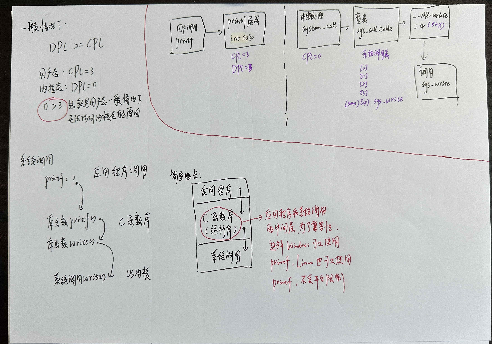 

## 1. 内核态和用户态

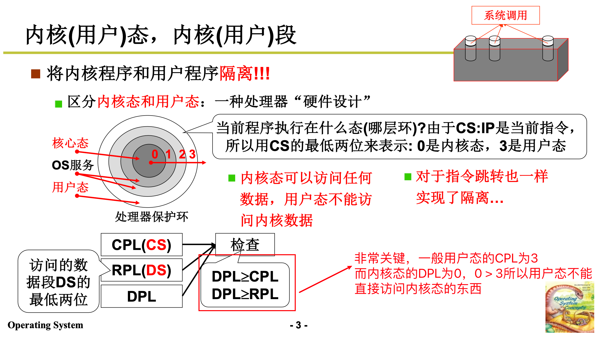 

## 2. 系统调用的核心

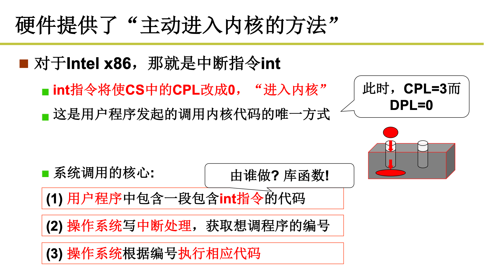 

## 3. 系统调用实现

### 3.1 步骤一

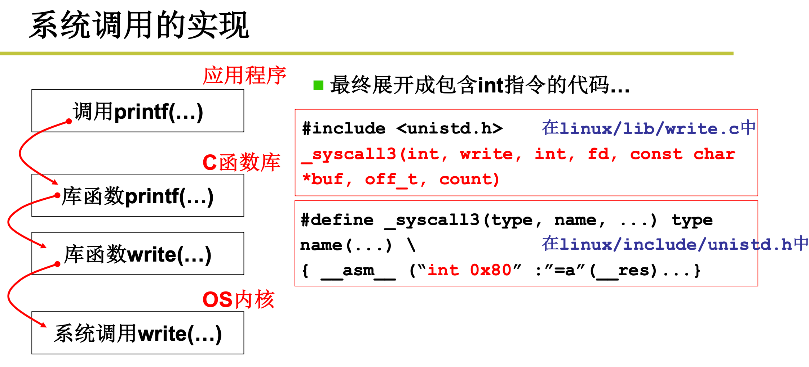 

### 3.2 步骤二

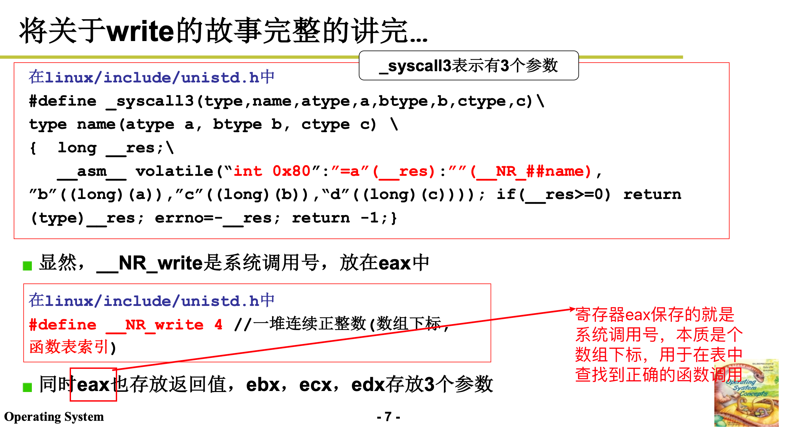 

### 3.3 步骤三：`int 0x80`中断处理

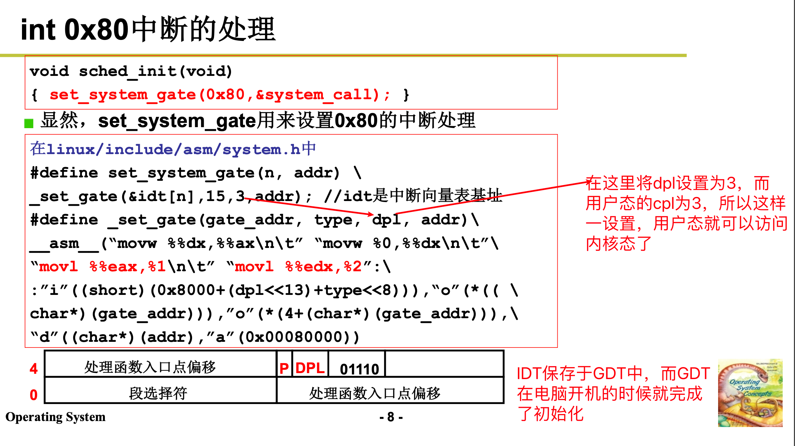 

### 3.4 步骤四：`_system_call`

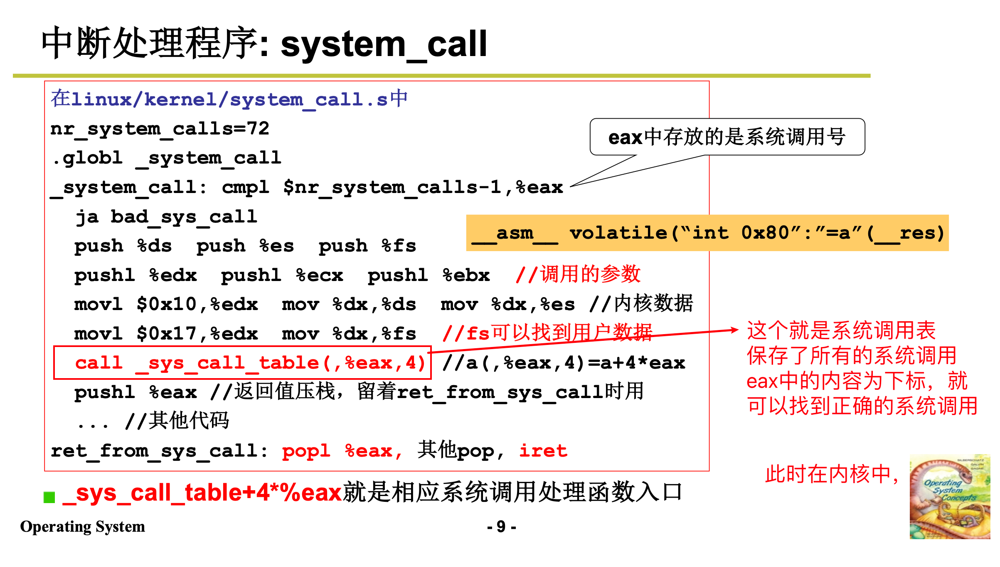 

### 3.5 步骤五：`_sys_call_table`

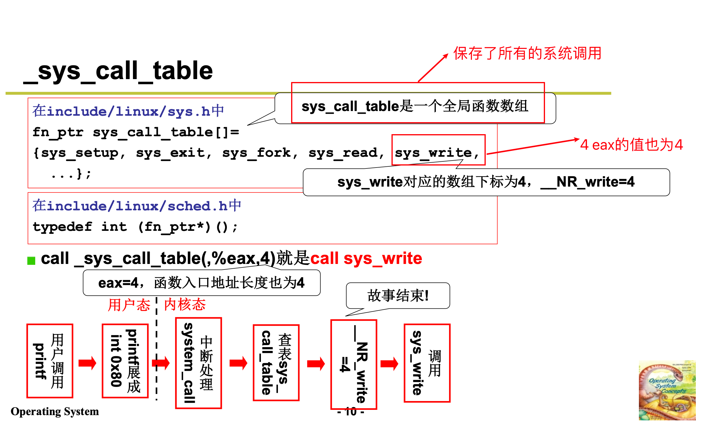 

## 4. 调用whoami大致流程

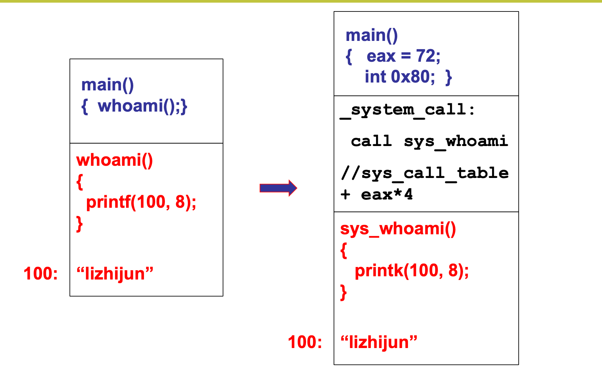 

## 5. C运行库包装系统调用的代码

### 5.1 完整代码

```c
/* ************************************************************************
> File Name:     stdio.c
> Author:        niu0217
> Created Time:  Mon 19 Feb 2024 12:49:50 PM CST
> Description:
 ************************************************************************/

#include "minicrt.h"

int mini_crt_io_init() {
    return 1;
}

#ifdef WIN32 //Windows
#include<Windows.h>

FILE* fopen(const char* filename, const char* mode) {
    HANDLE hFile = 0;
    int access = 0;
    int creation = 0;

    if(strcmp(mode, "w") == 0) {
        access |= GENERIC_WRITE;
        creation |= CREATE_ALWAYS;
    }

    if(strcmp(mode, "w+") == 0) {
        access |= GENERIC_WRITE | GENERIC_READ;
        creation |= CREATE_ALWAYS;
    }

    if(strcmp(mode, "r") == 0) {
        access |= GENERIC_READ;
        creation += OPEN_EXISTING;
    }

    if(strcmp(mode, "r+") == 0) {
        access |= GENERIC_READ | GENERIC_WRITE;
        creation |= TRUNCATE_EXISTING;
    }

    hFile = CreateFileA(filename, access, 0, 0, creation, 0, 0);
    if(hFile == INVAILD_HANDLE_VALUE) {
        return 0;
    }

    return (FILE*)hFile;
}

int fread(void* buffer, int size, int count, FILE* stream) {
    int read = 0;
    if(!ReadFile((HANDLE)stream, buffer, size * count, &read, 0)) {
        return 0;
    }
    return read;
}

int fwrite(const void* buffer, int size, int count, FILE* stream) {
    int written = 0;
    if(!WriteFile((HANDLE)stream, buffer, size * count, &written, 0)) {
        return 0;
    }
    return written;
}

int fclose(FILE* fp) {
    return CloseHandle((HANDLE)fp);
}

int fseek(FILE* fp, int offset, int set) {
    return SetFilePointer((HANDLE)fp, offset, 0, set);
}

#else //Linux
static int open(const char* pathname, int flags, int mode) {
    int fd = 0;
    asm("movl $5,%%eax  \n\t"
        "movl %1,%%ebx  \n\t"
        "movl %2,%%ecx  \n\t"
        "movl %3,%%edx  \n\t"
        "int $0x80      \n\t"
        "movl %%eax,%0  \n\t":
        "=m"(fd):"m"(pathname),"m"(flags),"m"(mode));
}

static int read(int fd, void* buffer, unsigned size) {
    int ret = 0;
    asm("movl $3,%%eax   \n\t"
        "movl %1,%%ebx   \n\t"
        "movl %2,%%ecx   \n\t"
        "movl %3,%%edx   \n\t"
        "int $0x80       \n\y"
        "movl %%eax,%0   \n\t":
        "=m"(ret):"m"(fd),"m"(buffer),"m"(size));
    return ret;
}

static int write(int fd, const void* buffer, unsigned size) {
    int ret = 0;
    asm("movl $4,%%eax   \n\t"
        "movl %1,%%ebx   \n\t"
        "movl %2,%%ecx   \n\t"
        "movl %3,%%edx   \n\t"
        "int $0x80       \n\t"
        "movl %%eax,%0   \n\t":
        "=m"(ret):"m"(fd),"m"(buffer),"m"(size));
    return ret;
}

static int close(int fd) {
    int ret = 0;
    asm("movl $6,%%eax   \n\t"
        "movl %1,%%ebx   \n\t"
        "int $0x80       \n\t"
        "movl %%eax,%0   \n\t":
        "=m"(ret):"m"(fd));
    return ret;
}

static int seek(int fd, int offset, int mode) {
    int ret = 0;
    asm("movl $19,%%eax   \n\t"
        "movl %1,%%ebx    \n\t"
        "movl %2,%%ecx    \n\t"
        "movl %3,%%edx    \n\t"
        "int $0x80        \n\t":
        "=m"(ret):"m"(fd),"m"(offset),"m"(mode));
    return ret;
}

FILE* fopen(const char* filename, const char* mode) {
    int fd = -1;
    int flags = 0;
    int access = 00700;

//来自于/usr/include/bits/fcnt1.h
//以0开头的数字是八进制的
#define O_RDONLY   00
#define O_WRONLY   01
#define O_RDWR     02
#define O_CREAT    0100
#define O_TRUNC    01000
#define O_APPEND   02000

    if(strcmp(mode, "w") == 0) {
        flags |= O_WRONLY | O_CREAT | O_TRUNC;
    }

    if(strcmp(mode, "w+") == 0) {
        flags |= O_RDWR | O_CREAT | O_TRUNC;
    }

    if(strcmp(mode, "r") == 0) {
        flags |= O_RDONLY;
    }

    if(strcmp(mode, "r+") == 0) {
        flags |= O_RDWR | O_CREAT;
    }

    fd = open(filename, flags, access);
    return (FILE*)fd;
}

int fread(void* buffer, int size, int count, FILE* stream) {
    return read((int)stream, buffer, size * count);
}

int fwrite(const void* buffer, int size, int count, FILE* stream) {
    return write((int)stream, buffer, size * count);
}

int fclose(File* fp) {
    return close((int)fp);
}

int fseek(FILE* fp, int offset, int set) {
    return seek((int)fp, offset, set);
}

#endif
```

### 5.2 片段分析

```c
static int open(const char* pathname, int flags, int mode) {
    int fd = 0;
    asm("movl $5,%%eax  \n\t"
        "movl %1,%%ebx  \n\t"
        "movl %2,%%ecx  \n\t"
        "movl %3,%%edx  \n\t"
        "int $0x80      \n\t"
        "movl %%eax,%0  \n\t":
        "=m"(fd):"m"(pathname),"m"(flags),"m"(mode));
}
```

1. `movl \$5, %%eax`：将立即数 5（文件打开的系统调用号）移入 `%eax` 寄存器中，即准备系统调用号。
2. `movl %1, %%ebx`：将第一个输入参数 `pathname` 的值移入 `%ebx` 寄存器中，用于系统调用的参数传递。
3. `movl %2, %%ecx`：将第二个输入参数 `flags` 的值移入 `%ecx` 寄存器中，也用于系统调用的参数传递。
4. `movl %3, %%edx`：将第三个输入参数 `mode` 的值移入 `%edx` 寄存器中，同样用于系统调用的参数传递。
5. `int $0x80`：触发 0x80 号中断，这在 Linux/x86 系统中是一种传统的调用系统调用的方法。
6. `movl %%eax, %0`：将 `%eax` 寄存器中的返回值（系统调用的返回值）移入到输出变量 `fd` 中。

接下来是这段代码的约束语句（constraints），它们描述了寄存器和内存的使用情况。在这个例子中，`"=m"(fd)` 表示 `%0` 在内存中的变量 `fd`，`"m"(pathname), "m"(flags), "m"(mode)` 表示 `%1`、`%2`、`%3` 在内存中的变量 `pathname`、`flags`、`mode`。

这段内联汇编代码的作用看起来像是执行一个文件打开的系统调用（在 Linux 下是通过 `int 0x80` 来执行系统调用），然后将返回的文件描述符保存在变量 `fd` 中。这种技术通常用于需要直接访问底层系统功能的情况，例如系统调用或者对硬件的直接访问。

## 6. 补充知识

### 6.1 Linux系统中断流程

 

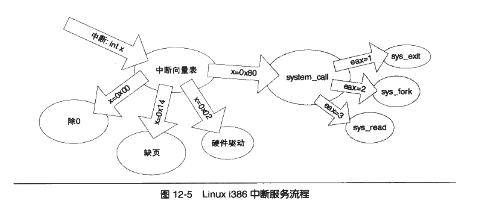 

### 6.2 Linux和Windows的fwrite路径

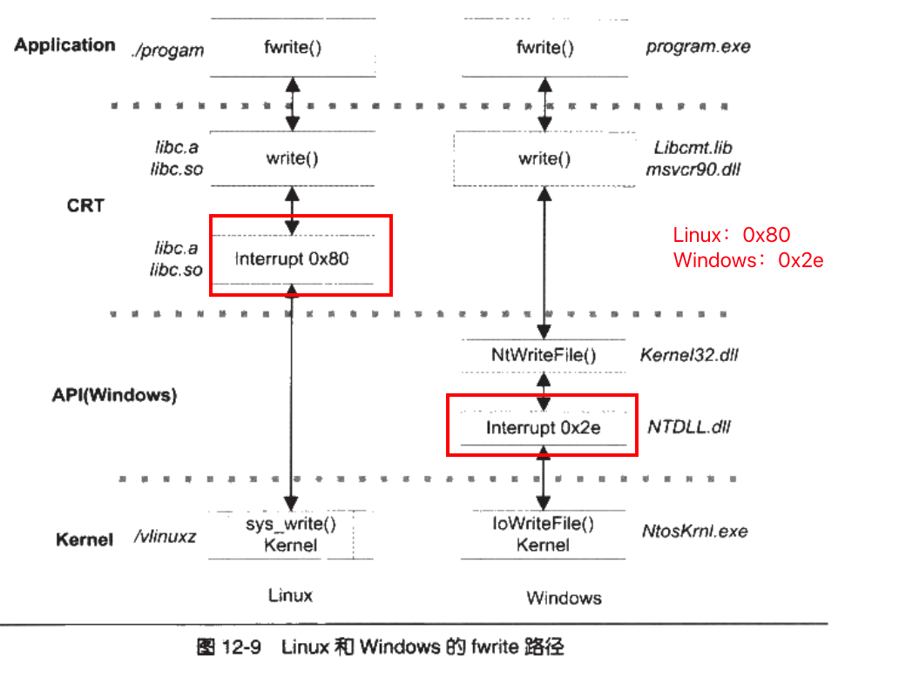 

### 6.3 Windows API的好处

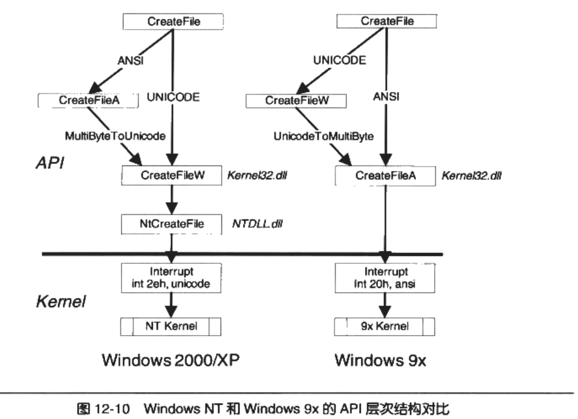 

