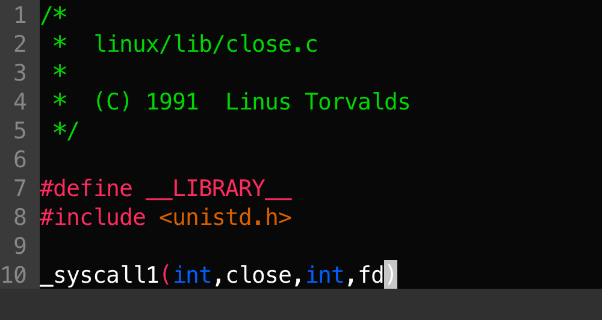
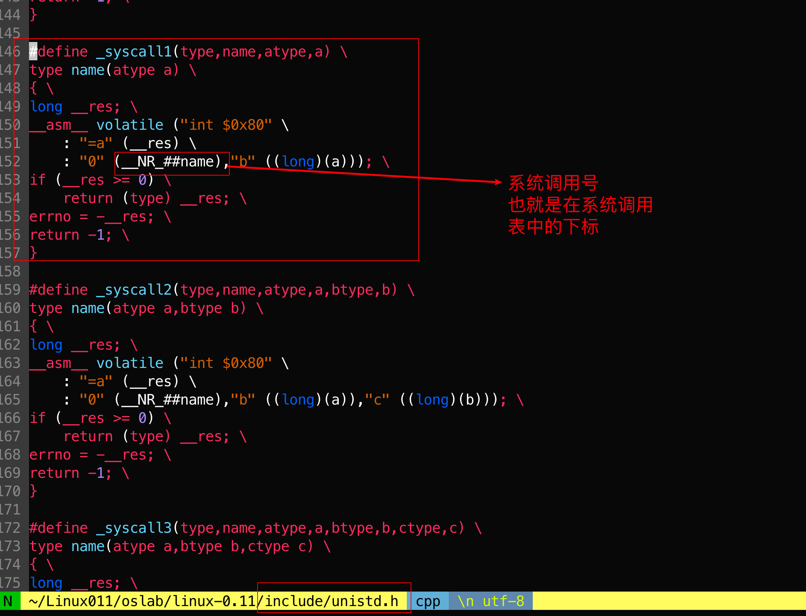
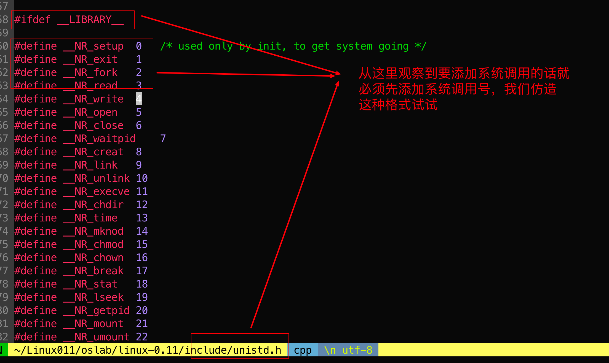
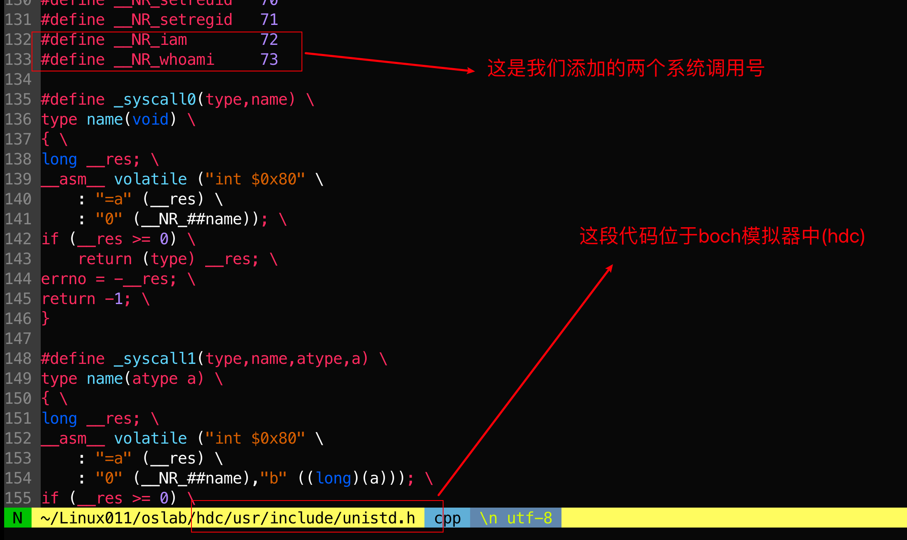
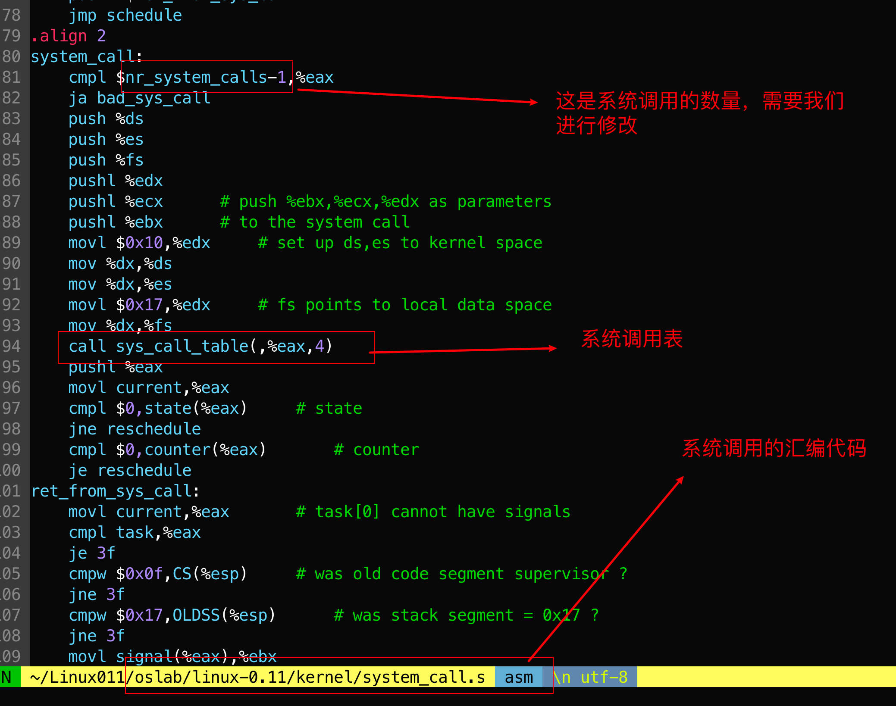
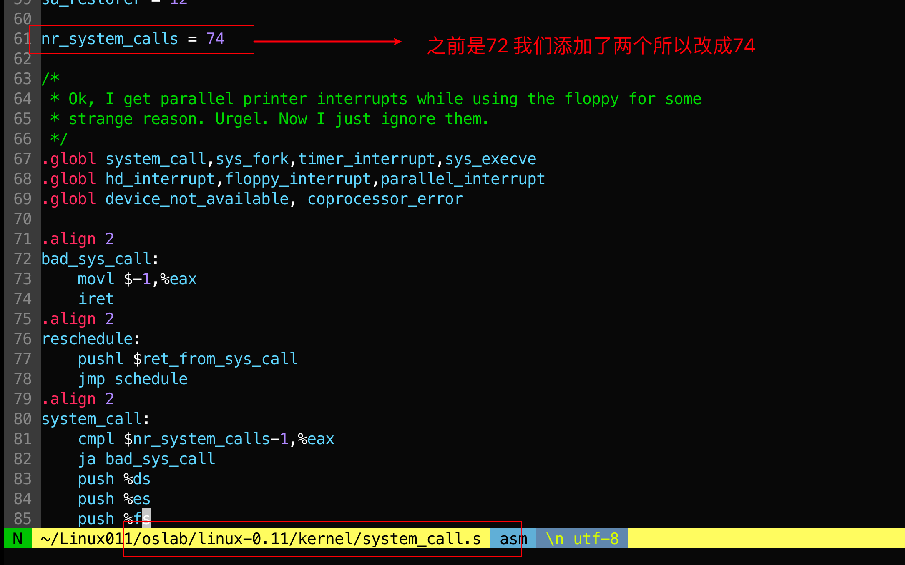
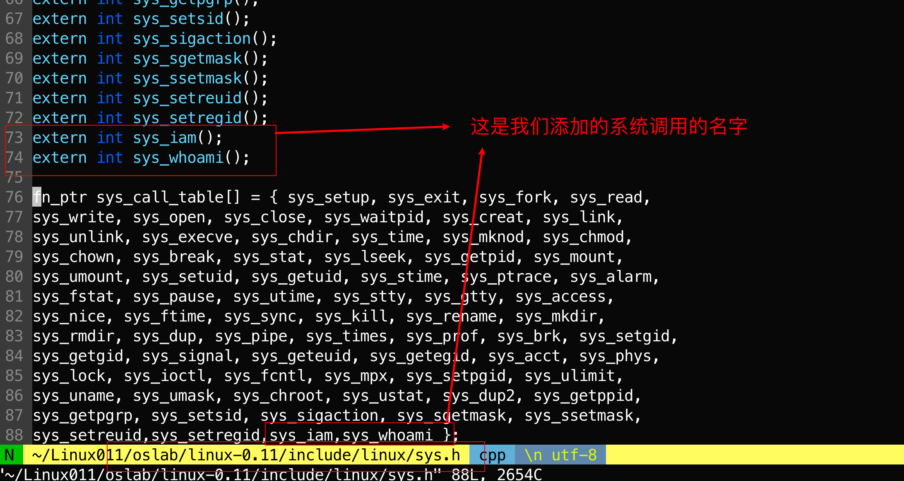
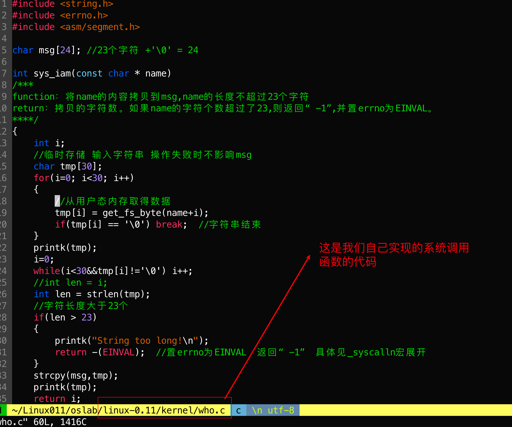
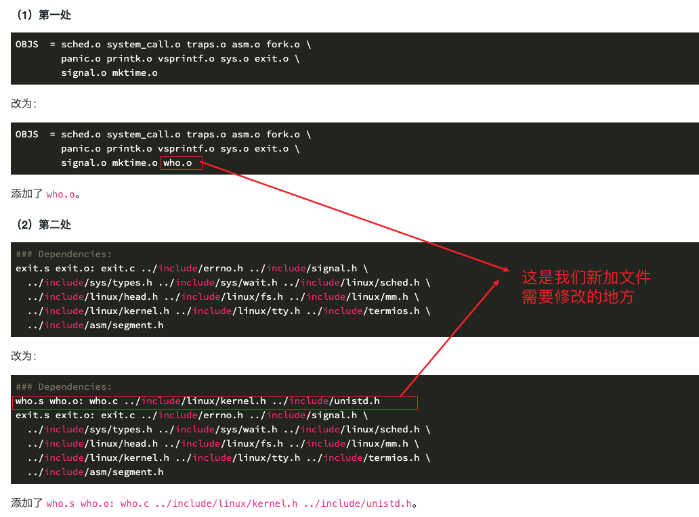

# 过程研究

研究之前是怎么调用的：

 

跳转到`_syscall1`的定义处：

 

 

 

 

 

跳转到`sys_call_table`的定义处：

 

然后改我们自己实现系统调用函数了：

 

接下来修改makefile（linux-0.11/kernel/Makefile）：

 

接下来进入模拟器添加文件`iam.c`。然后编译：

```bash
gcc -o iam iam.c -Wall
```

最后运行得到我们想要的结果。