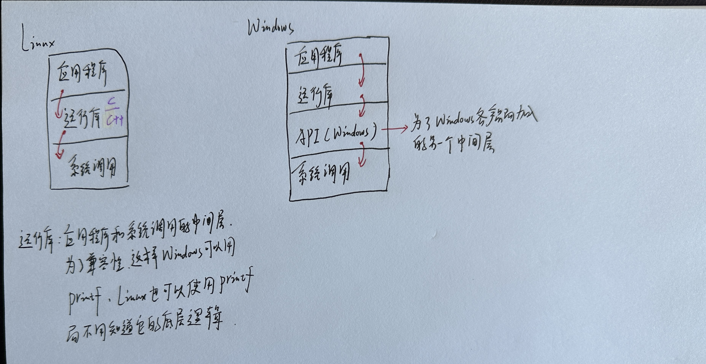

# 面试-系统调用

## 参考资料

+ Linux内核完全注释.pdf
+ 程序员的自我修养—链接、装载与库.pdf

## 1. 系统调用和应用程序的关系

 

## 2. 系统调用过程解析

### 2.1 故事的开始

 

### 2.2 向中断向量表注册中断处理函数(int 0x80)

文件名字：init/main.c

 

文件名字：kernel/sched.c

 

文件名字：include/asm/system.h

 

 

### 2.3 分析system_call函数

备注：所有的0x80中断最终都会调用到这个函数，所以它非常非常重要！！！

文件：kernel/system_call.s

```assembly
system_call:    # linux系统调用入口 调用中断int 0x80 eax中是系统调用号
	cmpl $nr_system_calls-1,%eax
	ja bad_sys_call
	push %ds
	push %es
	push %fs
	pushl %edx
	pushl %ecx		# push %ebx,%ecx,%edx as parameters
	pushl %ebx		# to the system call
	movl $0x10,%edx		# set up ds,es to kernel space
	mov %dx,%ds
	mov %dx,%es
	movl $0x17,%edx		# fs points to local data space
	mov %dx,%fs
	call sys_call_table(,%eax,4)    # 查系统调用表，根据系统调用号(eax)找到要调用的函数
	pushl %eax         # 把系统调用返回值入栈
	movl current,%eax   # 96-100查看当前任务的运行状态
	cmpl $0,state(%eax)		# state
	jne reschedule
	cmpl $0,counter(%eax)		# counter
	je reschedule
ret_from_sys_call:  # 系统调用C函数返回后，对信号进行识别处理
	movl current,%eax		# task[0] cannot have signals
	cmpl task,%eax          # task对应C程序中的task[]数组(进程PCB)
	je 3f
	cmpw $0x0f,CS(%esp)		# was old code segment supervisor ?
	jne 3f
	cmpw $0x17,OLDSS(%esp)		# was stack segment = 0x17 ?
	jne 3f
	movl signal(%eax),%ebx  # 处理当前任务中的信号
	movl blocked(%eax),%ecx
	notl %ecx
	andl %ebx,%ecx
	bsfl %ecx,%ecx
	je 3f
	btrl %ecx,%ebx
	movl %ebx,signal(%eax)
	incl %ecx
	pushl %ecx
	call do_signal  # 调用C函数信号处理程序
	popl %eax
3:	popl %eax
	popl %ebx
	popl %ecx
	popl %edx
	pop %fs
	pop %es
	pop %ds
	iret
```

我们观察到：

```assembly
call sys_call_table(,%eax,4)    # 查系统调用表，根据系统调用号(eax)找到要调用的函数
```

这里它会去查系统调用表，eax保存的是一个下标，对应具体要调用的系统调用函数，那么sys_call_table到底是什么样子的呢？

### 2.4 分析sys_call_table函数

文件：include/linux/sys.h

```c
extern int sys_setup();
extern int sys_exit();
extern int sys_fork();
extern int sys_read();
extern int sys_write();
extern int sys_open();
extern int sys_close();
extern int sys_waitpid();
extern int sys_creat();
extern int sys_link();
extern int sys_unlink();
extern int sys_execve();
extern int sys_chdir();
extern int sys_time();
extern int sys_mknod();
extern int sys_chmod();
extern int sys_chown();
extern int sys_break();
extern int sys_stat();
extern int sys_lseek();
extern int sys_getpid();
extern int sys_mount();
extern int sys_umount();
extern int sys_setuid();
extern int sys_getuid();
extern int sys_stime();
extern int sys_ptrace();
extern int sys_alarm();
extern int sys_fstat();
extern int sys_pause();
extern int sys_utime();
extern int sys_stty();
extern int sys_gtty();
extern int sys_access();
extern int sys_nice();
extern int sys_ftime();
extern int sys_sync();
extern int sys_kill();
extern int sys_rename();
extern int sys_mkdir();
extern int sys_rmdir();
extern int sys_dup();
extern int sys_pipe();
extern int sys_times();
extern int sys_prof();
extern int sys_brk();
extern int sys_setgid();
extern int sys_getgid();
extern int sys_signal();
extern int sys_geteuid();
extern int sys_getegid();
extern int sys_acct();
extern int sys_phys();
extern int sys_lock();
extern int sys_ioctl();
extern int sys_fcntl();
extern int sys_mpx();
extern int sys_setpgid();
extern int sys_ulimit();
extern int sys_uname();
extern int sys_umask();
extern int sys_chroot();
extern int sys_ustat();
extern int sys_dup2();
extern int sys_getppid();
extern int sys_getpgrp();
extern int sys_setsid();
extern int sys_sigaction();
extern int sys_sgetmask();
extern int sys_ssetmask();
extern int sys_setreuid();
extern int sys_setregid();
extern int sys_iam();
extern int sys_whoami();

fn_ptr sys_call_table[] = { sys_setup, sys_exit, sys_fork, sys_read,
sys_write, sys_open, sys_close, sys_waitpid, sys_creat, sys_link,
sys_unlink, sys_execve, sys_chdir, sys_time, sys_mknod, sys_chmod,
sys_chown, sys_break, sys_stat, sys_lseek, sys_getpid, sys_mount,
sys_umount, sys_setuid, sys_getuid, sys_stime, sys_ptrace, sys_alarm,
sys_fstat, sys_pause, sys_utime, sys_stty, sys_gtty, sys_access,
sys_nice, sys_ftime, sys_sync, sys_kill, sys_rename, sys_mkdir,
sys_rmdir, sys_dup, sys_pipe, sys_times, sys_prof, sys_brk, sys_setgid,
sys_getgid, sys_signal, sys_geteuid, sys_getegid, sys_acct, sys_phys,
sys_lock, sys_ioctl, sys_fcntl, sys_mpx, sys_setpgid, sys_ulimit,
sys_uname, sys_umask, sys_chroot, sys_ustat, sys_dup2, sys_getppid,
sys_getpgrp, sys_setsid, sys_sigaction, sys_sgetmask, sys_ssetmask,
sys_setreuid,sys_setregid,sys_iam,sys_whoami };

```

从这里我们得到sys_call_table就是一个数组，其中保存的是系统调用函数，eax就是下标。

举例：如果我们在c程序中调用fork函数，代码如下：

```c
#include <stdio.h>
#include <sys/types.h>
#include <unistd.h>

int main() {
    pid_t child_pid;

    // 创建子进程
    child_pid = fork();

    if (child_pid == 0) {
        // 子进程的代码
        printf("This is the child process, with PID: %d\n", getpid());
    } else if (child_pid > 0) {
        // 父进程的代码
        printf("This is the parent process, with PID: %d\n", getpid());
        printf("Child PID: %d\n", child_pid);
    } else {
        // fork() 出错
        fprintf(stderr, "Fork failed\n");
        return 1;
    }

    return 0;
}
```

 

那么sys_fork函数是什么样子的呢？

### 2.5 分析sys_fork函数

文件：kernel/system_call.s

 

具体细节暂时不考虑了，但是这个函数就是fork函数真正的底层原理了。

## 3. 小结Linux系统中断流程

 

 

## 4. Linux和Windows的fwrite路径

 

## 5. Windows的API好处

 


