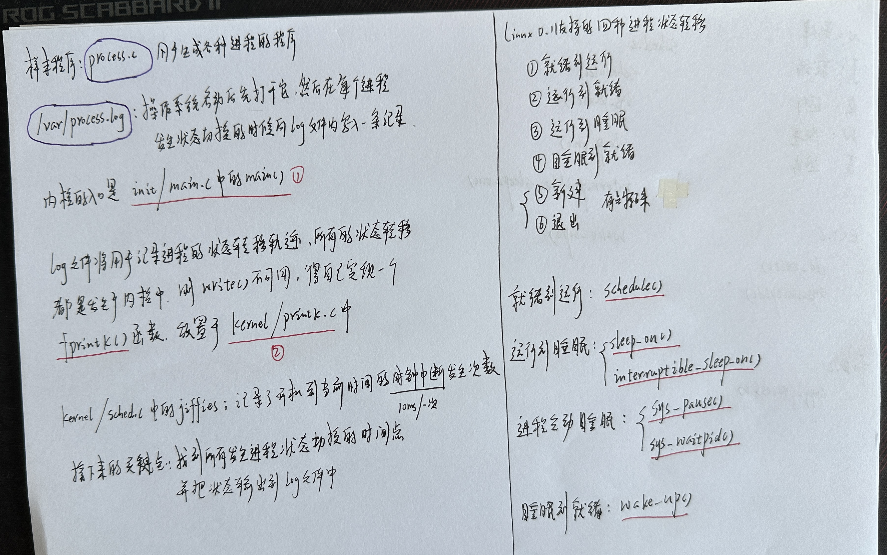
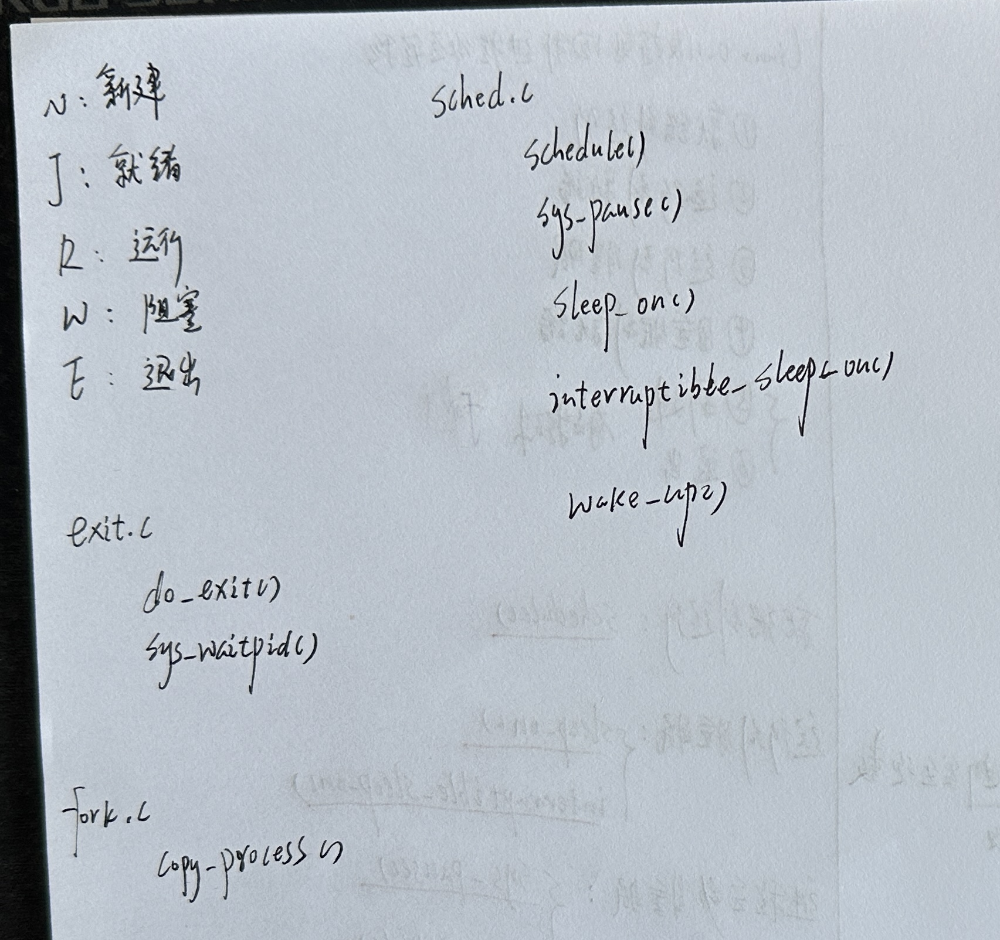
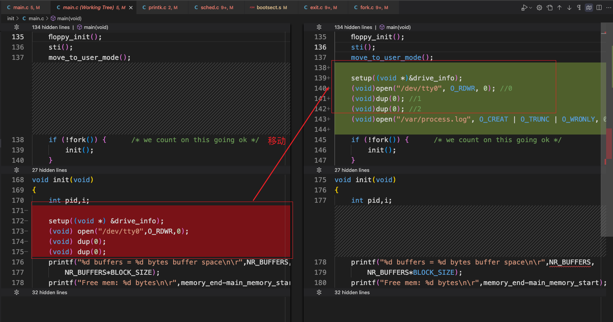
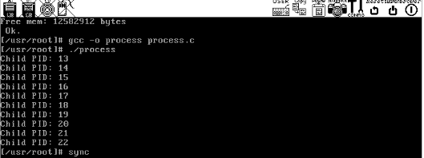

# 实验三报告

## 1. 引入

 

 

## 2. 开启实验

### 2.1 样本程序编写

文件名字：process.c

```c
#include <stdio.h>
#include <unistd.h>
#include <time.h>
#include <sys/times.h>
#include <sys/types.h>

#define HZ 100

void cpuio_bound(int last, int cpu_time, int io_time);
/*
1.  所有子进程都并行运行,每个子进程的实际运行时间一般不超过30秒;
2.  父进程向标准输出打印所有子进程的id,并在所有子进程都退出后才退出;
*/
int main(int argc, char *argv[])
{
	pid_t n_proc[10]; /*10个子进程 PID*/
	int i;
	for (i = 0; i < 10; i++)
	{
		n_proc[i] = fork();
		/*子进程*/
		if (n_proc[i] == 0)
		{
			cpuio_bound(20, 2 * i, 20 - 2 * i); /*每个子进程都占用20s*/
			return 0;							/*执行完cpuio_bound 以后，结束该子进程*/
		}
		/*fork 失败*/
		else if (n_proc[i] < 0)
		{
			printf("Failed to fork child process %d!\n", i + 1);
			return -1;
		}
		/*父进程继续fork*/
	}
	/*打印所有子进程PID*/
	for (i = 0; i < 10; i++)
		printf("Child PID: %d\n", n_proc[i]);
	/*等待所有子进程完成*/
	wait(&i); /*Linux 0.11 上 gcc要求必须有一个参数, gcc3.4+则不需要*/
	return 0;
}

/*
 * 此函数按照参数占用CPU和I/O时间
 * last: 函数实际占用CPU和I/O的总时间，不含在就绪队列中的时间，>=0是必须的
 * cpu_time: 一次连续占用CPU的时间，>=0是必须的
 * io_time: 一次I/O消耗的时间，>=0是必须的
 * 如果last > cpu_time + io_time，则往复多次占用CPU和I/O
 * 所有时间的单位为秒
 */
void cpuio_bound(int last, int cpu_time, int io_time)
{
	struct tms start_time, current_time;
	clock_t utime, stime;
	int sleep_time;

	while (last > 0)
	{
		/* CPU Burst */
		times(&start_time);
		/* 其实只有t.tms_utime才是真正的CPU时间。但我们是在模拟一个
		 * 只在用户状态运行的CPU大户，就像“for(;;);”。所以把t.tms_stime
		 * 加上很合理。*/
		do
		{
			times(&current_time);
			utime = current_time.tms_utime - start_time.tms_utime;
			stime = current_time.tms_stime - start_time.tms_stime;
		} while (((utime + stime) / HZ) < cpu_time);
		last -= cpu_time;

		if (last <= 0)
			break;

		/* IO Burst */
		/* 用sleep(1)模拟1秒钟的I/O操作 */
		sleep_time = 0;
		while (sleep_time < io_time)
		{
			sleep(1);
			sleep_time++;
		}
		last -= sleep_time;
	}
}
```

### 2.2 log文件

 

文件名字：init/main.c

```c
/*
 *  linux/init/main.c
 *
 *  (C) 1991  Linus Torvalds
 */

#define __LIBRARY__
#include <unistd.h>
#include <time.h>

/*
 * we need this inline - forking from kernel space will result
 * in NO COPY ON WRITE (!!!), until an execve is executed. This
 * is no problem, but for the stack. This is handled by not letting
 * main() use the stack at all after fork(). Thus, no function
 * calls - which means inline code for fork too, as otherwise we
 * would use the stack upon exit from 'fork()'.
 *
 * Actually only pause and fork are needed inline, so that there
 * won't be any messing with the stack from main(), but we define
 * some others too.
 */
static inline _syscall0(int,fork)
static inline _syscall0(int,pause)
static inline _syscall1(int,setup,void *,BIOS)
static inline _syscall0(int,sync)

#include <linux/tty.h>
#include <linux/sched.h>
#include <linux/head.h>
#include <asm/system.h>
#include <asm/io.h>

#include <stddef.h>
#include <stdarg.h>
#include <unistd.h>
#include <fcntl.h>
#include <sys/types.h>

#include <linux/fs.h>

static char printbuf[1024];

extern int vsprintf();
extern void init(void);
extern void blk_dev_init(void);
extern void chr_dev_init(void);
extern void hd_init(void);
extern void floppy_init(void);
extern void mem_init(long start, long end);
extern long rd_init(long mem_start, int length);
extern long kernel_mktime(struct tm * tm);
extern long startup_time;

/*
 * This is set up by the setup-routine at boot-time
 */
#define EXT_MEM_K (*(unsigned short *)0x90002)
#define DRIVE_INFO (*(struct drive_info *)0x90080)
#define ORIG_ROOT_DEV (*(unsigned short *)0x901FC)

/*
 * Yeah, yeah, it's ugly, but I cannot find how to do this correctly
 * and this seems to work. I anybody has more info on the real-time
 * clock I'd be interested. Most of this was trial and error, and some
 * bios-listing reading. Urghh.
 */

#define CMOS_READ(addr) ({ \
outb_p(0x80|addr,0x70); \
inb_p(0x71); \
})

#define BCD_TO_BIN(val) ((val)=((val)&15) + ((val)>>4)*10)

static void time_init(void)
{
	struct tm time;

	do {
		time.tm_sec = CMOS_READ(0);
		time.tm_min = CMOS_READ(2);
		time.tm_hour = CMOS_READ(4);
		time.tm_mday = CMOS_READ(7);
		time.tm_mon = CMOS_READ(8);
		time.tm_year = CMOS_READ(9);
	} while (time.tm_sec != CMOS_READ(0));
	BCD_TO_BIN(time.tm_sec);
	BCD_TO_BIN(time.tm_min);
	BCD_TO_BIN(time.tm_hour);
	BCD_TO_BIN(time.tm_mday);
	BCD_TO_BIN(time.tm_mon);
	BCD_TO_BIN(time.tm_year);
	time.tm_mon--;
	startup_time = kernel_mktime(&time);
}

static long memory_end = 0;
static long buffer_memory_end = 0;
static long main_memory_start = 0;

struct drive_info { char dummy[32]; } drive_info;

void main(void)		/* This really IS void, no error here. */
{			/* The startup routine assumes (well, ...) this */
/*
 * Interrupts are still disabled. Do necessary setups, then
 * enable them
 */
 	ROOT_DEV = ORIG_ROOT_DEV;
 	drive_info = DRIVE_INFO;
	memory_end = (1<<20) + (EXT_MEM_K<<10);
	memory_end &= 0xfffff000;
	if (memory_end > 16*1024*1024)
		memory_end = 16*1024*1024;
	if (memory_end > 12*1024*1024) 
		buffer_memory_end = 4*1024*1024;
	else if (memory_end > 6*1024*1024)
		buffer_memory_end = 2*1024*1024;
	else
		buffer_memory_end = 1*1024*1024;
	main_memory_start = buffer_memory_end;
#ifdef RAMDISK
	main_memory_start += rd_init(main_memory_start, RAMDISK*1024);
#endif
	mem_init(main_memory_start,memory_end);
	trap_init();
	blk_dev_init();
	chr_dev_init();
	tty_init();
	time_init();
	sched_init();
	buffer_init(buffer_memory_end);
	hd_init();
	floppy_init();
	sti();
	move_to_user_mode();

	setup((void *)&drive_info);
	(void)open("/dev/tty0", O_RDWR, 0); //0
	(void)dup(0); //1
	(void)dup(0); //2
	(void)open("/var/process.log", O_CREAT | O_TRUNC | O_WRONLY, 0666); //3

	if (!fork()) {		/* we count on this going ok */
		init();
	}
/*
 *   NOTE!!   For any other task 'pause()' would mean we have to get a
 * signal to awaken, but task0 is the sole exception (see 'schedule()')
 * as task 0 gets activated at every idle moment (when no other tasks
 * can run). For task0 'pause()' just means we go check if some other
 * task can run, and if not we return here.
 */
	for(;;) pause();
}

static int printf(const char *fmt, ...)
{
	va_list args;
	int i;

	va_start(args, fmt);
	write(1,printbuf,i=vsprintf(printbuf, fmt, args));
	va_end(args);
	return i;
}

static char * argv_rc[] = { "/bin/sh", NULL };
static char * envp_rc[] = { "HOME=/", NULL };

static char * argv[] = { "-/bin/sh",NULL };
static char * envp[] = { "HOME=/usr/root", NULL };

void init(void)
{
	int pid,i;
	printf("%d buffers = %d bytes buffer space\n\r",NR_BUFFERS,
		NR_BUFFERS*BLOCK_SIZE);
	printf("Free mem: %d bytes\n\r",memory_end-main_memory_start);
	if (!(pid=fork())) {
		close(0);
		if (open("/etc/rc",O_RDONLY,0))
			_exit(1);
		execve("/bin/sh",argv_rc,envp_rc);
		_exit(2);
	}
	if (pid>0)
		while (pid != wait(&i))
			/* nothing */;
	while (1) {
		if ((pid=fork())<0) {
			printf("Fork failed in init\r\n");
			continue;
		}
		if (!pid) {
			close(0);close(1);close(2);
			setsid();
			(void) open("/dev/tty0",O_RDWR,0);
			(void) dup(0);
			(void) dup(0);
			_exit(execve("/bin/sh",argv,envp));
		}
		while (1)
			if (pid == wait(&i))
				break;
		printf("\n\rchild %d died with code %04x\n\r",pid,i);
		sync();
	}
	_exit(0);	/* NOTE! _exit, not exit() */
}

```

### 2.3 写log文件

文件名字：kernel/printk.c

```c
/*
 *  linux/kernel/printk.c
 *
 *  (C) 1991  Linus Torvalds
 */

/*
 * When in kernel-mode, we cannot use printf, as fs is liable to
 * point to 'interesting' things. Make a printf with fs-saving, and
 * all is well.
 */
#include <stdarg.h>
#include <stddef.h>
#include <linux/sched.h>
#include <sys/stat.h>

#include <linux/kernel.h>

static char buf[1024];

extern int vsprintf(char * buf, const char * fmt, va_list args);

int printk(const char *fmt, ...)
{
	va_list args;
	int i;

	va_start(args, fmt);
	i=vsprintf(buf,fmt,args);
	va_end(args);
	__asm__("push %%fs\n\t"
		"push %%ds\n\t"
		"pop %%fs\n\t"
		"pushl %0\n\t"
		"pushl $buf\n\t"
		"pushl $0\n\t"
		"call tty_write\n\t"
		"addl $8,%%esp\n\t"
		"popl %0\n\t"
		"pop %%fs"
		::"r" (i):"ax","cx","dx");
	return i;
}

static char logbuf[1024];
int fprintk(int fd, const char *fmt, ...)
{
	va_list args;
	int count;
	struct file *file;
	struct m_inode *inode;
	va_start(args, fmt);
	count = vsprintf(logbuf, fmt, args);
	va_end(args);
	if (fd < 3)
	/* 如果输出到stdout或stderr,直接调用sys_write即可 */
	{
		__asm__("push %%fs\n\t"
				"push %%ds\n\t"
				"pop %%fs\n\t"
				"pushl %0\n\t"
				"pushl $logbuf\n\t" /* 注意对于Windows环境来说,是_logbuf,下同 */
				"pushl %1\n\t"
				"call sys_write\n\t" /* 注意对于Windows环境来说,是_sys_write,下同 */
				"addl $8,%%esp\n\t"
				"popl %0\n\t"
				"pop %%fs" ::"r"(count),
				"r"(fd) : "ax", "cx", "dx");
	}
	else
	/* 假定>=3的描述符都与文件关联。事实上,还存在很多其它情况,这里并没有考虑。*/
	{
		if (!(file = task[0]->filp[fd])) /* 从进程0的文件描述符表中得到文件句柄 */
			return 0;
		inode = file->f_inode;
		__asm__("push %%fs\n\t"
				"push %%ds\n\t"
				"pop %%fs\n\t"
				"pushl %0\n\t"
				"pushl $logbuf\n\t"
				"pushl %1\n\t"
				"pushl %2\n\t"
				"call file_write\n\t"
				"addl $12,%%esp\n\t"
				"popl %0\n\t"
				"pop %%fs" ::"r"(count),
				"r"(file), "r"(inode) : "ax", "cx", "dx");
	}
	return count;
}
```

### 2.4 寻找状态切换点

#### 2.4.1 kernel/exit.c

```c
int do_exit(long code)
{
	int i;
	free_page_tables(get_base(current->ldt[1]),get_limit(0x0f));
	free_page_tables(get_base(current->ldt[2]),get_limit(0x17));
	for (i=0 ; i<NR_TASKS ; i++)
		if (task[i] && task[i]->father == current->pid) {
			task[i]->father = 1;
			if (task[i]->state == TASK_ZOMBIE)
				/* assumption task[1] is always init */
				(void) send_sig(SIGCHLD, task[1], 1);
		}
	for (i=0 ; i<NR_OPEN ; i++)
		if (current->filp[i])
			sys_close(i);
	iput(current->pwd);
	current->pwd=NULL;
	iput(current->root);
	current->root=NULL;
	iput(current->executable);
	current->executable=NULL;
	if (current->leader && current->tty >= 0)
		tty_table[current->tty].pgrp = 0;
	if (last_task_used_math == current)
		last_task_used_math = NULL;
	if (current->leader)
		kill_session();
	current->state = TASK_ZOMBIE;
	/*
	 * 退出一个进程
	 */
	fprintk(3, "%d\tE\t%d\n", current->pid, jiffies);
	current->exit_code = code;
	tell_father(current->father);
	schedule();
	return (-1);	/* just to suppress warnings */
}
```

```c
int sys_waitpid(pid_t pid,unsigned long * stat_addr, int options)
{
	int flag, code;
	struct task_struct ** p;

	verify_area(stat_addr,4);
repeat:
	flag=0;
	for(p = &LAST_TASK ; p > &FIRST_TASK ; --p) {
		if (!*p || *p == current)
			continue;
		if ((*p)->father != current->pid)
			continue;
		if (pid>0) {
			if ((*p)->pid != pid)
				continue;
		} else if (!pid) {
			if ((*p)->pgrp != current->pgrp)
				continue;
		} else if (pid != -1) {
			if ((*p)->pgrp != -pid)
				continue;
		}
		switch ((*p)->state) {
			case TASK_STOPPED:
				if (!(options & WUNTRACED))
					continue;
				put_fs_long(0x7f,stat_addr);
				return (*p)->pid;
			case TASK_ZOMBIE:
				current->cutime += (*p)->utime;
				current->cstime += (*p)->stime;
				flag = (*p)->pid;
				code = (*p)->exit_code;
				release(*p);
				put_fs_long(code,stat_addr);
				return flag;
			default:
				flag=1;
				continue;
		}
	}
	if (flag) {
		if (options & WNOHANG)
			return 0;
		current->state=TASK_INTERRUPTIBLE;
		/*
		 * 当前进程 运行 => 等待
		 * 进程主动睡眠
		 */
		fprintk(3, "%d\tW\t%d\n", current->pid, jiffies);
		schedule();
		if (!(current->signal &= ~(1<<(SIGCHLD-1))))
			goto repeat;
		else
			return -EINTR;
	}
	return -ECHILD;
}
```

#### 2.4.2 kernel/fork.c

```c
/*
 *  Ok, this is the main fork-routine. It copies the system process
 * information (task[nr]) and sets up the necessary registers. It
 * also copies the data segment in it's entirety.
 */
int copy_process(int nr,long ebp,long edi,long esi,long gs,long none,
		long ebx,long ecx,long edx,
		long fs,long es,long ds,
		long eip,long cs,long eflags,long esp,long ss)
{
	struct task_struct *p;
	int i;
	struct file *f;

	p = (struct task_struct *) get_free_page();
	if (!p)
		return -EAGAIN;
	task[nr] = p;
	*p = *current;	/* NOTE! this doesn't copy the supervisor stack */
	p->state = TASK_UNINTERRUPTIBLE;
	p->pid = last_pid;
	p->father = current->pid;
	p->counter = p->priority;
	p->signal = 0;
	p->alarm = 0;
	p->leader = 0;		/* process leadership doesn't inherit */
	p->utime = p->stime = 0;
	p->cutime = p->cstime = 0;
	p->start_time = jiffies;
	//新建一个进程
	fprintk(3, "%d\tN\t%d\n", p->pid, jiffies);
	p->tss.back_link = 0;
	p->tss.esp0 = PAGE_SIZE + (long) p;
	p->tss.ss0 = 0x10;
	p->tss.eip = eip;
	p->tss.eflags = eflags;
	p->tss.eax = 0;
	p->tss.ecx = ecx;
	p->tss.edx = edx;
	p->tss.ebx = ebx;
	p->tss.esp = esp;
	p->tss.ebp = ebp;
	p->tss.esi = esi;
	p->tss.edi = edi;
	p->tss.es = es & 0xffff;
	p->tss.cs = cs & 0xffff;
	p->tss.ss = ss & 0xffff;
	p->tss.ds = ds & 0xffff;
	p->tss.fs = fs & 0xffff;
	p->tss.gs = gs & 0xffff;
	p->tss.ldt = _LDT(nr);
	p->tss.trace_bitmap = 0x80000000;
	if (last_task_used_math == current)
		__asm__("clts ; fnsave %0"::"m" (p->tss.i387));
	if (copy_mem(nr,p)) {
		task[nr] = NULL;
		free_page((long) p);
		return -EAGAIN;
	}
	for (i=0; i<NR_OPEN;i++)
		if ((f=p->filp[i]))
			f->f_count++;
	if (current->pwd)
		current->pwd->i_count++;
	if (current->root)
		current->root->i_count++;
	if (current->executable)
		current->executable->i_count++;
	set_tss_desc(gdt+(nr<<1)+FIRST_TSS_ENTRY,&(p->tss));
	set_ldt_desc(gdt+(nr<<1)+FIRST_LDT_ENTRY,&(p->ldt));
	p->state = TASK_RUNNING;	/* do this last, just in case */
	//进程从新建变化到就绪状态
	fprintk(3, "%d\tJ\t%d\n", p->pid, jiffies);
	return last_pid;
}
```

#### 2.4.3 kernel/sched.c

```c
/*
 *  'schedule()' is the scheduler function. This is GOOD CODE! There
 * probably won't be any reason to change this, as it should work well
 * in all circumstances (ie gives IO-bound processes good response etc).
 * The one thing you might take a look at is the signal-handler code here.
 *
 *   NOTE!!  Task 0 is the 'idle' task, which gets called when no other
 * tasks can run. It can not be killed, and it cannot sleep. The 'state'
 * information in task[0] is never used.
 */
void schedule(void)
{
	int i,next,c;
	struct task_struct ** p;

/* check alarm, wake up any interruptible tasks that have got a signal */

	for(p = &LAST_TASK ; p > &FIRST_TASK ; --p)
		if (*p) {
			if ((*p)->alarm && (*p)->alarm < jiffies) {
					(*p)->signal |= (1<<(SIGALRM-1));
					(*p)->alarm = 0;
				}
			if (((*p)->signal & ~(_BLOCKABLE & (*p)->blocked)) &&
			(*p)->state==TASK_INTERRUPTIBLE) {
				(*p)->state = TASK_RUNNING;
				/*阻塞 ==>就绪*/
				fprintk(3, "%d\tJ\t%d\n", (*p)->pid, jiffies);
			}
		}

/* this is the scheduler proper: */

	while (1) {
		c = -1;
		next = 0;
		i = NR_TASKS;
		p = &task[NR_TASKS];
		while (--i) {
			if (!*--p)
				continue;
			if ((*p)->state == TASK_RUNNING && (*p)->counter > c)
				c = (*p)->counter, next = i;
		}
		if (c) break;
		for(p = &LAST_TASK ; p > &FIRST_TASK ; --p)
			if (*p)
				(*p)->counter = ((*p)->counter >> 1) +
						(*p)->priority;
	}
	/*编号为next的进程 运行*/
	if (current->pid != task[next]->pid)
	{
		/*时间片到 当前进程从：运行 => 就绪*/
		if (current->state == TASK_RUNNING)
			fprintk(3, "%d\tJ\t%d\n", current->pid, jiffies);
		/*next进程从就绪转化为运行*/
		fprintk(3, "%d\tR\t%d\n", task[next]->pid, jiffies);
	}
	switch_to(next);
}
```

```c
int sys_pause(void)
{
	current->state = TASK_INTERRUPTIBLE;
	/*
	 * 状态：当前进程  运行 => 阻塞
	 * 行为：进程主动睡眠
	 */
	if (current->pid != 0)
		fprintk(3, "%d\tW\t%d\n", current->pid, jiffies);
	schedule();
	return 0;
}
```

```c
void sleep_on(struct task_struct **p)
{
	struct task_struct *tmp;

	if (!p)
		return;
	if (current == &(init_task.task))
		panic("task[0] trying to sleep");
	tmp = *p;
	*p = current;
	current->state = TASK_UNINTERRUPTIBLE;
	/*
	 *当前进程 运行 => 阻塞
	 */
	fprintk(3, "%d\tW\t%d\n", current->pid, jiffies);
	schedule();
	if (tmp) {
		tmp->state=0;
		/*
		 *原等待队列 第一个进程：阻塞 => 就绪
		 */
		fprintk(3, "%d\tJ\t%d\n", tmp->pid, jiffies);
	}
}
```

```c
void interruptible_sleep_on(struct task_struct **p)
{
	struct task_struct *tmp;

	if (!p)
		return;
	if (current == &(init_task.task))
		panic("task[0] trying to sleep");
	tmp=*p;
	*p=current;
repeat:	current->state = TASK_INTERRUPTIBLE;
	/*
	 *这一部分属于 唤醒队列中间进程，通过goto实现唤醒 队列头进程 过程中Wait
	 */
	fprintk(3, "%d\tW\t%d\n", current->pid, jiffies);
	schedule();
	if (*p && *p != current) {
		(**p).state=0;
		/*
		 *当前进程：睡眠 => 就绪
		 */
		fprintk(3, "%d\tJ\t%d\n", (*p)->pid, jiffies);
		goto repeat;
	}
	*p=NULL;
	if (tmp) {
		tmp->state = 0;
		/*
		 *原等待队列 第一个进程：睡眠 => 就绪
		 */
		fprintk(3, "%d\tJ\t%d\n", tmp->pid, jiffies);
	}
}
```

```c
void wake_up(struct task_struct **p)
{
	if (p && *p) {
		(**p).state=0;
		/*
		 *唤醒 最后进入等待序列的 进程
		 *睡眠 ==> 就绪
		 */
		fprintk(3, "%d\tJ\t%d\n", (*p)->pid, jiffies);
		*p=NULL;
	}
}
```

### 2.5 实验结果分析

 

```bash
ubuntu@VM-0-16-ubuntu:~/Linux011/oslab$ head -n 100 process.log
1       N       48	# 进程1新建（init()）。此前是进程0建立和运行
1       J       48	# 新建后进入就绪队列
0       J       48	# 进程0从运行->就绪，让出CPU
1       R       48	# 进程1运行
2       N       49	# 进程1建立进程2。2会运行/etc/rc脚本，然后退出
2       J       49
1       W       49	# 进程1开始等待（等待进程2退出）
2       R       49	# 进程2运行
3       N       63	# 进程2建立进程3。3是/bin/sh建立的运行脚本的子进程
3       J       64
2       J       64	# 进程2从运行->就绪，让出CPU
3       R       64	# 进程3运行
3       W       68	# 进程3从运行->阻塞
2       R       68	# 进程2运行
2       E       73	# 进程2不等进程3退出，就先走一步了
1       J       73	# 进程1此前在等待进程2退出，被阻塞。进程2退出后，重新进入就绪队列
1       R       73
4       N       74	# 进程1建立进程4，即shell
4       J       74
1       W       74	# 进程1等待shell退出（除非执行exit命令，否则shell不会退出）
4       R       74	# 进程4运行
5       N       106	# 进程5是shell建立的不知道做什么的进程
5       J       106
4       W       107
5       R       107
4       J       109
5       E       109	# 进程5很快退出
4       R       109	
4       W       115	# shell等待用户输入命令
0       R       115	# 因为无事可做，所以进程0重出江湖
4       J       1710	# 用户输入命令了，唤醒了shell
4       R       1710
4       W       1710
0       R       1710
4       J       1760
4       R       1760
4       W       1760
0       R       1760
4       J       1968
4       R       1968
4       W       1968
0       R       1968
4       J       2011
4       R       2011
4       W       2011
0       R       2011
4       J       2081
4       R       2081
4       W       2081
0       R       2081
4       J       2108
4       R       2108
4       W       2108
0       R       2108
4       J       2704
4       R       2704
4       W       2704
0       R       2704
4       J       2746
4       R       2746
4       W       2746
0       R       2746
3       J       3067
3       R       3067
3       W       3067
0       R       3067
4       J       3483
4       R       3483
4       W       3483
0       R       3483
4       J       3532
4       R       3532
4       W       3532
0       R       3532
4       J       3979
4       R       3979
4       W       3979
0       R       3979
4       J       4015
4       R       4015
4       W       4015
0       R       4015
4       J       4800
4       R       4800
4       W       4800
0       R       4800
4       J       5167
4       R       5167
4       W       5167
0       R       5167
4       J       5693
4       R       5693
4       W       5693
0       R       5693
4       J       5695
4       R       5695
4       W       5696
0       R       5696
4       J       5696
4       R       5696
```

+ 进程0：第一个进程；
+ 进程1：一直运行；
+ 进程2：2会运行/etc/rc脚本，然后退出；
+ 进程3：3是/bin/sh建立的运行脚本的子进程；
+ 进程4：进程1建立进程4，即shell；
+ 进程5：shell创建的进程，很快就退出；
+ 进程6：
+ 。。。

### 2.6 完整代码

https://github.com/niu0217/HGDOS/tree/Lib3


