# 实验四报告

## 参考资料

+ 实验地址：https://www.lanqiao.cn/courses/115/learning/?id=571&compatibility=false
+ 博主
  + 博主1：
    + https://blog.csdn.net/qq_42518941/article/details/119182097
    + https://blog.csdn.net/qq_42518941/article/details/119145575
  + [博主2](https://blog.csdn.net/leoabcd12/article/details/122268321?ops_request_misc=%257B%2522request%255Fid%2522%253A%2522171115295416800222836403%2522%252C%2522scm%2522%253A%252220140713.130102334..%2522%257D&request_id=171115295416800222836403&biz_id=0&utm_medium=distribute.pc_search_result.none-task-blog-2~all~baidu_landing_v2~default-5-122268321-null-null.142%5Ev99%5Epc_search_result_base3&utm_term=%E5%93%88%E5%B7%A5%E5%A4%A7%E6%93%8D%E4%BD%9C%E7%B3%BB%E7%BB%9F%E6%9D%8E%E6%B2%BB%E5%86%9B%E5%AE%9E%E9%AA%8C&spm=1018.2226.3001.4187)
  + 博主3
    + https://blog.csdn.net/a634238158/article/details/100118927
  + 博主4
    + https://www.cnblogs.com/wanghuizhao/p/16988619.html
+ Github
  + https://foxsen.github.io/archbase/

最完整的，可以成功实现的文章：

+ https://www.cnblogs.com/wanghuizhao/p/16988619.html

## 1. 引入

### 1.1 步骤一：修改kernel/sched.c

#### 1.1.1 修改的地方

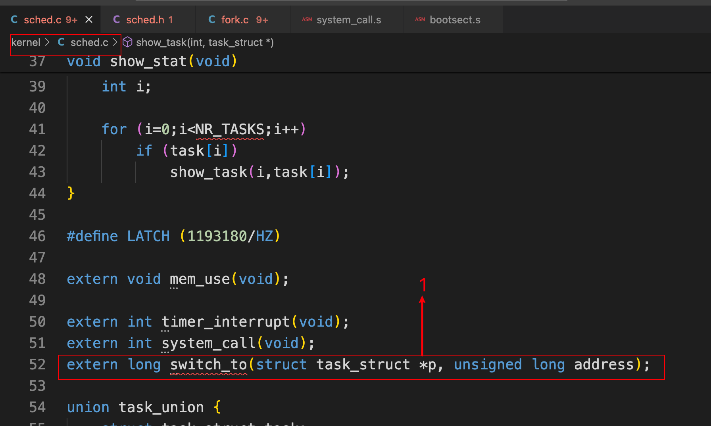 

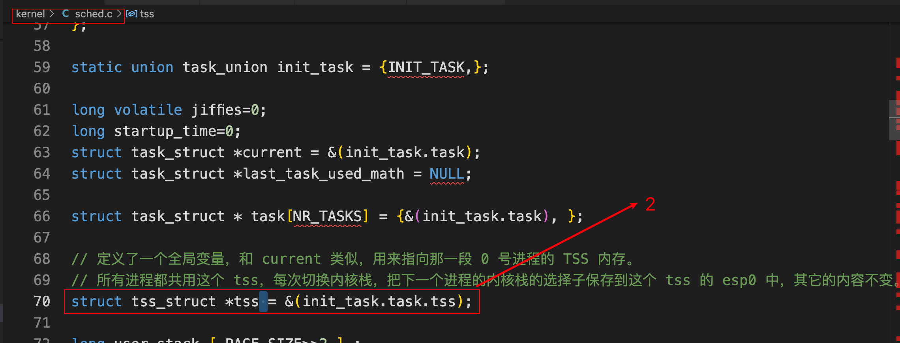 

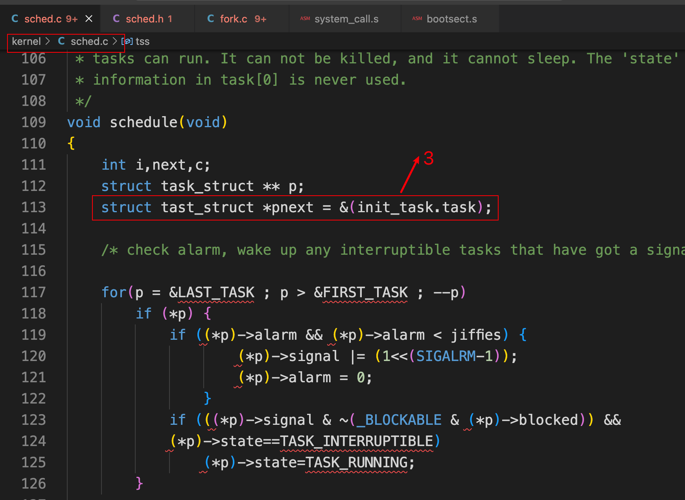 

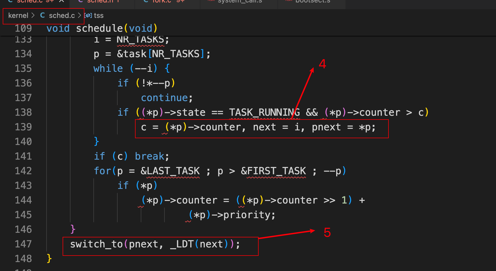 

#### 1.1.2 完整代码

```c
/*
 *  linux/kernel/sched.c
 *
 *  (C) 1991  Linus Torvalds
 */

/*
 * 'sched.c' is the main kernel file. It contains scheduling primitives
 * (sleep_on, wakeup, schedule etc) as well as a number of simple system
 * call functions (type getpid(), which just extracts a field from
 * current-task
 */
#include <linux/sched.h>
#include <linux/kernel.h>
#include <linux/sys.h>
#include <linux/fdreg.h>
#include <asm/system.h>
#include <asm/io.h>
#include <asm/segment.h>

#include <signal.h>

#define _S(nr) (1<<((nr)-1))
#define _BLOCKABLE (~(_S(SIGKILL) | _S(SIGSTOP)))

void show_task(int nr,struct task_struct * p)
{
	int i,j = 4096-sizeof(struct task_struct);

	printk("%d: pid=%d, state=%d, ",nr,p->pid,p->state);
	i=0;
	while (i<j && !((char *)(p+1))[i])
		i++;
	printk("%d (of %d) chars free in kernel stack\n\r",i,j);
}

void show_stat(void)
{
	int i;

	for (i=0;i<NR_TASKS;i++)
		if (task[i])
			show_task(i,task[i]);
}

#define LATCH (1193180/HZ)

extern void mem_use(void);

extern int timer_interrupt(void);
extern int system_call(void);
extern long switch_to(struct task_struct *p, unsigned long address);

union task_union {
	struct task_struct task;
	char stack[PAGE_SIZE];
};

static union task_union init_task = {INIT_TASK,};

long volatile jiffies=0;
long startup_time=0;
struct task_struct *current = &(init_task.task);
struct task_struct *last_task_used_math = NULL;

struct task_struct * task[NR_TASKS] = {&(init_task.task), };

// 定义了一个全局变量，和 current 类似，用来指向那一段 0 号进程的 TSS 内存。
// 所有进程都共用这个 tss，每次切换内核栈，把下一个进程的内核栈的选择子保存到这个 tss 的 esp0 中，其它的内容不变。
struct tss_struct *tss = &(init_task.task.tss);

long user_stack [ PAGE_SIZE>>2 ] ;

struct {
	long * a;
	short b;
	} stack_start = { & user_stack [PAGE_SIZE>>2] , 0x10 };
/*
 *  'math_state_restore()' saves the current math information in the
 * old math state array, and gets the new ones from the current task
 */
void math_state_restore()
{
	if (last_task_used_math == current)
		return;
	__asm__("fwait");
	if (last_task_used_math) {
		__asm__("fnsave %0"::"m" (last_task_used_math->tss.i387));
	}
	last_task_used_math=current;
	if (current->used_math) {
		__asm__("frstor %0"::"m" (current->tss.i387));
	} else {
		__asm__("fninit"::);
		current->used_math=1;
	}
}

/*
 *  'schedule()' is the scheduler function. This is GOOD CODE! There
 * probably won't be any reason to change this, as it should work well
 * in all circumstances (ie gives IO-bound processes good response etc).
 * The one thing you might take a look at is the signal-handler code here.
 *
 *   NOTE!!  Task 0 is the 'idle' task, which gets called when no other
 * tasks can run. It can not be killed, and it cannot sleep. The 'state'
 * information in task[0] is never used.
 */
void schedule(void)
{
	int i,next,c;
	struct task_struct ** p;
	struct tast_struct *pnext = &(init_task.task);

	/* check alarm, wake up any interruptible tasks that have got a signal */

	for(p = &LAST_TASK ; p > &FIRST_TASK ; --p)
		if (*p) {
			if ((*p)->alarm && (*p)->alarm < jiffies) {
					(*p)->signal |= (1<<(SIGALRM-1));
					(*p)->alarm = 0;
				}
			if (((*p)->signal & ~(_BLOCKABLE & (*p)->blocked)) &&
			(*p)->state==TASK_INTERRUPTIBLE)
				(*p)->state=TASK_RUNNING;
		}

/* this is the scheduler proper: */

	while (1) {
		c = -1;
		next = 0;
		i = NR_TASKS;
		p = &task[NR_TASKS];
		while (--i) {
			if (!*--p)
				continue;
			if ((*p)->state == TASK_RUNNING && (*p)->counter > c)
				c = (*p)->counter, next = i, pnext = *p;
		}
		if (c) break;
		for(p = &LAST_TASK ; p > &FIRST_TASK ; --p)
			if (*p)
				(*p)->counter = ((*p)->counter >> 1) +
						(*p)->priority;
	}
	switch_to(pnext, _LDT(next));
}

int sys_pause(void)
{
	current->state = TASK_INTERRUPTIBLE;
	schedule();
	return 0;
}

void sleep_on(struct task_struct **p)
{
	struct task_struct *tmp;

	if (!p)
		return;
	if (current == &(init_task.task))
		panic("task[0] trying to sleep");
	tmp = *p;
	*p = current;
	current->state = TASK_UNINTERRUPTIBLE;
	schedule();
	if (tmp)
		tmp->state=0;
}

void interruptible_sleep_on(struct task_struct **p)
{
	struct task_struct *tmp;

	if (!p)
		return;
	if (current == &(init_task.task))
		panic("task[0] trying to sleep");
	tmp=*p;
	*p=current;
repeat:	current->state = TASK_INTERRUPTIBLE;
	schedule();
	if (*p && *p != current) {
		(**p).state=0;
		goto repeat;
	}
	*p=NULL;
	if (tmp)
		tmp->state=0;
}

void wake_up(struct task_struct **p)
{
	if (p && *p) {
		(**p).state=0;
		*p=NULL;
	}
}

/*
 * OK, here are some floppy things that shouldn't be in the kernel
 * proper. They are here because the floppy needs a timer, and this
 * was the easiest way of doing it.
 */
static struct task_struct * wait_motor[4] = {NULL,NULL,NULL,NULL};
static int  mon_timer[4]={0,0,0,0};
static int moff_timer[4]={0,0,0,0};
unsigned char current_DOR = 0x0C;

int ticks_to_floppy_on(unsigned int nr)
{
	extern unsigned char selected;
	unsigned char mask = 0x10 << nr;

	if (nr>3)
		panic("floppy_on: nr>3");
	moff_timer[nr]=10000;		/* 100 s = very big :-) */
	cli();				/* use floppy_off to turn it off */
	mask |= current_DOR;
	if (!selected) {
		mask &= 0xFC;
		mask |= nr;
	}
	if (mask != current_DOR) {
		outb(mask,FD_DOR);
		if ((mask ^ current_DOR) & 0xf0)
			mon_timer[nr] = HZ/2;
		else if (mon_timer[nr] < 2)
			mon_timer[nr] = 2;
		current_DOR = mask;
	}
	sti();
	return mon_timer[nr];
}

void floppy_on(unsigned int nr)
{
	cli();
	while (ticks_to_floppy_on(nr))
		sleep_on(nr+wait_motor);
	sti();
}

void floppy_off(unsigned int nr)
{
	moff_timer[nr]=3*HZ;
}

void do_floppy_timer(void)
{
	int i;
	unsigned char mask = 0x10;

	for (i=0 ; i<4 ; i++,mask <<= 1) {
		if (!(mask & current_DOR))
			continue;
		if (mon_timer[i]) {
			if (!--mon_timer[i])
				wake_up(i+wait_motor);
		} else if (!moff_timer[i]) {
			current_DOR &= ~mask;
			outb(current_DOR,FD_DOR);
		} else
			moff_timer[i]--;
	}
}

#define TIME_REQUESTS 64

static struct timer_list {
	long jiffies;
	void (*fn)();
	struct timer_list * next;
} timer_list[TIME_REQUESTS], * next_timer = NULL;

void add_timer(long jiffies, void (*fn)(void))
{
	struct timer_list * p;

	if (!fn)
		return;
	cli();
	if (jiffies <= 0)
		(fn)();
	else {
		for (p = timer_list ; p < timer_list + TIME_REQUESTS ; p++)
			if (!p->fn)
				break;
		if (p >= timer_list + TIME_REQUESTS)
			panic("No more time requests free");
		p->fn = fn;
		p->jiffies = jiffies;
		p->next = next_timer;
		next_timer = p;
		while (p->next && p->next->jiffies < p->jiffies) {
			p->jiffies -= p->next->jiffies;
			fn = p->fn;
			p->fn = p->next->fn;
			p->next->fn = fn;
			jiffies = p->jiffies;
			p->jiffies = p->next->jiffies;
			p->next->jiffies = jiffies;
			p = p->next;
		}
	}
	sti();
}

void do_timer(long cpl)
{
	extern int beepcount;
	extern void sysbeepstop(void);

	if (beepcount)
		if (!--beepcount)
			sysbeepstop();

	if (cpl)
		current->utime++;
	else
		current->stime++;

	if (next_timer) {
		next_timer->jiffies--;
		while (next_timer && next_timer->jiffies <= 0) {
			void (*fn)(void);
			
			fn = next_timer->fn;
			next_timer->fn = NULL;
			next_timer = next_timer->next;
			(fn)();
		}
	}
	if (current_DOR & 0xf0)
		do_floppy_timer();
	if ((--current->counter)>0) return;
	current->counter=0;
	if (!cpl) return;
	schedule();
}

int sys_alarm(long seconds)
{
	int old = current->alarm;

	if (old)
		old = (old - jiffies) / HZ;
	current->alarm = (seconds>0)?(jiffies+HZ*seconds):0;
	return (old);
}

int sys_getpid(void)
{
	return current->pid;
}

int sys_getppid(void)
{
	return current->father;
}

int sys_getuid(void)
{
	return current->uid;
}

int sys_geteuid(void)
{
	return current->euid;
}

int sys_getgid(void)
{
	return current->gid;
}

int sys_getegid(void)
{
	return current->egid;
}

int sys_nice(long increment)
{
	if (current->priority-increment>0)
		current->priority -= increment;
	return 0;
}

void sched_init(void)
{
	int i;
	struct desc_struct * p;

	if (sizeof(struct sigaction) != 16)
		panic("Struct sigaction MUST be 16 bytes");
	set_tss_desc(gdt+FIRST_TSS_ENTRY,&(init_task.task.tss));
	set_ldt_desc(gdt+FIRST_LDT_ENTRY,&(init_task.task.ldt));
	p = gdt+2+FIRST_TSS_ENTRY;
	for(i=1;i<NR_TASKS;i++) {
		task[i] = NULL;
		p->a=p->b=0;
		p++;
		p->a=p->b=0;
		p++;
	}
/* Clear NT, so that we won't have troubles with that later on */
	__asm__("pushfl ; andl $0xffffbfff,(%esp) ; popfl");
	ltr(0);
	lldt(0);
	outb_p(0x36,0x43);		/* binary, mode 3, LSB/MSB, ch 0 */
	outb_p(LATCH & 0xff , 0x40);	/* LSB */
	outb(LATCH >> 8 , 0x40);	/* MSB */
	set_intr_gate(0x20,&timer_interrupt);
	outb(inb_p(0x21)&~0x01,0x21);
	set_system_gate(0x80,&system_call);
}

```

### 1.2 步骤二：修改include/linux/sched.h

#### 1.2.1 修改的地方

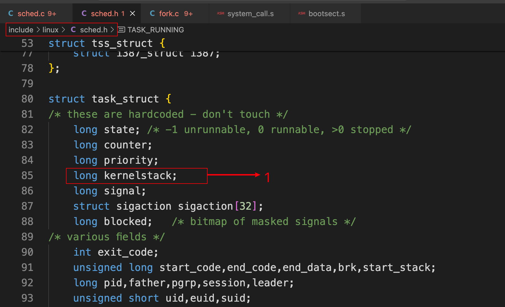 

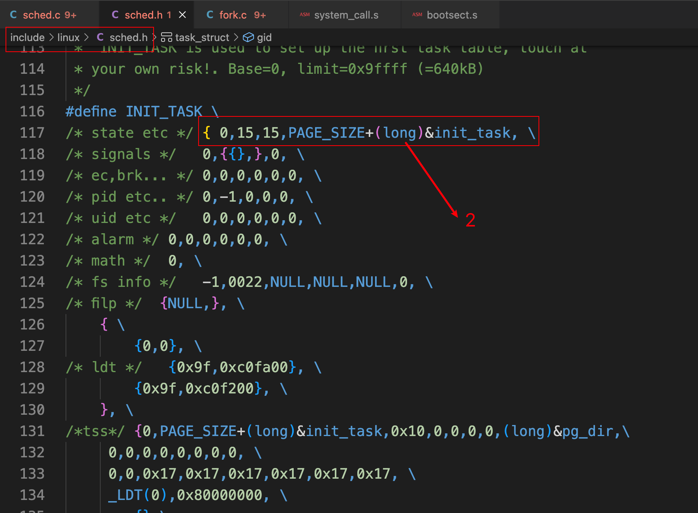 

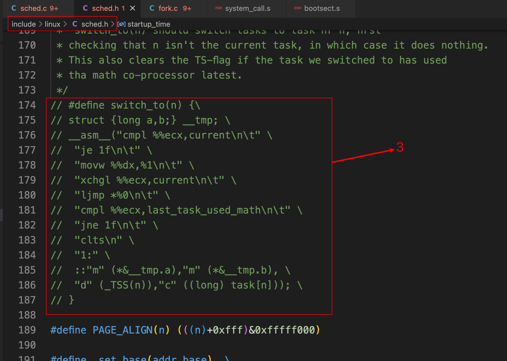 

#### 1.2.2 完整代码

```c
#ifndef _SCHED_H
#define _SCHED_H

#define NR_TASKS 64
#define HZ 100

#define FIRST_TASK task[0]
#define LAST_TASK task[NR_TASKS-1]

#include <linux/head.h>
#include <linux/fs.h>
#include <linux/mm.h>
#include <signal.h>

#if (NR_OPEN > 32)
#error "Currently the close-on-exec-flags are in one word, max 32 files/proc"
#endif

#define TASK_RUNNING		0
#define TASK_INTERRUPTIBLE	1
#define TASK_UNINTERRUPTIBLE	2
#define TASK_ZOMBIE		3
#define TASK_STOPPED		4

#ifndef NULL
#define NULL ((void *) 0)
#endif

extern int copy_page_tables(unsigned long from, unsigned long to, long size);
extern int free_page_tables(unsigned long from, unsigned long size);

extern void sched_init(void);
extern void schedule(void);
extern void trap_init(void);
#ifndef PANIC
volatile void panic(const char * str);
#endif
extern int tty_write(unsigned minor,char * buf,int count);

typedef int (*fn_ptr)();

struct i387_struct {
	long	cwd;
	long	swd;
	long	twd;
	long	fip;
	long	fcs;
	long	foo;
	long	fos;
	long	st_space[20];	/* 8*10 bytes for each FP-reg = 80 bytes */
};

struct tss_struct {
	long	back_link;	/* 16 high bits zero */
	long	esp0;
	long	ss0;		/* 16 high bits zero */
	long	esp1;
	long	ss1;		/* 16 high bits zero */
	long	esp2;
	long	ss2;		/* 16 high bits zero */
	long	cr3;
	long	eip;
	long	eflags;
	long	eax,ecx,edx,ebx;
	long	esp;
	long	ebp;
	long	esi;
	long	edi;
	long	es;		/* 16 high bits zero */
	long	cs;		/* 16 high bits zero */
	long	ss;		/* 16 high bits zero */
	long	ds;		/* 16 high bits zero */
	long	fs;		/* 16 high bits zero */
	long	gs;		/* 16 high bits zero */
	long	ldt;		/* 16 high bits zero */
	long	trace_bitmap;	/* bits: trace 0, bitmap 16-31 */
	struct i387_struct i387;
};

struct task_struct {
/* these are hardcoded - don't touch */
	long state;	/* -1 unrunnable, 0 runnable, >0 stopped */
	long counter;
	long priority;
	long kernelstack;
	long signal;
	struct sigaction sigaction[32];
	long blocked;	/* bitmap of masked signals */
/* various fields */
	int exit_code;
	unsigned long start_code,end_code,end_data,brk,start_stack;
	long pid,father,pgrp,session,leader;
	unsigned short uid,euid,suid;
	unsigned short gid,egid,sgid;
	long alarm;
	long utime,stime,cutime,cstime,start_time;
	unsigned short used_math;
/* file system info */
	int tty;		/* -1 if no tty, so it must be signed */
	unsigned short umask;
	struct m_inode * pwd;
	struct m_inode * root;
	struct m_inode * executable;
	unsigned long close_on_exec;
	struct file * filp[NR_OPEN];
/* ldt for this task 0 - zero 1 - cs 2 - ds&ss */
	struct desc_struct ldt[3];
/* tss for this task */
	struct tss_struct tss;
};

/*
 *  INIT_TASK is used to set up the first task table, touch at
 * your own risk!. Base=0, limit=0x9ffff (=640kB)
 */
#define INIT_TASK \
/* state etc */	{ 0,15,15,PAGE_SIZE+(long)&init_task, \
/* signals */	0,{{},},0, \
/* ec,brk... */	0,0,0,0,0,0, \
/* pid etc.. */	0,-1,0,0,0, \
/* uid etc */	0,0,0,0,0,0, \
/* alarm */	0,0,0,0,0,0, \
/* math */	0, \
/* fs info */	-1,0022,NULL,NULL,NULL,0, \
/* filp */	{NULL,}, \
	{ \
		{0,0}, \
/* ldt */	{0x9f,0xc0fa00}, \
		{0x9f,0xc0f200}, \
	}, \
/*tss*/	{0,PAGE_SIZE+(long)&init_task,0x10,0,0,0,0,(long)&pg_dir,\
	 0,0,0,0,0,0,0,0, \
	 0,0,0x17,0x17,0x17,0x17,0x17,0x17, \
	 _LDT(0),0x80000000, \
		{} \
	}, \
}

extern struct task_struct *task[NR_TASKS];
extern struct task_struct *last_task_used_math;
extern struct task_struct *current;
extern long volatile jiffies;
extern long startup_time;

#define CURRENT_TIME (startup_time+jiffies/HZ)

extern void add_timer(long jiffies, void (*fn)(void));
extern void sleep_on(struct task_struct ** p);
extern void interruptible_sleep_on(struct task_struct ** p);
extern void wake_up(struct task_struct ** p);

/*
 * Entry into gdt where to find first TSS. 0-nul, 1-cs, 2-ds, 3-syscall
 * 4-TSS0, 5-LDT0, 6-TSS1 etc ...
 */
#define FIRST_TSS_ENTRY 4
#define FIRST_LDT_ENTRY (FIRST_TSS_ENTRY+1)
#define _TSS(n) ((((unsigned long) n)<<4)+(FIRST_TSS_ENTRY<<3))
#define _LDT(n) ((((unsigned long) n)<<4)+(FIRST_LDT_ENTRY<<3))
#define ltr(n) __asm__("ltr %%ax"::"a" (_TSS(n)))
#define lldt(n) __asm__("lldt %%ax"::"a" (_LDT(n)))
#define str(n) \
__asm__("str %%ax\n\t" \
	"subl %2,%%eax\n\t" \
	"shrl $4,%%eax" \
	:"=a" (n) \
	:"a" (0),"i" (FIRST_TSS_ENTRY<<3))
/*
 *	switch_to(n) should switch tasks to task nr n, first
 * checking that n isn't the current task, in which case it does nothing.
 * This also clears the TS-flag if the task we switched to has used
 * tha math co-processor latest.
 */
// #define switch_to(n) {\
// struct {long a,b;} __tmp; \
// __asm__("cmpl %%ecx,current\n\t" \
// 	"je 1f\n\t" \
// 	"movw %%dx,%1\n\t" \
// 	"xchgl %%ecx,current\n\t" \
// 	"ljmp *%0\n\t" \
// 	"cmpl %%ecx,last_task_used_math\n\t" \
// 	"jne 1f\n\t" \
// 	"clts\n" \
// 	"1:" \
// 	::"m" (*&__tmp.a),"m" (*&__tmp.b), \
// 	"d" (_TSS(n)),"c" ((long) task[n])); \
// }

#define PAGE_ALIGN(n) (((n)+0xfff)&0xfffff000)

#define _set_base(addr,base)  \
__asm__ ("push %%edx\n\t" \
	"movw %%dx,%0\n\t" \
	"rorl $16,%%edx\n\t" \
	"movb %%dl,%1\n\t" \
	"movb %%dh,%2\n\t" \
	"pop %%edx" \
	::"m" (*((addr)+2)), \
	 "m" (*((addr)+4)), \
	 "m" (*((addr)+7)), \
	 "d" (base) \
	)

#define _set_limit(addr,limit) \
__asm__ ("push %%edx\n\t" \
	"movw %%dx,%0\n\t" \
	"rorl $16,%%edx\n\t" \
	"movb %1,%%dh\n\t" \
	"andb $0xf0,%%dh\n\t" \
	"orb %%dh,%%dl\n\t" \
	"movb %%dl,%1\n\t" \
	"pop %%edx" \
	::"m" (*(addr)), \
	 "m" (*((addr)+6)), \
	 "d" (limit) \
	)

#define set_base(ldt,base) _set_base( ((char *)&(ldt)) , (base) )
#define set_limit(ldt,limit) _set_limit( ((char *)&(ldt)) , (limit-1)>>12 )

/**
#define _get_base(addr) ({\
unsigned long __base; \
__asm__("movb %3,%%dh\n\t" \
	"movb %2,%%dl\n\t" \
	"shll $16,%%edx\n\t" \
	"movw %1,%%dx" \
	:"=d" (__base) \
	:"m" (*((addr)+2)), \
	 "m" (*((addr)+4)), \
	 "m" (*((addr)+7)) \
        :"memory"); \
__base;})
**/

static inline unsigned long _get_base(char * addr)
{
         unsigned long __base;
         __asm__("movb %3,%%dh\n\t"
                 "movb %2,%%dl\n\t"
                 "shll $16,%%edx\n\t"
                 "movw %1,%%dx"
                 :"=&d" (__base)
                 :"m" (*((addr)+2)),
                  "m" (*((addr)+4)),
                  "m" (*((addr)+7)));
         return __base;
}

#define get_base(ldt) _get_base( ((char *)&(ldt)) )

#define get_limit(segment) ({ \
unsigned long __limit; \
__asm__("lsll %1,%0\n\tincl %0":"=r" (__limit):"r" (segment)); \
__limit;})

#endif

```

### 1.3 步骤三：修改kernel/system_call.s

#### 1.3.1 修改的地方

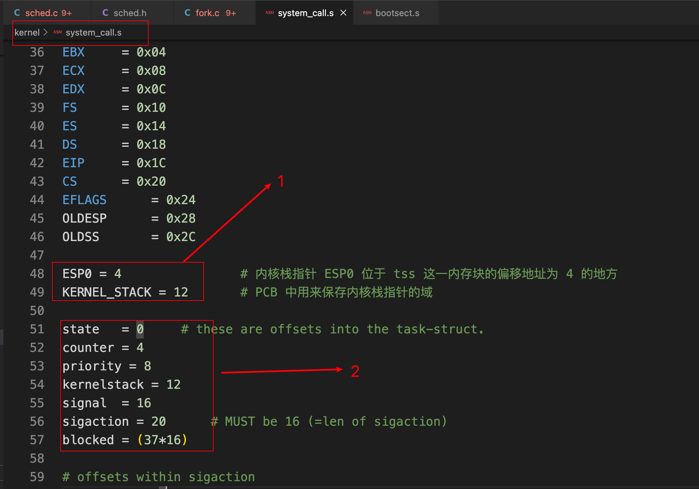 

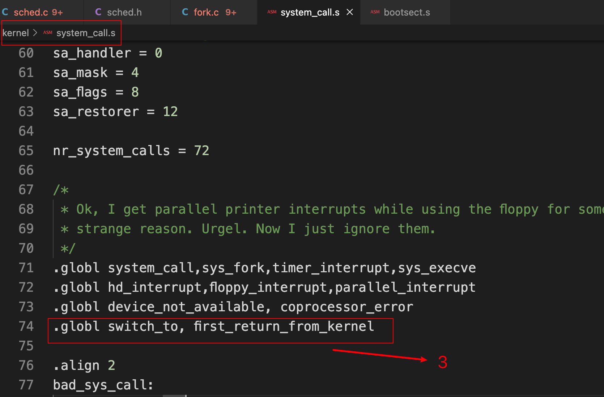 

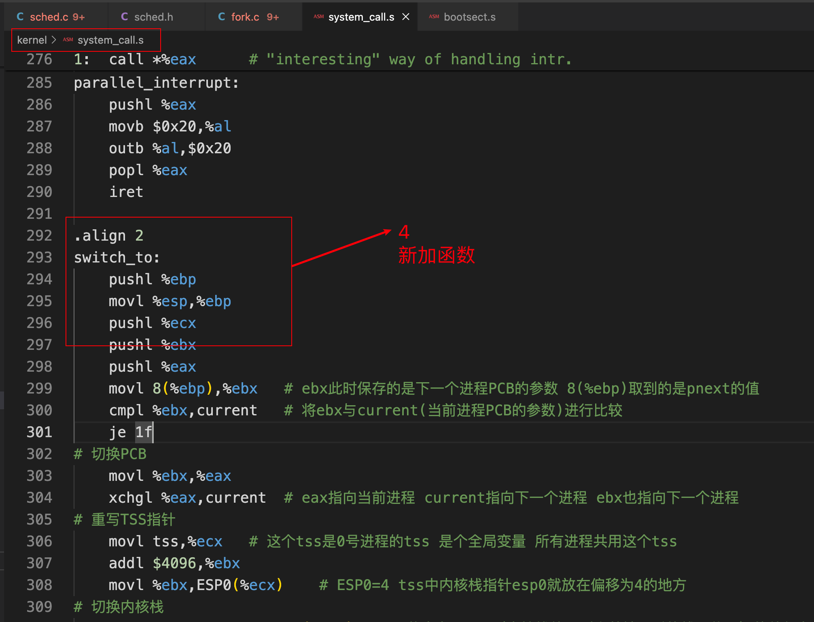 

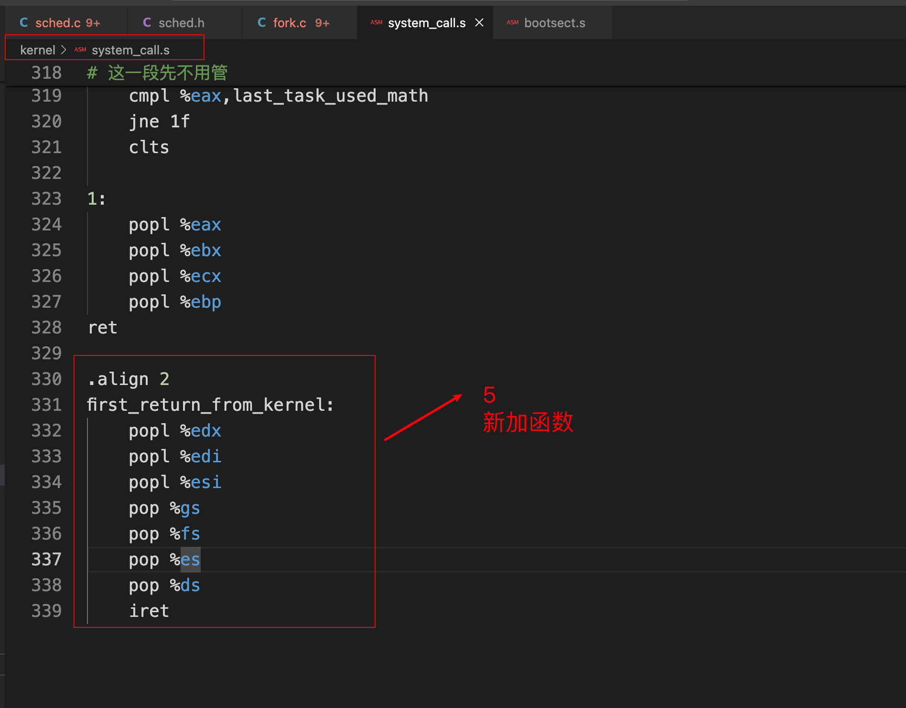 

#### 1.3.2 完整代码

```assembly
/*
 *  linux/kernel/system_call.s
 *
 *  (C) 1991  Linus Torvalds
 */

/*
 *  system_call.s  contains the system-call low-level handling routines.
 * This also contains the timer-interrupt handler, as some of the code is
 * the same. The hd- and flopppy-interrupts are also here.
 *
 * NOTE: This code handles signal-recognition, which happens every time
 * after a timer-interrupt and after each system call. Ordinary interrupts
 * don't handle signal-recognition, as that would clutter them up totally
 * unnecessarily.
 *
 * Stack layout in 'ret_from_system_call':
 *
 *	 0(%esp) - %eax
 *	 4(%esp) - %ebx
 *	 8(%esp) - %ecx
 *	 C(%esp) - %edx
 *	10(%esp) - %fs
 *	14(%esp) - %es
 *	18(%esp) - %ds
 *	1C(%esp) - %eip
 *	20(%esp) - %cs
 *	24(%esp) - %eflags
 *	28(%esp) - %oldesp
 *	2C(%esp) - %oldss
 */

SIG_CHLD	= 17

EAX		= 0x00
EBX		= 0x04
ECX		= 0x08
EDX		= 0x0C
FS		= 0x10
ES		= 0x14
DS		= 0x18
EIP		= 0x1C
CS		= 0x20
EFLAGS		= 0x24
OLDESP		= 0x28
OLDSS		= 0x2C

ESP0 = 4                # 内核栈指针 ESP0 位于 tss 这一内存块的偏移地址为 4 的地方
KERNEL_STACK = 12       # PCB 中用来保存内核栈指针的域

state	= 0		# these are offsets into the task-struct.
counter	= 4
priority = 8
kernelstack = 12
signal	= 16
sigaction = 20		# MUST be 16 (=len of sigaction)
blocked = (37*16)

# offsets within sigaction
sa_handler = 0
sa_mask = 4
sa_flags = 8
sa_restorer = 12

nr_system_calls = 72

/*
 * Ok, I get parallel printer interrupts while using the floppy for some
 * strange reason. Urgel. Now I just ignore them.
 */
.globl system_call,sys_fork,timer_interrupt,sys_execve
.globl hd_interrupt,floppy_interrupt,parallel_interrupt
.globl device_not_available, coprocessor_error
.globl switch_to, first_return_from_kernel

.align 2
bad_sys_call:
	movl $-1,%eax
	iret
.align 2
reschedule:
	pushl $ret_from_sys_call
	jmp schedule
.align 2
system_call:
	cmpl $nr_system_calls-1,%eax
	ja bad_sys_call
	push %ds
	push %es
	push %fs
	pushl %edx
	pushl %ecx		# push %ebx,%ecx,%edx as parameters
	pushl %ebx		# to the system call
	movl $0x10,%edx		# set up ds,es to kernel space
	mov %dx,%ds
	mov %dx,%es
	movl $0x17,%edx		# fs points to local data space
	mov %dx,%fs
	call sys_call_table(,%eax,4)
	pushl %eax
	movl current,%eax
	cmpl $0,state(%eax)		# state
	jne reschedule
	cmpl $0,counter(%eax)		# counter
	je reschedule
ret_from_sys_call:
	movl current,%eax		# task[0] cannot have signals
	cmpl task,%eax
	je 3f
	cmpw $0x0f,CS(%esp)		# was old code segment supervisor ?
	jne 3f
	cmpw $0x17,OLDSS(%esp)		# was stack segment = 0x17 ?
	jne 3f
	movl signal(%eax),%ebx
	movl blocked(%eax),%ecx
	notl %ecx
	andl %ebx,%ecx
	bsfl %ecx,%ecx
	je 3f
	btrl %ecx,%ebx
	movl %ebx,signal(%eax)
	incl %ecx
	pushl %ecx
	call do_signal
	popl %eax
3:	popl %eax
	popl %ebx
	popl %ecx
	popl %edx
	pop %fs
	pop %es
	pop %ds
	iret

.align 2
coprocessor_error:
	push %ds
	push %es
	push %fs
	pushl %edx
	pushl %ecx
	pushl %ebx
	pushl %eax
	movl $0x10,%eax
	mov %ax,%ds
	mov %ax,%es
	movl $0x17,%eax
	mov %ax,%fs
	pushl $ret_from_sys_call
	jmp math_error

.align 2
device_not_available:
	push %ds
	push %es
	push %fs
	pushl %edx
	pushl %ecx
	pushl %ebx
	pushl %eax
	movl $0x10,%eax
	mov %ax,%ds
	mov %ax,%es
	movl $0x17,%eax
	mov %ax,%fs
	pushl $ret_from_sys_call
	clts				# clear TS so that we can use math
	movl %cr0,%eax
	testl $0x4,%eax			# EM (math emulation bit)
	je math_state_restore
	pushl %ebp
	pushl %esi
	pushl %edi
	call math_emulate
	popl %edi
	popl %esi
	popl %ebp
	ret

.align 2
timer_interrupt:
	push %ds		# save ds,es and put kernel data space
	push %es		# into them. %fs is used by _system_call
	push %fs
	pushl %edx		# we save %eax,%ecx,%edx as gcc doesn't
	pushl %ecx		# save those across function calls. %ebx
	pushl %ebx		# is saved as we use that in ret_sys_call
	pushl %eax
	movl $0x10,%eax
	mov %ax,%ds
	mov %ax,%es
	movl $0x17,%eax
	mov %ax,%fs
	incl jiffies
	movb $0x20,%al		# EOI to interrupt controller #1
	outb %al,$0x20
	movl CS(%esp),%eax
	andl $3,%eax		# %eax is CPL (0 or 3, 0=supervisor)
	pushl %eax
	call do_timer		# 'do_timer(long CPL)' does everything from
	addl $4,%esp		# task switching to accounting ...
	jmp ret_from_sys_call

.align 2
sys_execve:
	lea EIP(%esp),%eax
	pushl %eax
	call do_execve
	addl $4,%esp
	ret

.align 2
sys_fork:
	call find_empty_process
	testl %eax,%eax
	js 1f
	push %gs
	pushl %esi
	pushl %edi
	pushl %ebp
	pushl %eax
	call copy_process
	addl $20,%esp
1:	ret

hd_interrupt:
	pushl %eax
	pushl %ecx
	pushl %edx
	push %ds
	push %es
	push %fs
	movl $0x10,%eax
	mov %ax,%ds
	mov %ax,%es
	movl $0x17,%eax
	mov %ax,%fs
	movb $0x20,%al
	outb %al,$0xA0		# EOI to interrupt controller #1
	jmp 1f			# give port chance to breathe
1:	jmp 1f
1:	xorl %edx,%edx
	xchgl do_hd,%edx
	testl %edx,%edx
	jne 1f
	movl $unexpected_hd_interrupt,%edx
1:	outb %al,$0x20
	call *%edx		# "interesting" way of handling intr.
	pop %fs
	pop %es
	pop %ds
	popl %edx
	popl %ecx
	popl %eax
	iret

floppy_interrupt:
	pushl %eax
	pushl %ecx
	pushl %edx
	push %ds
	push %es
	push %fs
	movl $0x10,%eax
	mov %ax,%ds
	mov %ax,%es
	movl $0x17,%eax
	mov %ax,%fs
	movb $0x20,%al
	outb %al,$0x20		# EOI to interrupt controller #1
	xorl %eax,%eax
	xchgl do_floppy,%eax
	testl %eax,%eax
	jne 1f
	movl $unexpected_floppy_interrupt,%eax
1:	call *%eax		# "interesting" way of handling intr.
	pop %fs
	pop %es
	pop %ds
	popl %edx
	popl %ecx
	popl %eax
	iret

parallel_interrupt:
	pushl %eax
	movb $0x20,%al
	outb %al,$0x20
	popl %eax
	iret

.align 2
switch_to:
    pushl %ebp
    movl %esp,%ebp
    pushl %ecx
    pushl %ebx
    pushl %eax
    movl 8(%ebp),%ebx	# ebx此时保存的是下一个进程PCB的参数 8(%ebp)取到的是pnext的值
    cmpl %ebx,current	# 将ebx与current(当前进程PCB的参数)进行比较
    je 1f
# 切换PCB
    movl %ebx,%eax	
	xchgl %eax,current	# eax指向当前进程 current指向下一个进程 ebx也指向下一个进程
# 重写TSS指针
    movl tss,%ecx	# 这个tss是0号进程的tss 是个全局变量 所有进程共用这个tss
    addl $4096,%ebx
    movl %ebx,ESP0(%ecx)	# ESP0=4 tss中内核栈指针esp0就放在偏移为4的地方
# 切换内核栈
    movl %esp,KERNEL_STACK(%eax)	# 将寄存器esp（内核栈使用到当前情况时的栈顶位置）的值保存到当前PCB中
    movl 8(%ebp),%ebx	# 再取一下ebx，因为前面修改过ebx的值
    movl KERNEL_STACK(%ebx),%esp	# 从下一个PCB中的对应位置上取出保存的内核栈栈顶放入esp寄存器
# 切换LDT
	movl 12(%ebp), %ecx
    lldt %cx
    movl $0x17,%ecx	# 切换LDT之后需要重新设置寄存器fs的值
	mov %cx,%fs
# 这一段先不用管
    cmpl %eax,last_task_used_math 
    jne 1f
    clts

1: 
	popl %eax
    popl %ebx
    popl %ecx
    popl %ebp
ret

.align 2
first_return_from_kernel:
    popl %edx
    popl %edi
    popl %esi
    pop %gs
    pop %fs
    pop %es
    pop %ds
    iret
```

### 1.4 步骤四：修改kernel/fork.c

#### 1.4.1 修改的地方

```c
/*
 *  Ok, this is the main fork-routine. It copies the system process
 * information (task[nr]) and sets up the necessary registers. It
 * also copies the data segment in it's entirety.
 */
int copy_process(int nr,long ebp,long edi,long esi,long gs,long none,
		long ebx,long ecx,long edx,
		long fs,long es,long ds,
		long eip,long cs,long eflags,long esp,long ss)
{
	struct task_struct *p;
	int i;
	struct file *f;

	p = (struct task_struct *) get_free_page();
	if (!p)
		return -EAGAIN;
	task[nr] = p;
	*p = *current;	/* NOTE! this doesn't copy the supervisor stack */
	p->state = TASK_UNINTERRUPTIBLE;
	p->pid = last_pid;
	p->father = current->pid;
	p->counter = p->priority;
	p->signal = 0;
	p->alarm = 0;
	p->leader = 0;		/* process leadership doesn't inherit */
	p->utime = p->stime = 0;
	p->cutime = p->cstime = 0;
	p->start_time = jiffies;
	if (last_task_used_math == current)
		__asm__("clts ; fnsave %0" ::"m"(p->tss.i387));
	if (copy_mem(nr, p))
	{
		task[nr] = NULL;
		free_page((long)p);
		return -EAGAIN;
	}

	//初始化内核栈
	long *krnstack;
	krnstack = (long)(PAGE_SIZE + (long)p); // krnstack保存的是子进程的内核栈位置

	//iret指令的出栈数据
	*(--krnstack) = ss & 0xffff;
	*(--krnstack) = esp;
	*(--krnstack) = eflags;
	*(--krnstack) = cs & 0xffff;
	*(--krnstack) = eip;

	// “内核级线程切换五段论”中的最后一段切换，即完成用户栈和用户代码的切换
	// 依靠的核心指令就是 iret，回到用户态程序，当然在切换之前应该恢复一下执行现场，
	// 主要就是 eax,ebx,ecx,edx,esi,edi,gs,fs,es,ds 等寄存器的恢复.
	*(--krnstack) = ds & 0xffff;
	*(--krnstack) = es & 0xffff;
	*(--krnstack) = fs & 0xffff;
	*(--krnstack) = gs & 0xffff;
	*(--krnstack) = esi;
	*(--krnstack) = edi;
	*(--krnstack) = edx;

	// 处理 switch_to 返回，即结束后 ret 指令要用到的，ret 指令默认弹出一个 EIP 操作
	*(--krnstack) = (long)first_return_from_kernel;

	// swtich_to 函数中的 “切换内核栈” 后的弹栈操作
	*(--krnstack) = ebp;
	*(--krnstack) = ecx;
	*(--krnstack) = ebx;
	*(--krnstack) = 0;

	p->kernelstack = krnstack; // 将存放在 PCB 中的内核栈指针修改到初始化完成时内核栈的栈顶

	for (i=0; i<NR_OPEN;i++)
		if ((f=p->filp[i]))
			f->f_count++;
	if (current->pwd)
		current->pwd->i_count++;
	if (current->root)
		current->root->i_count++;
	if (current->executable)
		current->executable->i_count++;
	set_tss_desc(gdt+(nr<<1)+FIRST_TSS_ENTRY,&(p->tss));
	set_ldt_desc(gdt+(nr<<1)+FIRST_LDT_ENTRY,&(p->ldt));
	p->state = TASK_RUNNING;	/* do this last, just in case */
	return last_pid;
}
```

#### 1.4.2 完整代码

```c
/*
 *  linux/kernel/fork.c
 *
 *  (C) 1991  Linus Torvalds
 */

/*
 *  'fork.c' contains the help-routines for the 'fork' system call
 * (see also system_call.s), and some misc functions ('verify_area').
 * Fork is rather simple, once you get the hang of it, but the memory
 * management can be a bitch. See 'mm/mm.c': 'copy_page_tables()'
 */
#include <errno.h>

#include <linux/sched.h>
#include <linux/kernel.h>
#include <asm/segment.h>
#include <asm/system.h>

extern void write_verify(unsigned long address);
extern long first_return_from_kernel(void);

long last_pid=0;

void verify_area(void * addr,int size)
{
	unsigned long start;

	start = (unsigned long) addr;
	size += start & 0xfff;
	start &= 0xfffff000;
	start += get_base(current->ldt[2]);
	while (size>0) {
		size -= 4096;
		write_verify(start);
		start += 4096;
	}
}

int copy_mem(int nr,struct task_struct * p)
{
	unsigned long old_data_base,new_data_base,data_limit;
	unsigned long old_code_base,new_code_base,code_limit;

	code_limit=get_limit(0x0f);
	data_limit=get_limit(0x17);
	old_code_base = get_base(current->ldt[1]);
	old_data_base = get_base(current->ldt[2]);
	if (old_data_base != old_code_base)
		panic("We don't support separate I&D");
	if (data_limit < code_limit)
		panic("Bad data_limit");
	new_data_base = new_code_base = nr * 0x4000000;
	p->start_code = new_code_base;
	set_base(p->ldt[1],new_code_base);
	set_base(p->ldt[2],new_data_base);
	if (copy_page_tables(old_data_base,new_data_base,data_limit)) {
		printk("free_page_tables: from copy_mem\n");
		free_page_tables(new_data_base,data_limit);
		return -ENOMEM;
	}
	return 0;
}

/*
 *  Ok, this is the main fork-routine. It copies the system process
 * information (task[nr]) and sets up the necessary registers. It
 * also copies the data segment in it's entirety.
 */
int copy_process(int nr,long ebp,long edi,long esi,long gs,long none,
		long ebx,long ecx,long edx,
		long fs,long es,long ds,
		long eip,long cs,long eflags,long esp,long ss)
{
	struct task_struct *p;
	int i;
	struct file *f;

	p = (struct task_struct *) get_free_page();
	if (!p)
		return -EAGAIN;
	task[nr] = p;
	*p = *current;	/* NOTE! this doesn't copy the supervisor stack */
	p->state = TASK_UNINTERRUPTIBLE;
	p->pid = last_pid;
	p->father = current->pid;
	p->counter = p->priority;
	p->signal = 0;
	p->alarm = 0;
	p->leader = 0;		/* process leadership doesn't inherit */
	p->utime = p->stime = 0;
	p->cutime = p->cstime = 0;
	p->start_time = jiffies;
	if (last_task_used_math == current)
		__asm__("clts ; fnsave %0" ::"m"(p->tss.i387));
	if (copy_mem(nr, p))
	{
		task[nr] = NULL;
		free_page((long)p);
		return -EAGAIN;
	}

	//初始化内核栈
	long *krnstack;
	krnstack = (long)(PAGE_SIZE + (long)p); // krnstack保存的是子进程的内核栈位置

	//iret指令的出栈数据
	*(--krnstack) = ss & 0xffff;
	*(--krnstack) = esp;
	*(--krnstack) = eflags;
	*(--krnstack) = cs & 0xffff;
	*(--krnstack) = eip;

	// “内核级线程切换五段论”中的最后一段切换，即完成用户栈和用户代码的切换
	// 依靠的核心指令就是 iret，回到用户态程序，当然在切换之前应该恢复一下执行现场，
	// 主要就是 eax,ebx,ecx,edx,esi,edi,gs,fs,es,ds 等寄存器的恢复.
	*(--krnstack) = ds & 0xffff;
	*(--krnstack) = es & 0xffff;
	*(--krnstack) = fs & 0xffff;
	*(--krnstack) = gs & 0xffff;
	*(--krnstack) = esi;
	*(--krnstack) = edi;
	*(--krnstack) = edx;

	// 处理 switch_to 返回，即结束后 ret 指令要用到的，ret 指令默认弹出一个 EIP 操作
	*(--krnstack) = (long)first_return_from_kernel;

	// swtich_to 函数中的 “切换内核栈” 后的弹栈操作
	*(--krnstack) = ebp;
	*(--krnstack) = ecx;
	*(--krnstack) = ebx;
	*(--krnstack) = 0;

	p->kernelstack = krnstack; // 将存放在 PCB 中的内核栈指针修改到初始化完成时内核栈的栈顶

	for (i=0; i<NR_OPEN;i++)
		if ((f=p->filp[i]))
			f->f_count++;
	if (current->pwd)
		current->pwd->i_count++;
	if (current->root)
		current->root->i_count++;
	if (current->executable)
		current->executable->i_count++;
	set_tss_desc(gdt+(nr<<1)+FIRST_TSS_ENTRY,&(p->tss));
	set_ldt_desc(gdt+(nr<<1)+FIRST_LDT_ENTRY,&(p->ldt));
	p->state = TASK_RUNNING;	/* do this last, just in case */
	return last_pid;
}

int find_empty_process(void)
{
	int i;

	repeat:
		if ((++last_pid)<0) last_pid=1;
		for(i=0 ; i<NR_TASKS ; i++)
			if (task[i] && task[i]->pid == last_pid) goto repeat;
	for(i=1 ; i<NR_TASKS ; i++)
		if (!task[i])
			return i;
	return -EAGAIN;
}

```

## 2. 实验四完整代码

https://github.com/niu0217/HGDOS/tree/Lib4

## 3. 课后问题

### 3.1 问题一

针对下面的代码片段：

```assembly
movl tss, %ecx
addl $4096, %ebx
movl %ebx, ESP0(%ecx)
```

回答问题：

- （1）为什么要加 4096；
  4096 字节等于 4KB。由于 Linux 0.11 进程的内核栈和该进程的 PCB 在同一页内存上（一块 4KB 大小的内存），其中 PCB 位于这页内存的低地址，栈位于这页内存的高地址。ebx 指向下一个进程的 PCB，偏移 4KB 之后，便能指向该进程的内核栈地址。
- （2）为什么没有设置 tss 中的 ss0。
  因为 tss.ss0 默认设置为 0x10，已经处于内核态中，而且现在所有的进程都共用一个 tss，因此不需要每次切换都去设置。

### 3.2 问题二

针对代码片段：

```assembly
*(--krnstack) = ebp;
*(--krnstack) = ecx;
*(--krnstack) = ebx;
*(--krnstack) = 0;
```

回答问题：

- （1）子进程第一次执行时，eax=？为什么要等于这个数？哪里的工作让 eax 等于这样一个数？
  eax = 0，目的是为了将父子进程区分开，改写的 copy_process 函数中 *(--krnstack) = 0; ，该代码经过出栈操作后，将 0 赋值给 eax 寄存器，最后经过 iret 指令后，在用户态就能得到调用 fork() 函数的返回值，等于 0 就代表是子进程。（即可以使用这样的代码 if (!fork()) {...}）
- （2）这段代码中的 ebx 和 ecx 来自哪里，是什么含义，为什么要通过这些代码将其写到子进程的内核栈中？
  ebx 和 ecx 来自 copy_process() 函数的参数，这些参数来自调用 copy_proces() 的进程的内核栈中，就是父进程的内核栈中，所以对于 fork() 函数而言，子进程是父进程内核栈数据的拷贝，就是要让父子进程共用同一个代码、数据和堆栈。这样可以保证切换到子进程用户态运行时，子进程和父进程处于同样的环境。
- （3）这段代码中的 ebp 来自哪里，是什么含义，为什么要做这样的设置？可以不设置吗？为什么？
  ebp 来自于父进程，保存的是父进程用户栈基地址指针。即在 fork 刚刚执行完 copy_process 的时候，它的用户栈是父进程的用户栈，而非自己的用户栈。当子进程进行其他操作时，造成需要的栈将要与父进程不同了，才会创建自己的用户栈。这么做的好处时当一些子进程什么都不做，系统不用分配额外的空间。这就是 Copy On Write。

### 3.3 问题三

- 为什么要在切换完 LDT 之后要重新设置 fs=0x17？而且为什么重设操作要出现在切换完 LDT 之后，出现在 LDT 之前又会怎么样？
  为了重新去查 GDT 表，重新取一下段寄存器 fs 的值，是必须要加的，也必须要出现在切换完 LDT 之后，这是因为通过 fs 访问进程的用户态内存，LDT 切换完成就意味着切换了分配给进程的用户态内存地址空间，所以前一个 fs 指向的是上一个进程的用户态内存，而现在需要执行下一个进程的用户态内存，所以就需要重取 fs。
  如果出现在 LDT 之前访问的就还是上一个进程的用户态内存。
