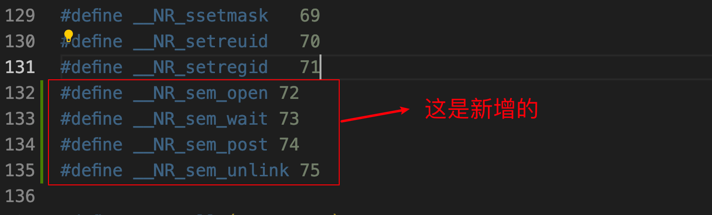
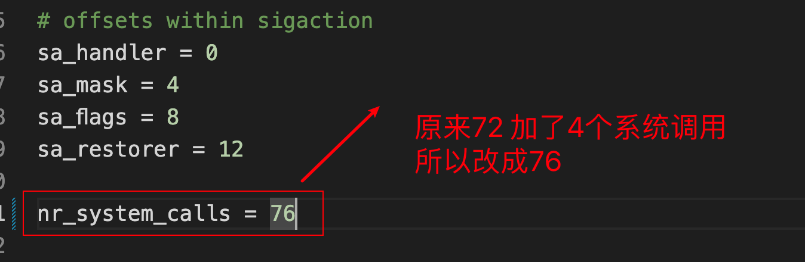
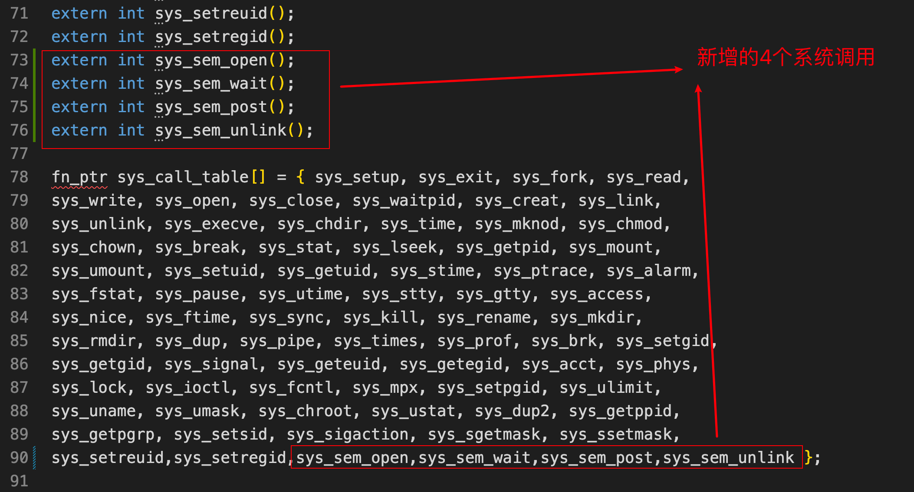
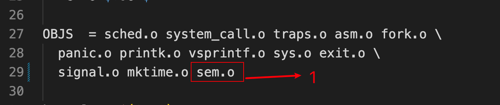
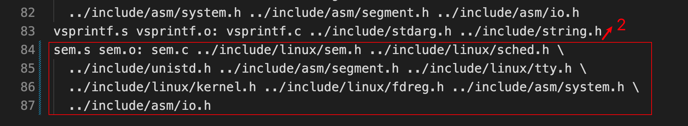
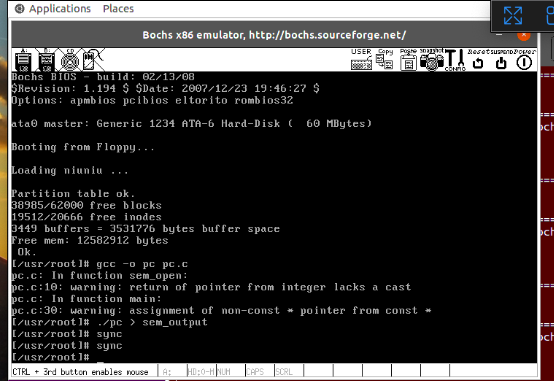
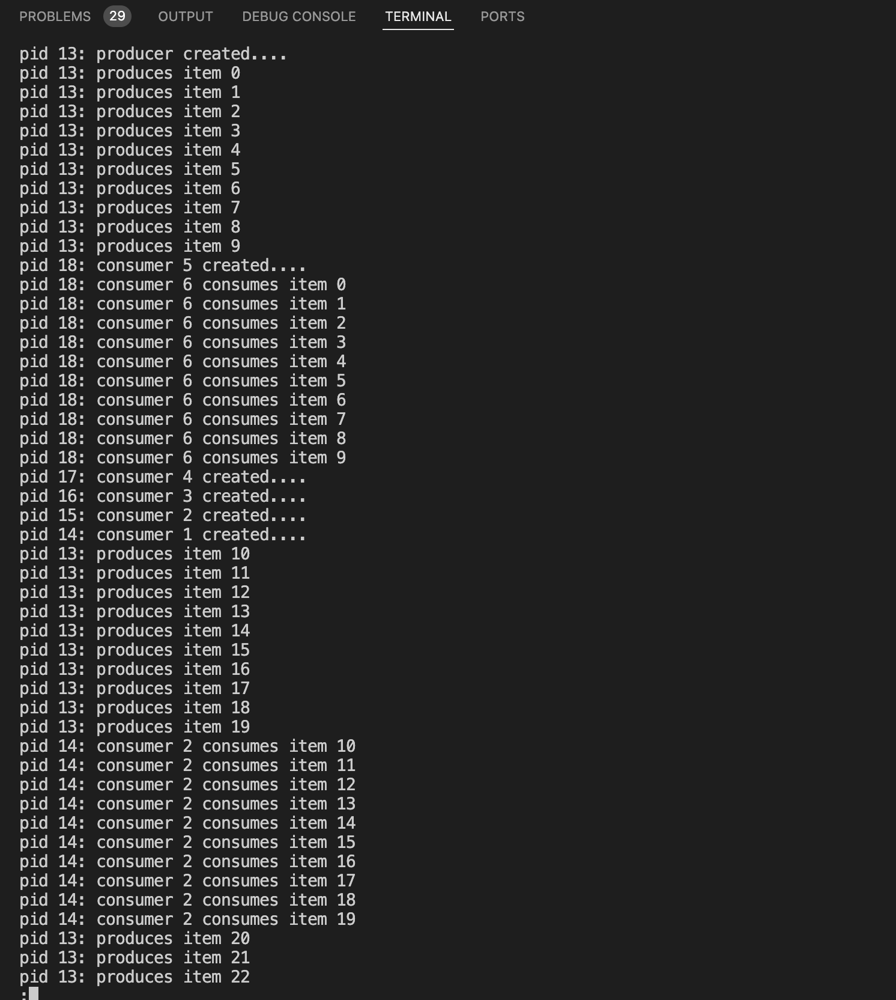

# 实验五报告

## 参考资料

+ https://www.cnblogs.com/mirage-mc/p/12913993.html
+ https://www.lanqiao.cn/courses/115/learning/?id=572&compatibility=false

## 1. 实验

### 1.1 实现信号量

#### 1.1.1 新建include/linux/sem.h

```c
#ifndef _SEM_H
#define _SEM_H

#include <linux/sched.h>

#define SEMTABLE_LEN 20
#define SEM_NAME_LEN 20

typedef struct semaphore
{
    char name[SEM_NAME_LEN];
    int value;
    struct task_struct *queue;
} sem_t;
extern sem_t semtable[SEMTABLE_LEN];

#endif

```

#### 1.1.2 新建kernel/sem.c

```c
#include <linux/sem.h>
#include <linux/sched.h>
#include <unistd.h>
#include <asm/segment.h>
#include <linux/tty.h>
#include <linux/kernel.h>
#include <linux/fdreg.h>
#include <asm/system.h>
#include <asm/io.h>
// #include <string.h>

sem_t semtable[SEMTABLE_LEN];
int cnt = 0;

sem_t *sys_sem_open(const char *name, unsigned int value)
{
    char kernelname[100];
    int isExist = 0;
    int i = 0;
    int name_cnt = 0;
    while (get_fs_byte(name + name_cnt) != '\0')
        name_cnt++;
    if (name_cnt > SEM_NAME_LEN)
        return NULL;
    for (i = 0; i < name_cnt; i++)
        kernelname[i] = get_fs_byte(name + i);
    int name_len = strlen(kernelname);
    int sem_name_len = 0;
    sem_t *p = NULL;
    for (i = 0; i < cnt; i++)
    {
        sem_name_len = strlen(semtable[i].name);
        if (sem_name_len == name_len)
        {
            if (!strcmp(kernelname, semtable[i].name))
            {
                isExist = 1;
                break;
            }
        }
    }
    if (isExist == 1)
    {
        p = (sem_t *)(&semtable[i]);
        // printk("find previous name!\n");
    }
    else
    {
        i = 0;
        for (i = 0; i < name_len; i++)
        {
            semtable[cnt].name[i] = kernelname[i];
        }
        semtable[cnt].value = value;
        p = (sem_t *)(&semtable[cnt]);
        // printk("creat name!\n");
        cnt++;
    }
    return p;
}

int sys_sem_wait(sem_t *sem)
{
    cli();
    while (sem->value <= 0)      //
        sleep_on(&(sem->queue)); // 这两条语句顺序不能颠倒，很重要，是关于互斥信号量能不能正确工作的！！！
    sem->value--;
    sti();
    return 0;
}
int sys_sem_post(sem_t *sem)
{
    cli();
    sem->value++;
    if ((sem->value) <= 1)
        wake_up(&(sem->queue));
    sti();
    return 0;
}

int sys_sem_unlink(const char *name)
{
    char kernelname[100]; /* 应该足够大了 */
    int isExist = 0;
    int i = 0;
    int name_cnt = 0;
    while (get_fs_byte(name + name_cnt) != '\0')
        name_cnt++;
    if (name_cnt > SEM_NAME_LEN)
        return NULL;
    for (i = 0; i < name_cnt; i++)
        kernelname[i] = get_fs_byte(name + i);
    int name_len = strlen(name);
    int sem_name_len = 0;
    for (i = 0; i < cnt; i++)
    {
        sem_name_len = strlen(semtable[i].name);
        if (sem_name_len == name_len)
        {
            if (!strcmp(kernelname, semtable[i].name))
            {
                isExist = 1;
                break;
            }
        }
    }
    if (isExist == 1)
    {
        int tmp = 0;
        for (tmp = i; tmp <= cnt; tmp++)
        {
            semtable[tmp] = semtable[tmp + 1];
        }
        cnt = cnt - 1;
        return 0;
    }
    else
        return -1;
}

```

#### 1.1.3 修改include/unistd.h

 

```c
#define __NR_sem_open 72
#define __NR_sem_wait 73
#define __NR_sem_post 74
#define __NR_sem_unlink 75
```

#### 1.1.4 修改kernel/system_call.s

 

#### 1.1.5 修改include/linux/sys.h

 

```c
extern int sys_sem_open();
extern int sys_sem_wait();
extern int sys_sem_post();
extern int sys_sem_unlink();

fn_ptr sys_call_table[] = { sys_setup, sys_exit, sys_fork, sys_read,
sys_write, sys_open, sys_close, sys_waitpid, sys_creat, sys_link,
sys_unlink, sys_execve, sys_chdir, sys_time, sys_mknod, sys_chmod,
sys_chown, sys_break, sys_stat, sys_lseek, sys_getpid, sys_mount,
sys_umount, sys_setuid, sys_getuid, sys_stime, sys_ptrace, sys_alarm,
sys_fstat, sys_pause, sys_utime, sys_stty, sys_gtty, sys_access,
sys_nice, sys_ftime, sys_sync, sys_kill, sys_rename, sys_mkdir,
sys_rmdir, sys_dup, sys_pipe, sys_times, sys_prof, sys_brk, sys_setgid,
sys_getgid, sys_signal, sys_geteuid, sys_getegid, sys_acct, sys_phys,
sys_lock, sys_ioctl, sys_fcntl, sys_mpx, sys_setpgid, sys_ulimit,
sys_uname, sys_umask, sys_chroot, sys_ustat, sys_dup2, sys_getppid,
sys_getpgrp, sys_setsid, sys_sigaction, sys_sgetmask, sys_ssetmask,
sys_setreuid,sys_setregid,sys_sem_open,sys_sem_wait,sys_sem_post,sys_sem_unlink };

```

#### 1.1.6 修改kernel/Makefile

 

 

```makefile
OBJS  = sched.o system_call.o traps.o asm.o fork.o \
	panic.o printk.o vsprintf.o sys.o exit.o \
	signal.o mktime.o sem.o
	
sem.s sem.o: sem.c ../include/linux/sem.h ../include/linux/sched.h \
  ../include/unistd.h ../include/asm/segment.h ../include/linux/tty.h \
  ../include/linux/kernel.h ../include/linux/fdreg.h ../include/asm/system.h \
  ../include/asm/io.h
```

#### 1.1.7 挂载hdc并准备相关文件

+ 进入oslab根目录执行sudo ./mount-hdc；
+ 随后将unistd.h复制到hdc/usr/include下，将sem.h复制到hdc/usr/include/linux下；
+ 最后使用sudo umount hdc卸载hdc；

### 1.2 编写生产者-消费者程序

#### 1.2.1 新建pc.c

```c
#define __LIBRARY__
#include <unistd.h>
#include <linux/sem.h>
#include <stdio.h>
#include <sys/types.h>
#include <sys/stat.h>
#include <fcntl.h>
#include <linux/sched.h>

_syscall2(sem_t *,sem_open,const char *,name,unsigned int,value)
_syscall1(int,sem_wait,sem_t *,sem)
_syscall1(int,sem_post,sem_t *,sem)
_syscall1(int,sem_unlink,const char *,name)

const char *FILENAME = "/usr/root/buffer_file";    /* 消费生产的产品存放的缓冲文件的路径 */
const int NR_CONSUMERS = 5;                        /* 消费者的数量 */
const int NR_ITEMS = 50;                        /* 产品的最大量 */
const int BUFFER_SIZE = 10;                        /* 缓冲区大小，表示可同时存在的产品数量 */
sem_t *metux, *full, *empty;                    /* 3个信号量 */
unsigned int item_pro, item_used;                /* 刚生产的产品号；刚消费的产品号 */
int fi, fo;                                        /* 供生产者写入或消费者读取的缓冲文件的句柄 */


int main(int argc, char *argv[])
{
    char *filename;
    int pid;
    int i;

    filename = argc > 1 ? argv[1] : FILENAME;
    /* O_TRUNC 表示：当文件以只读或只写打开时，若文件存在，则将其长度截为0（即清空文件）
     * 0222 和 0444 分别表示文件只写和只读（前面的0是八进制标识）
     */
    fi = open(filename, O_CREAT| O_TRUNC| O_WRONLY, 0222);    /* 以只写方式打开文件给生产者写入产品编号 */
    fo = open(filename, O_TRUNC| O_RDONLY, 0444);            /* 以只读方式打开文件给消费者读出产品编号 */

    metux = sem_open("METUX", 1);    /* 互斥信号量，防止生产消费同时进行 */
    full = sem_open("FULL", 0);        /* 产品剩余信号量，大于0则可消费 */
    empty = sem_open("EMPTY", BUFFER_SIZE);    /* 空信号量，它与产品剩余信号量此消彼长，大于0时生产者才能继续生产 */

    item_pro = 0;

    if ((pid = fork()))    /* 父进程用来执行消费者动作 */
    {
        printf("pid %d:\tproducer created....\n", pid);
        /* printf()输出的信息会先保存到输出缓冲区，并没有马上输出到标准输出（通常为终端控制台）。
         * 为避免偶然因素的影响，我们每次printf()都调用一下stdio.h中的fflush(stdout)
         * 来确保将输出立刻输出到标准输出。
         */
        fflush(stdout);

        while (item_pro <= NR_ITEMS)    /* 生产完所需产品 */
        {
            sem_wait(empty);
            sem_wait(metux);

            /* 生产完一轮产品（文件缓冲区只能容纳BUFFER_SIZE个产品编号）后
             * 将缓冲文件的位置指针重新定位到文件首部。
             */
            if(!(item_pro % BUFFER_SIZE))
                lseek(fi, 0, 0);

            write(fi, (char *) &item_pro, sizeof(item_pro));        /* 写入产品编号 */
            printf("pid %d:\tproduces item %d\n", pid, item_pro);
            fflush(stdout);
            item_pro++;

            sem_post(full);        /* 唤醒消费者进程 */
            sem_post(metux);
        }
    }
    else    /* 子进程来创建消费者 */
    {
        i = NR_CONSUMERS;
        while(i--)
        {
            if(!(pid=fork()))    /* 创建i个消费者进程 */
            {
                pid = getpid();
                printf("pid %d:\tconsumer %d created....\n", pid, NR_CONSUMERS-i);
                fflush(stdout);

                while(1)
                {
                    sem_wait(full);
                    sem_wait(metux);

                    /* read()读到文件末尾时返回0，将文件的位置指针重新定位到文件首部 */
                    if(!read(fo, (char *)&item_used, sizeof(item_used)))
                    {
                        lseek(fo, 0, 0);
                        read(fo, (char *)&item_used, sizeof(item_used));
                    }

                    printf("pid %d:\tconsumer %d consumes item %d\n", pid, NR_CONSUMERS-i+1, item_used);
                    fflush(stdout);

                    sem_post(empty);    /* 唤醒生产者进程 */
                    sem_post(metux);

                    if(item_used == NR_ITEMS)    /* 如果已经消费完最后一个商品，则结束 */
                        goto OK;
                }
            }
        }
    }
OK:
    close(fi);
    close(fo);
    return 0;
}

```

将此文件移动到hdc/usr/root目录下，此目录需要挂载hdc才可以访问。移动成功之后直接重新编译linux并在虚拟环境内运行。

#### 1.2.2 编译运行pc.c

运行linux-0.11之后，首先编译pc.c，使用命令**gcc -o pc pc.c**，随后运行pc，使用命令**./pc > sem_output**即可，最终在虚拟环境内输入sync把修改的数据写入磁盘。

 

#### 1.2.3 查看sem_output

首先挂载hdc，然后进入hdc/usr/root目录并在终端内执行**sudo less sem_output**命令，可看到下图结果：  

 

## 2. 完整代码

https://github.com/niu0217/HGDOS/tree/Lib5

