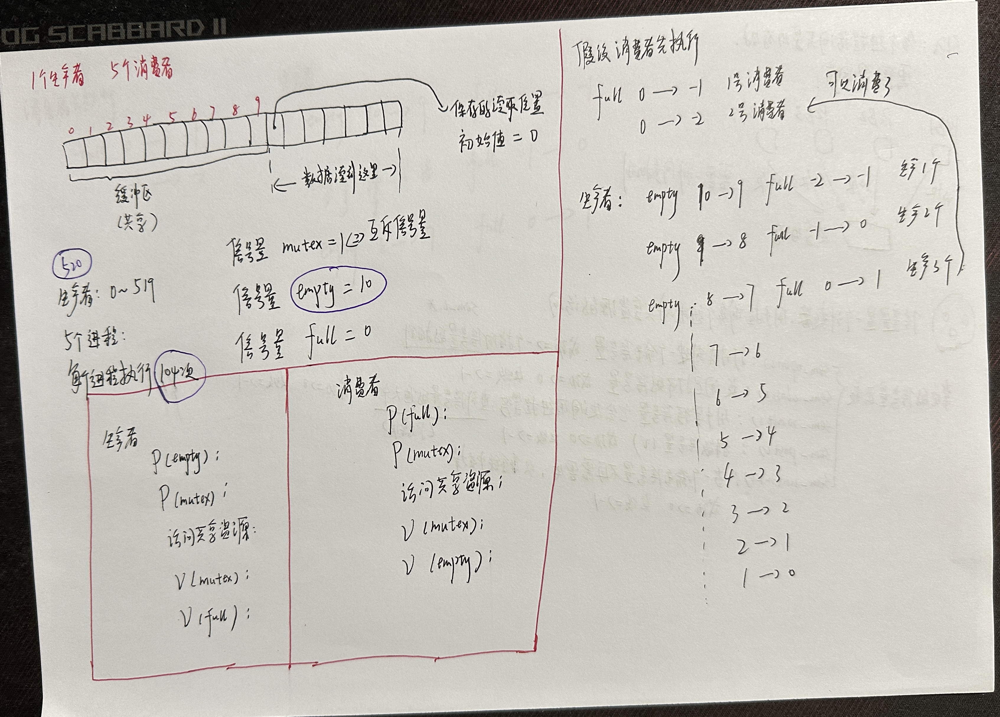

# 解决生产者-消费者问题

## 基本条件

+ 1个生产者，5个消费者；
+ 共享缓存区大小为10；
+ 生产者一共生产520个东西；
+ 每个消费者消费104个东西；

 

## 代码

```c
#define   __LIBRARY__
#include <unistd.h>
#include <sys/types.h>
#include <fcntl.h>
#include <stdio.h>
#include <stdlib.h>
#include <semaphore.h>
#include <string.h>

#define NUMBER 520 /*打出数字总数*/
#define CHILD 5 /*消费者进程数*/
#define BUFSIZE 10 /*缓冲区大小*/

sem_t   *empty, *full, *mutex;
int fno; /*文件描述符*/

int main()
{
    int  i,j,k;
    int  data;
    pid_t p;
    int  buf_read_pos = 0; /*从缓冲区读取位置*/
    int  buf_write_pos = 0; /*写入缓冲区位置*/
    /*打开信号量*/
    // mutex是一个互斥信号量
    if((mutex = sem_open("carmutex", O_CREAT, 0666, 1)) == SEM_FAILED)
    {
        perror("sem_open() error!\n");
        return -1;
    }
    if((empty = sem_open("carempty",O_CREAT, 0666, 10)) == SEM_FAILED)
    {
        perror("sem_open() error!\n");
        return -1;
    }
    if((full = sem_open("carfull",O_CREAT, 0666, 0)) == SEM_FAILED)
    {
        perror("sem_open() error!\n");
        return -1;
    }
    fno = open("buffer.dat",O_CREAT|O_RDWR|O_TRUNC,0666);
    int fd_out = open("log.txt", O_WRONLY | O_CREAT | O_APPEND, 0666);
    /* 将待读取位置存入buffer后,以便 子进程 之间通信 */
    // 将文件描述符 fno 对应的文件的文件偏移量移动到距文件开头位置为10个 int 大小的位置处
    lseek(fno, 10 * sizeof(int), SEEK_SET);
    // 将存储在 buf_read_pos 变量中的整型数据写入到以文件描述符 fno 标识的文件中
    write(fno,(char *)&buf_read_pos,sizeof(int));
    /*生产者进程*/
    if((p=fork())==0)   //子进程 1个生产者进程
    {
        for( i = 0 ; i < NUMBER; i++)
        {
            sem_wait(empty);
            sem_wait(mutex);
            /*写入一个字符*/
            lseek(fno, buf_write_pos*sizeof(int), SEEK_SET); 
            write(fno,(char *)&i,sizeof(int));  //向缓存区中写
            buf_write_pos = ( buf_write_pos + 1)% BUFSIZE;

            sem_post(mutex);
            sem_post(full);
        }
        return 0;
    }else if(p < 0)
    {
        perror("Fail to fork!\n");
        return -1;
    }

    //5个消费者进程
    for( j = 0; j < CHILD ; j++ )
    {
        if((p=fork())==0)
        {
            //每个进程执行104次
            for( k = 0; k < NUMBER/CHILD; k++ )
            {
                sem_wait(full);
                sem_wait(mutex);
                /*获得读取位置*/
                lseek(fno,10*sizeof(int),SEEK_SET);
                read(fno,(char *)&buf_read_pos,sizeof(int));
                /*读取数据*/
                lseek(fno,buf_read_pos*sizeof(int),SEEK_SET);
                read(fno,(char *)&data,sizeof(int));
                /*写入读取位置*/
                buf_read_pos = (buf_read_pos + 1) % BUFSIZE;
                lseek(fno,10*sizeof(int),SEEK_SET);
                write(fno,(char *)&buf_read_pos,sizeof(int));

                sem_post(mutex);
                sem_post(empty);
                /*消费资源*/
                char temp_buffer[100];
                snprintf(temp_buffer, sizeof(temp_buffer), "%d: %d\n", getpid(), data);
                write(fd_out, temp_buffer,strlen(temp_buffer));
            }
           return 0;
        }else if(p<0)
        {
            perror("Fail to fork!\n");
            return -1;
        }
    }
    wait(NULL);
    /*释放信号量*/
    sem_unlink("carfull");
    sem_unlink("carempty");
    sem_unlink("carmutex");
    /*释放资源*/
    close(fno);
    close(fd_out);
    return 0;
}

```

