# Linux0.11的内存管理

## 参考资料

+ Linux内核完全注释.pdf
  + 第13章：内存管理

## 1. 内存分页管理机制

### 1.1 system模块在内存中的映像示意图

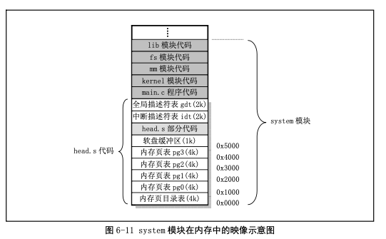 

内核的代码段和数据段长度是16MB（`4*1024*4KB`），使用了4个页表（即4个页目录项）。

这个4个页表直接位于页目录表后面，经过分段机制变换，内核代码和数据段位于线性地址空间的16MB范围内，再经过分页机制变换，它被直接一一对应地映射到了16MB的物理内存上。因此对于内核段来讲其线性地址就是物理地址。

### 1.2 页目录表和页表结构示意图

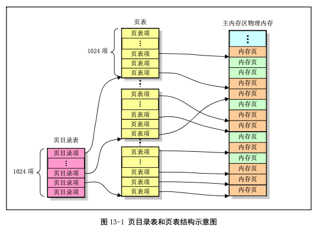 

+ 每个页目录项和页表项都是4个字节大小；
+ 每个页表项用来指定一页物理内存页；
+ 页目录表占用一页内存，所以最多可以寻址1024个页表；
+ 一个页表最多可以寻址1024个物理内存页面；
+ 一个页目录表所寻址的所有页表共可以寻址：`1024*1024*4096=4G`；
  + 页目录项：2的10次方
  + 页表项：2的10次方
  + 页内偏移值：2的12次方
  + 汇总起来就是4G
+ Linux0.11中所有进程都使用一个页目录表，而每个进程都有自己的页表；

### 1.3 页目录表项和页表项结构

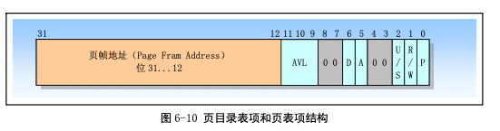 

+ P：页面存在于内存标志；
  + P=0：表示该页或页表项当前不在物理内存中，可能已被换出到磁盘上，或者尚未加载到物理内存。当处理器尝试访问这些页面时，会触发一个页面错误（Page Fault），然后操作系统负责将该页面装入物理内存；
  + P=1：表示该页或页表项已经在物理内存中，可以被访问；
+ R/W：读写标志；
  + R/W=0：表示页面是只读的，只读页面用于共享代码段，确保同一代码段的多个进程可以共享同一物理内存空间，而不会相互干扰。修改只读页面会触发异常；
  + R/W=1：表示页面是可读写的，可读写页面用于存储数据或代码段，允许进程读取和修改页面内容；
+ U/S：用户/超级用户标志；
  + U/S=0：表示页面只能由操作系统内核（超级用户）访问，用户态的程序无权访问这个页面。这样的权限通常用于操作系统内核代码和数据；
  + U/S=1：表示页面可以被超级用户和用户态程序（普通用户）访问。通常，U/S = 1 的页面可以被用户态程序读取或写入。
+ A：页面已访问标志；
  + A=0：表示该页面未被访问过。当处理器访问该页面时，硬件会将 A 标志置为 1，表示该页面被访问过；
  + A=1：表示该页面已经被访问过。处理器在访问页面时会自动更新这个标志；
+ D：页面内容已修改标志；
  + D=0：表示页面未被修改过。当处理器对页面执行写操作时，硬件会将 D 标志置为 1，表示页面已经被修改；
  + D=1：表示页面已经被修改过。处理器在写入页面时会更新这个标志；
+ 页帧地址：也就是物理页框号；

### 1.4 线性地址变化示意图

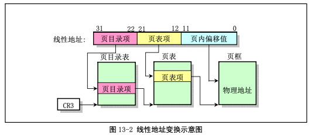 

### 1.5 线性地址对应的物理地址

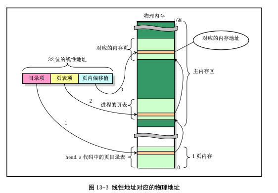 

+ 对于第一个进程（任务0），其页表是在页目录表之后，共4页；

+ 对于应用程序的进程，其页表所使用的内存是在进程创建时向内存管理程序申请的，因此是在主内存区中；

一个系统中可以同时存在多个页目录表，但是在某个时刻只有一个页目录表可用。当前的页目录表是用CPU寄存器CR3来确定的，它存储着当前页目录表的物理内存地址。

### 1.6 Linux内核使用描述符表的示意图

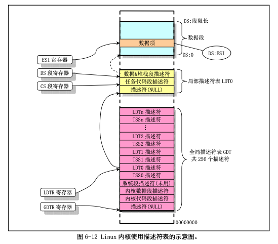 

## 2. Linux中物理内存的分配和管理

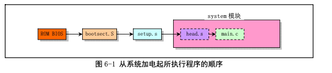 

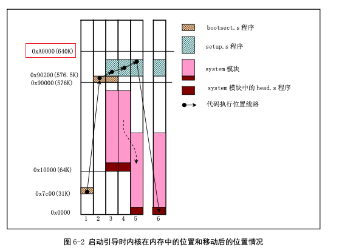 

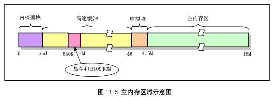 

对于Linux0.11内核，它默认最多支持16M物理内存。

为了节约物理内存，在调用fork生成新进程时，新进程与原进程会共享同一内存区。只有当其中一个进程进行写操作时，系统才会为其另外分配内存页面，这就是写时复制的概念。

## 3. Linux内核对线性地址空间的使用分配

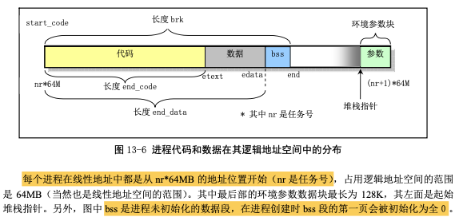 

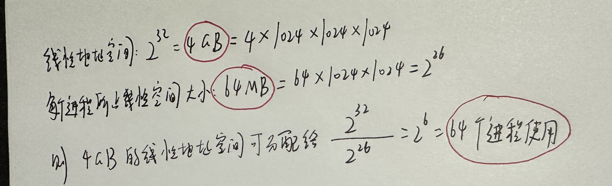 

证据：

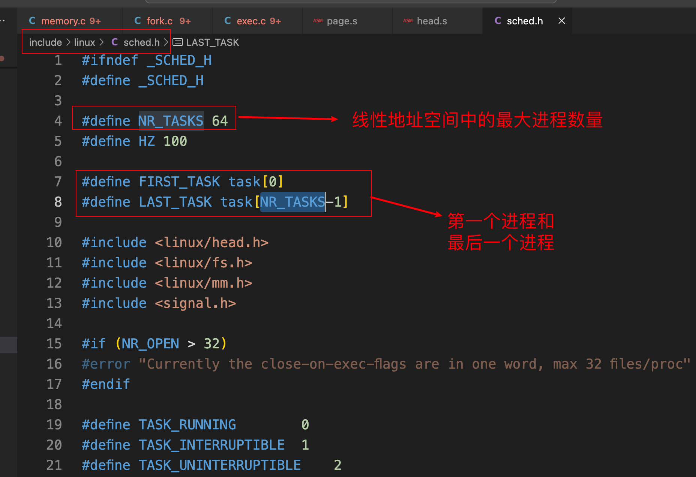 

进程0，1，2的虚拟地址：

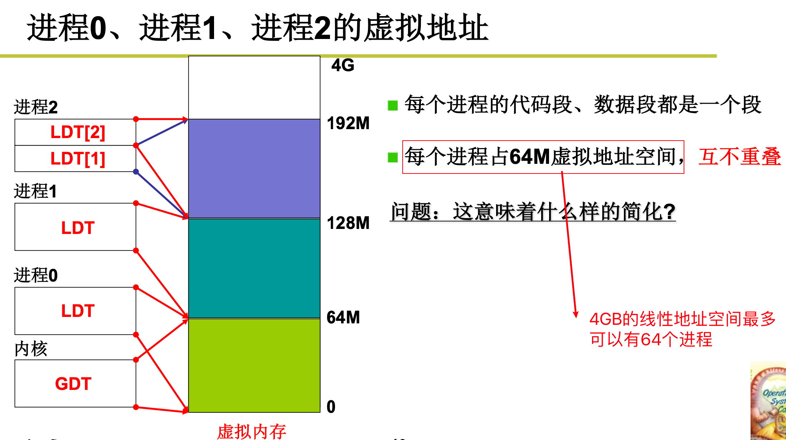 

## 4. 页面出错异常处理

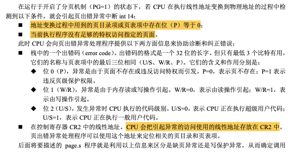 

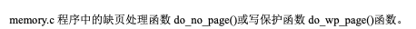 

## 5. 写时复制机制

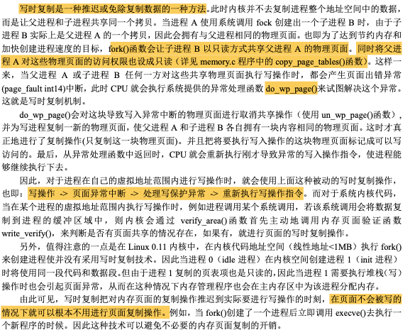 

## 6. 需求加载机制

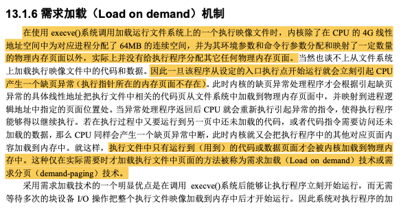 

 

