# Linux0.11的内存管理2

## 1. memory.c程序

文件：mm/memory.c

### 1.1 功能描述

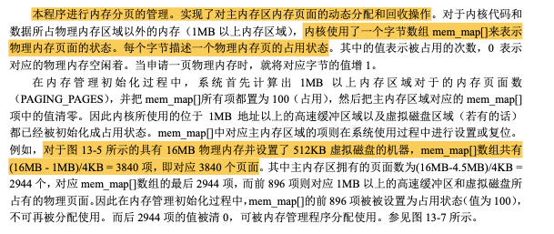 

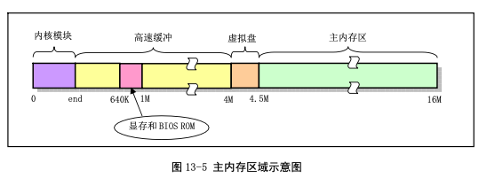 

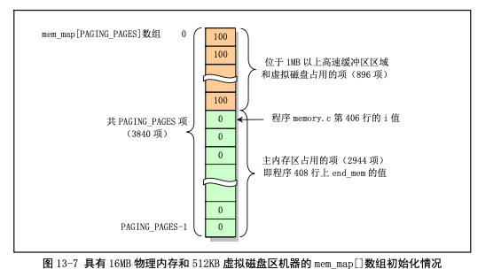 

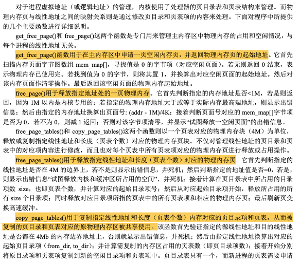 

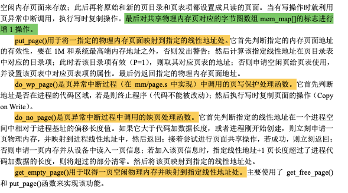 

### 1.2 重要声明

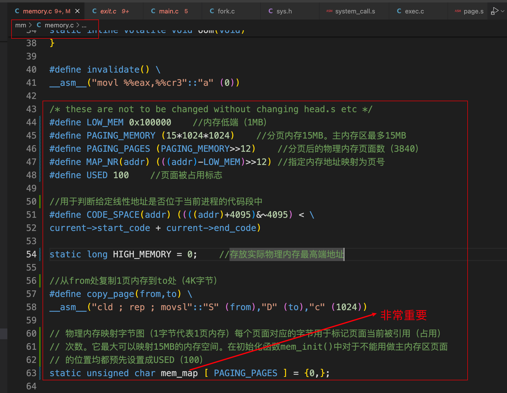 

### 1.3 重要函数

#### 1.3.1 mem_init

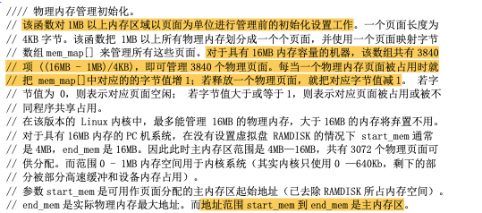 

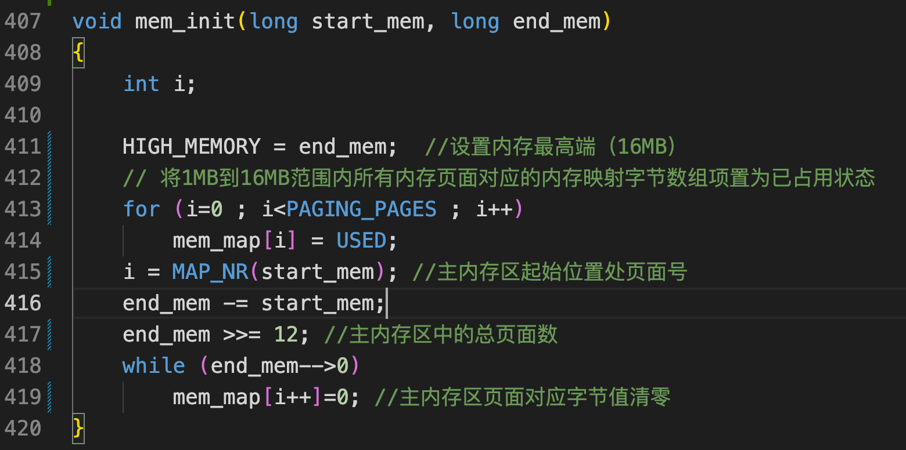 

执行完这个函数之后的状态：

 

#### 1.3.2 put_page

##### 1.3.2.1 完整代码

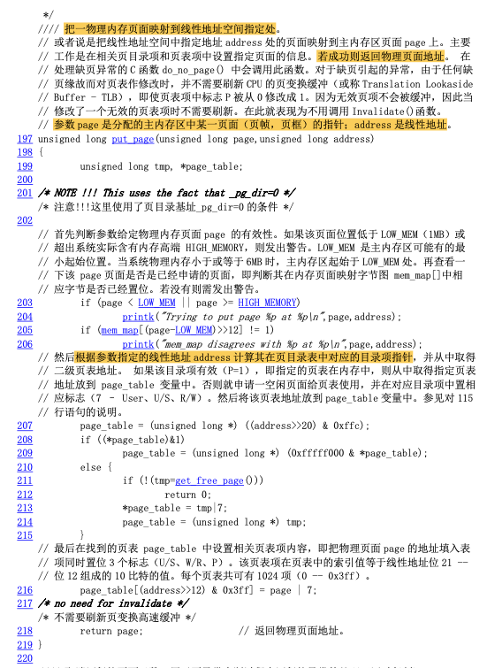 

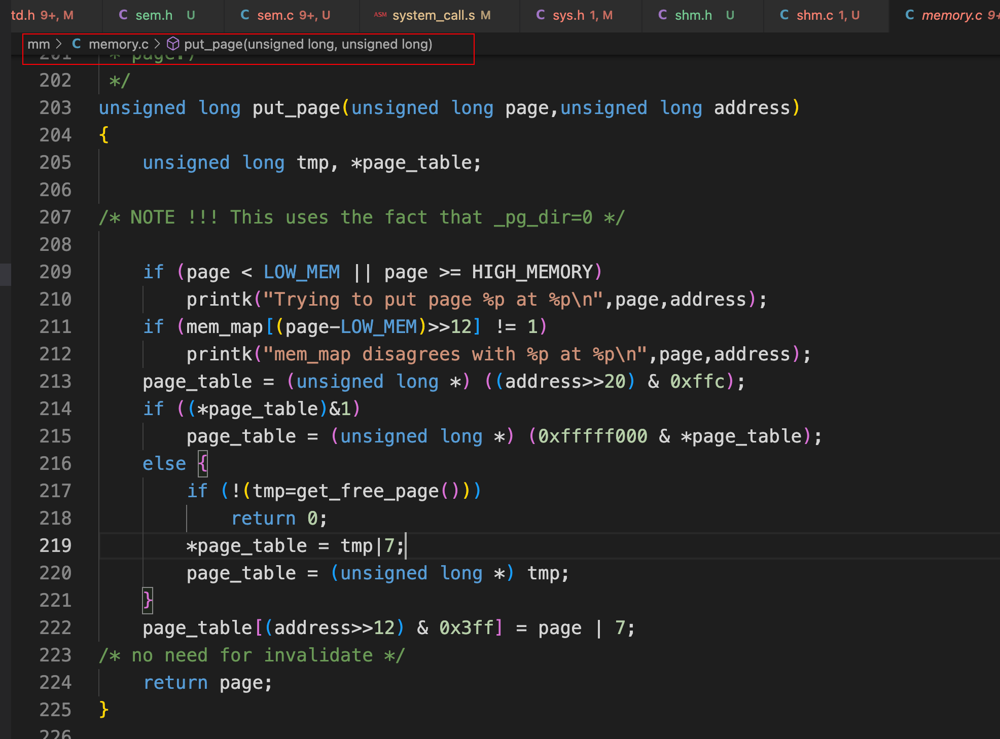 

##### 1.3.2.2 片段一

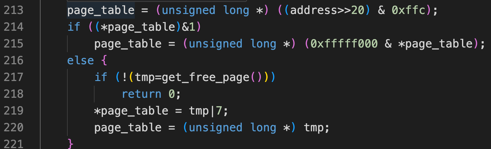 

+ 如果该目录项有效（P=1），即指定的页表在内存中，则从中取得指定页表地址放到page_table变量中；
+ 否则就申请一块空闲页面给页表使用，并在对应目录项中置相应标志；

##### 1.3.2.3 片段二

 

把物理页面page的地址填入到对应的页表中；

## 2. page.s程序

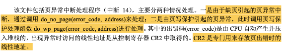 

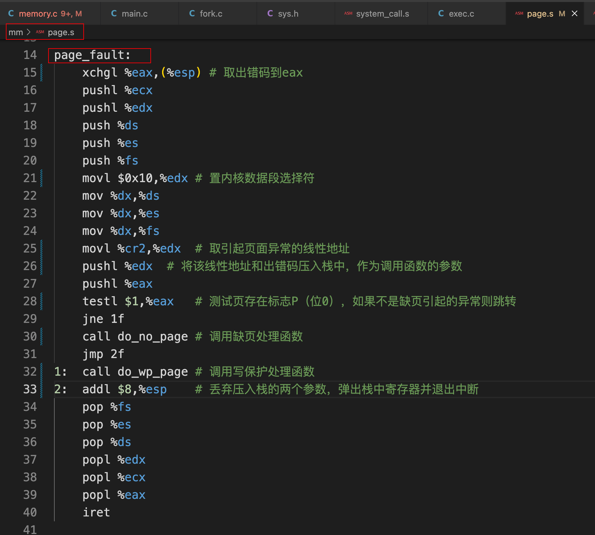 

