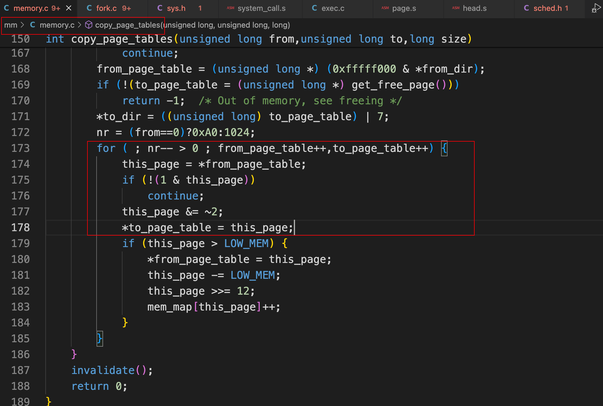

# 分析fork的内存管理

## 1. 从fork到sys_fork

 

 

## 2. 分析copy_process

### 2.1 完整代码

kernel/fork.c

```c
/*
 *  Ok, this is the main fork-routine. It copies the system process
 * information (task[nr]) and sets up the necessary registers. It
 * also copies the data segment in it's entirety.
 */
int copy_process(int nr,long ebp,long edi,long esi,long gs,long none,
		long ebx,long ecx,long edx,
		long fs,long es,long ds,
		long eip,long cs,long eflags,long esp,long ss)
{
	struct task_struct *p;
	int i;
	struct file *f;

	p = (struct task_struct *) get_free_page();
	if (!p)
		return -EAGAIN;
	task[nr] = p;
	*p = *current;	/* NOTE! this doesn't copy the supervisor stack */
	p->state = TASK_UNINTERRUPTIBLE;
	p->pid = last_pid;
	p->father = current->pid;
	p->counter = p->priority;
	p->signal = 0;
	p->alarm = 0;
	p->leader = 0;		/* process leadership doesn't inherit */
	p->utime = p->stime = 0;
	p->cutime = p->cstime = 0;
	p->start_time = jiffies;
	p->tss.back_link = 0;
	p->tss.esp0 = PAGE_SIZE + (long) p;
	p->tss.ss0 = 0x10;
	p->tss.eip = eip;
	p->tss.eflags = eflags;
	p->tss.eax = 0;
	p->tss.ecx = ecx;
	p->tss.edx = edx;
	p->tss.ebx = ebx;
	p->tss.esp = esp;
	p->tss.ebp = ebp;
	p->tss.esi = esi;
	p->tss.edi = edi;
	p->tss.es = es & 0xffff;
	p->tss.cs = cs & 0xffff;
	p->tss.ss = ss & 0xffff;
	p->tss.ds = ds & 0xffff;
	p->tss.fs = fs & 0xffff;
	p->tss.gs = gs & 0xffff;
	p->tss.ldt = _LDT(nr);
	p->tss.trace_bitmap = 0x80000000;
	if (last_task_used_math == current)
		__asm__("clts ; fnsave %0"::"m" (p->tss.i387));
	if (copy_mem(nr,p)) {
		task[nr] = NULL;
		free_page((long) p);
		return -EAGAIN;
	}
	for (i=0; i<NR_OPEN;i++)
		if ((f=p->filp[i]))
			f->f_count++;
	if (current->pwd)
		current->pwd->i_count++;
	if (current->root)
		current->root->i_count++;
	if (current->executable)
		current->executable->i_count++;
	set_tss_desc(gdt+(nr<<1)+FIRST_TSS_ENTRY,&(p->tss));
	set_ldt_desc(gdt+(nr<<1)+FIRST_LDT_ENTRY,&(p->ldt));
	p->state = TASK_RUNNING;	/* do this last, just in case */
	return last_pid;
}
```

### 2.2 逐步分析

 

## 3. 分析copy_mem

### 3.1 完整代码

kernel/fork.c

```c
int copy_mem(int nr,struct task_struct * p)
{
	unsigned long old_data_base,new_data_base,data_limit;
	unsigned long old_code_base,new_code_base,code_limit;

	code_limit=get_limit(0x0f);
	data_limit=get_limit(0x17);
	old_code_base = get_base(current->ldt[1]);
	old_data_base = get_base(current->ldt[2]);
	if (old_data_base != old_code_base)
		panic("We don't support separate I&D");
	if (data_limit < code_limit)
		panic("Bad data_limit");
	new_data_base = new_code_base = nr * 0x4000000;
	p->start_code = new_code_base;
	set_base(p->ldt[1],new_code_base);
	set_base(p->ldt[2],new_data_base);
	if (copy_page_tables(old_data_base,new_data_base,data_limit)) {
		printk("free_page_tables: from copy_mem\n");
		free_page_tables(new_data_base,data_limit);
		return -ENOMEM;
	}
	return 0;
}
```

### 3.2 逐步分析

 

浅浅看一下set_base：

 

插入进程虚拟地址分配后的样子：

 


继续分析copy_mem，现在该轮到分配内存，创建页表了：

 

 

## 4. 分析copy_page_tables

### 4.1 完整代码

mm/memory.c

```c
/*
 *  Well, here is one of the most complicated functions in mm. It
 * copies a range of linerar addresses by copying only the pages.
 * Let's hope this is bug-free, 'cause this one I don't want to debug :-)
 *
 * Note! We don't copy just any chunks of memory - addresses have to
 * be divisible by 4Mb (one page-directory entry), as this makes the
 * function easier. It's used only by fork anyway.
 *
 * NOTE 2!! When from==0 we are copying kernel space for the first
 * fork(). Then we DONT want to copy a full page-directory entry, as
 * that would lead to some serious memory waste - we just copy the
 * first 160 pages - 640kB. Even that is more than we need, but it
 * doesn't take any more memory - we don't copy-on-write in the low
 * 1 Mb-range, so the pages can be shared with the kernel. Thus the
 * special case for nr=xxxx.
 */
int copy_page_tables(unsigned long from,unsigned long to,long size)
{
	unsigned long * from_page_table;
	unsigned long * to_page_table;
	unsigned long this_page;
	unsigned long * from_dir, * to_dir;
	unsigned long nr;

	if ((from&0x3fffff) || (to&0x3fffff))
		panic("copy_page_tables called with wrong alignment");
	from_dir = (unsigned long *) ((from>>20) & 0xffc); /* _pg_dir = 0 */
	to_dir = (unsigned long *) ((to>>20) & 0xffc);
	size = ((unsigned) (size+0x3fffff)) >> 22;
	for( ; size-->0 ; from_dir++,to_dir++) {
		if (1 & *to_dir)
			panic("copy_page_tables: already exist");
		if (!(1 & *from_dir))
			continue;
		from_page_table = (unsigned long *) (0xfffff000 & *from_dir);
		if (!(to_page_table = (unsigned long *) get_free_page()))
			return -1;	/* Out of memory, see freeing */
		*to_dir = ((unsigned long) to_page_table) | 7;
		nr = (from==0)?0xA0:1024;
		for ( ; nr-- > 0 ; from_page_table++,to_page_table++) {
			this_page = *from_page_table;
			if (!(1 & this_page))
				continue;
			this_page &= ~2;
			*to_page_table = this_page;
			if (this_page > LOW_MEM) {
				*from_page_table = this_page;
				this_page -= LOW_MEM;
				this_page >>= 12;
				mem_map[this_page]++;
			}
		}
	}
	invalidate();
	return 0;
}
```

### 4.2 逐步分析

#### 4.2.1 变量的含义

+ `unsigned long * from_page_table;`
  + 含义：指向源页表基地址的指针；
+ `unsigned long * to_page_table;`
  + 含义：指向目标页表基地址的指针；
+ `unsigned long * from_dir;`
  + 含义：指向源页目录表基地址的指针；
+ `unsigned long * to_dir;`
  + 含义：指向目标页目录表基地址的指针；

#### 4.2.2 大致关系图

 

 

#### 4.2.3 get_free_page分析

 

主要是找到一块空闲的内存页，然后返回。

#### 4.2.4 代码片段分析

##### 4.2.4.1 片段一

```c
if ((from&0x3fffff) || (to&0x3fffff))
		panic("copy_page_tables called with wrong alignment");
```

确保源地址和目标地址在低22位（0x3fffff）上为零，这通常是 x86 架构中对物理地址进行对齐的要求。如果源地址或目标地址的低22位不是零，就会调用 panic 函数，该函数用于处理严重的错误情况。

##### 4.2.4.2 片段二

```c
from_dir = (unsigned long *) ((from>>20) & 0xffc); /* _pg_dir = 0 */
to_dir = (unsigned long *) ((to>>20) & 0xffc);
size = ((unsigned) (size+0x3fffff)) >> 22;
```

 

##### 4.2.4.3 片段三

```c
for( ; size-->0 ; from_dir++,to_dir++) {
		if (1 & *to_dir)
			panic("copy_page_tables: already exist");
		if (!(1 & *from_dir))
			continue;
```

在得到了源起始目录项指针from_dir和目的起始目录项指针to_dir以及需要复制的页表个数size后，下面开始对每个页目录项依次申请1页内存来保存对应的页表，并且开始页表项复制操作。

+ 如果目的目录项指定的页表已经存在（P = 1），则出错死机；
+ 如果源目录项无效，则指定的页表不存在（P=0），则继续处理下一个页目录项；

##### 4.2.4.4 片段四

```c
from_page_table = (unsigned long *) (0xfffff000 & *from_dir);
if (!(to_page_table = (unsigned long *) get_free_page()))
  return -1;	/* Out of memory, see freeing */
```

在验证了当前源目录项和目的项正常之后，我们取源目录项中页表地址from_page_table。为了保存目的目录项对应的页表，需要在主内存区中申请一页空闲内存页。如果取空闲页面函数get_free_page返回0，则说明没有申请到空闲内存页面，可能是内存不够，于是返回-1并退出。

##### 4.2.4.5 片段五

```c
*to_dir = ((unsigned long) to_page_table) | 7;
nr = (from==0)?0xA0:1024;
```

否则我们设置目的目录项信息，把最后3位置位，表示对应页表映射的内存页面是用户级别的，并且可读写，存在。

+ 如果U/S=0，则R/W就没有作用；
+ 如果U/S=1，而R/W=0，则运行在用户层的代码就只能读页面；
+ 如果U/S=1 R/W=1，则就有读写的权限；

然后针对当前处理的页目录项对应的页表，设置需要复制的页面项数。

+ 如果是在内核空间，则仅需要复制头160页对应的页表项的页表，对应于开始640KB物理内存；
+ 否则需要复制一个页表中所有1024个页表项（nr=1024），可映射4MB物理内存；

##### 4.2.4.6 片段六

 

对应于当前页表，开始循环复制指定的nr个内存页面表项。先取出源页表项内容。

+ 如果当前源页面没有使用，则不用复制该表项，继续处理下一项。
+ 否则复位页表项中R/W标志（位1置0），即让页表项对应的内存页面只读。

然后将该页表项复制到目的页表中。

##### 4.2.4.7 片段七

 

如果该页表项所指物理页面的地址在1MB以上，则需要设置内存页面映射数组mem_map[]，于是计算页面号，并以它为索引在页面映射数组对应项中增加引用次数。而对于位于1MB以下的页面，说明是内核页面，因此不需要对mem_map[]进行设置。因为mem_map[]仅用于管理主内存区中的页面使用情况。

因此对于内核移动到任务0中并且调用fork创建任务1时（用于运行init()），由于此时复制的页面还仍然都在内核代码区域，因此以下判断语句中的语句不会执行，任务0的页面仍然可以随时读写。只有当调用fork的父进程代码处于主内存区（页面位置大于1MB）时才会执行。这种情况需要在进程调用execve并装载执行了新程序代码时才会出现。

```c
*from_page_table = this_page;
```

这行语义是让源页表项所指内存页也为只读。因为现在开始有两个进程共用内存区了，若其中一个进程需要进行写操作，则可以通过页异常写保护处理为执行写操作的进程分配1页新空闲页面，也即进行写时复制。

## 5. 总结

 

 

