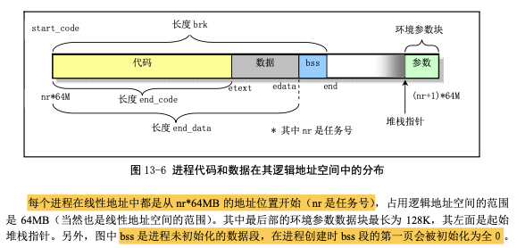
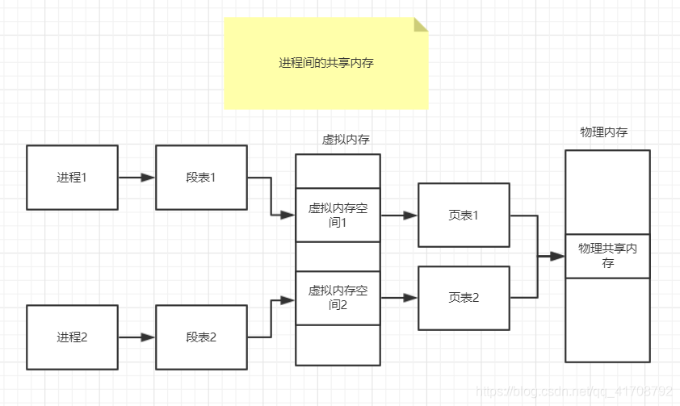
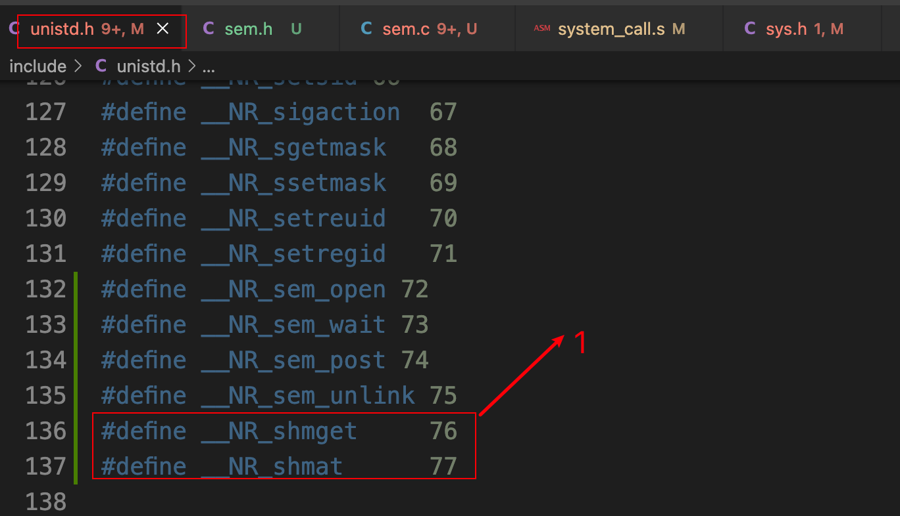
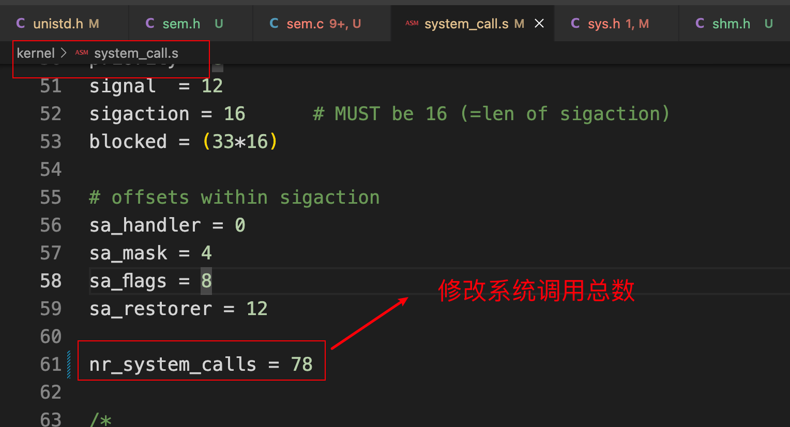
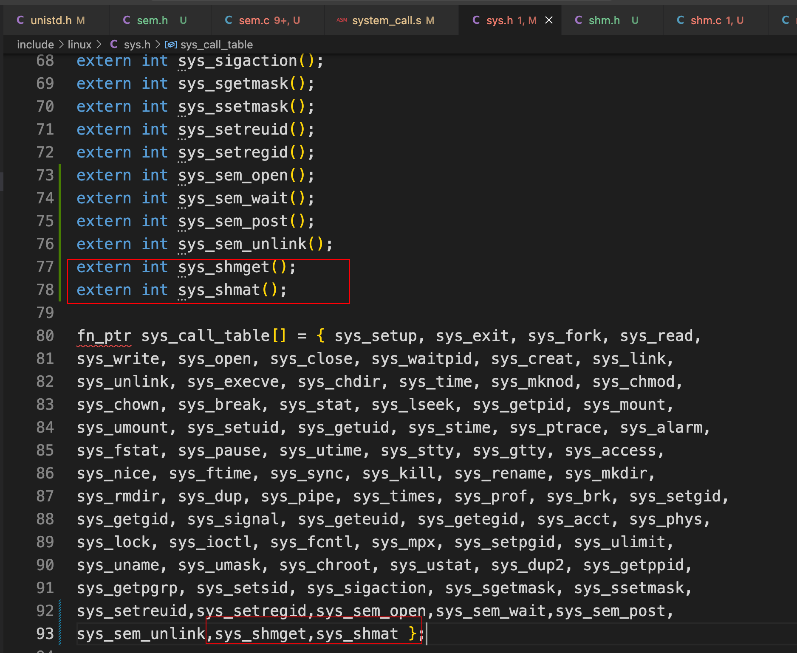
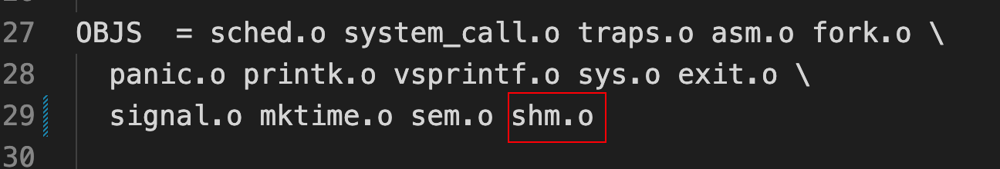
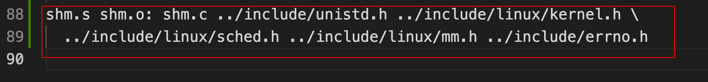
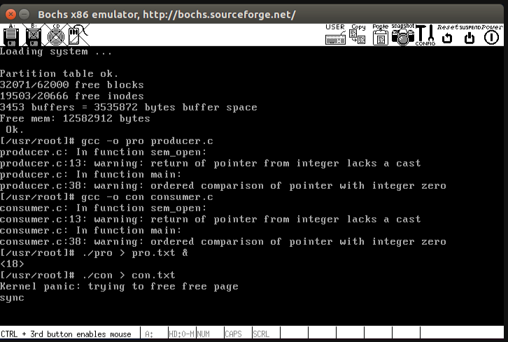
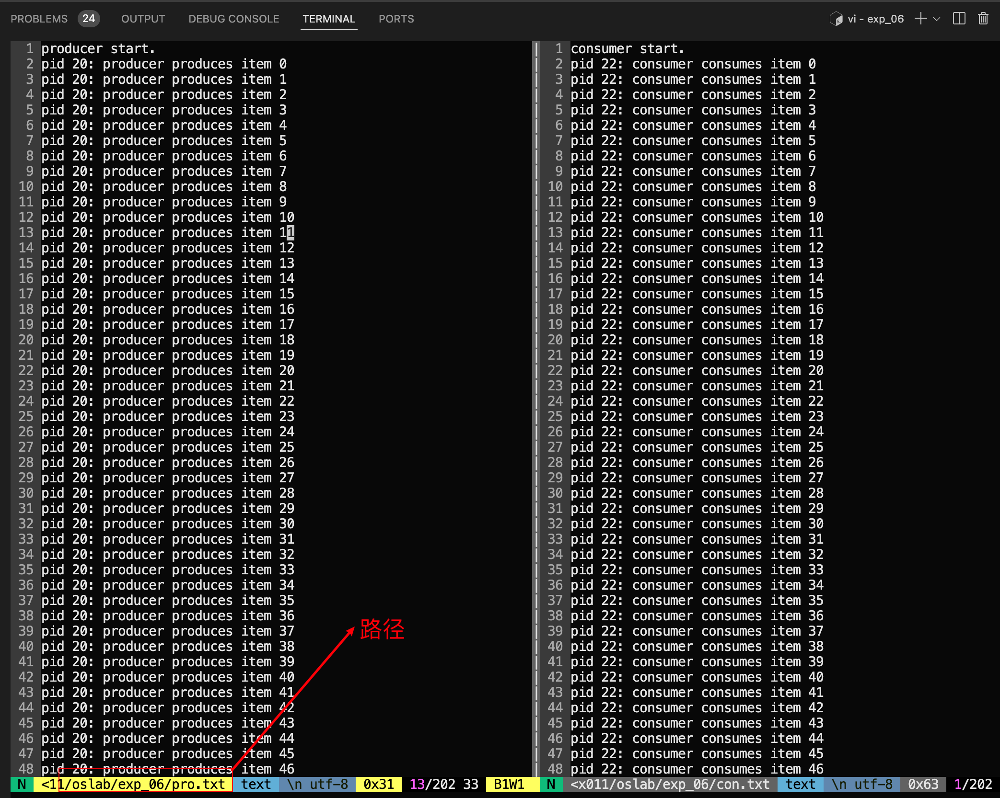

# 实现共享内存

## 参考资料

+ 实验地址：https://www.lanqiao.cn/courses/115/learning/?id=573&compatibility=false
+ https://blog.csdn.net/qq_41708792/article/details/90205521
+ https://blog.csdn.net/Amentos/article/details/131392469

 

##  1. 实验目的图

 

## 2. 在ubuntu中正常使用共享内存

```c
#include <sys/ipc.h>
#include <sys/shm.h>
#include <stdio.h>

int main() {
    key_t key = ftok("shmfile",65);
    int shmid = shmget(key,1024,0666|IPC_CREAT);
    char *shmaddr = (char*)shmat(shmid,(void*)0,0);
    
    //使用共享内存
    
    shmdt(shmaddr); // 断开共享内存连接
    
    return 0;
}
```

1. 引入必要的头文件：
   - `<sys/ipc.h>`：包含 ftok 函数的相关定义。
   - `<sys/shm.h>`：包含共享内存相关的定义。
   - `<stdio.h>`：标准输入输出头文件。
2. 在 `main()` 函数中：
   - 通过 `ftok("shmfile", 65)` 创建一个唯一的键值（key），用于获取共享内存标识符。
   - 使用 `shmget(key, 1024, 0666|IPC_CREAT)` 创建一个共享内存段，大小为1024字节，权限为0666（允许读写），并设置 IPC_CREAT 选项表示如果共享内存不存在，则创建它。
   - 使用 `shmat(shmid, (void *)0, 0)` 将共享内存连接到当前进程的地址空间，并返回共享内存的起始地址。这个地址被赋值给 `shmaddr` 变量，它是一个指向共享内存的指针。
   - 使用共享内存段进行相关操作（在注释中表示为 "使用共享内存"）。
   - 使用 `shmdt(shmaddr)` 断开当前进程和共享内存段之间的连接，使得进程无法再访问共享内存段。

这段代码的主要目的是演示了如何创建、连接和断开共享内存段。共享内存允许不同的进程共享同一块内存，进程可以通过这种方式进行数据共享。

## 3. 开始

必须先实现信号量，见实验五：信号量的实现和应用

这里实现共享内存就是实现 `shmget()` 和 `shmat()` 两个系统调用，能支持 `producer.c` 和 `consumer.c` 的运行即可，不需要完整地实现 POSIX 所规定的功能

### 3.1 添加系统调用

添加系统调用编号：

 

修改系统调用总数：

 

添加系统调用函数名并维护系统调用表：

 

### 3.2 实现系统调用

+ `sys_shmget()` 函数的主要作用是获得一个空闲的物理页面，可通过调用已有的 `get_free_page` 实现。

+ `sys_shmat()` 函数的主要作用是将这个页面和进程的虚拟地址以及逻辑地址关联起来，让进程对某个逻辑地址的读写就是在读写该内存页。该函数首先要完成虚拟地址和物理页面的映射，核心就是填写页表，可通过调用已有的 `put_page` 实现。

#### 3.2.1 新建include/shm.h

```c
#include <stddef.h>

typedef unsigned int key_t;

struct struct_shmem
{
    unsigned int size;  //共享内存大小
    unsigned int key;   //标识这个共享内存
    unsigned long page; //共享内存的开始地址
};

int shmget(key_t key, size_t size);
void *shmat(int shmid);

#define SHM_NUM 16
```

#### 3.2.2 新建kernel/shm.c

```c
#include <shm.h>
#include <linux/mm.h>
#include <unistd.h>
#include <errno.h>
#include <linux/kernel.h>
#include <linux/sched.h>

struct struct_shmem shm_list[SHM_NUM] = {{0, 0, 0}};

// 获得一个空闲的物理页面
int sys_shmget(key_t key, size_t size)
{
    int i;
    unsigned long page;

    if (size > PAGE_SIZE)
    {
        errno = EINVAL;
        printk("shmget:The size connot be greater than the PAGE_SIZE!\r\n");
        return -1;
    }

    if (key == 0)
    {
        printk("shmget:key connot be 0!\r\n");
        return -1;
    }

    // 判断是否已经创建
    for (i = 0; i < SHM_NUM; i++)
    {
        if (shm_list[i].key == key)
            return i;
    }

    page = get_free_page(); // 申请内存页
    if (!page)
    {
        errno = ENOMEM;
        printk("shmget:connot get free page!\r\n");
        return -1;
    }

    for (i = 0; i < SHM_NUM; i++)
    {
        if (shm_list[i].key == 0)
        {
            shm_list[i].size = size;
            shm_list[i].key = key;
            shm_list[i].page = page;
            break;
        }
    }
    return i;
}

// 将这个页面和进程的虚拟地址以及逻辑地址关联起来，让进程对某个逻辑地址的读写就是在读写该内存页
void *sys_shmat(int shmid)
{
    unsigned long tmp; // 虚拟地址
    unsigned long logicalAddr;
    if (shmid < 0 || shmid >= SHM_NUM || shm_list[shmid].page == 0 || shm_list[shmid].key <= 0)
    {
        errno = EINVAL;
        printk("shmat:The shmid id invalid!\r\n");
        return NULL;
    }
    tmp = get_base(current->ldt[1]) + current->brk; // 计算虚拟地址
    put_page(shm_list[shmid].page, tmp);
    logicalAddr = current->brk; // 记录逻辑地址
    current->brk += PAGE_SIZE;  // 更新brk指针
    return (void *)logicalAddr;
}
```

#### 3.2.3 修改kernel/Makefile

 

 

```makefile
OBJS  = sched.o system_call.o traps.o asm.o fork.o \
	panic.o printk.o vsprintf.o sys.o exit.o \
	signal.o mktime.o sem.o shm.o
	
shm.s shm.o: shm.c ../include/unistd.h ../include/linux/kernel.h \
  ../include/linux/sched.h ../include/linux/mm.h ../include/errno.h
```

#### 3.2.4 挂载文件

```bash
# oslab 目录下
sudo ./mount-hdc

cp ./linux-0.11/include/unistd.h ./hdc/usr/include/

cp ./linux-0.11/include/shm.h ./hdc/usr/include/

sudo umount hdc
```

### 3.3 实现共享内存的生产者-消费者程序

#### 3.3.1 producer.c

```c
/* producer.c */
 
#define __LIBRARY__
#include <unistd.h>
#include <linux/sem.h>
#include <stdio.h>
#include <sys/types.h>
#include <sys/stat.h>
#include <fcntl.h>
#include <linux/sched.h>
#include <linux/kernel.h>
 
 
_syscall2(sem_t *,sem_open,const char *,name,unsigned int,value)
_syscall1(int,sem_wait,sem_t *,sem)
_syscall1(int,sem_post,sem_t *,sem)
_syscall1(int,sem_unlink,const char *,name)
 
_syscall1(int, shmat, int, shmid);
_syscall2(int, shmget, unsigned int, key, size_t, size);
 
#define PRODUCE_NUM 200 /* 打出数字总数*/
#define BUFFER_SIZE 10  /* 缓冲区大小 */
#define SHM_KEY 2018
 
sem_t *Empty,*Full,*Mutex;
 
int main(int argc, char* argv[])
{
    int i, shm_id, location=0;
    int *p;
 
    Empty = sem_open("Empty", BUFFER_SIZE);
    Full = sem_open("Full", 0);
    Mutex = sem_open("Mutex", 1);
 
    if((shm_id = shmget(SHM_KEY, BUFFER_SIZE*sizeof(int))) < 0)
        printf("shmget failed!");    
 
    if((p = (int * )shmat(shm_id)) < 0)
        printf("shmat error!");
 
	printf("producer start.\n");
	fflush(stdout);
 
    for(i=0; i<PRODUCE_NUM; i++)
    {
        sem_wait(Empty);
        sem_wait(Mutex);
 
        p[location] = i;
 
        printf("pid %d:\tproducer produces item %d\n", getpid(), p[location]);
        fflush(stdout);
 
        sem_post(Mutex);
        sem_post(Full);
        location  = (location+1) % BUFFER_SIZE;
    }
 
	printf("producer end.\n");
	fflush(stdout);
 
    /* 释放信号量 */
    sem_unlink("Full");
    sem_unlink("Empty");
    sem_unlink("Mutex");
 
    return 0;    
}
```

#### 3.3.2 consumer.c

```c
/* consumer.c */
 
#define __LIBRARY__
#include <unistd.h>
#include <linux/sem.h>
#include <stdio.h>
#include <sys/types.h>
#include <sys/stat.h>
#include <fcntl.h>
#include <linux/sched.h>
#include <linux/kernel.h>
 
_syscall2(sem_t *,sem_open,const char *,name,unsigned int,value)
_syscall1(int,sem_wait,sem_t *,sem)
_syscall1(int,sem_post,sem_t *,sem)
_syscall1(int,sem_unlink,const char *,name)
 
_syscall1(int, shmat, int, shmid);
_syscall2(int, shmget, unsigned int, key, size_t, size);
 
#define PRODUCE_NUM 200
#define BUFFER_SIZE 10
#define SHM_KEY 2018
 
sem_t *Empty,*Full,*Mutex;
 
int main(int argc, char* argv[])
{
    int used = 0, shm_id,location = 0;
    int *p;
 
    Empty = sem_open("Empty", BUFFER_SIZE);
    Full = sem_open("Full", 0);
    Mutex = sem_open("Mutex", 1);
 
    if((shm_id = shmget(SHM_KEY, BUFFER_SIZE*sizeof(int))) < 0)
        printf("shmget failed!\n");    
 
    if((p = (int * )shmat(shm_id)) < 0)
        printf("link error!\n");
 
	printf("consumer start.\n");
	fflush(stdout);
 
    while(1)
    {
        sem_wait(Full);
        sem_wait(Mutex);
 
        printf("pid %d:\tconsumer consumes item %d\n", getpid(), p[location]);
        fflush(stdout);
 
        sem_post(Mutex);     
        sem_post(Empty);
        location  = (location+1) % BUFFER_SIZE;
 
        if(++used == PRODUCE_NUM)
            break;
    }
 
	printf("consumer end.\n");
	fflush(stdout);
 
    /* 释放信号量 */
    sem_unlink("Mutex");
    sem_unlink("Full");
    sem_unlink("Empty");
 
    return 0;    
}
```

#### 3.3.3 挂载文件

```bash
sudo ./mount-hdc
cp ./exp_06/producer.c ./hdc/usr/root/
cp ./exp_06/consumer.c ./hdc/usr/root/
sudo umount hdc/
```

#### 3.3.4 编译运行

```bash
gcc -o pro producer.c
gcc -o con consumer.c
 
./pro > pro.txt &
./con > con.txt
```

#### 3.3.5 结果

 

```bash
sudo ./mount-hdc
sudo cp ./hdc/usr/root/pro.txt ./exp_06
sudo cp ./hdc/usr/root/con.txt ./exp_06
sudo chmod 777 exp_06/pro.txt
sudo chmod 777 exp_06/con.txt
```

 

## 4. 完整代码

https://github.com/niu0217/HGDOS/tree/Lib6

