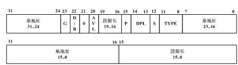

# 虚拟地址翻译成物理地址

## 用到的代码

```c
#include <stdio.h>

int i = 0x12345678;
int main(void)
{
    printf("The logical/virtual address of i is 0x%08x", &i);
    fflush(stdout);
    while (i)
        ;
    return 0;
}
```

## [1. 实验地址](https://www.lanqiao.cn/courses/115/learning/?id=573&compatibility=false)

## 2. 博主分析过程

[地址](https://blog.csdn.net/leoabcd12/article/details/122268321?ops_request_misc=%257B%2522request%255Fid%2522%253A%2522171115295416800222836403%2522%252C%2522scm%2522%253A%252220140713.130102334..%2522%257D&request_id=171115295416800222836403&biz_id=0&utm_medium=distribute.pc_search_result.none-task-blog-2~all~baidu_landing_v2~default-5-122268321-null-null.142%5Ev99%5Epc_search_result_base3&utm_term=%E5%93%88%E5%B7%A5%E5%A4%A7%E6%93%8D%E4%BD%9C%E7%B3%BB%E7%BB%9F%E6%9D%8E%E6%B2%BB%E5%86%9B%E5%AE%9E%E9%AA%8C&spm=1018.2226.3001.4187)

 

 

段描述符的样子：

 

 我们看到段选择符是一个64位二进制的数，存放了段基址和段限长等重要的数据。

+ P（Present）：是段是否存在的标记；
+ S
  + S=0：表示是系统段描述符；
  + S=1：表示是代码或数据段描述符；

+ 四位的TYPE：用来表示段的类型，比如数据段、代码段、可读、可写等；
+ DPL：表示段的权限，和CPL、RPL对应使用；
+ G：表示粒度
  + G=0：表示段限长以位为单位；
  + G=1：表示段限长以4KB为单位；


页目录项和页表项的结构 ：

 

 

