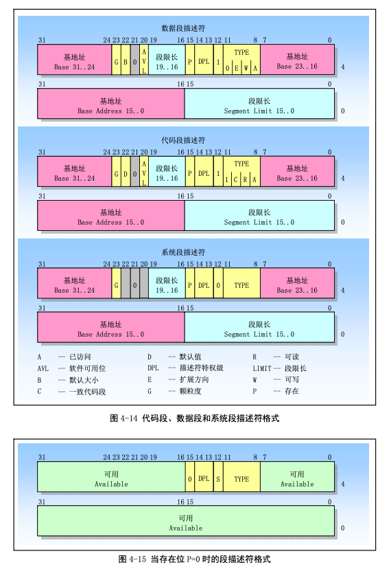

# 虚拟地址翻译成物理地址

## 用到的代码

```c
#include <stdio.h>

int i = 0x12345678;
int main(void)
{
    printf("The logical/virtual address of i is 0x%08x", &i);
    fflush(stdout);
    while (i)
        ;
    return 0;
}
```

## [1. 实验地址](https://www.lanqiao.cn/courses/115/learning/?id=573&compatibility=false)

## 2. 博主分析过程

[地址](https://blog.csdn.net/leoabcd12/article/details/122268321?ops_request_misc=%257B%2522request%255Fid%2522%253A%2522171115295416800222836403%2522%252C%2522scm%2522%253A%252220140713.130102334..%2522%257D&request_id=171115295416800222836403&biz_id=0&utm_medium=distribute.pc_search_result.none-task-blog-2~all~baidu_landing_v2~default-5-122268321-null-null.142%5Ev99%5Epc_search_result_base3&utm_term=%E5%93%88%E5%B7%A5%E5%A4%A7%E6%93%8D%E4%BD%9C%E7%B3%BB%E7%BB%9F%E6%9D%8E%E6%B2%BB%E5%86%9B%E5%AE%9E%E9%AA%8C&spm=1018.2226.3001.4187)

 

 

段描述符的样子：

 

 我们看到段选择符是一个64位二进制的数，存放了段基址和段限长等重要的数据。

+ P（Present）：是段是否存在的标记；
+ S
  + S=0：表示是系统段描述符；
  + S=1：表示是代码或数据段描述符；

+ 四位的TYPE：用来表示段的类型，比如数据段、代码段、可读、可写等；
+ DPL：表示段的权限，和CPL、RPL对应使用；
+ G：表示粒度
  + G=0：表示段限长以位为单位；
  + G=1：表示段限长以4KB为单位；


页目录项和页表项的结构 ：

 

 

## 3. 自己实验

### 3.1 准备工作

 

 

 

### 3.2 段表

 

可以看到 ldtr 的值是 `0x0068=0000000001101000`（二进制），表示 LDT 表存放在 GDT 表的 1101（二进制）=13（十进制）号位置（每位数据的意义参考后文叙述的段选择子）。

而 GDT 的位置已经由 gdtr 明确给出，在物理地址的 `0x00005cb8`。

用 `xp /32w 0x00005cb8` 查看从该地址开始，32 个字的内容，及 GDT 表的前 16 项，如下：

 

GDT 表中的每一项占 64 位（8 个字节），所以我们要查找的项的地址是 `0x00005cb8+13*8`。

输入 `xp /2w 0x00005cb8+13*8`，得到：

 

两步看到的数值可能和这里给出的示例不一致，这是很正常的。如果想确认是否准确，就看 `sreg` 输出中，ldtr 所在行里，`dl` 和 `dh` 的值，它们是 Bochs 的调试器自动计算出的，你寻找到的必须和它们一致。

“0x**a2d0**0068 0x**00**0082**f9**” 将其中的加粗数字组合为“0x00f9a2d0”，这就是 LDT 表的物理地址（为什么这么组合，参考后文介绍的段描述符）。

`xp /8w 0x00f9a2d0`，得到：

 

这就是 LDT 表的前 4 项内容了。

### 3.3 段描述符

在保护模式下，段寄存器有另一个名字，叫段选择子，因为它保存的信息主要是该段在段表里索引值，用这个索引值可以从段表中“选择”出相应的段描述符。

先看看 ds 选择子的内容，还是用 `sreg` 命令：

 

可以看到，ds 的值是 `0x0017`。段选择子是一个 16 位寄存器。

看看上面的 ds，`0x0017=0000000000010111`（二进制），所以 RPL=11，可见是在最低的特权级（因为在应用程序中执行），TI=1，表示查找 LDT 表，索引值为 10（二进制）= 2（十进制），表示找 LDT 表中的第 3 个段描述符（从 0 开始编号）。

LDT 和 GDT 的结构一样，每项占 8 个字节。所以第 3 项 `0x00003fff 0x10c0f300`（上一步骤的最后一个输出结果中） 就是搜寻好久的 ds 的段描述符了。

### 3.4 段基址和线性地址

费了很大的劲，实际上我们需要的只有段基址一项数据，即段描述符 “0x**0000**3fff 0x**10**c0f3**00**” 中加粗部分组合成的 “0x10000000”。这就是 ds 段在线性地址空间中的起始地址。用同样的方法也可以算算其它段的基址，都是这个数。

段基址+段内偏移，就是线性地址了。所以 ds:0x3004 的线性地址就是：

```bash
0x10000000 + 0x3004 = 0x10003004
```

用 `calc ds:0x3004` 命令可以验证这个结果。

 

### 3.5 页表

线性地址变成物理地址

首先需要算出线性地址中的页目录号、页表号和页内偏移，它们分别对应了 32 位线性地址的 10 位 + 10 位 + 12 位，所以 0x10003004 的页目录号是 64，页号 3，页内偏移是 4。

IA-32 下，页目录表的位置由 CR3 寄存器指引。“creg”命令可以看到：

 

说明页目录表的基址为 0。看看其内容，“xp /68w 0”：

 

页目录表和页表中的内容很简单。这 32 位中前 20 位是物理页框号，后面是一些属性信息（其中最重要的是最后一位 P）。其中第 65 个页目录项就是我们要找的内容，用“xp /w 0+64*4”查看：

 

页表所在物理页框号为 0x00f97，即页表在物理内存的 0x00f97000 位置。从该位置开始查找 3 号页表项，得到（xp /w 0x00f97000+3*4）：

 

### 3.6 物理地址

线性地址 0x10003004 对应的物理页框号为 0x00f96，和页内偏移 0x004 接到一起，得到 0x00f96004，这就是变量 i 的物理地址。可以通过两种方法验证。

 

现在，通过直接修改内存来改变 i 的值为 0，命令是： setpmem 0x00f96004 4 0，表示从 0x00f96004 地址开始的 4 个字节都设为 0。然后再用“c”命令继续 Bochs 的运行，可以看到 test 退出了，说明 i 的修改成功了，此项实验结束。

 

## 4. 补充知识

### 4.1 Linux内核使用描述符表的示意图

 

### 4.2 页目录表和页表结构示意图

 

+ 每个页目录项和页表项都是4个字节大小；
+ 每个页表项用来指定一页物理内存页；
+ 页目录表占用一页内存，所以最多可以寻址1024个页表；
+ 一个页表最多可以寻址1024个物理内存页面；
+ 一个页目录表所寻址的所有页表共可以寻址：`1024*1024*4096=4G`；
  + 页目录项：2的10次方
  + 页表项：2的10次方
  + 页内偏移值：2的12次方
  + 汇总起来就是4G
+ Linux0.11中所有进程都使用一个页目录表，而每个进程都有自己的页表；

### 4.3 页目录表项和页表项结构

 

+ P：页面存在于内存标志；
+ R/W：读写标志；
+ U/S：用户/超级用户标志；
+ A：页面已访问标志；
+ D：页面内容已修改标志；
+ 页帧地址：也就是物理页框号；

### 4.4 线性地址变化示意图

 

### 4.5 线性地址对应的物理地址

 

+ 对于第一个进程（任务0），其页表是在页目录表之后，共4页；

+ 对于应用程序的进程，其页表所使用的内存是在进程创建时向内存管理程序申请的，因此是在主内存区中；

一个系统中可以同时存在多个页目录表，但是在某个时刻只有一个页目录表可用。当前的页目录表是用CPU寄存器CR3来确定的，它存储着当前页目录表的物理内存地址。

## 5. 用到的知识串线

### 5.1 重要寄存器

#### 5.1.1 内存管理寄存器

 

#### 5.1.2 控制寄存器

 

#### 5.1.3 段寄存器

主要用于存放段选择符。

程序中由16位的段和32位偏移构成的48位地址或长指针称为一个逻辑地址（虚拟地址）。它唯一确定了一个数据对象的段地址和段内偏移。而仅由32位偏移地址或指针指定的地址是基于当前段的对象地址。

+ CS：
  + 用于寻址代码段；
  + 在任何给定时刻由CS寻址的段称为当前代码段，此时EIP寄存器中包含了当前代码段内下一条要执行指令的段内偏移地址，因此要执行指令的地址可以表示为`CS:[EIP]`；
  + 段间转移指令可以被用来为CS和EIP赋予新值，从而可以把执行位置改变到其他的代码段中，这样就实现了在不同段中程序的控制转移；
+ DS：用于寻址数据段（当指令中没有指定所操作数据的段时，那么DS将是默认的数据段寄存器）；
+ ES
+ SS：
  + 用于寻址堆栈段；
  + 由段寄存器SS寻址的段称为当前堆栈段。栈顶由ESP寄存器内容指定。因此堆栈顶处的地址是`SS:[ESP]`；
+ FS
+ GS

偏移地址=`基地址+（变址*比例因子）+偏移量`

### 5.2 地址变换

计算机中的物理内存是字节的线性数组，每个字节具有一个唯一的物理地址。

内存管理机制将逻辑地址（虚拟地址）转换为物理地址。

为什么要分段和分页？

为了减少确定地址变换需要的信息，变换和映射通常以内存块为操作单位。

物理地址空间定义为：处理器在其地址总线上能够产生的地址范围。

### 5.3 虚拟地址到物理地址的变换过程

 

### 5.4 逻辑地址、线性地址和物理地址之间的变换

 

### 5.5 逻辑地址映射到线性地址

 

 

### 5.6 段描述符表

 

段描述符表是段描述符的一个数组，描述符表的长度可变，最多可以包含8192个8字节描述符。

系统中所有任务共享的段由GDT来映射。

 

### 5.7 段选择符

 

+ TI：指出去哪查询该段描符符
  + TI=0：表示描述符在GDT中；
  + TI=1：表示描述符在LDT中；
+ RPL：提供了段保护信息
  + RPL=00：内核级别；
  + RPL=11：用户级别；

 

### 5.8 段描述符

#### 5.8.1 格式

 

#### 5.8.2 各字段含义

 

 

#### 5.8.3 格式汇总

 

### 5.9 分页机制

#### 5.9.1 线性地址转换为物理地址

 

 

#### 5.9.2 页目录项和页表项的格式

 

