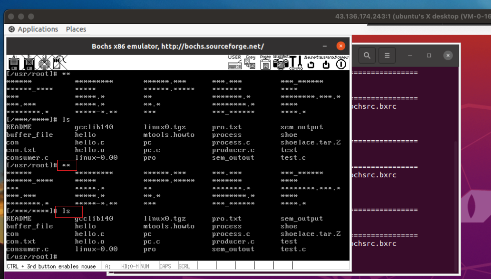

# 终端设备的控制

## 参考资料

+ 实验地址：https://www.lanqiao.cn/courses/115/learning/?id=574&compatibility=false
+ [博主1](https://blog.csdn.net/leoabcd12/article/details/122268321?ops_request_misc=%257B%2522request%255Fid%2522%253A%2522171115295416800222836403%2522%252C%2522scm%2522%253A%252220140713.130102334..%2522%257D&request_id=171115295416800222836403&biz_id=0&utm_medium=distribute.pc_search_result.none-task-blog-2~all~baidu_landing_v2~default-5-122268321-null-null.142%5Ev99%5Epc_search_result_base3&utm_term=%E5%93%88%E5%B7%A5%E5%A4%A7%E6%93%8D%E4%BD%9C%E7%B3%BB%E7%BB%9F%E6%9D%8E%E6%B2%BB%E5%86%9B%E5%AE%9E%E9%AA%8C&spm=1018.2226.3001.4187)

## 重要关系图

 

 

## 开始实验

### 1. 修改kernel/chr_drv/tty_io.c

 

```c
int switch_show_char_flag = 0;
void press_f12_handle(void) 
{
	if(switch_show_char_flag == 0) {
		switch_show_char_flag = 1;
	}
	else if (switch_show_char_flag = 1) {
		switch_show_char_flag = 0;
	}
}
```

### 2. 修改include/linux/tty.h

 

```c
extern int switch_show_char_flag;
void press_f12_handle(void);
```

### 3. 修改kernel/chr_drv/keyboard.S

 

### 4. 修改kernel/chr_drv/console.c

 

### 5. 结果展示

 

## 完整代码

https://github.com/niu0217/HGDOS/tree/Lib7

