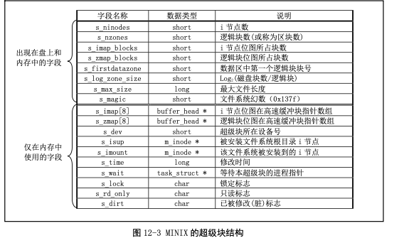
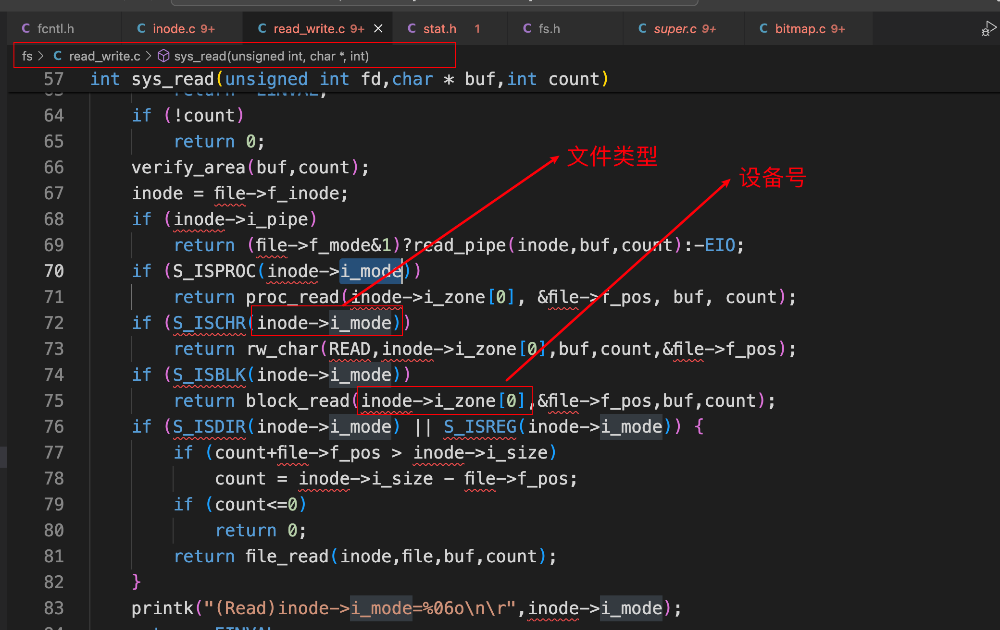
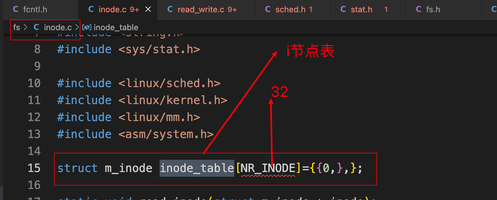
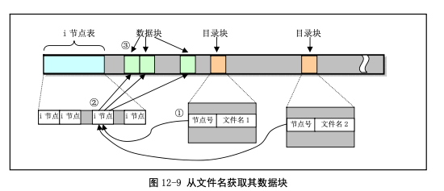

# Linux0.11内核完全注释-文件系统

## 1. MINIX文件系统

### 1.1 360K的软盘

 

### 1.2 硬盘设备上的分区和文件系统

 

### 1.3 MINIX的超级块结构

超级块用于存放盘设备上文件系统结构的信息，并说明各部分的大小。

 

 

 

 

### 1.4 MINIX的逻辑块位图

 

 

 

### 1.5 MINIX的i节点位图

 

 

 

### 1.6 MINIX的i节点结构

盘上的`i节点`部分存放着文件系统中文件或目录名的索引节点，每个文件或目录名都有一个`i节点`。

每个`i节点结构`中存放着对应文件的相关信息。

 

 

#### 1.6.1 i_mode字段解释

i_mode字段用来保存文件的类型和访问权限属性。

+ 比特位15-12：保存文件的类型；
+ 比特位11-9：保存执行文件时设置的信息；
+ 比特位8-0：表示文件的访问权限；

 

 

 

 

#### 1.6.2 i_zone[9]字段解释

 文件中的数据是放在磁盘块的数据区中的，而一个文件名则通过对应的`i节点`与这些数据磁盘块相联系，这些盘块的号码就存放在`i节点`的逻辑块数组`i_zone[]`中。

`i_zone[]`数组用于存放i节点对应文件的盘块号。

+ `i_zone[0]`到`i_zone[6]`用于存放文件开始的7个磁盘块号，称为直接块。若文件长度小于等于7K字节，则根据其i节点可以很快就找到它所使用的盘块。
+ 若文件长度比7K大一些，则需要用到一次间接块了（`i_zone[7]`），这个盘块中存放着附加的盘块号。对于MINIX文件系统它可以存放512个盘块号，因此可以寻址512个盘块。
+ 若文件长度再大一些，就需要用到二次间接盘块了（`i_zone[8]`），二次间接盘块的一级盘块作用类似于一次间接盘块，因此使用二次间接盘块可以寻址`512*512个`盘块。

 

对于`/dev`目录下的设备文件来说，它们并不占用磁盘数据区中的数据盘块，即它们文件的长度是0。

设备文件名的`i节点`仅用于保存其所定义设备的属性和设备号。设备号被存放在设备文件`i节点`的`zone[0]`中。

 

### 1.7 MINIX的i节点表

 

`i节点0`的结构被初始化为全0，并在创建文件系统时将`i节点0`的比特位置位。

## 2. 文件的类型、属性和目录项

### 2.1 文件的类型和属性

 

 

解析其中的一个：

```bash
drwxrwxr-x 2 ubuntu ubuntu   4096 Apr 19 12:48 boot
```

+ `d`：目录名
+ `rwxrwxr-x`：
  + 用户：可读可写可执行
  + 同组：可读可写可执行
  + 其他人：可读可执行不可写
+ `2`：链接计数
+ `ubuntu`：用户名
+ `ubuntu`：组名
+ `4096`：文件大小
+ `Apr 19 12:48`：最后修改时间
+ `boot`：文件名字

 

### 2.2 文件系统的目录项结构

#### 2.2.1 目录项结构

**文件的目录项结构：**

 

每个目录项只包括一个长度为14字节的文件名字符串和该文件名对应的2字节的i节点号。

因此一个逻辑磁盘块可以存放1024/16=64个目录项。

有关文件的其他信息则被保存在该`i节点号`指定的`i节点结构`中，该结构中主要包括文件访问属性、宿主、长度、访问保存时间以及所在磁盘块等信息。每个`i节点号`的`i节点`都位于磁盘上的固定位置处。

#### 2.2.2 通过文件名找磁盘块

 

 

+ 通过对用户程序指定的文件名，我们可以找到对应的目录项；
+ 通过目录项中的`i节点号`就可以找到`i节点表`中相应的`i节点结构`；
+ `i节点结构`中包含着该文件数据的块号信息，因此最终可以得到文件名对应的数据信息；

上图中有两个目录项指向了同一个`i节点`，因此根据这两个文件名都可以得到磁盘上相同的数据。每个`i节点结构`中都有一个链接计数字段`i_nlinks`记录着指向该`i节点`的目录项数，即文件的硬链接计数值。

在执行删除文件的操作时，只有当i节点链接计数值等于0的时候内核才会真正删除磁盘上的该文件的数据。另外，由于目录项中`i节点号`仅能用于当前文件系统中，因此不能使用一个文件系统的目录项来指向另一个文件系统中的`i节点`，即硬链接不能跨越文件系统。

#### 2.2.3 分析.和..

 

 

#### 2.2.4 目录结构例子

 

 

 

 

### 2.3 补充知识：符号链接和硬链接

#### 2.3.1 符号链接

**优点：**

符号链接（Symbolic links，也称为软链接）是一种特殊类型的文件，用于指向另一个文件或目录。它们提供了在文件系统中创建指向另一个文件或目录的快捷方式的方法。符号链接的作用包括以下几点：

1. **路径简化**：符号链接可以帮助简化文件系统的路径，使得文件的访问更加方便。通过在需要访问的位置创建符号链接，用户可以直接使用链接来查找文件，而无需知道实际文件的存储位置。
2. **跨文件系统访问**：符号链接可以创建在不同文件系统间跳转的方式。例如，如果需要在不同的驱动器或分区中共享文件，可以使用符号链接在不同的位置间建立链接。
3. **兼容性和扩展性**：符号链接可以帮助处理文件路径改变或文件迁移时的问题。如果文件被移动到不同的目录或文件夹，符号链接可以保持不变，从而保证程序能够正常运行。
4. **实现一个文件在多个位置访问**：通过在需要的位置创建符号链接，可以使得同一个文件能够在多个位置访问，而不需要复制多个实际文件。

总的来说，符号链接提供了一种灵活的方式来管理文件系统中的文件和目录，使得文件的访问和操作更加方便，同时也有助于维护文件系统的结构和可维护性。

**举例：**

假设你有一个存储在 `/home/user/documents` 目录下的文件 `report.txt`，现在你希望能够在 `/var/www/html` 目录下访问这个文件，但又不想复制文件到新的位置。这时你可以使用符号链接来实现这一目的。

你可以在 `/var/www/html` 目录下创建一个符号链接，指向 `/home/user/documents/report.txt` 文件。这样做的话，你就可以通过访问符号链接来读取或操作原始文件，而不必担心复制多份文件导致管理混乱。

具体操作步骤如下（假设你当前位于 `/var/www/html` 目录下）：

1. 创建符号链接：

```bash
ln -s /home/user/documents/report.txt report_link.txt
```

这将在 `/var/www/html` 目录下创建名为 `report_link.txt` 的符号链接，指向 `/home/user/documents/report.txt` 文件。

1. 现在，通过 `report_link.txt` 这个符号链接，你就可以直接访问原始文件 `report.txt`：

```bash
cat report_link.txt    # 显示 report.txt 的内容
```

这样，你就可以通过符号链接在不同位置访问同一个文件，而无需复制文件到新的位置。

#### 2.3.2 硬链接

**优点：**

硬链接（Hard links）是文件系统中的一个概念，它允许一个文件有多个文件路径指向同一个索引节点（inode）。硬链接与符号链接（软链接）不同，它们指向的是文件系统中的实际数据块，而不是一个路径的字符串。当你创建一个硬链接时，实际上是增加了一个指向已存在文件的新目录项，而不是创建一个新的文件副本。

以下是关于硬链接的一些重要点：

1. **多个路径指向相同的数据**：硬链接允许多个文件名指向同一个数据块，这意味着无论你通过哪个文件名来访问文件，最终访问的都是相同的数据。
2. **没有所有者之分**：硬链接创建后，并没有主文件和副本的概念，所有的硬链接都指向同一个文件。
3. **文件修改的影响**：如果你修改了一个硬链接指向的文件，不管是对文件内容进行修改还是删除文件，所有的硬链接都会受到影响，因为它们都指向相同的数据块。
4. **文件系统限制**：硬链接只能在同一个文件系统内创建，因为硬链接实际上是指向了文件系统中的 inode，而不是一个路径。因此，你无法在不同的文件系统间创建硬链接。

总的来说，硬链接提供了一种有效的方式来在文件系统中共享同一份数据，节省存储空间，并确保文件的更新和访问都是同步的。

**举例：**

假设在你的系统中有一个文件 `/home/user/file.txt`，现在我们将通过创建硬链接来演示硬链接的工作方式。

1. 首先，使用以下命令在同一文件系统下创建一个硬链接（假设你当前位于 `/home/user` 目录下）：

```bash
ln /home/user/file.txt /home/user/hardlink.txt
```

这将创建一个名为 `hardlink.txt` 的硬链接，指向原始文件 `file.txt`。

2. 然后，你可以对 `file.txt` 或 `hardlink.txt` 进行操作。无论你使用哪个文件名，实际上修改的都是同一个数据。

```bash
echo "Hello, this is a test" >> /home/user/file.txt
```

现在，如果你查看 `hardlink.txt` 的内容，你会发现它也包含相同的文本，因为 `hardlink.txt` 和 `file.txt` 实际上指向了同一个数据块。

3. 如果你删除 `file.txt`，`hardlink.txt` 仍然可以访问相同的数据，因为硬链接实际上指向的是文件系统中的 inode，而不是文件名。

```bash
rm /home/user/file.txt
```

即使你删除了 `file.txt`，`hardlink.txt` 仍然可以继续访问相同的数据。

通过这个例子，你可以看到硬链接的工作方式：它们允许多个文件名指向同一个数据块，使得文件共享数据，节省存储空间，并确保数据的同步性。