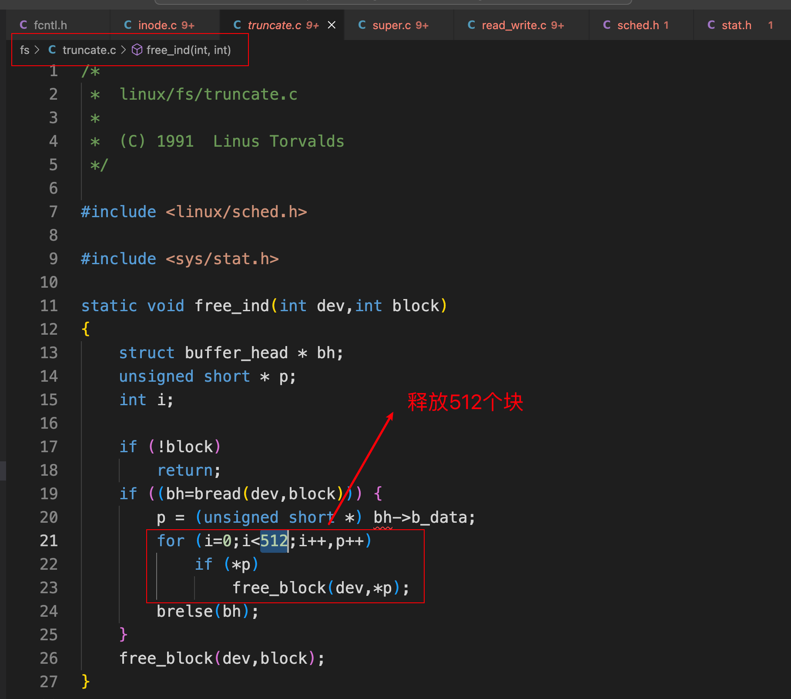

# Linux0.11内核完全注释-文件系统2

## 1. 高速缓存区

 

 

## 2. 文件系统底层函数

### 2.1 fs/bitmap.c

fs/bitmap.c：包括对i节点位图和逻辑块位图进行释放和占用处理函数

操作i节点位图：

 

 

操作逻辑块位图：

 

 

### 2.2 fs/truncate.c

 

 

 

### 2.3 fs/inode.c

+ 分配`i节点`函数`iget()`
+ 放回对内存`i节点`存取函数`iput()`
+ 根据`i节点`信息取文件数据块在设备上对应的逻辑块号函数`bmap()`

### 2.4 fs/namei.c

 

### 2.5 fs/super.c

专门用于处理文件系统超级块；

还包括几个文件系统加载/卸载处理函数和系统调用；

### 2.6 层次关系

 

## 3. 文件中数据的访问操作

### 3.1 文件数据访问函数

 

### 3.2 具体函数概括

 

 

### 3.3 管理对文件的操作访问

#### 3.3.1 文件结构file

 

  

+ f_mode：类似于m_inode中的i_mode；

+ 常用的`f_flags`

 

+ f_count：指出本文件被文件句柄引用的次数计数；
+ f_inode：内存i节点结构字段f_inode指向本文件对应`i节点表`中的内存`i节点结构项`；
+ f_pos：文件指针的位置；

#### 3.3.2 文件表file_table

文件表`file_table`是内核中由文件结构项组成的数组，在Linux0.11内核中文件表最多可有64项，因此整个系统同时最多打开64个文件。

 

在进程的数据结构中，专门定义有本进程打开文件的文件结构指针数组`filp[NR_OPEN]`字段，其中NR_OPEN=20，因此每个进程最多可同时打开20个文件。该指针数组项的顺序号即对应文件的描述符值，而项的指针则指向文件表中打开的文件项。比如`filp[0]`即是进程当前打开文件描述符0对应的文件结构指针。

 

#### 3.3.3 i节点表inode_table

内核中`i节点表`inode_table[NR_INODE]是由内存`i节点结构`组成的数组，其中NR_INODE=32，因此在某一时刻内核中同时只能保存32个内存`i节点`信息。

 

 

#### 3.3.4 进程打开文件使用的内核数据结构

 

## 4. 文件和目录管理系统调用

 

