# Linux0.11内核完全注释-文件系统3

## 引入

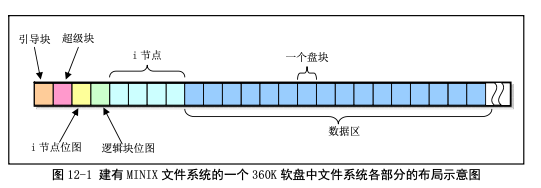 

## 1. 360KB软盘中文件系统实例分析

### 1.1 制作一个文件系统

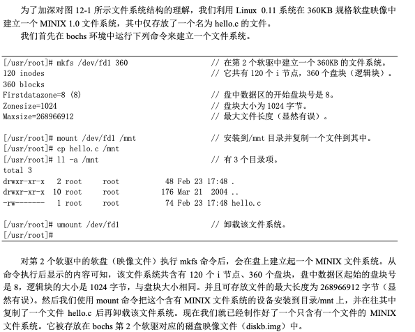 

### 1.2 查看我们制作的文件系统

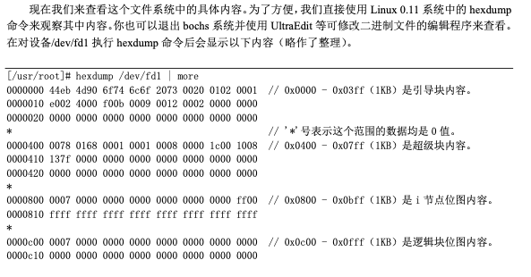 

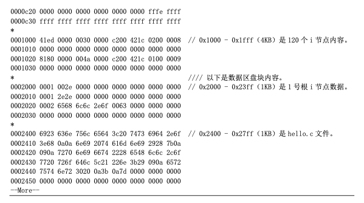 

### 1.3 详细分析

#### 1.3.1 引导块

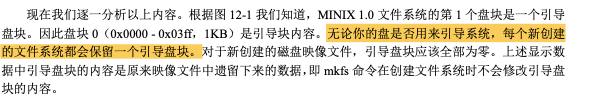 

#### 1.3.2 超级块 

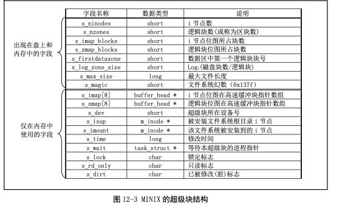 

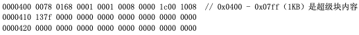  

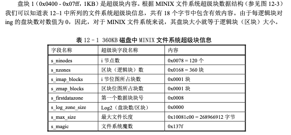 

#### 1.3.3 i节点位图

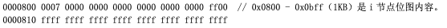 

 

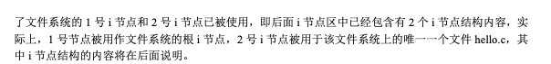 

#### 1.3.4 逻辑块位图

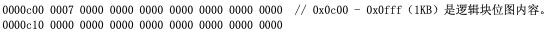 

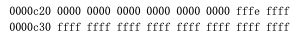 

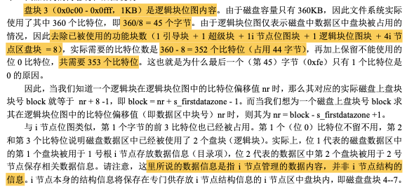 

#### 1.3.5 i节点结构信息

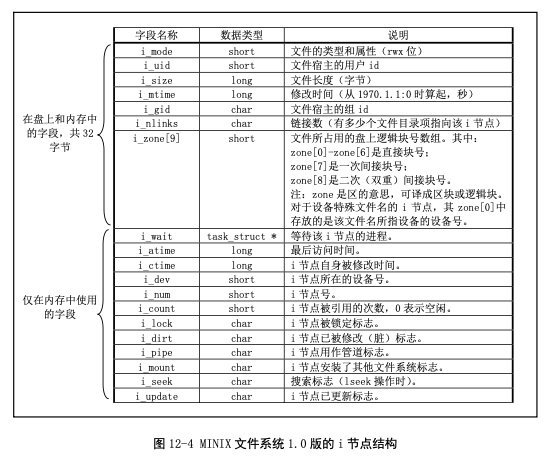 

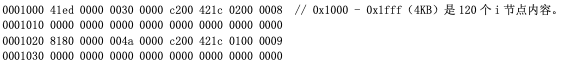 

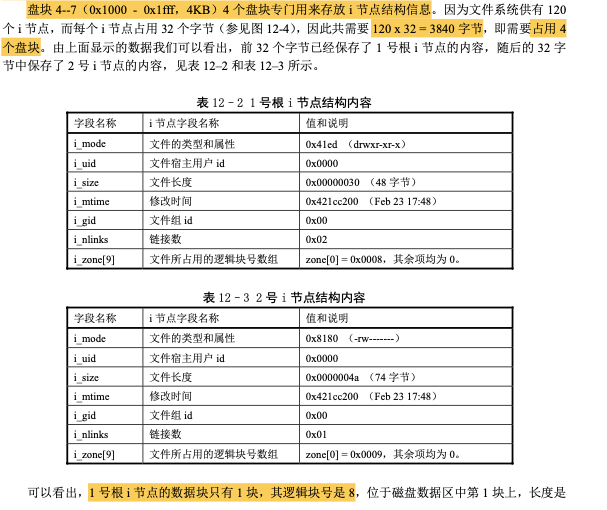 

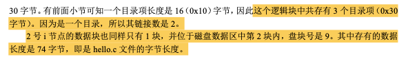 

#### 1.3.6 数据区

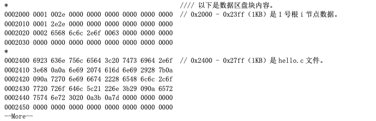  

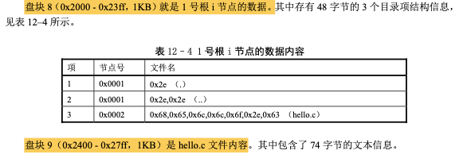 

## 2. read函数调用执行过程

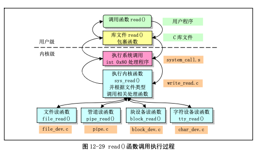 

