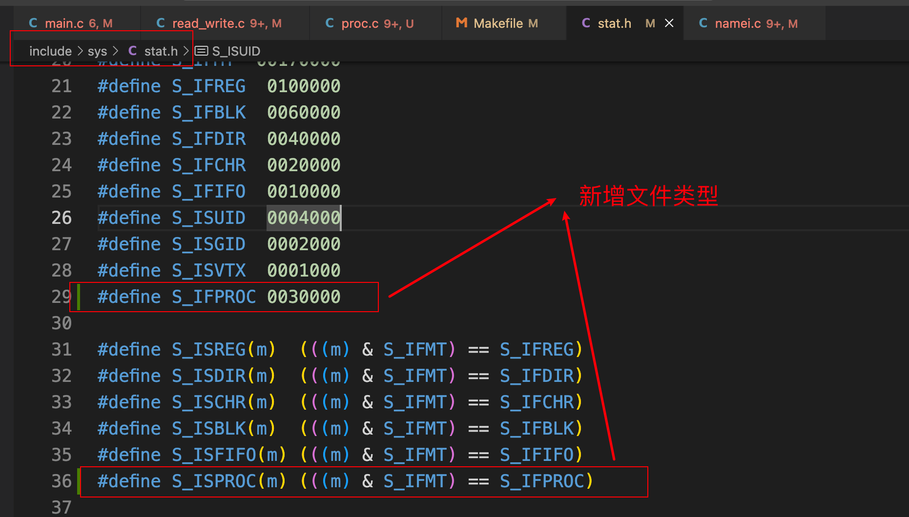
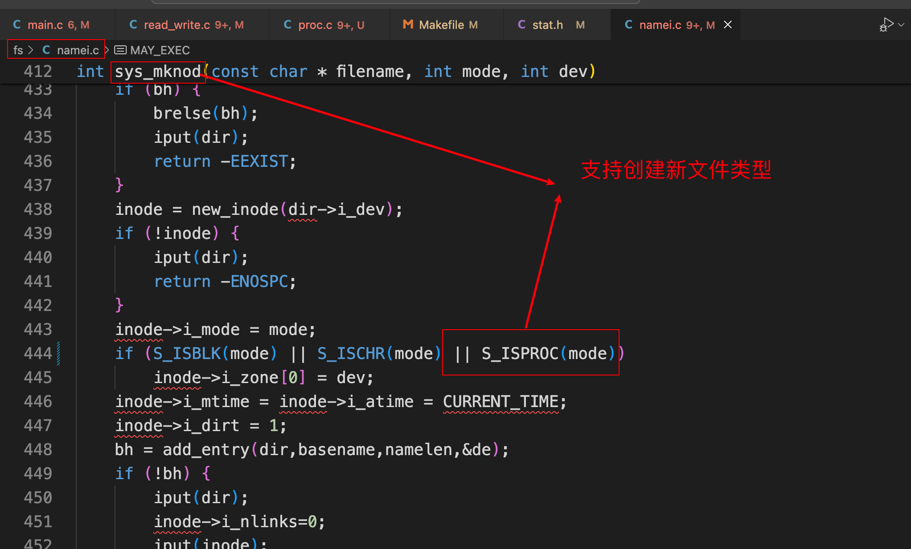
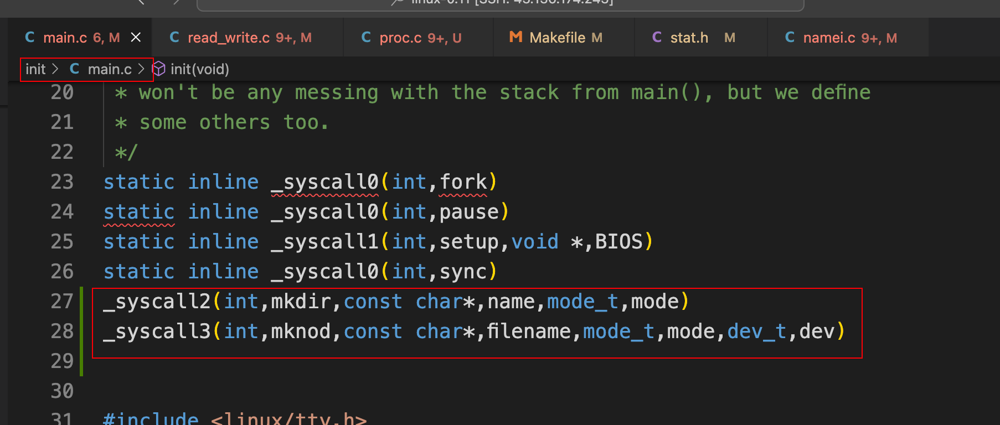
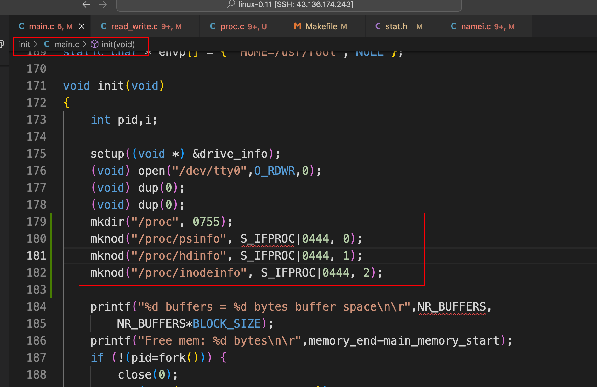
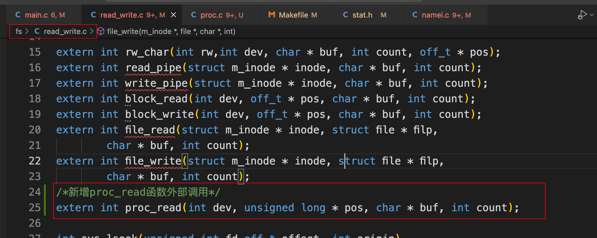
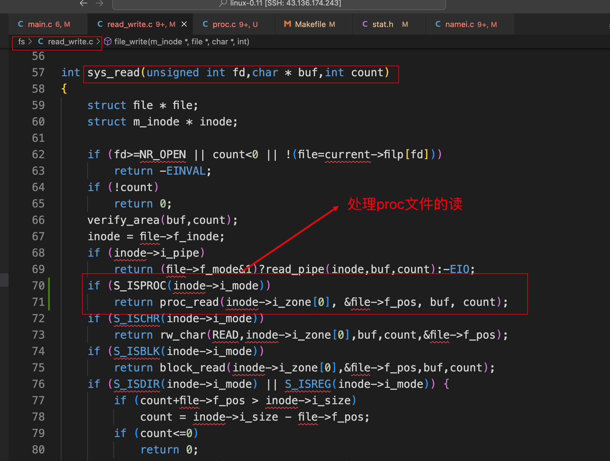
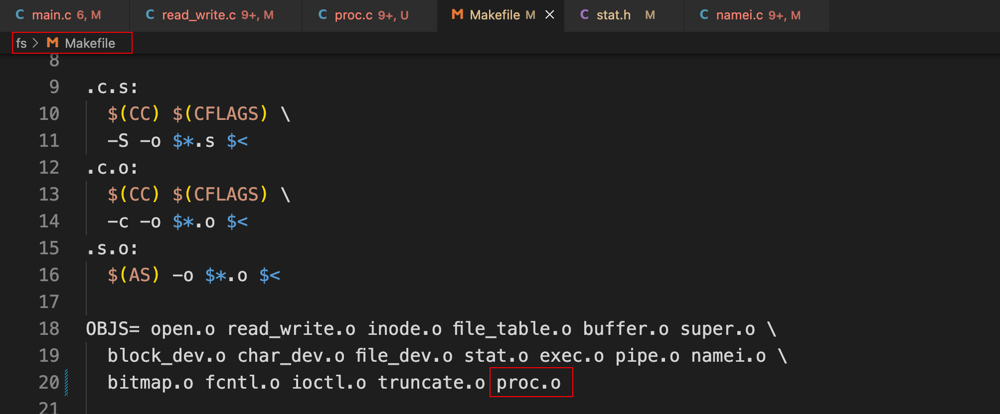
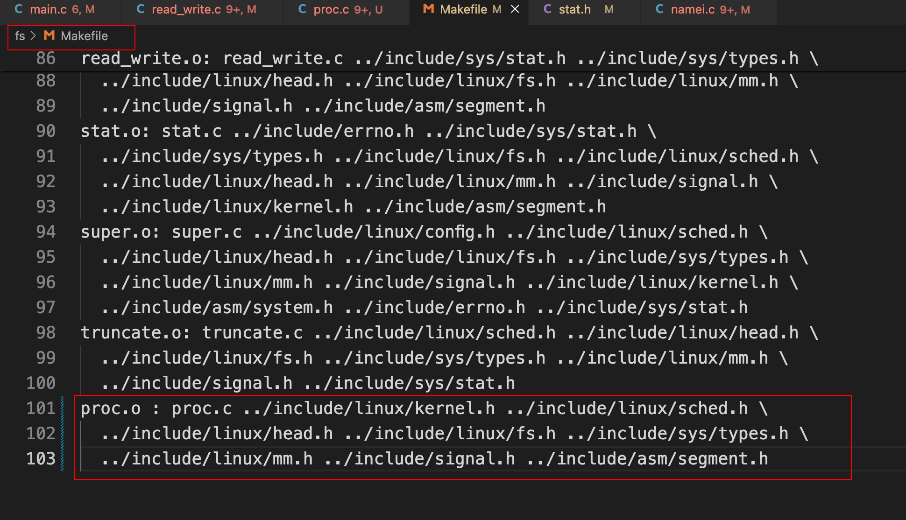
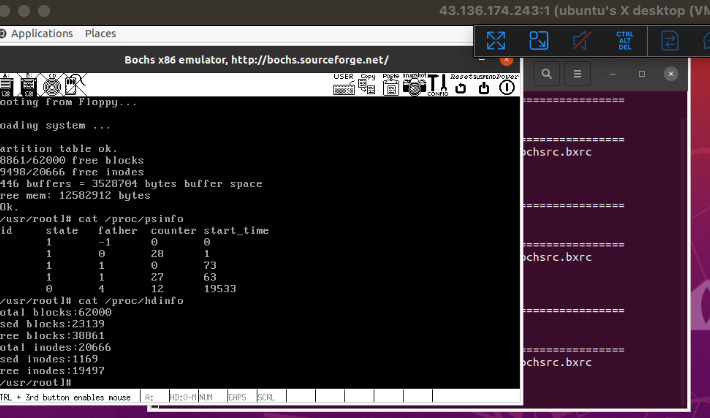

# proc文件系统的实现

## 参考资料

+ 实验地址：https://www.lanqiao.cn/courses/115/learning/?id=575&compatibility=false

+ [博主1](https://blog.csdn.net/leoabcd12/article/details/122268321?ops_request_misc=%257B%2522request%255Fid%2522%253A%2522171115295416800222836403%2522%252C%2522scm%2522%253A%252220140713.130102334..%2522%257D&request_id=171115295416800222836403&biz_id=0&utm_medium=distribute.pc_search_result.none-task-blog-2~all~baidu_landing_v2~default-5-122268321-null-null.142%5Ev99%5Epc_search_result_base3&utm_term=%E5%93%88%E5%B7%A5%E5%A4%A7%E6%93%8D%E4%BD%9C%E7%B3%BB%E7%BB%9F%E6%9D%8E%E6%B2%BB%E5%86%9B%E5%AE%9E%E9%AA%8C&spm=1018.2226.3001.4187)

## 1. 开始实验

### 1.1 修改include/sys/stat.h

 

### 1.2 修改fs/namei.c

 

### 1.3 修改init/main.c

 

 

```c
_syscall2(int,mkdir,const char*,name,mode_t,mode)
_syscall3(int,mknod,const char*,filename,mode_t,mode,dev_t,dev)
  
mkdir("/proc", 0755);
mknod("/proc/psinfo", S_IFPROC|0444, 0);
mknod("/proc/hdinfo", S_IFPROC|0444, 1);
mknod("/proc/inodeinfo", S_IFPROC|0444, 2);
```

### 1.4 修改fs/read_write.c

 

 

```c
extern int proc_read(int dev, unsigned long * pos, char * buf, int count);

if (S_ISPROC(inode->i_mode))
		return proc_read(inode->i_zone[0], &file->f_pos, buf, count);
```

### 1.5 新增文件fs/proc.c

```c
#include <linux/kernel.h>
#include <linux/sched.h>
#include <asm/segment.h>
#include <linux/fs.h>
#include <stdarg.h>
#include <unistd.h>

#define set_bit(bitnr, addr) ({ \
register int __res ; \
__asm__("bt %2,%3;setb %%al":"=a" (__res):"a" (0),"r" (bitnr),"m" (*(addr))); \
__res; })

char proc_buf[4096] = {'\0'};

extern int vsprintf(char *buf, const char *fmt, va_list args);

// Linux0.11没有sprintf()，该函数是用于输出结果到字符串中的，所以就实现一个，这里是通过vsprintf()实现的。
int sprintf(char *buf, const char *fmt, ...)
{
    va_list args;
    int i;
    va_start(args, fmt);
    i = vsprintf(buf, fmt, args);
    va_end(args);
    return i;
}

int get_psinfo()
{
    int read = 0;
    read += sprintf(proc_buf + read, "%s", "pid\tstate\tfather\tcounter\tstart_time\n");
    struct task_struct **p;
    for (p = &FIRST_TASK; p <= &LAST_TASK; ++p)
        if (*p != NULL)
        {
            read += sprintf(proc_buf + read, "%d\t", (*p)->pid);
            read += sprintf(proc_buf + read, "%d\t", (*p)->state);
            read += sprintf(proc_buf + read, "%d\t", (*p)->father);
            read += sprintf(proc_buf + read, "%d\t", (*p)->counter);
            read += sprintf(proc_buf + read, "%d\n", (*p)->start_time);
        }
    return read;
}

/*
 *  参考fs/super.c mount_root()函数
 */
int get_hdinfo()
{
    int read = 0;
    int i, used;
    struct super_block *sb;
    sb = get_super(0x301); /*磁盘设备号 3*256+1*/
    /*Blocks信息*/
    read += sprintf(proc_buf + read, "Total blocks:%d\n", sb->s_nzones);
    used = 0;
    i = sb->s_nzones;
    while (--i >= 0)
    {
        if (set_bit(i & 8191, sb->s_zmap[i >> 13]->b_data))
            used++;
    }
    read += sprintf(proc_buf + read, "Used blocks:%d\n", used);
    read += sprintf(proc_buf + read, "Free blocks:%d\n", sb->s_nzones - used);
    /*Inodes 信息*/
    read += sprintf(proc_buf + read, "Total inodes:%d\n", sb->s_ninodes);
    used = 0;
    i = sb->s_ninodes + 1;
    while (--i >= 0)
    {
        if (set_bit(i & 8191, sb->s_imap[i >> 13]->b_data))
            used++;
    }
    read += sprintf(proc_buf + read, "Used inodes:%d\n", used);
    read += sprintf(proc_buf + read, "Free inodes:%d\n", sb->s_ninodes - used);
    return read;
}

int get_inodeinfo()
{
    int read = 0;
    int i;
    struct super_block *sb;
    struct m_inode *mi;
    sb = get_super(0x301); /*磁盘设备号 3*256+1*/
    i = sb->s_ninodes + 1;
    i = 0;
    while (++i < sb->s_ninodes + 1)
    {
        if (set_bit(i & 8191, sb->s_imap[i >> 13]->b_data))
        {
            mi = iget(0x301, i);
            read += sprintf(proc_buf + read, "inr:%d;zone[0]:%d\n", mi->i_num, mi->i_zone[0]);
            iput(mi);
        }
        if (read >= 4000)
        {
            break;
        }
    }
    return read;
}

int proc_read(int dev, unsigned long *pos, char *buf, int count)
{

    int i;
    if (*pos % 1024 == 0)
    {
        if (dev == 0)
            get_psinfo();
        if (dev == 1)
            get_hdinfo();
        if (dev == 2)
            get_inodeinfo();
    }
    for (i = 0; i < count; i++)
    {
        if (proc_buf[i + *pos] == '\0')
            break;
        put_fs_byte(proc_buf[i + *pos], buf + i + *pos);
    }
    *pos += i;
    return i;
}

```

### 1.6 修改fs/Makefile

 

 

```makefile
OBJS=	open.o read_write.o inode.o file_table.o buffer.o super.o \
	block_dev.o char_dev.o file_dev.o stat.o exec.o pipe.o namei.o \
	bitmap.o fcntl.o ioctl.o truncate.o proc.o
	
proc.o : proc.c ../include/linux/kernel.h ../include/linux/sched.h \
  ../include/linux/head.h ../include/linux/fs.h ../include/sys/types.h \
  ../include/linux/mm.h ../include/signal.h ../include/asm/segment.h
```

### 1.7 实验结果

 

## 2. 完整代码

https://github.com/niu0217/HGDOS/tree/Lib8


