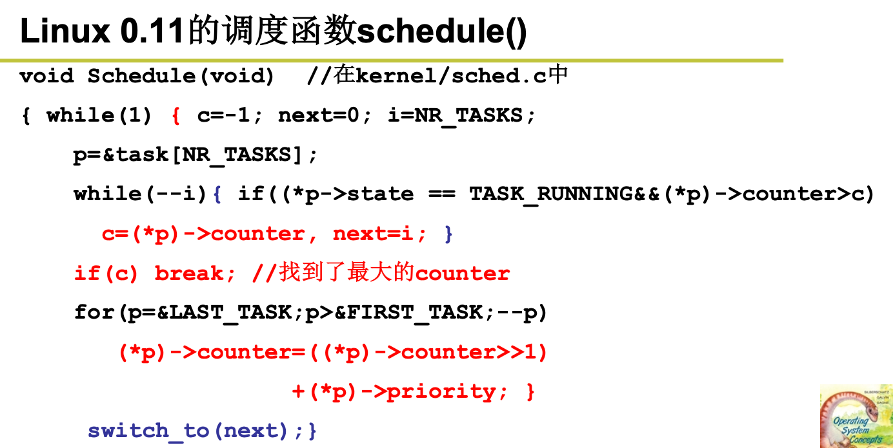
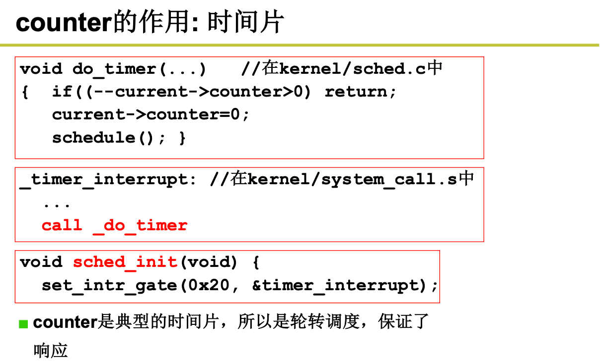
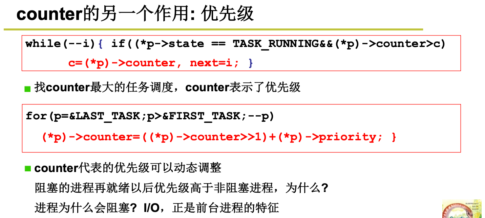
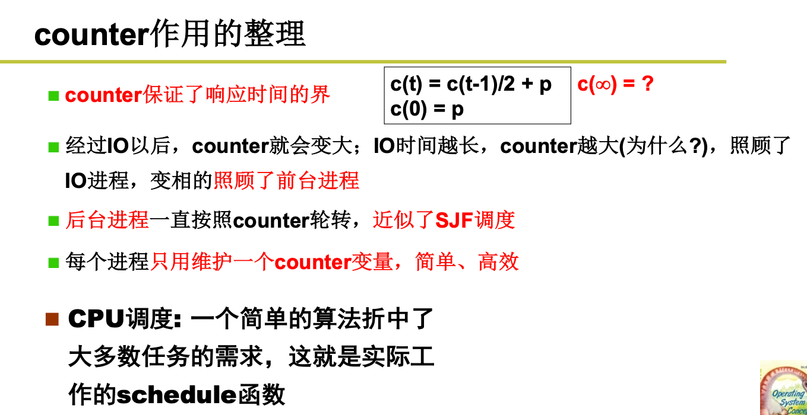

# Linux0.11中的调度函数

## 1. 整体代码

 

## 2. 拆解

### 2.1 时间片概念

 

### 2.2 优先级概念

 

原因：

+ 如果是非阻塞IO的话，时间片会为0，则代表counter为0；
+ 如果是阻塞IO的话，它的时间片不为0，则代表counter不为0；

这样按照上面的算法，非阻塞IO的优先级一定比阻塞IO的优先级低。

## 3. 小结

 

