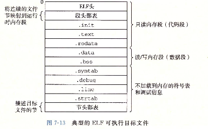
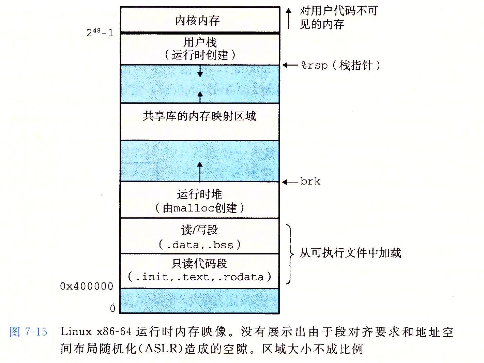
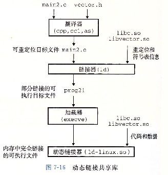

# 可执行目标文件

## 1. 简介

 

+ `ELF头`：描述文件的总体格式。它还包括程序的入口点，也就是当程序运行时要执行的第一条指令的地址。
+ `.text/.rodata/.data/.bss`：和可重定位目标文件中的节是相似的，除了这些节已经被重定位到它们最终的运行时内存地址以外。
+ `.init`：定义了一个小函数，叫做`_init`，程序的初始化代码会调用它。因为可执行文件时完全链接的（已被重定位），所以它不再需要`rel`节。

ELF可执行文件被设计得很容易加载到内存，可执行文件的连续的片（chunk）被映射到连续的内存段。程序头部表描述了这种映射关系。

举例：

```c++
//hello.cpp

#include<iostream>

void printHello()
{
    std::cout<<"你好...\n";
}
```

```c++
//test.cpp

#include<iostream>

const int a = 10;
const int b = 20;
const int c = 0;
const int d = 0;

static int e = 30;
static int f = 40;
static int g = 0;
static int h = 0;

int i = 50;
int j = 60;
int k = 0;
int l = 0;

extern void printHello();

int main()
{
    int* p = new int[10];
    int element1 = 100;
    int element2 = 200;
    printHello();
}
```

```bash
g++ -o test test.cpp hello.cpp

objdump -p test > test.txt
```

输出结果：

```assembly
ubuntu@niu0217:~/Dev/C++ObjectModern/objfile$ cat test.txt

test:     file format elf64-x86-64

Program Header:
    PHDR off    0x0000000000000040 vaddr 0x0000000000000040 paddr 0x0000000000000040 align 2**3
         filesz 0x00000000000002d8 memsz 0x00000000000002d8 flags r--
  INTERP off    0x0000000000000318 vaddr 0x0000000000000318 paddr 0x0000000000000318 align 2**0
         filesz 0x000000000000001c memsz 0x000000000000001c flags r--
    LOAD off    0x0000000000000000 vaddr 0x0000000000000000 paddr 0x0000000000000000 align 2**12
         filesz 0x00000000000007e0 memsz 0x00000000000007e0 flags r--
    LOAD off    0x0000000000001000 vaddr 0x0000000000001000 paddr 0x0000000000001000 align 2**12
         filesz 0x0000000000000355 memsz 0x0000000000000355 flags r-x
    LOAD off    0x0000000000002000 vaddr 0x0000000000002000 paddr 0x0000000000002000 align 2**12
         filesz 0x0000000000000238 memsz 0x0000000000000238 flags r--
    LOAD off    0x0000000000002d78 vaddr 0x0000000000003d78 paddr 0x0000000000003d78 align 2**12
         filesz 0x00000000000002a8 memsz 0x00000000000003f8 flags rw-
 DYNAMIC off    0x0000000000002d98 vaddr 0x0000000000003d98 paddr 0x0000000000003d98 align 2**3
         filesz 0x0000000000000200 memsz 0x0000000000000200 flags rw-
    NOTE off    0x0000000000000338 vaddr 0x0000000000000338 paddr 0x0000000000000338 align 2**3
         filesz 0x0000000000000020 memsz 0x0000000000000020 flags r--
    NOTE off    0x0000000000000358 vaddr 0x0000000000000358 paddr 0x0000000000000358 align 2**2
         filesz 0x0000000000000044 memsz 0x0000000000000044 flags r--
0x6474e553 off    0x0000000000000338 vaddr 0x0000000000000338 paddr 0x0000000000000338 align 2**3
         filesz 0x0000000000000020 memsz 0x0000000000000020 flags r--
EH_FRAME off    0x0000000000002024 vaddr 0x0000000000002024 paddr 0x0000000000002024 align 2**2
         filesz 0x000000000000006c memsz 0x000000000000006c flags r--
   STACK off    0x0000000000000000 vaddr 0x0000000000000000 paddr 0x0000000000000000 align 2**4
         filesz 0x0000000000000000 memsz 0x0000000000000000 flags rw-
   RELRO off    0x0000000000002d78 vaddr 0x0000000000003d78 paddr 0x0000000000003d78 align 2**0
         filesz 0x0000000000000288 memsz 0x0000000000000288 flags r--

Dynamic Section:
  NEEDED               libstdc++.so.6
  NEEDED               libc.so.6
  INIT                 0x0000000000001000
  FINI                 0x0000000000001348
  INIT_ARRAY           0x0000000000003d78
  INIT_ARRAYSZ         0x0000000000000018
  FINI_ARRAY           0x0000000000003d90
  FINI_ARRAYSZ         0x0000000000000008
  GNU_HASH             0x00000000000003a0
  STRTAB               0x00000000000004e8
  SYMTAB               0x00000000000003c8
  STRSZ                0x000000000000011d
  SYMENT               0x0000000000000018
  DEBUG                0x0000000000000000
  PLTGOT               0x0000000000003f98
  PLTRELSZ             0x0000000000000060
  PLTREL               0x0000000000000007
  JMPREL               0x0000000000000780
  RELA                 0x0000000000000660
  RELASZ               0x0000000000000120
  RELAENT              0x0000000000000018
  FLAGS                0x0000000000000008
  FLAGS_1              0x0000000008000001
  VERNEED              0x0000000000000620
  VERNEEDNUM           0x0000000000000002
  VERSYM               0x0000000000000606
  RELACOUNT            0x0000000000000005

Version References:
  required from libc.so.6:
    0x09691a75 0x00 03 GLIBC_2.2.5
  required from libstdc++.so.6:
    0x08922974 0x00 02 GLIBCXX_3.4
```

## 2. 加载可执行目标文件

 

任何Linux程序都可以通过调用`execve`函数来调用加载器。加载器将可执行文件中的代码和数据从磁盘复制到内存中，然后通过跳转到程序的第一条指令或入口点来运行该程序。这个将程序复制到内存并运行的过程叫做加载。

当加载器运行时，它创建上图所示的内存映像。在程序头部表的引导下，加载器将可执行文件的片（chunk）复制到代码段和数据段。接下来，加载器跳转到程序的入口点，也就是`_start`函数的地址。这个函数是在系统目标文件`ctrl.o`中定义的，对所有的C程序都是一样的。`_start`函数调用系统启动函数`__libc_start_main`，该函数定义在`libc.so`中。它初始化执行环境，调用用户层的main函数，处理main函数的返回值，并且在需要的时候把控制返回给内核。

加载器是如何工作的？

+ Linux系统中的每个程序都运行在一个进程上下文中，有自己的虚拟地址空间。当shell运行一个程序时，父shell进程生成一个子进程，它是父进程的一个复制。子进程通过`execve`系统调用启动加载器。
+ 加载器删除子进程现有的虚拟内存段，并创建一组新的代码、数据、堆和栈段。新的堆和栈段被初始化为零。
+ 通过将虚拟地址空间中的页映射到可执行文件的页大小的片（chunk），新的代码和数据段被初始化为可执行文件的内容。
+ 最后，加载器跳转到`_start`地址，它最终会调用应用程序的main函数。
+ 除了一些头部信息，在加载过程中没有任何从磁盘到内存的数据复制。直到CPU引用一个被映射的虚拟页时才会进行复制，此时，操作系统利用它的页面调度机制自动将页面从磁盘传送到内存。

## 3. 动态链接共享库

### 3.1 引入

共享库是一个目标模块，在运行或加载时，可以加载到任意的内存地址，并和一个在内存中的程序链接起来。这个过程称为动态链接，是由一个动态链接器的程序来执行的。共享库也叫做共享目标，在Linux系统中通常用`.so`后缀来表示。微软的操作系统大量地使用了共享库，它们称为DLL（动态链接库）。

共享库是以两种不同的方式来共享的：

+ 在任何给定的文件系统中，对于一个库只有一个`.so`文件。所有引用该库的可执行目标文件共享这个`.so`文件中的代码和数据，而不是像静态库的内容那样被复制和嵌入到引用它们的可执行文件中。
+ 在内存中，一个共享库的`.text`节的一个副本可以被不同的正在运行的进程共享。

 

**举例：**

```bash
ubuntu@niu0217:~/Dev/C++ObjectModern/objfile/shared_library$ tree
.
├── addvec.c
├── main2.c
├── multvec.c
└── vector.h

0 directories, 4 files
```

```c++
//vector.h

void addvec(int* x, int* y, int* z, int n);
void multvec(int* x, int* y, int* z, int n);
```

```c++
//addvec.c

#include "vector.h"

int addcnt = 0;

void addvec(int* x, int* y, int* z, int n) {
    int i;
    addcnt++;
    for(i = 0; i < n; i++) {
        z[i] = x[i] + y[i];
    }
}
```

```c++
//multvec.c

#include "vector.h"

int multcnt = 0;

void multvec(int* x, int* y, int* z, int n) {
    int i;
    multcnt++;
    for(i = 0; i < n; i++) {
        z[i] = x[i] * y[i];
    }
}
```

```c++
//main2.c

#include<stdio.h>
#include "vector.h"

int x[2] = { 1, 2 };
int y[2] = { 3, 4 };
int z[2];

int main()
{
    addvec(x, y, z, 2);
    printf("z = [%d %d]\n", z[0], z[1]);
    return 0;
}
```

### 3.2 制作动态库

```bash
gcc -shared -fpic -o libvector.so addvec.c multvec.c
```

`-fpic`选项指示编译器生成与位置无关的代码。`-shared`选项指示链接器创建一个共享的目标文件。

### 3.3 使用动态库

动态库的搜索路径：

- 1.编译目标代码时指定的动态库搜索路径;
- 2.环境变量`LD_LIBRARY_PATH`指定的动态库搜索路径；
- 3.配置文件`/etc/ld.so.conf`中指定的动态库搜索路径；
- 4.默认的动态库搜索路径`/lib`
- 5.默认的动态库搜索路径 `/usr/lib`。

（1）生成可执行文件：

```bash
gcc -o proc21 main2.c -L. -lvector
```

（2）查看当前路径：

```bash
ubuntu@niu0217:~/Dev/C++ObjectModern/objfile/shared_library$ pwd
/home/ubuntu/Dev/C++ObjectModern/objfile/shared_library
```

（3）终端执行下列命令：

```bash
#必须是绝对路径
LD_LIBRARY_PATH=/home/ubuntu/Dev/C++ObjectModern/objfile/shared_library
export LD_LIBRARY_PATH
```

（4）执行可执行文件并输出

```bash
ubuntu@niu0217:~/Dev/C++ObjectModern/objfile/shared_library$ ./proc21
z = [4 6]
```

### 3.4 总结

```bash
ubuntu@niu0217:~/Dev/C++ObjectModern/objfile/shared_library$ ldd proc21
	linux-vdso.so.1 (0x00007ffd72b79000)
	libvector.so => /home/ubuntu/Dev/C++ObjectModern/objfile/shared_library/libvector.so (0x00007f0bad023000)
	libc.so.6 => /lib/x86_64-linux-gnu/libc.so.6 (0x00007f0bace1f000)
	/lib64/ld-linux-x86-64.so.2 (0x00007f0bad02f000)
```

当加载器加载和运行可执行文件`proc21`的时候，加载部分链接的可执行文件`proc21`。接着，它注意到`proc21`包含一个`.interp`节，这一节包含动态链接器的路径名，动态链接器本身就是一个共享目标（如在Linux系统上的`ld-linux.so`）。加载器不会像它通常所做那样将控制传递给应用，而是加载和运行这个动态链接器。然后，动态链接器通过执行下面的重定位完成链接任务：

+ 重定位`libc.so`的文本和数据到某个内存段；
+ 重定位`libvector.so`的文本和数据到另一个内存段；
+ 重定位`proc21`中所有对`libc.so`和`libvector.so`定义的符号的引用。

最后，动态链接器将控制传递给应用程序。从这时刻开始，共享库的位置就固定了，并且在程序执行的过程中都不会改变。

