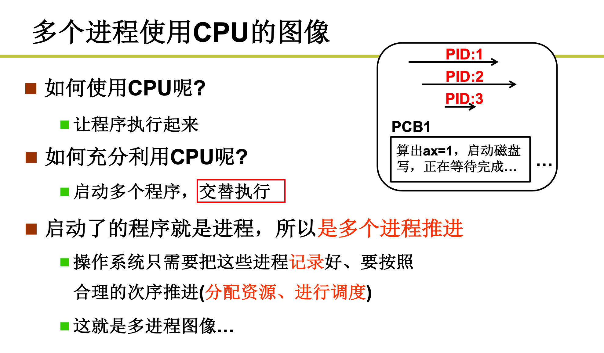
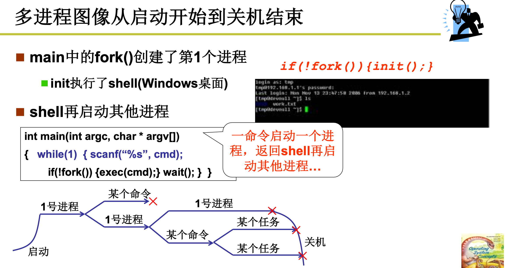
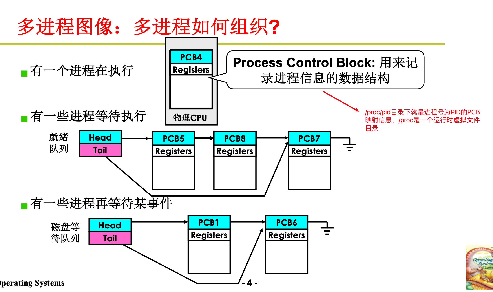
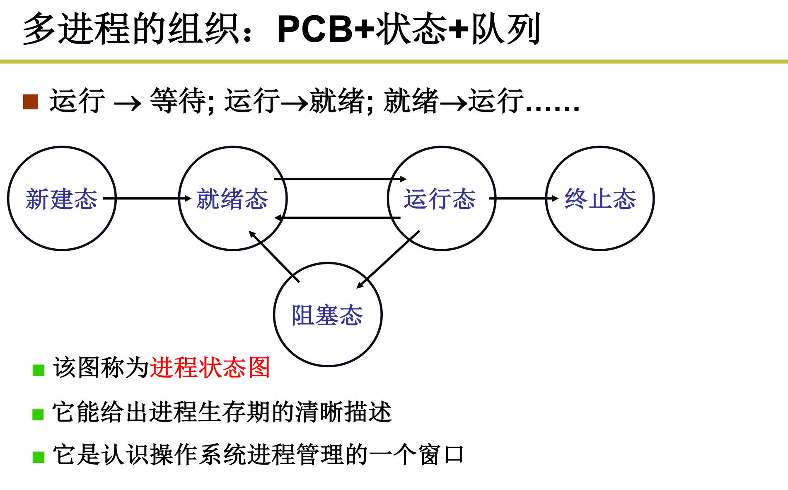
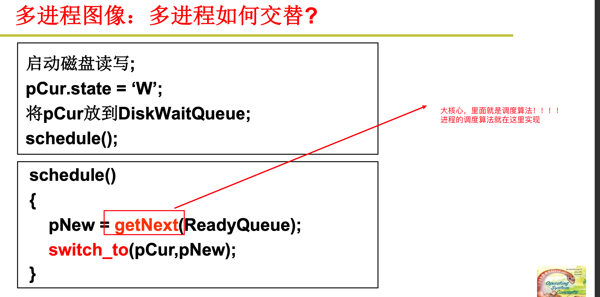
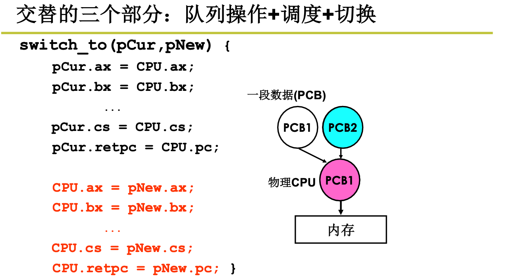
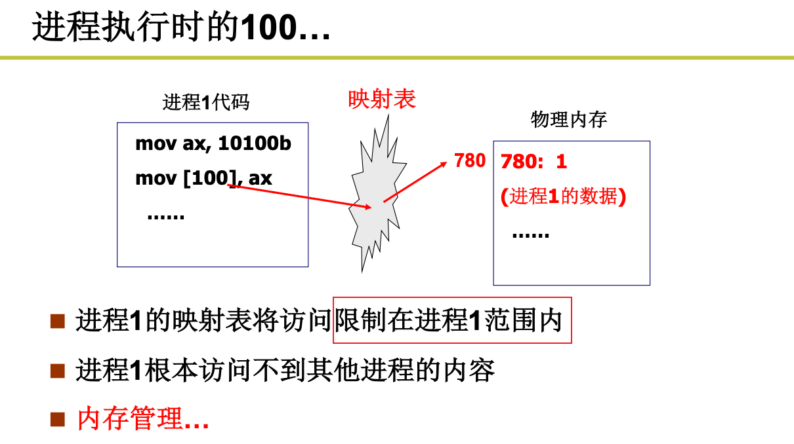
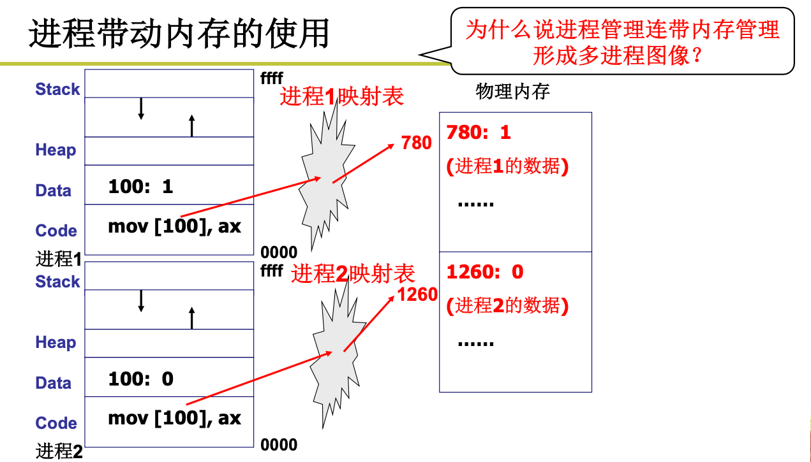
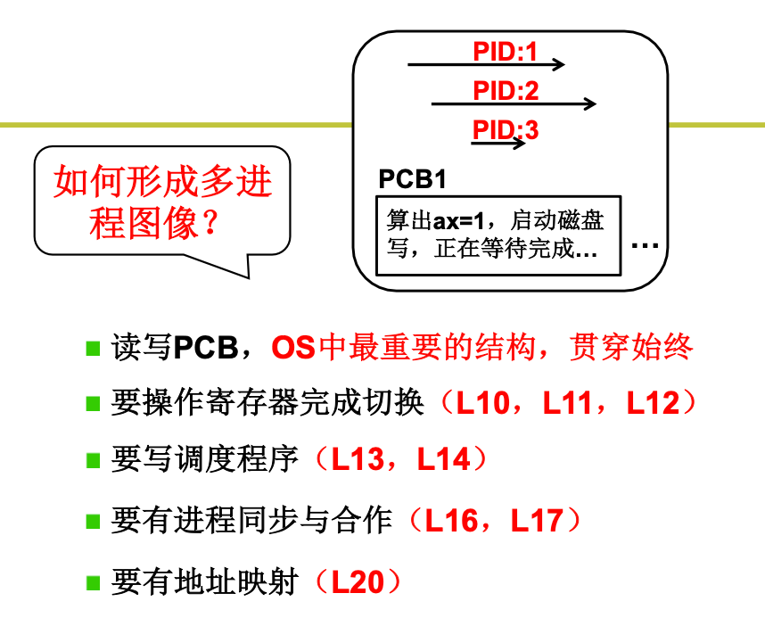

# 进程

## 1. 多个进程如何使用CPU

 

## 2. 多进程的开始与结束

 

## 3. 多进程如何组织

 

 

## 4. 多进程如何交替

 

交替的三个部分：

+ 队列操作
+ 调度
+ 切换

调度算法：

+ FIFO
+ Priority
+ 。。。

切换：

 

## 5. 多进程问题

 

## 6. 进程的映射表

 

 

## 7. 如何形成多进程图像

 

