# 虚拟内存

## 1. 引入

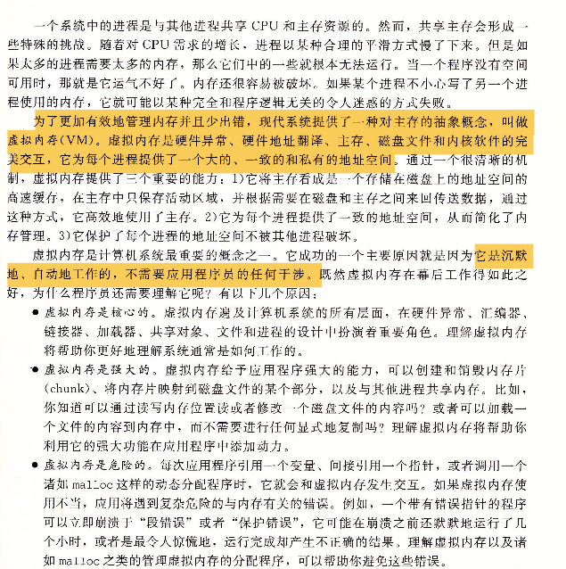 

## 2. 物理和虚拟地址

 

## 3. 地址空间

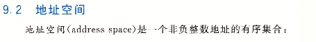 

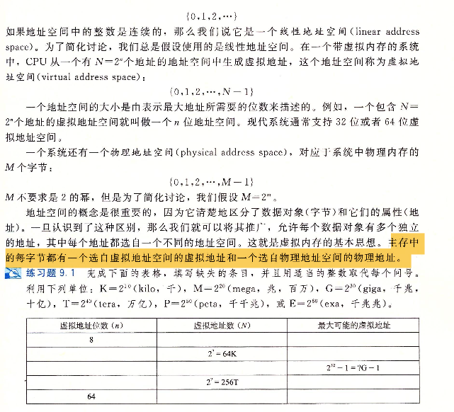 

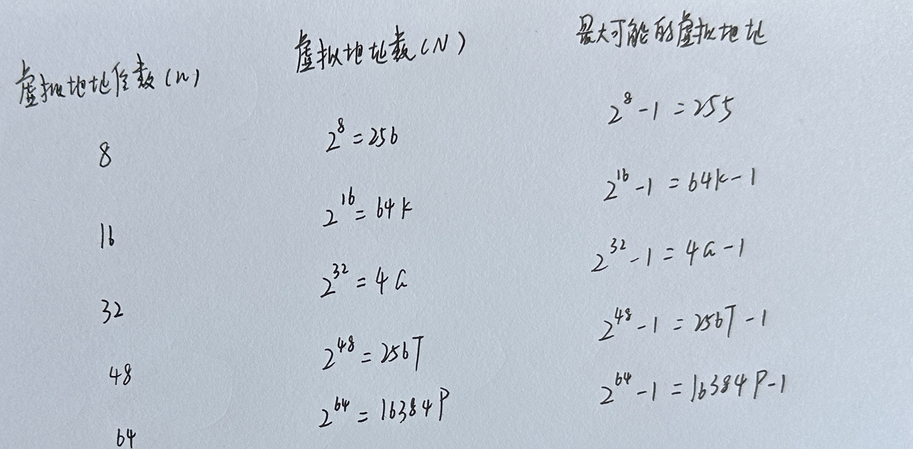 

## 4. 虚拟地址作为缓存的工具

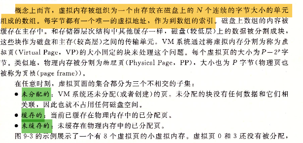 

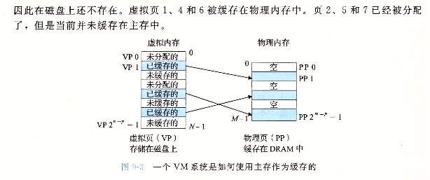 

### 4.1 DRAM缓存的组织结构

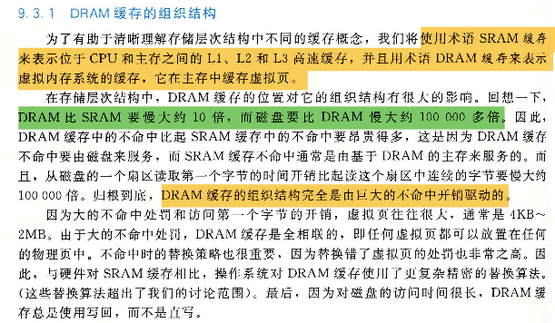 

### 4.2 页表

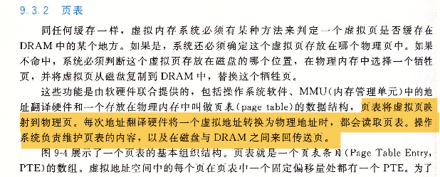 

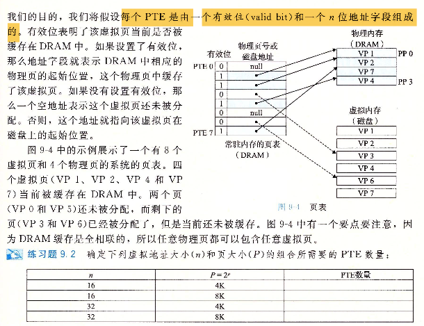 

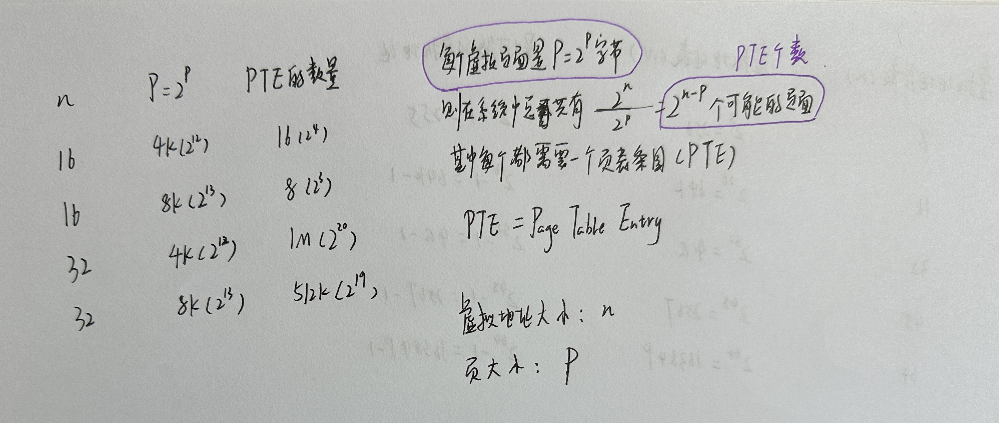 

### 4.3 页命中

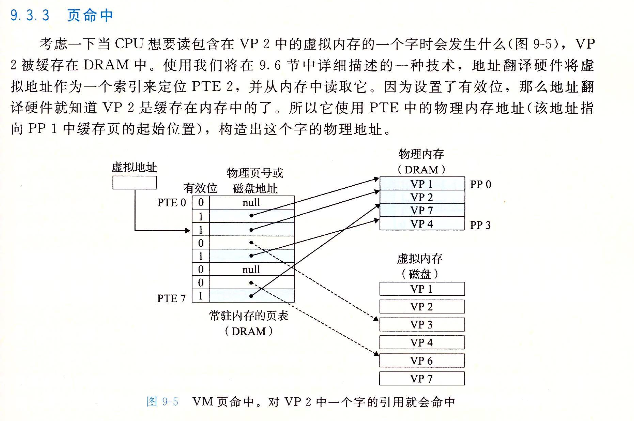 

### 4.4 缺页

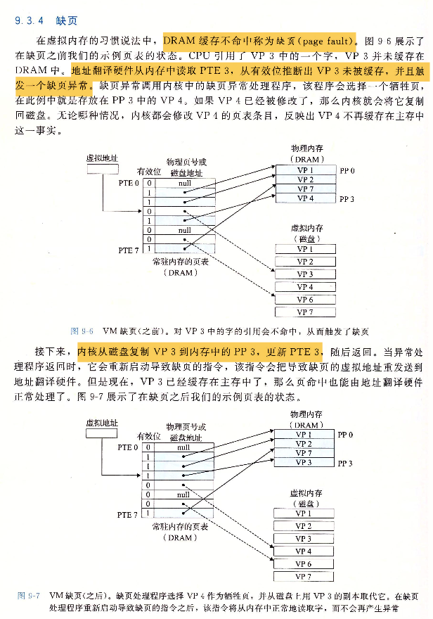 

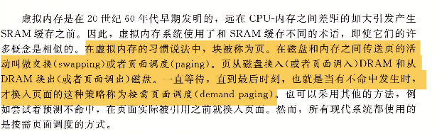 

### 4.5 分配页面

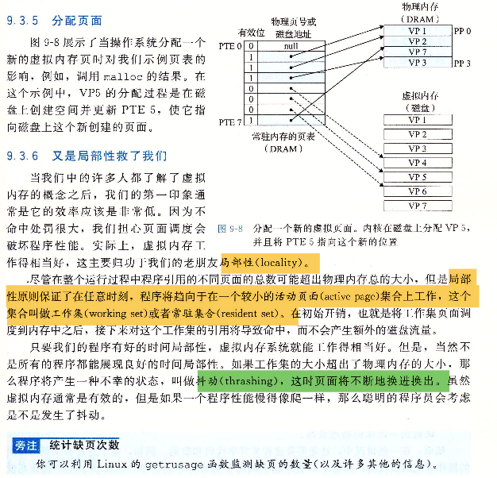 

## 5. 虚拟内存作为内存管理的工具

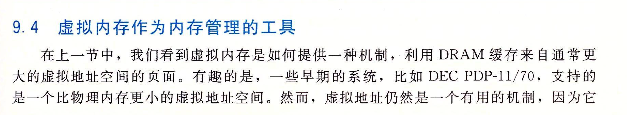 

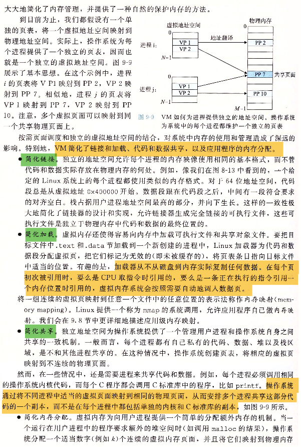 

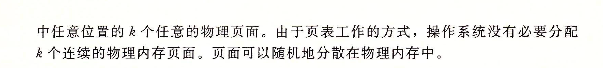 

## 6. 虚拟内存作为内存保护的工具

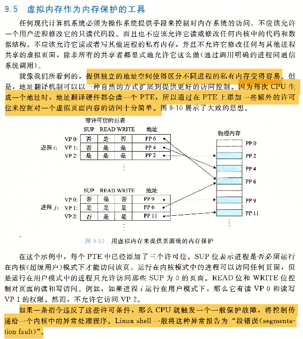 

