# 虚拟内存2

## 1. 地址翻译

### 1.1 引入

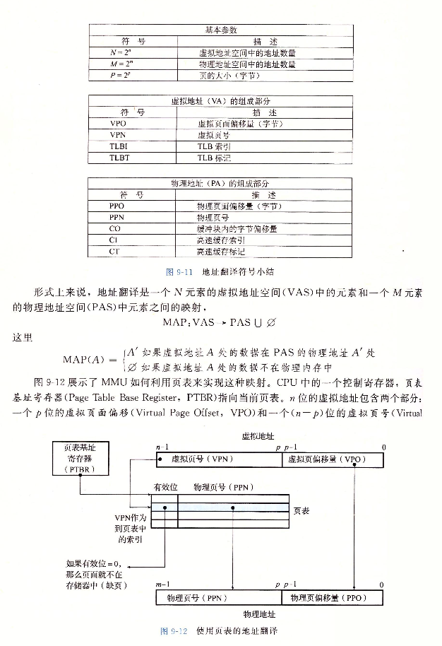 

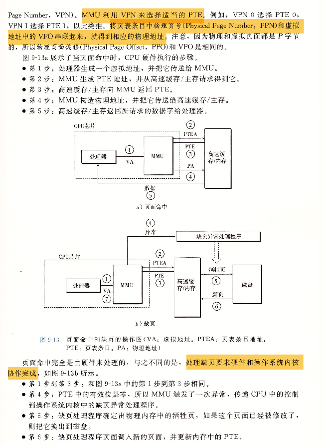 

 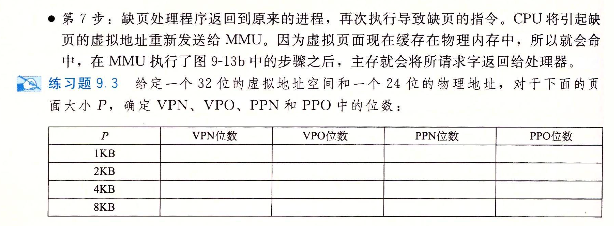 

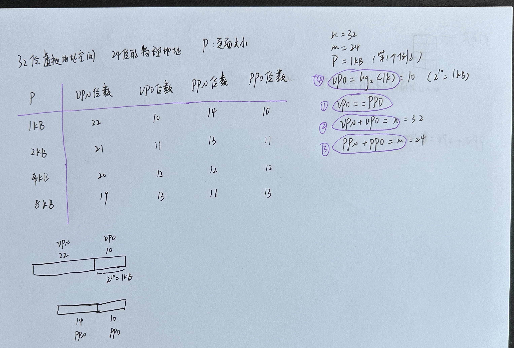 

### 1.2 结合高速缓存和虚拟内存

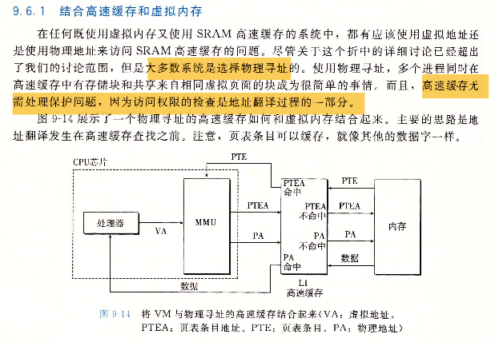 

### 1.3 利用TLB加速地址翻译

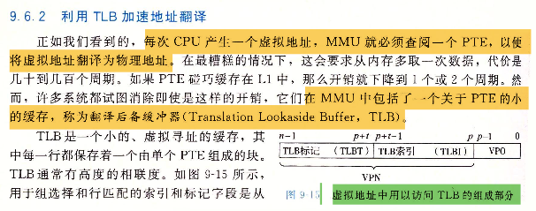 

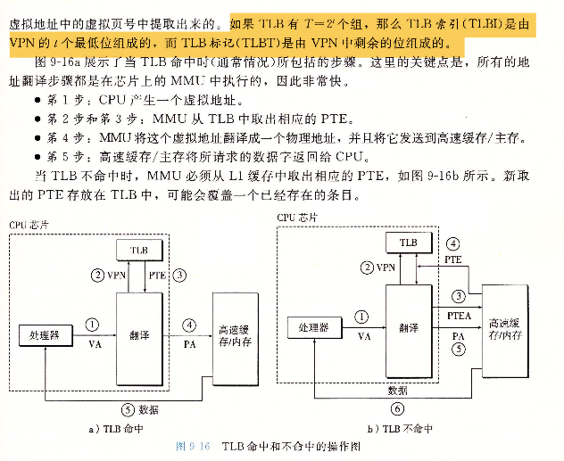 

### 1.4 多级页表

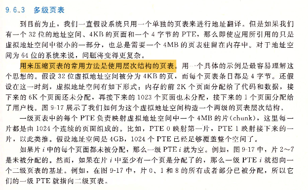 

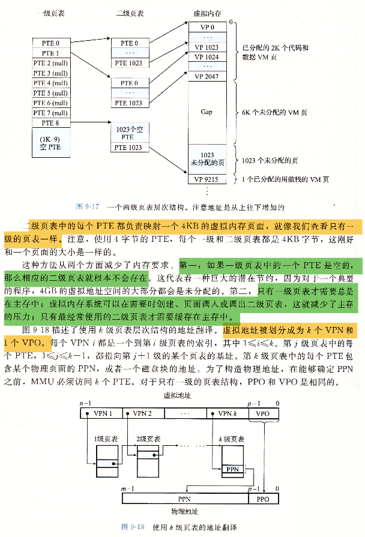 

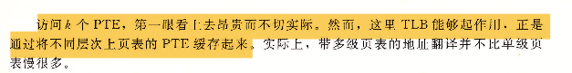 

### 1.5 综合：端到端的地址翻译

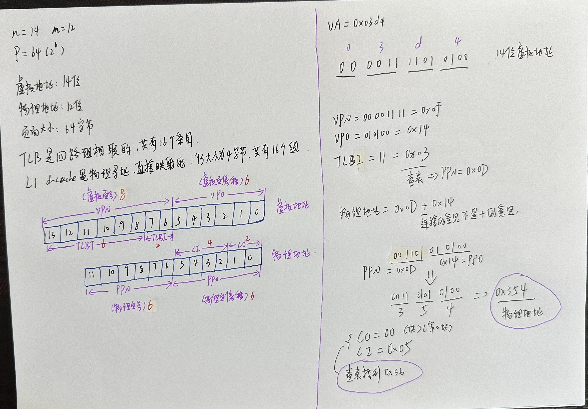 

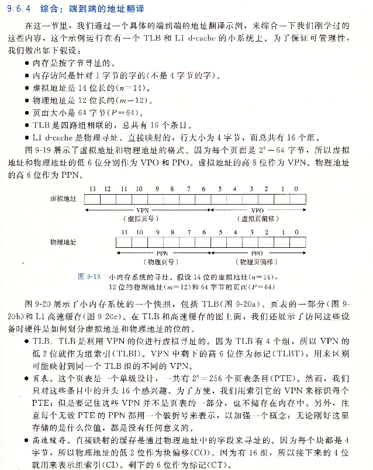 

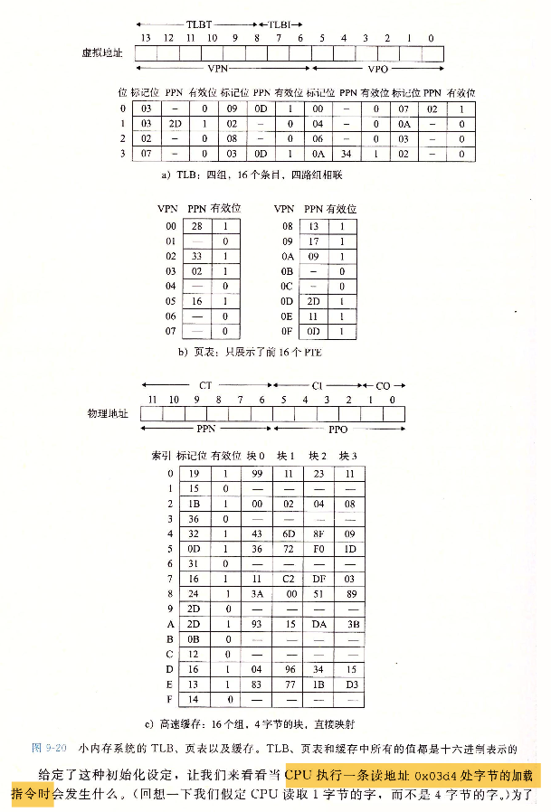 

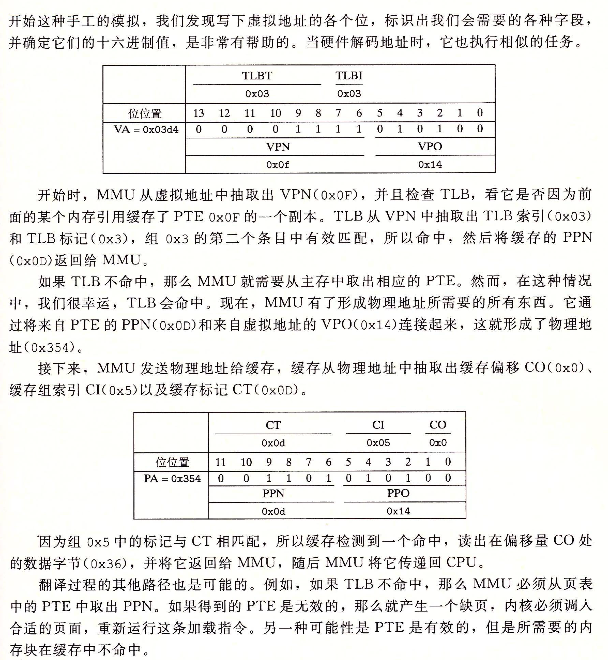 

### 1.6 综合习题

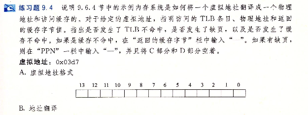 

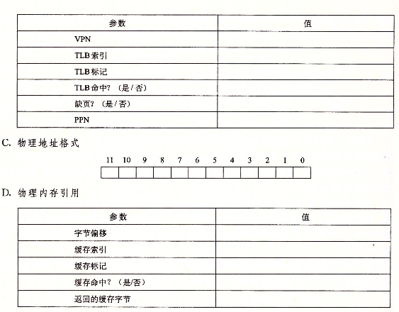 

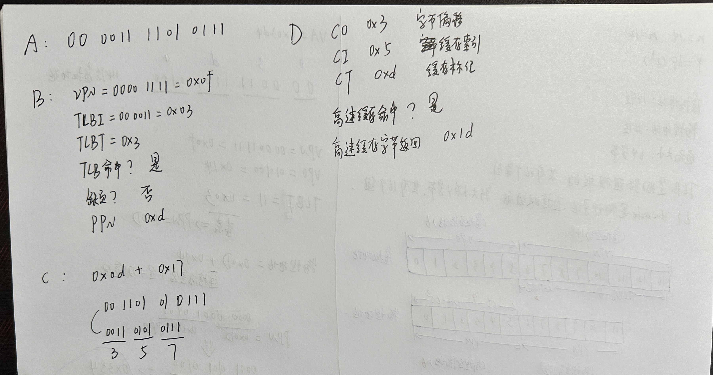 

## 2. 案例：Intel Core i7

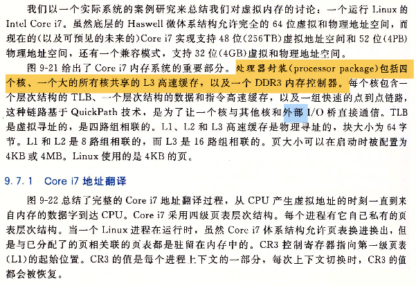 

### 2.1 Core i7的内存系统

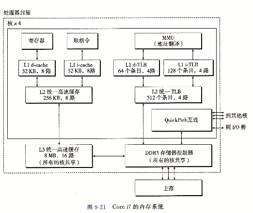 

### 2.2 Core i7的地址翻译

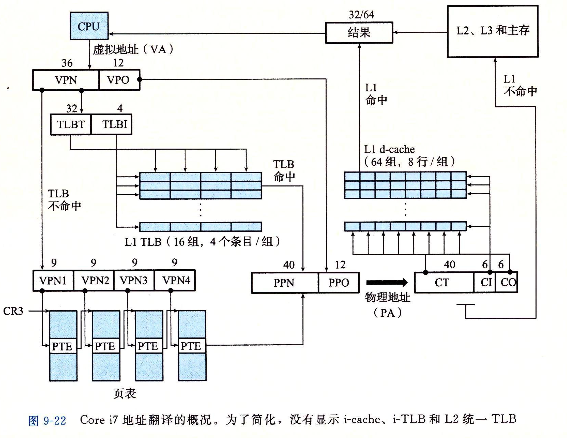 

### 2.3 第一｜二｜三级页表中条目的格式

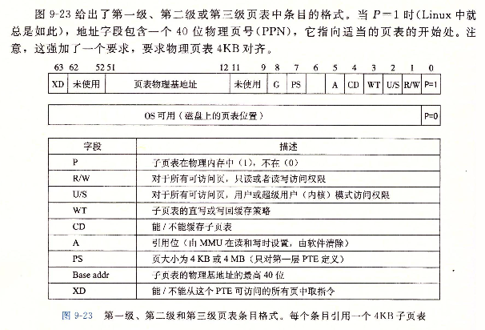 

### 2.4 第四级页表中条目的格式

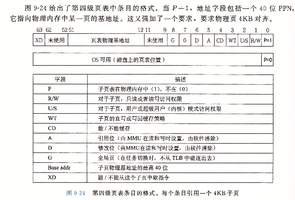 

### 2.5 串联

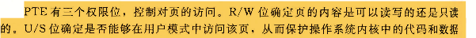 

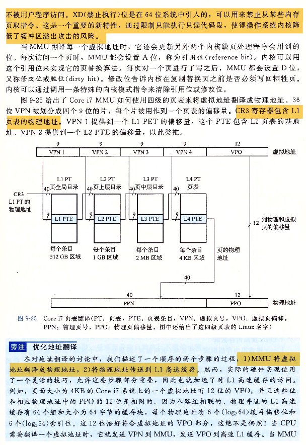 

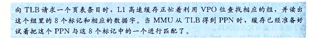 

## 3. 案例：Linux虚拟内存系统

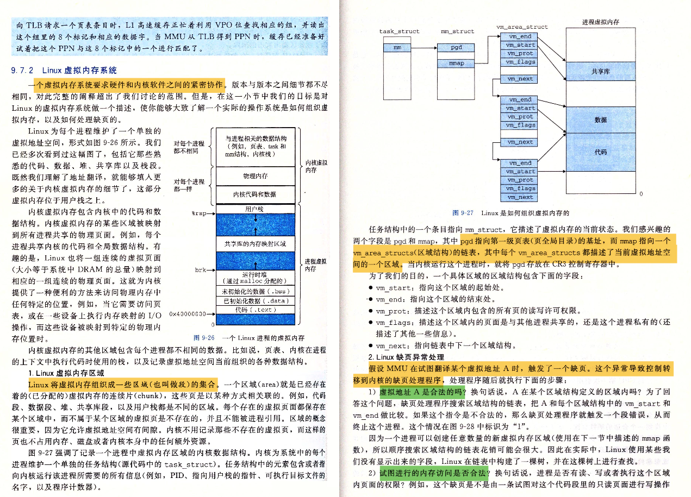 

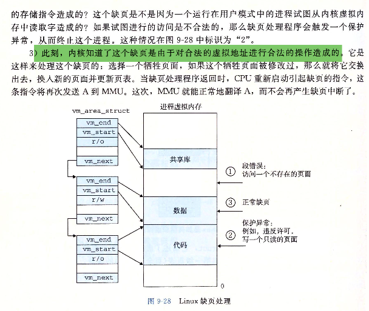 

